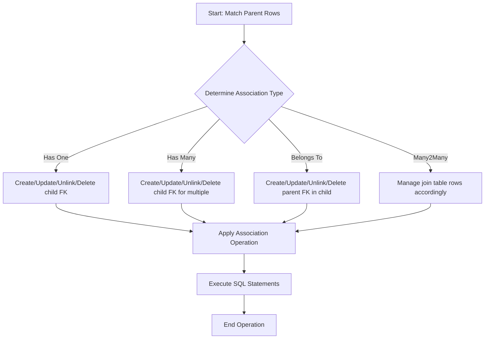

# Associations: Types and Operations

GORM CLI elevates your data modeling by generating comprehensive, type-safe association helpers directly from your Go model structs. These helpers empower developers to fluently manage complex entity relationships—such as 'has one,' 'has many,' 'belongs to,' and 'many2many'—with compile-time safety, intuitive operations, and fine-grained control.

This guide unpacks the core concepts, semantics, and practical operations of associations within GORM CLI’s generated code, enabling you to harness their full power and avoid common pitfalls.

---

## Understanding Association Types in GORM CLI

GORM CLI analyzes your Go models' struct fields and GORM tags to determine the nature of associations. Each association type corresponds to distinct relational semantics different from simple field mappings.

### 1. Has One
- Represents a one-to-one relation where the parent owns exactly one related entity.
- Foreign key typically resides on the child pointing to the parent.
- Examples: `User.Account`.

### 2. Has Many
- Represents a one-to-many relationship where the parent owns multiple related entities.
- Child entities have a foreign key referencing the parent.
- Examples: `User.Pets`, `User.Team`.

### 3. Belongs To
- Indicates that the model holds the foreign key of another model.
- The parent of the association is on the referenced side.
- Examples: `User.Company`, `User.Manager`.

### 4. Many2Many
- Many-to-many associations rely on a join table linking two entities.
- Both sides can have multiple related entities.
- Examples: `User.Languages`, `User.Friends`.

### Polymorphic Associations
- A special case where the related model can belong to multiple types through type and ID fields.
- Examples: `Pet.Toy` with polymorphic `Owner`.

---

## Generated Association Helpers API

The generated code exposes two primary helper types for associations:

- `field.Struct[T]` — for single-valued associations (`has one`, `belongs to`).
- `field.Slice[T]` — for collection-valued associations (`has many`, `many2many`).

These helpers include methods like `Create`, `CreateInBatch`, `Update`, `Unlink`, and `Delete`, each corresponding to CRUD or relationship management operations.

### Assigning Association Helpers

```go
var User = struct {
  Account field.Struct[models.Account]
  Pets    field.Slice[models.Pet]
  Languages field.Slice[models.Language]
  // ... other fields
}{
  Account: field.Struct[models.Account]{}.WithName("Account"),
  Pets:    field.Slice[models.Pet]{}.WithName("Pets"),
  Languages: field.Slice[models.Language]{}.WithName("Languages"),
  // ...
}
```

---

## Semantic Behavior of Association Operations

GORM CLI models key association operations with precise semantics based on relation type:

| Operation    | Has One          | Has Many           | Belongs To        | Many2Many          |
| ------------ | ---------------- | ------------------ | ----------------- | ------------------ |
| Create       | Insert and link  | Insert one per parent | Insert and link parent | Insert + join rows |
| CreateInBatch| N/A              | Batch insert and link| N/A               | Batch join insert  |
| Update       | Update associated | Update filtered children | Update referenced parent | Update related rows |
| Unlink       | Set FK NULL      | Set child's FK NULL | Set parent's FK NULL | Remove join rows only|
| Delete       | Delete associated| Delete children     | Delete referenced   | Delete join rows only|

### Important Notes on Operation Semantics

- **Unlink** removes relationship ties but retains the associated rows, typically by setting foreign key(s) to `NULL` or deleting join rows.
- **Delete** removes the associated rows from the database.
- **Create / Update** operations operate per matched parent row, allowing batch-like semantics through query conditions.

---

## Practical Examples of Common Association Operations

Below are real, concrete code examples illustrating typical workflows to create, update, unlink, and delete associations using the generated helpers.

### 1. Creating and Associating a New Entity (Has Many)

```go
// Create a new pet and associate it with matched users
_, err := gorm.G[models.User](db).
    Where(generated.User.ID.Eq(1)).
    Set(
      generated.User.Pets.Create(
        generated.Pet.Name.Set("fido"),
      ),
    ).
    Update(ctx)
```

### 2. Creating Multiple Entities in Batch (Many2Many)

```go
// Batch link languages to users
_, err := gorm.G[models.User](db).
    Where(generated.User.ID.Eq(1)).
    Set(
      generated.User.Languages.CreateInBatch([]models.Language{{Code: "EN"}, {Code: "FR"}}),
    ).
    Update(ctx)
```

### 3. Updating Associated Records with Filters

```go
_, err := gorm.G[models.User](db).
    Where(generated.User.ID.Eq(1)).
    Set(
      generated.User.Pets.Where(generated.Pet.Name.Eq("fido")).
        Update(generated.Pet.Name.Set("rex")),
    ).
    Update(ctx)
```

### 4. Unlinking Associations Without Deleting Rows

```go
// Set child FK to NULL but keep pets
_, err := gorm.G[models.User](db).
    Where(generated.User.ID.Eq(1)).
    Set(generated.User.Pets.Unlink()).
    Update(ctx)
```

### 5. Deleting Associated Rows

```go
_, err := gorm.G[models.User](db).
    Where(generated.User.ID.Eq(1)).
    Set(generated.User.Pets.Delete()).
    Update(ctx)
```

---

## Detailed Association Semantics

### Has One
- `Create`: inserts the associated record and links it via foreign key.
- `Update`: updates the linked child record based on optional filters.
- `Unlink`: sets the child’s foreign key to NULL, breaking the association.
- `Delete`: deletes the associated child record.

### Has Many
- `Create`: creates one new child record per matched parent and associates it.
- `CreateInBatch`: batch creates multiple children associating all matched parents.
- `Update`: updates all matched child records per parent.
- `Unlink`: clears the foreign keys in child records to unlink without deletion.
- `Delete`: deletes matched child records.

### Belongs To
- `Create`: creates new parent records and sets the foreign key in the current record.
- `Update`: updates the parent records.
- `Unlink`: sets the foreign key in current record to NULL.
- `Delete`: deletes the parent record(s).

### Many2Many
- Uses separate join table.
- `Create`: creates related records and join table rows.
- `CreateInBatch`: batch creates related records and join rows.
- `Update`: updates related records.
- `Unlink`: removes join table entries, preserving related records.
- `Delete`: removes join table entries, leaves related records intact.

---

## Best Practices for Working With Associations

- Always chain association operations inside `Set(...)` when performing parent `Create` or `Update` calls.
- Use `Where(...)` on association helpers to filter target associated rows before `Update`, `Unlink`, or `Delete`.
- Prefer `CreateInBatch` for efficiently linking multiple related records in a single operation.
- Understand unlink vs delete semantics to avoid accidental data loss.
- When using polymorphic associations, unlinking will clear owner type and ID fields on the related record.

---

## Common Pitfalls and Troubleshooting

- **Associations Not Linking:** Ensure the foreign keys and GORM tags are correctly defined in your model; verify generated helper uses correct association name.
- **Unintended Data Deletion:** Use `Unlink` cautiously instead of `Delete` when you want to keep associated data but remove relationships.
- **Batch Operations Not Working:** Confirm your DB driver supports batch operations used by `CreateInBatch`; fallback to individual creates if necessary.
- **Polymorphic Associations Misbehave:** Confirm the polymorphic field names and types match expected GORM conventions; generated helpers rely on accurate model metadata.

---

## How Associations Fit Into GORM CLI Workflow

Associations emerge from static analysis of Go model structs annotated with GORM conventions. They seamlessly pair with **model-driven field helpers** for predicates and setters, and with the generated query interfaces for expressive, type-safe querying.

Together, these tools enable expressive, fluent data access and manipulation workflows, like:

```go
// Query users with pets named "fido", update pet name to "rex".
users, err := generated.Query[models.User](db).
  FilterByNameAndAge("John", 30).
  Find(ctx)

_, err = gorm.G[models.User](db).
  Where(generated.User.ID.Eq(users[0].ID)).
  Set(
    generated.User.Pets.Where(generated.Pet.Name.Eq("fido")).Update(generated.Pet.Name.Set("rex")),
  ).
  Update(ctx)
```

This harmony between query interfaces and association helpers makes GORM CLI an indispensable productivity booster for GORM users.

---

## Diagram: Association Operation Flow



---

## Next Steps

- Review [Working With Associations](../../guides/best-practices-patterns/associations-and-relations) for comprehensive usage scenarios and advanced patterns.
- Deepen understanding by exploring [Model-Driven Field Helpers](../model-driven-field-helpers) to leverage predicates and setters alongside associations.
- Combine with [Interface-Driven Query APIs](../interface-driven-query-apis) to compose rich, type-safe database operations.

---

This page empowers you to master association semantics and operations generated by GORM CLI, giving you confidence and control over your data model relationships with clear, actionable, and type-safe APIs.


---

# Appendix: Code Snippet — Using Associations in Practice

```go
ctx := context.Background()

// Create user with one pet
_, err := gorm.G[models.User](db).
  Set(
    generated.User.Name.Set("alice"),
    generated.User.Pets.Create(generated.Pet.Name.Set("fido")),
  ).
  Create(ctx)
if err != nil {
  panic(err)
}

// Update user's pet name where name = 'fido'
_, err = gorm.G[models.User](db).
  Where(generated.User.Name.Eq("alice")).
  Set(
    generated.User.Pets.Where(generated.Pet.Name.Eq("fido")).Update(
      generated.Pet.Name.Set("rex"),
    ),
  ).
  Update(ctx)
if err != nil {
  panic(err)
}

// Unlink pet association (child FK set to NULL, pet row remains)
_, err = gorm.G[models.User](db).
  Where(generated.User.Name.Eq("alice")).
  Set(generated.User.Pets.Unlink()).
  Update(ctx)
if err != nil {
  panic(err)
}

// Delete the pet (pet row removed)
_, err = gorm.G[models.User](db).
  Where(generated.User.Name.Eq("alice")).
  Set(generated.User.Pets.Delete()).
  Update(ctx)
if err != nil {
  panic(err)
}
```

---
