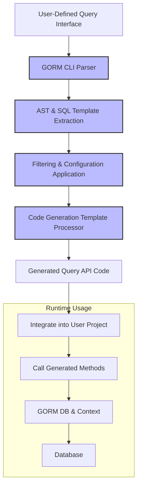

# Interface-Driven Query APIs

Discover how Go interfaces annotated with SQL templates are transformed into rich, type-safe query methods. This approach streamlines data access by converting interface method signatures and comments into fully implemented, compile-time safe queries.

---

## Introduction

GORM CLI empowers developers to define database query methods declaratively by writing Go interfaces with inline SQL templates in method comments. These interfaces are then processed by the CLI to generate concrete, type-safe query APIs. This approach eliminates error-prone manual query construction, offering fluent, discoverable, and compile-validated data access.

Such an interface-driven pattern integrates naturally with your Go codebase, providing direct method calls for queries and updates backed by safe SQL generation.

---

## Understanding the Interface-Driven Query API Workflow

At its core, the workflow involves these steps:

1. **Define Go interfaces with annotated SQL templates:**
   Methods include SQL-like annotations in doc comments that specify the query logic using placeholders and GORM CLI’s SQL template DSL.
2. **Run the GORM CLI generator:**
   The CLI parses your interfaces, extracting method signatures and SQL annotations.
3. **Generate concrete Go implementations:**
   The output is strongly typed Go code providing methods that encapsulate your SQL logic and accept typed parameters.
4. **Use the generated methods in your application:**
   Call these methods as regular Go functions to interact with the database in a type-safe way.

This flow tightly integrates with GORM’s `*gorm.DB` and context handling, making query usage natural in idiomatic Go.

---

## SQL Template DSL Syntax & Semantics

The power of interface-driven queries lies in the expressive SQL template DSL within method comments. Here are its key features:

| Directive  | Purpose                                        | Example                                      |
|------------|------------------------------------------------|----------------------------------------------|
| `@@table`  | Resolves to the model's actual table name      | `SELECT * FROM @@table WHERE id=@id`         |
| `@@column` | Dynamic column binding                          | `WHERE @@column=@value`                       |
| `@param`   | Bind Go method parameters to SQL parameters    | `WHERE name=@user.Name`                       |
| `{{where}}`| Conditional WHERE clause blocks                  | `{{where}} age > 18 {{end}}`                  |
| `{{set}}`  | Conditional SET clause for UPDATE statements   | `{{set}} name=@name {{end}}`                  |
| `{{if}}`   | Conditional SQL fragment inclusion              | `{{if age > 0}} AND age=@age {{end}}`         |
| `{{for}}`  | Iteration over slices or maps to construct SQL | `{{for _, t := range tags}} WHERE tags LIKE concat('%',@t,'%') {{end}}` |

This DSL allows you to write dynamic yet safe SQL snippets, where placeholders map directly to method parameters and model fields. The generated code automatically handles parameter binding and SQL string construction.

---

## Defining Query Interfaces

An interface defines methods with signatures and SQL templates.

```go
// UserQuery defines user-related queries
// T is the generic model type
type Query[T any] interface {
  // GetByID fetches a record by its ID
  //
  // SELECT * FROM @@table WHERE id=@id
  GetByID(id int) (T, error)

  // FilterByNameAndAge filters records by name and age
  // where("name=@name AND age=@age")
  FilterByNameAndAge(name string, age int)

  // UpdateUser conditionally updates user data
  // UPDATE @@table
  // {{set}}
  //   {{if user.Name != ""}} name=@user.Name, {{end}}
  //   {{if user.Age > 0}} age=@user.Age, {{end}}
  // {{end}}
  // WHERE id=@id
  UpdateUser(user User, id int) error
}
```

### Key Points:

- Comments directly above method signatures define the SQL template.
- Parameters bind to SQL placeholders using the `@param` syntax.
- Methods returning `(T, error)` retrieve single records, while error-only results typically represent update/insert operations.

---

## Generated Code Usage

After generation, the CLI produces a concrete implementation with methods:

```go
// Usage example:
u, err := generated.Query[User](db).GetByID(ctx, 123)

// Filter users by name and age:
users, err := generated.Query[User](db).FilterByNameAndAge("jinzhu", 25).Find(ctx)

// Update user info:
err := generated.Query[User](db).UpdateUser(ctx, User{Name: "jinzhu", Age: 20}, 1)
```

These methods return either:

- Query result structs with appropriate types
- Errors on failure
- Query builders for chaining (in case of `Where` or `Select`-style methods)

This creates a fluent, type-safe interface that integrates seamlessly with GORM.

---

## Practical Examples

### 1. Simple Select by ID

```go
// Interface method comment:
// SELECT * FROM @@table WHERE id=@id
GetByID(id int) (T, error)
```

Generated method builds SQL, binds parameter `id`, and returns one result.

---

### 2. Dynamic Filter with Column

```go
// SELECT * FROM @@table WHERE @@column=@value
FilterWithColumn(column string, value string) (T, error)
```

Allows dynamic column filtering, binding the column and value parameters safely.

---

### 3. Conditional Update

```go
// UPDATE @@table
// {{set}}
//  {{if user.Name != ""}} name=@user.Name, {{end}}
//  {{if user.Age > 0}} age=@user.Age, {{end}}
// {{end}}
// WHERE id=@id
UpdateUser(user User, id int) error
```

Only non-empty fields in `user` participate in the update. The generated code builds the SET clause conditionally based on struct values.

---

## Advanced Features

### Context Auto-Injection

If you omit `context.Context` in the method parameters, the generator injects it automatically, allowing flexible method signatures.

### Chainable Methods

Where no raw SQL is defined, a method will return an interface supporting chaining with `Where` or `Select` clauses.

### Support for Slices and Batch Operations

Methods can return slices for multiple results, supporting flexible data retrieval.

---

## Common Pitfalls & Tips

- **Always bind parameters using `@param` syntax** to avoid SQL injection.
- **Use `@@table` to refer to the model's actual table name dynamically**.
- Keep SQL templates readable with multiline comments.
- Make sure method return signatures match the declared SQL operation (e.g., `error` for updates, `(T, error)` for queries).
- Use conditional blocks `{{if}}` to include only valid SQL portions.
- Remember to handle empty or zero-value parameters properly for expected behavior.

---

## Troubleshooting

- **No generated methods:** Verify interface method comments contain proper SQL templates.
- **Parameter binding errors:** Check that parameters in the SQL template match method signature names precisely.
- **Compilation errors in generated code:** Confirm Go generics and interface constraints are used correctly.

---

## Diagram: Interface-Driven Query API Generation Flow



---

## Next Steps & Related Guides

Once comfortable with interface-driven queries, explore these related documentation pages:

- [Working With Template-Based Queries](../guides/best-practices-patterns/template-based-queries) for deeper templating patterns
- [Using Generated APIs in Your Application](../guides/core-workflows/using-generated-apis) for practical usage
- [Model-Driven Field Helpers](../concepts/data-models-and-abstractions/model-driven-field-helpers) to combine with field predicates
- [Customizing Generation Configuration](../guides/core-workflows/customizing-generation-config) to tailor outputs

---

For examples and deeper insight, see the [query.go example](https://github.com/go-gorm/cli/blob/main/examples/query.go) and generated output in `examples/output`.

---

## Summary

Interface-Driven Query APIs in GORM CLI convert annotated Go interfaces into type-safe, fluent query methods that embed SQL templating. This approach enables strong compile-time safety and expressive querying without manual SQL building. The SQL template DSL empowers dynamic, readable, and maintainable queries that cleanly map Go parameters to SQL.

Start by defining carefully annotated interfaces, generate with the CLI, and consume the resulting API in your application for a robust, maintainable data access layer.