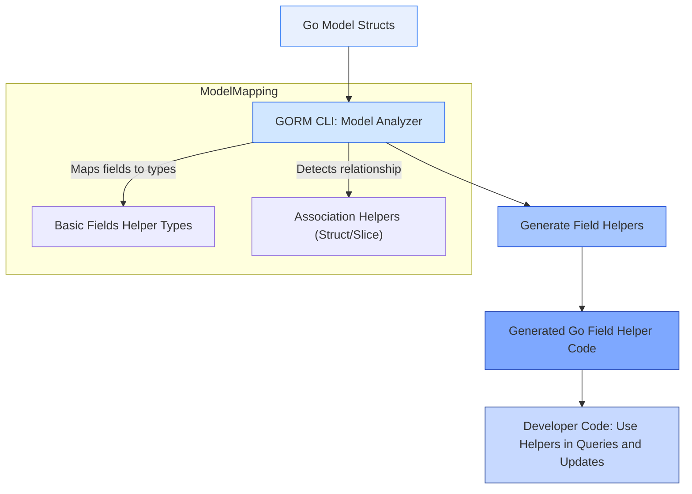

# Model-Driven Field Helpers

GORM CLI empowers you to generate **model-driven field helpers** derived directly from your Go model structs. These helpers simplify how you build safe, fluent, and declarative queries and updates by providing strongly typed predicates and setters for your model's fields and associations.

---

## Why Model-Driven Field Helpers?

Imagine navigating complex SQL queries by hand: prone to errors and repetitive. GORM CLI transforms your Go structs into rich helper objects that represent each field and relationship, offering you an intuitive API layer to express filters, updates, and association operations without losing type safety or discoverability.

This automation accelerates writing queries like `WHERE age > 18` or updates like `SET name = 'Alice'`, while preventing common mistakes such as mismatched types or invalid column names.

> _"Instead of writing raw strings or manual SQL clauses, you use generated fields as Go objects to build your queries—ensuring correctness from the start."_

---

## How GORM CLI Analyzes Your Models

When you run the generator, GORM CLI scans your Go model structs and **maps each exported field** into a corresponding field helper, resolving:

- **Basic fields:** Integers, strings, booleans, times, nullable types, bytes, and custom named types.
- **Associations:** Related entities configured via GORM tags (has one, has many, belongs to, many-to-many), including polymorphic relations.

### Supported Go Types for Basic Fields

GORM CLI supports the standard Go types and well-known nullable types, such as:

| Type                       | Description                      |
|----------------------------|--------------------------------|
| `int`, `uint`, `int64` etc | Numeric fields                  |
| `string`                   | Textual fields                  |
| `bool`                     | Boolean flags                  |
| `time.Time` or `sql.NullTime` | Date/time with or without nulls |
| `[]byte`                   | Binary data                    |
| Custom named types         | If implementing `Scanner`/`Valuer` or tagged (`gen:"json"` etc.) |

### Association Helper Types

Associations transform related structs into specialized helpers:

| Relation Type              | Generated Helper Type          | Behavior / Usage Notes
|----------------------------|-------------------------------|----------------------
| **Has One / Belongs To**   | `field.Struct[T]`              | Represents a single related struct  |
| **Has Many / Many-to-Many**| `field.Slice[T]`               | Represents collections of related structs |

The helper carries methods for CRUD-like association operations:

- `Create()`: create and link related records
- `Update()`: update associated records with conditions
- `Unlink()`: remove links without deleting rows
- `Delete()`: delete related rows (or join records)
- `CreateInBatch()`: batch create/link for collections

---

## Generated Helper Methods

Each field helper exposes a fluent, strongly typed API tailored to its purpose.

### Predicates (Filters)

Common comparison methods for basic fields:

```go
// Examples:
generated.User.Name.Eq("alice")        // WHERE name = 'alice'
generated.User.Age.Gt(18)                // WHERE age > 18
generated.User.Score.IsNull()            // WHERE score IS NULL
```

These predicates are designed to be composable and safe, preventing SQL injection and type mismatches.

### Setters (Updates)

Setters allow setting new values, applying expressions, or incrementing numeric fields:

```go
// Set fixed values
generated.User.Name.Set("jinzhu")

// Increment age by 1
generated.User.Age.Incr(1)

// Set complex expression
generated.User.Age.SetExpr(clause.Expr{SQL: "GREATEST(?, ?)" , Vars: []any{clause.Column{Name: "age"}, 18}})
```

Use them with GORM's `Set()` and `Update()` methods for clear update queries:

```go
gorm.G[User](db).
  Where(generated.User.ID.Eq(1)).
  Set(
    generated.User.Name.Set("alice"),
    generated.User.Age.Incr(1),
  ).
  Update(ctx)
```

### Association Operations

Operate on related entities directly through association helpers attached to the parent struct:

```go
// Create a new pet for a user
gorm.G[User](db).
  Set(
    generated.User.Name.Set("alice"),
    generated.User.Pets.Create(generated.Pet.Name.Set("fido")),
  ).
  Create(ctx)

// Update pet's name where pet name is 'fido'
gorm.G[User](db).
  Where(generated.User.ID.Eq(1)).
  Set(
    generated.User.Pets.Where(generated.Pet.Name.Eq("fido")).
      Update(generated.Pet.Name.Set("rex")),
  ).
  Update(ctx)

// Unlink all pets from a user (remove relationship without deleting pets)
gorm.G[User](db).
  Where(generated.User.ID.Eq(1)).
  Set(generated.User.Pets.Unlink()).
  Update(ctx)
```

#### Semantics by Association Type:

| Association Type | Unlink Effect                     | Delete Effect                        |
|------------------|----------------------------------|------------------------------------|
| belongs to       | Set parent FK column to NULL     | Remove associated rows              |
| has one/has many | Set child FK columns to NULL     | Remove child rows                   |
| many-to-many     | Remove join rows only             | Remove join rows only, keep related entities |

---

## How Fields Are Mapped

Fields are analyzed by their Go type and struct tags:

- **Basic fields** are mapped to corresponding typed field helpers like `field.Number[int]`, `field.String`, or mapped custom helpers (`field.Time` for `sql.NullTime`, or `examples.JSON` for `gen:"json"`).

- **Pointer types** are dereferenced and mapped accordingly.

- **Slice fields** referencing other structs map to `field.Slice[T]` association helpers.

- **Single structs or pointer structs** map to `field.Struct[T]` association helpers.

- Fields with tags like `gen:"json"` leverage configuration (`genconfig.Config`) to override default mappings.

Example generated snippet from a `User` struct:

```go
var User = struct {
	ID        field.Number[uint]
	Name      field.String
	Age       field.Number[int]
	Pets      field.Slice[models.Pet]
	Company   field.Struct[models.Company]
	Profile   examples.JSON
}{
	ID:        field.Number[uint]{}.WithColumn("id"),
	Name:      field.String{}.WithColumn("name"),
	Age:       field.Number[int]{}.WithColumn("age"),
	Pets:      field.Slice[models.Pet]{}.WithName("Pets"),
	Company:   field.Struct[models.Company]{}.WithName("Company"),
	Profile:   examples.JSON{}.WithColumn("profile"),
}
```

---

## Using Field Helpers in Practice

### Step 1: Generate Helpers

Run the generator targeting your Go models:

```bash
gorm gen -i ./models -o ./generated
```

### Step 2: Build Queries Using the Generated Helpers

Filter users older than 18:

```go
users, err := gorm.G[User](db).
  Where(generated.User.Age.Gt(18)).
  Find(ctx)
```

Update the role for a user named "alice":

```go
err := gorm.G[User](db).
  Set(generated.User.Role.Set("admin")).
  Where(generated.User.Name.Eq("alice")).
  Update(ctx)
```

Create a new user with associated pets:

```go
err = gorm.G[User](db).
  Set(
    generated.User.Name.Set("bob"),
    generated.User.Pets.Create(generated.Pet.Name.Set("rex")),
  ).
  Create(ctx)
```

### Step 3: Combine Complex Conditions

Use multiple predicates together:

```go
users, err := gorm.G[User](db).
  Where(
    generated.User.Age.Between(18, 65),
    generated.User.Status.Eq("active"),
  ).
  Find(ctx)
```

---

## Best Practices & Tips

- **Always Prefer Generated Helpers**: They ensure type correctness and guard against runtime errors.
- **Use Association Helpers for Relationship Logic**: This prevents manual foreign key manipulation and keeps data consistent.
- **Leverage Custom Configurations**: Use `genconfig.Config` to define special mappings (e.g., JSON helpers) and tailor generated helpers to your domain needs.
- **Combine with Template-Based Queries**: Field helpers integrate seamlessly with query APIs for complex conditional filtering.

---

## Common Pitfalls & Troubleshooting

<AccordionGroup title="Common Issues and Solutions">
<Accordion title="Missing Generated Field Helpers">
Ensure your model structs are exported and located in the input path you specify. Also check `IncludeStructs` or `ExcludeStructs` in config do not filter out your structs unintentionally.
</Accordion>
<Accordion title="Incorrect Field Types in Generated Code">
Verify custom mappings in `FieldTypeMap` and `FieldNameMap` in your `genconfig.Config` to ensure specialized types like JSON are properly configured.
</Accordion>
<Accordion title="Association Operations Not Working as Expected">
Check the association tags on your struct fields match GORM conventions exactly (`gorm:"has many"`, `gorm:"many2many"`, `gorm:"polymorphic"`). Also confirm your data model supports intended foreign keys and that you use `Set(...).Create()` or `Set(...).Update()` correctly on parent entities.
</Accordion>
</AccordionGroup>

---

## Summary Diagram: How Field Helpers Fit in the Generation Flow



---

## Related Guides

- [Working With Basic Fields](../../guides/best-practices-patterns/working-with-basic-fields): Detailed usage of predicates and setters for generated fields.
- [Working With Associations](../../guides/best-practices-patterns/associations-and-relations): Deep dive into managing relational data using generated association helpers.
- [Custom Field Helpers: JSON Example](../../guides/best-practices-patterns/json-field-customization): Learn how to extend your field helpers with custom types like JSON.
- [Using Generated APIs in Your Application](../../guides/core-workflows/using-generated-apis): How to combine query APIs and field helpers for full database interaction.

---

Explore these guides to unlock the full power of GORM CLI's generated helpers and build safer, clearer, and more maintainable data access layers.

---

## References

- [GORM CLI README](../README.md#field-helper-generation-rules)
- [Examples/models/user.go for typical generated field helpers](../../examples/output/models/user.go)
- [Configuration for Custom Field Mappings](../../concepts/customization-scalability/generation-configuration)

---

Harness the full potential of GORM CLI by leveraging the model-driven field helpers — your indispensable allies for building type-safe, expressive, and maintainable database access code.
