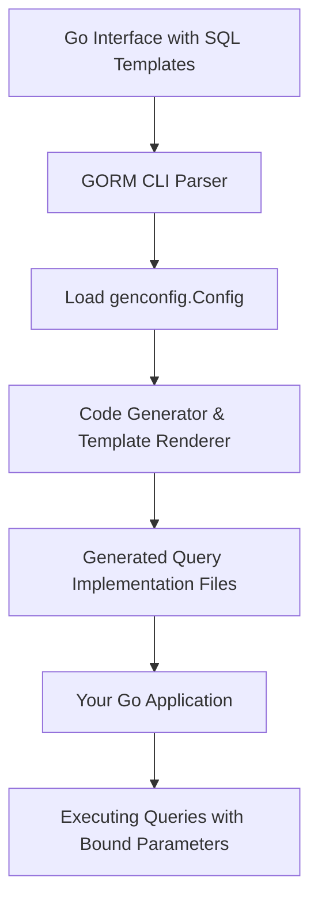

# Query Interfaces & Template DSL

Learn how GORM CLI empowers Go developers to define SQL queries declaratively inside Go interfaces using embedded SQL templates and a flexible domain-specific language (DSL). This approach tightly couples method signatures with SQL logic, making queries type-safe, expressive, and maintainable.

---

## Overview

GORM CLI uses specially annotated Go interfaces where each method's comment contains raw SQL or templated SQL. This SQL, combined with Go method parameters, generates robust, type-safe query implementations on top of GORM.

Key concepts include:

- **Method signatures:** Define intention, parameters, and return types.
- **In-comment SQL templates:** The SQL logic tied directly to method signatures.
- **Template DSL directives:** Special placeholders and blocks that enable dynamic SQL generation.

This blend allows you to write complex query logic declaratively, with GORM CLI handling safe parameter binding and code generation.

---

## How Query Interfaces Work

At the core, you define Go interfaces that describe your query methods. Each method includes a special comment block with raw SQL or templated SQL:

```go
// examples/query.go excerpt

type Query[T any] interface {
  // Get a record by its ID
  //
  // SELECT * FROM @@table WHERE id=@id AND name = "\@name"
  GetByID(id int) (T, error)

  // Filter using a dynamic column and value
  // SELECT * FROM @@table WHERE @@column=@value
  FilterWithColumn(column string, value string) (T, error)

  // Conditional query based on fields in a User struct
  // SELECT * FROM @@table
  //   {{if user.ID > 0}}
  //       WHERE id=@user.ID
  //   {{else if user.Name != ""}}
  //       WHERE name=@user.Name
  //   {{end}}
  QueryWith(user models.User) (T, error)

  // ...more methods
}
```

### What users achieve

- Express precise queries in one place, control SQL details explicitly.
- Leverage Go's type system for method inputs and outputs.
- Avoid scattering SQL strings in code.
- Generate implementations that are optimized and safe.


## The Template DSL Explained

The SQL templates inside comments use a lightweight DSL to express dynamic, conditional, and iterative SQL logic. The DSL is powerful yet approachable.

### Core DSL Elements

| Directive   | Role                               | Example                            |
|-------------|-----------------------------------|----------------------------------|
| `@@table`   | Inserts the current model’s table | `SELECT * FROM @@table WHERE id=@id` |
| `@@column`  | Dynamic column name                | `WHERE @@column=@value`           |
| `@param`    | Binds Go method parameters        | `WHERE name=@user.Name`           |
| `{{where}}` | Conditional WHERE block            | `{{where}} age > 18 {{end}}`      |
| `{{set}}`   | Conditional SET (for UPDATE)       | `{{set}} name=@name {{end}}`      |
| `{{if}}`    | Conditional SQL fragments          | `{{if age > 0}} AND age=@age {{end}}` |
| `{{for}}`   | Iterative blocks over collections  | `{{for _, tag := range tags}} ... {{end}}` |

### Details and Best Practices

- Use `@@table` to avoid hardcoding table names.
- Use `@param` bindings to ensure parameters are properly escaped and type-safe.
- Wrap complex logic inside `{{where}}` or `{{set}}` for dynamic query construction.
- Combine `{{if}}` and `{{for}}` for powerful conditional queries.
- Escape literal @ with `\@` when necessary.

### Example: Conditional Query
```go
// QueryWith example from Query interface
// SELECT * FROM @@table
// {{if user.ID > 0}}
//     WHERE id=@user.ID
// {{else if user.Name != ""}}
//     WHERE name=@user.Name
// {{end}}
QueryWith(user models.User) (T, error)
```

This compiles to generate an SQL statement picking one of the WHERE clauses at runtime depending on parameter values.

---

## User Flow: From Interface to Runtime Execution

1. **Define interface:** Write your query interface methods and embed SQL template comments.

2. **Run generator:** Use `gorm gen -i <input-path> -o <output-path>` to generate implementation files.

3. **Import and use:** Consume generated query structs and methods in your Go app with full type safety.

4. **Execute queries:** Calls to generated methods build and run queries with bound parameters.


## Example Usage

Given the interface declared in `examples/query.go`, the generator produces an implementation like:

```go
// example of generated GetByID method implementation
func (e _QueryImpl[T]) GetByID(ctx context.Context, id int) (T, error) {
  var sb strings.Builder
  params := make([]any, 0, 2)

  sb.WriteString("SELECT * FROM ? WHERE id=? AND name = \"@name\"")
  params = append(params, clause.Table{Name: clause.CurrentTable}, id)

  var result T
  err := e.Raw(sb.String(), params...).Scan(ctx, &result)
  return result, err
}
```

This method resolves `@@table` to the concrete table name and safely binds `id`.

Calling from your application:

```go
user, err := generated.Query[models.User](db).GetByID(ctx, 42)
```

Returns the user with ID 42 or an error.


## Tips & Best Practices

- Name interface methods clearly, matching purpose and parameter semantics.
- Use the SQL template DSL liberally to abstract away conditional SQL.
- Keep SQL templates close to method signatures, enhancing readability.
- Escape literal `@` signs in SQL comments to prevent mistaken param binding.
- Test queries standalone and generated code integration thoroughly.


## Common Pitfalls

<Warning>
- Forgetting to add `ctx context.Context` in method signature will have it added automatically, but consider explicitly declaring for clarity.
- Overly complex or nested templating can make SQL hard to read—keep it as simple as possible.
- Using dynamic column names (`@@column`) requires careful validation outside templates to avoid SQL injection.
</Warning>

---

## Diagram: Query Interface to Generated Implementation Flow



---

## Troubleshooting

<AccordionGroup title="Common Issues and Solutions">
<Accordion title="Queries not generating correctly">
- **Cause:** Malformed SQL comments or missing placeholders.
- **Solution:** Verify SQL syntax in comments, ensure placeholders (e.g., `@param`) match method parameters.
</Accordion>
<Accordion title="Method signatures missing context.Context">
- **Cause:** The generator auto-injects context if absent but generated method signatures differ from your calls.
- **Solution:** Add `ctx context.Context` explicitly in interface methods for consistency.
</Accordion>
<Accordion title="Unexpected SQL injection risk">
- **Cause:** Dynamic column names must be securely handled.
- **Solution:** Sanitize or whitelist dynamic columns before passing to the query interface.
</Accordion>
</AccordionGroup>

---

## Next Steps & Further Reading

- Explore the [SQL Template DSL Guide](/guides/advanced-patterns-customization/sql-template-dsl) for deeper mastery.
- Learn about [Working with Associations](/guides/advanced-patterns-customization/working-with-associations).
- Discover how to extend with [Custom Field Helpers](/guides/advanced-patterns-customization/custom-field-helpers).
- See a full [Code Generation Workflow](/concepts/architecture-and-core-concepts/code-generation-workflow) overview.
- Visit [Using the Generated APIs](/guides/getting-started-workflows/using-generated-apis) to integrate generated code into your app.

---

This page taught you how GORM CLI leverages annotated interfaces and a template DSL to generate type-safe query methods that blend Go method declarations and SQL logic seamlessly.

---