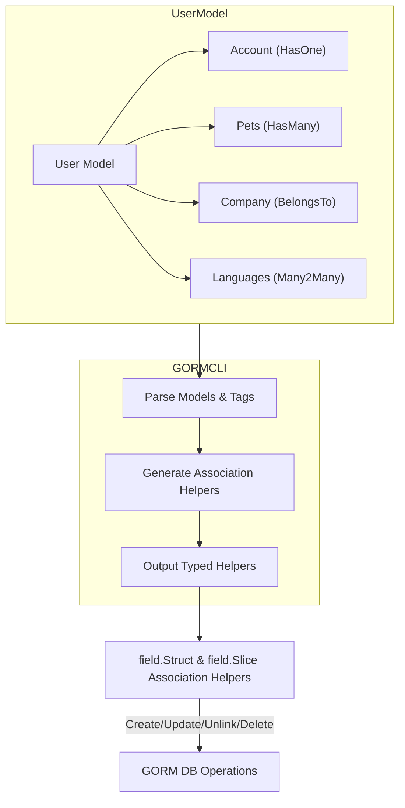

# Associations and Relations in GORM CLI

GORM CLI enhances your Go projects by generating powerful, type-safe helpers that reflect your model's associations and relations. This guide details how GORM CLI analyzes your Go structs to identify and generate helpers for common association types: **has one**, **has many**, **belongs to**, and **many2many**, including polymorphic associations. Understanding how these associations work and how GORM CLI represents them empowers you to manage related data efficiently and intuitively.

---

## Introduction to Association Types

GORM CLI inspects your model struct fields and their GORM tags to determine the association type. Each relationship type affects how foreign keys are managed, how related records are created, updated, or deleted, and how queries are composed.

### Supported Association Types

- **Has One:** A single related record owned by the parent.
- **Has Many:** Multiple related records owned by the parent.
- **Belongs To:** The parent record belongs to another record, indicating ownership on the child side.
- **Many To Many:** A bidirectional relation with a join table.
- **Polymorphic:** Associations where related records point to different owners using type and ID fields.

### Real-World Analogy
Think of a company with employees (has many), each with one locker (has one), reporting to a manager (belongs to), speaking multiple languages (many2many), and playing various sports clubs (many2many). GORM CLI maps these real-life relationships to code-safe, flow-driven operations.

---

## How GORM CLI Recognizes Associations

GORM CLI leverages struct field types and specific GORM tags in your model definitions:

- Field type:
  - Struct vs. slice:
    - `Struct[T]` implies single-object relations (`has one`, `belongs to`).
    - `Slice[T]` implies multi-object relations (`has many`, `many2many`).
- Tags like `gorm:"many2many:<join_table>"` or `gorm:"polymorphic:<owner>"` signal special association behavior.

### Example Model Snippet
```go
type User struct {
  gorm.Model
  Account   Account            // Has one
  Pets      []*Pet             // Has many
  Toys      []Toy `gorm:"polymorphic:Owner"` // Has many polymorphic
  CompanyID *int               // Foreign key for belongs to Company
  Company   Company            // Belongs to
  ManagerID *uint              // FK for belongs to User (Manager)
  Manager   *User              // Belongs to (single-table self-reference)
  Team      []User `gorm:"foreignkey:ManagerID"` // Has many (single-table self-reference)
  Languages []Language `gorm:"many2many:UserSpeak"` // Many to many
  Friends   []*User `gorm:"many2many:user_friends"` // Many to many (single-table)
}
```

This is the core input GORM CLI analyzes to generate association field helpers and code.

---

## Generated Association Helpers

GORM CLI generates strongly-typed association fields under the generated model structs. These include:

- `field.Struct[T]`: For single associations (`has one`, `belongs to`).
- `field.Slice[T]`: For multi associations (`has many`, `many2many`).

Example generated fields for the `User` model:

```go
var User = struct {
  ...
  Account   field.Struct[models.Account]
  Pets      field.Slice[models.Pet]
  Toys      field.Slice[models.Toy]
  Company   field.Struct[models.Company]
  Manager   field.Struct[models.User]
  Team      field.Slice[models.User]
  Languages field.Slice[models.Language]
  Friends   field.Slice[models.User]
  ...
}{}
```

These association helpers provide methods to perform common operations with compile-time safety:

- **Create:** Insert and associate a new related record.
- **CreateInBatch:** Insert multiple related records and associate them.
- **Update:** Update related records with optional filtering conditions.
- **Unlink:** Remove association links without deleting records.
- **Delete:** Delete the associated records (special semantics for many2many).

---

## Semantics by Association Type

Understanding how each association type manages foreign keys and join tables is vital to using these helpers correctly.

| Association | What Unlink Does                                    | What Delete Does                                          | Notes                                        |
|-------------|----------------------------------------------------|----------------------------------------------------------|----------------------------------------------|
| Belongs To  | Sets parent (child struct) FK to NULL              | Deletes the associated parent records                    | FK is on parent struct (child side)          |
| Has One/Has Many | Sets child FK to NULL                            | Deletes child records                                    | De-associates or removes owned records        |
| Many2Many   | Removes join table rows                             | Removes join rows only; keeps both parent and child rows | Both sides keep rows, only join changes       |

### Polymorphic Associations
Polymorphic associations work similarly but include type discrimination via additional `OwnerType` fields.

---

## Using Association Helpers in Code

### Creating Records with Associations
Creates a new parent record and associated child records in one operation.

```go
// Create a new User with one Pet
gorm.G[User](db).
  Set(
    generated.User.Name.Set("alice"),
    generated.User.Pets.Create(
      generated.Pet.Name.Set("fido"),
    ),
  ).
  Create(ctx)
```

### Updating Linked Associations with Conditions
Update specific child records filtered by conditions on the child side.

```go
// Update Pet where name = "fido" for matched User
gorm.G[User](db).
  Where(generated.User.ID.Eq(1)).
  Set(
    generated.User.Pets.Where(generated.Pet.Name.Eq("fido")).
      Update(generated.Pet.Name.Set("rex")),
  ).
  Update(ctx)
```

### Unlinking Associations
Remove foreign key links or join table entries without deleting records.

```go
// Unlink all Pets from User ID=1 (sets pet's user_id to NULL)
gorm.G[User](db).
  Where(generated.User.ID.Eq(1)).
  Set(generated.User.Pets.Unlink()).
  Update(ctx)
```

### Deleting Associated Records
Deletes child or join rows matching optional conditions.

```go
// Delete Pet named "old" for User=1
gorm.G[User](db).
  Where(generated.User.ID.Eq(1)).
  Set(generated.User.Pets.Where(generated.Pet.Name.Eq("old")).Delete()).
  Update(ctx)
```

### Batch Creating/Llinking Associations
Create or link multiple associated records efficiently.

```go
// Batch link languages to User=1
gorm.G[User](db).
  Where(generated.User.ID.Eq(1)).
  Set(generated.User.Languages.CreateInBatch([]models.Language{{Code: "EN"}, {Code: "FR"}})).
  Update(ctx)
```

---

## Polymorphic Associations

For polymorphic fields (e.g., `Toys []Toy` with `gorm:"polymorphic:Owner"`), the generated helpers respect the `OwnerID` and `OwnerType` fields:

- Unlink sets the foreign key and owner type fields to zero values (e.g., 0 and "").
- Delete removes child rows.

Example usage:

```go
// For Pet's polymorphic Toy association
gorm.G[Pet](db).
  Where(generated.Pet.ID.Eq(petID)).
  Set(generated.Pet.Toy.Unlink()).
  Update(ctx)
```

---

## Under the Hood: Mechanism of Generation

GORM CLI's code generation process parses your model structs, detects field types and GORM tags, then generates corresponding association helpers:

- **Struct fields** become `field.Struct[T]` or `field.Slice[T]` typed helpers.
- **Tags** like `many2many:` or `polymorphic:` trigger special handling.
- Foreign keys are inferred from field names or explicit tags.

This creates a seamless, type-safe API that reflects your data model relationships precisely.

---

## Best Practices and Tips

- Define explicit foreign keys and tags in your models to ensure correct association detection.
- Use conditions in `.Where()` to control which associated records you affect.
- Use `.Unlink()` to dissociate without deleting, protecting data integrity.
- When working with many2many relations, expect unlink/delete to only affect join tables.
- For polymorphic types, keep owner identifiers consistent to maintain correctness.

---

## Troubleshooting Common Issues

- **Unexpected NULL foreign keys:** Check FK fields are pointer types (`*int`, `*uint`) if you want nullable associations and remember unlink uses NULL.
- **Associations not generating:** Ensure your structs and tags follow GORM conventions; missing or malformed tags can cause skipped associations.
- **Unlink/Delete confusion:** Remember unlink only removes the link, delete removes rows (except in many2many where delete only removes join rows).
- **Batch Create errors:** Confirm your DB supports returning multiple rows and your slices are setup correctly.

Refer to [Troubleshooting Generation & Output](/getting-started/troubleshooting/troubleshooting-generation) for common pitfalls.

---

## Example Workflow Diagram



---

## Additional Resources

- [Core Concepts & Terminology](/overview/core-concepts-and-architecture/core-concepts) — foundational definitions.
- [Working with Associations](/guides/advanced-patterns/working-with-associations) — in-depth usage and patterns.
- [Model Structs and Type Mapping](/concepts/data-models-and-schema-representation/model-structs-and-type-mapping) — how fields map to helpers.
- [Interface-Driven Queries](/concepts/architecture-and-core-concepts/interface-driven-queries) — combining queries & associations.

---

By mastering associations and relations in GORM CLI, you harness the power of type safety and fluent APIs to build robust and maintainable data access layers that naturally express your domain models. This guide equips you with the knowledge to leverage these features fully and avoid common pitfalls.
