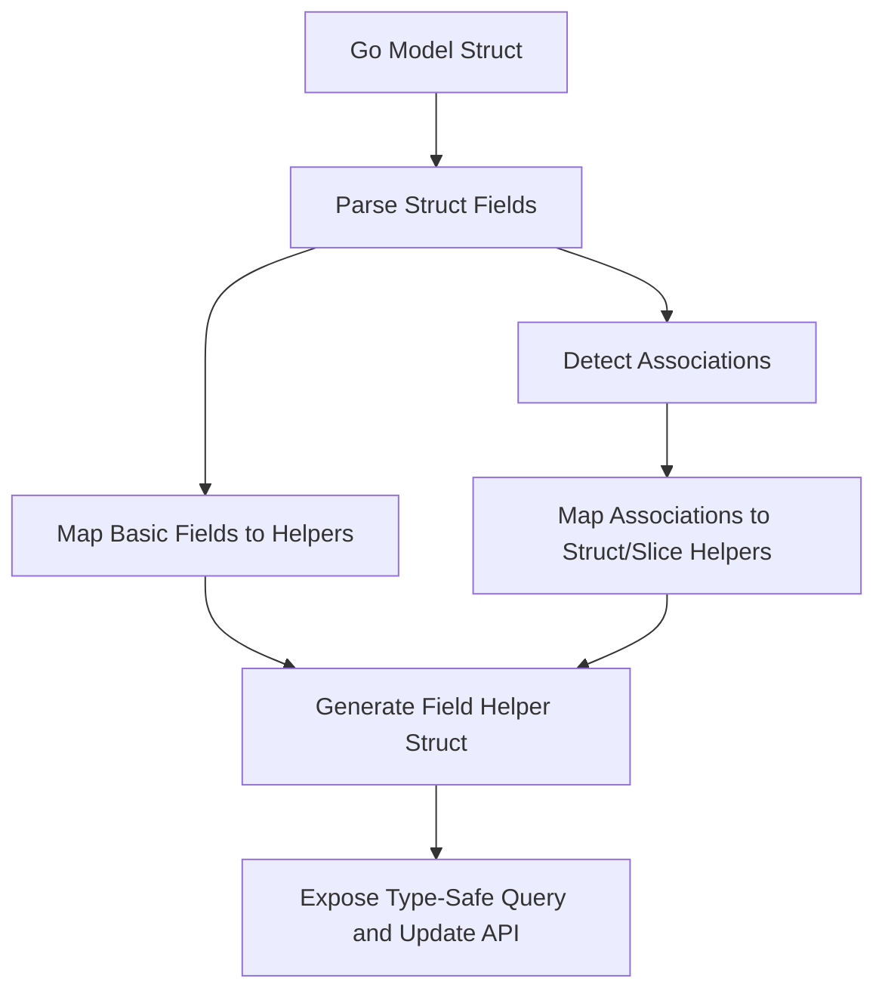

# Model Structs and Type Mapping

GORM CLI bridges your Go model structs and database access by automatically generating **field helpers** that provide type-safe, fluent APIs for filtering, updating, and managing associations. This documentation covers how the CLI parses your Go structs, how it maps Go field types (including custom and database-specific types) to generated helper types, and how you can extend or customize this process to handle non-standard fields such as JSON columns.

---

## Understanding Model Structs

At the core of GORM CLI's code generation are your **Go structs**—the data models that represent your database tables. These structs typically include:

- Basic fields like `string`, `int`, `bool`, `time.Time`, and nullable database types like `sql.NullInt64`.
- Associations representing relationships to other structs, such as `has_one`, `has_many`, `belongs_to`, and `many_to_many`.
- Custom tags to control GORM behavior or instruct the CLI generator.

### Example Model: User

```go
// User struct with basic fields and complex associations
type User struct {
    gorm.Model
    Name      string
    Age       int
    Birthday  *time.Time
    Score     sql.NullInt64
    LastLogin sql.NullTime

    Account   Account
    Pets      []*Pet
    Toys      []Toy `gorm:"polymorphic:Owner"`

    CompanyID *int
    Company   Company

    ManagerID *uint
    Manager   *User
    Team      []User `gorm:"foreignkey:ManagerID"`

    Languages []Language `gorm:"many2many:UserSpeak"`
    Friends   []*User    `gorm:"many2many:user_friends"`

    Role      string
    IsAdult   bool   `gorm:"column:is_adult"`
    Profile   string `gen:"json"` // Custom JSON field helper
}
```

This example reveals how GORM CLI infers field helper types:

- Basic types (`Name`, `Age`, `Role`, `IsAdult`) turn into strongly typed field helpers like `field.String`, `field.Number[int]`, and `field.Bool`.
- Nullable types such as `sql.NullInt64` and `sql.NullTime` map to `field.Field[T]` specialized for nullable values.
- Associations (`Account`, `Pets`, `Languages`) generate structured or slice helpers that enable relationship management.
- Custom JSON fields are identified by tags (`gen:"json"`) and mapped to user-defined helpers like `JSON`.

---

## How GORM CLI Maps Field Types

When generating helpers, GORM CLI examines your structs to create two categories of helpers:

### 1. Basic Field Helpers

These cover standard scalar fields and recognized nullable or custom types:

| Go Type                       | Generated Helper Type     | Description                            |
|------------------------------|--------------------------|------------------------------------|
| `string`                     | `field.String`            | Textual fields                      |
| `bool`                       | `field.Bool`              | Boolean fields                     |
| `int`, `uint`, `float*`      | `field.Number[T]`         | Numeric fields (int, float, uint) |
| `[]byte`                     | `field.Bytes`             | Byte arrays                       |
| `time.Time`                  | `field.Time`              | Timestamps or dates                |
| `sql.Null*` types            | `field.Field[T]`          | Nullable SQL values                |
| Custom types implementing *Scanner/Valuer/Serializer* | `field.Field[T]` | Special DB types supported by interfaces |

When a type implements allowed interfaces, such as `database/sql.Scanner` and `gorm.io/gorm.SerializerInterface`, the generator maps it as a generic `field.Field[T]` for flexible handling.

### 2. Association Field Helpers

Fields representing relationships are mapped to specialized helpers:

| Association Type              | Go Field Type             | Helper Type                  | Usage Example                          |
|------------------------------|--------------------------|------------------------------|--------------------------------------|
| Has One / Belongs To          | Single struct or pointer  | `field.Struct[T]`            | `generated.User.Account`              |
| Has Many / Many To Many       | Slice or slice pointer    | `field.Slice[T]`             | `generated.User.Pets`, `generated.User.Languages` |

These helpers provide operations to manage linked records (create, update, unlink, delete) with type-safety.

---

## Extending Field Mapping with Configuration

GORM CLI supports customizations through the optional `genconfig.Config` struct, letting you fine-tune how fields map to helper types.

### Key Configurable Maps

- **FieldTypeMap**: Override type mappings for specific Go types to custom helper types.
- **FieldNameMap**: Map fields by name or `gen` tag to specific helper types.

Example configuration snippet from `examples/query.go`:

```go
var _ = genconfig.Config{
    OutPath: "examples/output",
    FieldTypeMap: map[any]any{
        sql.NullTime{}: field.Time{}, // map sql.NullTime to time helper
    },
    FieldNameMap: map[string]any{
        "json": JSON{}, // map fields tagged with `gen:"json"` to custom JSON helper
    },
}
```

### Implementing Custom Helpers: JSON Case

For JSON column support, define a custom helper type implementing database-specific SQL generation logic.

Example:

```go
// JSON is a field helper for JSON columns that generates DB-specific comparisons.
type JSON struct{ column clause.Column }

func (j JSON) Equal(path string, value any) clause.Expression {
    return jsonEqualExpr{col: j.column, path: path, val: value}
}
```

This helper generates SQL like: 

- MySQL: `JSON_EXTRACT(col, path) = CAST(value AS JSON)`
- SQLite: `json_valid(col) AND json_extract(col, path) = value`
- Postgres: uses `jsonb_extract_path_text`

Use the `FieldNameMap` to register this helper for fields tagged as JSON.

---

## Generation Workflow: From Structs to Helpers

1. **Parsing Models**: GORM CLI parses your Go source files, reading struct definitions and extracting every exported field.
2. **Field Type Determination**: Using configured maps and interface detection, it determines the most appropriate helper type for each field.
3. **Association Detection**: Your relation fields (`struct` or `slice` of structs) are recognized as associations and receive special helpers.
4. **Name Mapping**: Database column names are derived via GORM's naming strategy or explicit `gorm:"column:"` tags.
5. **Helper Structs Generation**: A composite struct per model is created with every field mapped to its respective helper, exposing an API like:

```go
var User = struct {
    ID        field.Number[uint]
    Name      field.String
    Age       field.Number[int]
    Account   field.Struct[models.Account]
    Pets      field.Slice[models.Pet]
    Profile   JSON
}{
    ID:        field.Number[uint]{}.WithColumn("id"),
    Name:      field.String{}.WithColumn("name"),
    Age:       field.Number[int]{}.WithColumn("age"),
    Account:   field.Struct[models.Account]{}.WithName("Account"),
    Pets:      field.Slice[models.Pet]{}.WithName("Pets"),
    Profile:   JSON{}.WithColumn("profile"),
}
```

This struct acts as your API entrypoint for building type-safe queries and updates.

---

## Practical Examples

### Filtering by Basic Fields

```go
// Filter users whose name includes 'jinzhu' and age between 18 and 65
users, err := gorm.G[User](db).
    Where(
        generated.User.Name.Like("%jinzhu%"),
        generated.User.Age.Between(18, 65),
    ).
    Find(ctx)
```

### Updating with Field Helpers

```go
// Increase age by 1 and clear score (nullable int)
gorm.G[User](db).
  Where(generated.User.Name.Eq("alice")).
  Set(
    generated.User.Age.Incr(1),
    generated.User.Score.Set(sql.NullInt64{}),
  ).
  Update(ctx)
```

### Managing Associations (Create and Link)

```go
// Create user with one pet
gorm.G[User](db).
  Set(
    generated.User.Name.Set("alice"),
    generated.User.Pets.Create(generated.Pet.Name.Set("fido")),
  ).
  Create(ctx)
```

### Using Custom JSON Helper

```go
// Query users where JSON profile has vip = true
users, err := gorm.G[User](db).
  Where(generated.User.Profile.Equal("$.vip", true)).
  Find(ctx)
```

---

## Best Practices

- **Use `genconfig.Config` for Custom Types**: Register custom field helpers early in your packages to ensure seamless generation.
- **Keep Tags Consistent**: Use `gen:"json"` or similar tags precisely on struct fields requiring special helpers.
- **Name Associations Clearly**: Use meaningful Go struct and field names to make generated helpers intuitive.
- **Understand Nullable Types Mapping**: Nullable SQL types become generic fields with nullable capabilities.
- **Generate Often**: Integrate `gorm gen` as part of your build or CI pipelines to keep generated code up-to-date.

---

## Troubleshooting

### Field Not Mapping as Expected

- Verify your model’s field type matches a configured mapping.
- Confirm any custom tags like `gen:"json"` are present and spelled correctly.
- Ensure relevant packages are imported (e.g., `gorm.io/cli/gorm/field`).

### Generated Helper Missing

- Check your `genconfig.Config` for inclusion/exclusion filters.
- Make sure your model struct is within the scanned package or directory.
- Verify the generator output path and package alignment.

### Custom Helper Generation Errors

- Confirm your custom helper implements expected interfaces and methods.
- Test custom SQL generation logic independently.
- Review examples for JSON helper implementation.

---

## Visualization: Model Field Helper Generation Flow



---

## Next Steps

To deepen your mastery and extend functionality:

- Explore [Custom Field Helpers](https://pkg.go.dev/gorm.io/cli/gorm/genconfig#Config) for advanced type mappings
- Learn about [Associations and Relations](../associations-and-relations) to manage related data
- Understand how to use [Template-Based Queries](../template-queries-dsl) alongside generated helpers
- Customize generation using [genconfig.Config](../customizing-generation) to tailor outputs

---

## References and Related Documentation

- [Model-Driven Field Helpers](https://example.com/concepts/data-models-and-schema-representation/model-driven-field-helpers) (deeper concept overview)
- [Working with Associations](https://example.com/guides/advanced-patterns/working-with-associations) (managing linked data)
- [Custom Field Helpers](https://example.com/guides/advanced-patterns/json-field-helpers) (example with JSON)
- [Configuration & Customization](https://example.com/getting-started/first-steps/configuration-setup)
- [Quickstart Workflow](https://example.com/overview/feature-highlights-and-getting-started/quickstart)

---

By understanding how GORM CLI parses and maps your model structs into expressive, type-safe helper types, you unlock the full power of the CLI to generate fluent, maintainable database access code tailored precisely to your schema and application needs.