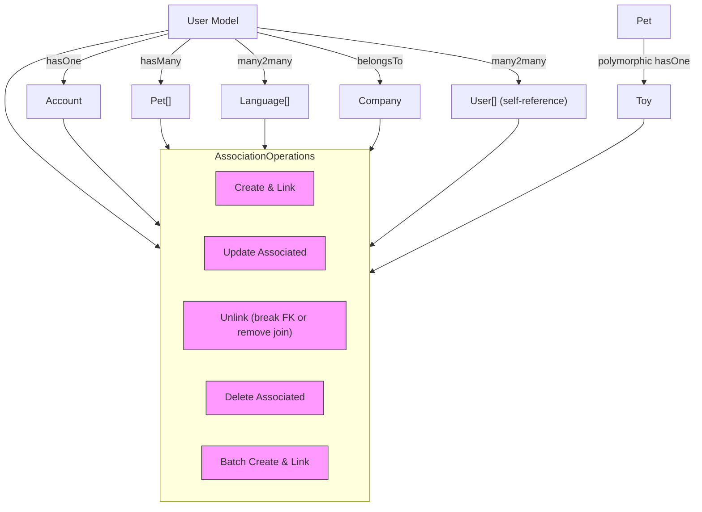

# Association Helpers and Operations

GORM CLI provides a robust, type-safe approach to working with associations in your GORM models by generating powerful association helpers. These helpers cover all major association types—including has-one, has-many, belongs-to, and many-to-many relationships—as well as polymorphic associations. This page breaks down how GORM CLI models these relationships, the operations supported, and how to use them effectively within your code to maintain data integrity and safety.

---

## Understanding Association Helpers

Every association in your models is represented by generated fields on the corresponding model helper struct. These use two core helper types:

- `field.Struct[T]`: Represents a single related object (`has-one`, `belongs-to`).
- `field.Slice[T]`: Represents multiple related objects (`has-many`, `many-to-many`).

These helpers provide methods to perform type-safe, declarative operations on associated data using a fluent API.

### Example Structure

For a `User` model with associations like `Account` (has-one), `Pets` (has-many), `Languages` (many-to-many), the generated helpers look like:

```go
var User = struct {
...
Account field.Struct[models.Account]
Pets    field.Slice[models.Pet]
Languages field.Slice[models.Language]
...
}{}
```

Each field includes typed methods to create, update, unlink, delete, or batch create related data.

---

## Supported Association Operations

GORM CLI generates a consistent set of operations that you use within a `Set(...).Create(ctx)` or `Set(...).Update(ctx)` call on your root model query. These operations ensure data safety and clear semantics.

| Operation       | Description                                                                 | When to Use                        |
|-----------------|-----------------------------------------------------------------------------|----------------------------------|
| `Create`        | Creates and associates a new related record **per matched parent row**.     | Creating new records on associations for existing parents.
| `CreateInBatch` | Creates and associates multiple related records in batch **for matched parents**. | Efficient batch creation for has-many and many-to-many.
| `Update`        | Updates fields on associated records, with optional filter conditions.      | Modify related records under matched parents.
| `Unlink`        | Removes the association link without deleting associated records.           | Disconnect associations safely without removing child rows.
| `Delete`        | Deletes associated records (for many-to-many, deletes join rows only).      | Remove associated data or join rows permanently.

### Example Usage

```go
// Create a new User and associate one Pet
gorm.G[User](db).
  Set(
    generated.User.Name.Set("alice"),
    generated.User.Pets.Create(generated.Pet.Name.Set("fido")),
  ).
  Create(ctx)

// Update a Pet's name where owned by user ID 1 and pet name = 'fido'
gorm.G[User](db).
  Where(generated.User.ID.Eq(1)).
  Set(generated.User.Pets.Where(generated.Pet.Name.Eq("fido")).Update(
    generated.Pet.Name.Set("rex"),
  )).
  Update(ctx)

// Unlink a user's Pets (remove FK, keep Pet rows)
gorm.G[User](db).
  Where(generated.User.ID.Eq(1)).
  Set(generated.User.Pets.Unlink()).
  Update(ctx)

// Delete a user's Pets named 'old'
gorm.G[User](db).
  Where(generated.User.ID.Eq(1)).
  Set(generated.User.Pets.Where(generated.Pet.Name.Eq("old")).Delete()).
  Update(ctx)

// Batch create multiple languages related to a user (many-to-many)
gorm.G[User](db).
  Where(generated.User.ID.Eq(1)).
  Set(generated.User.Languages.CreateInBatch([]models.Language{{Code: "EN"}, {Code: "FR"}})).
  Update(ctx)
```

---

## Semantics of Each Operation by Association Type

| Association Type | Create                  | Update               | Unlink                                      | Delete                                   |
|------------------|-------------------------|----------------------|---------------------------------------------|------------------------------------------|
| `belongs to`     | Sets parent FK & links  | Updates parent record| Sets parent's FK nullable (breaks link)    | Deletes parent rows                      |
| `has one`        | Creates child & links   | Updates child records| Sets child's FK nullable (breaks link)     | Deletes child rows                       |
| `has many`       | Creates multiple children & links| Updates matching children| Sets children's FK nullable (breaks link) | Deletes child rows                     |
| `many2many`      | Creates and inserts join rows| Updates matching target records| Removes join table rows only (keeps records)| Removes join rows only (not target records)|
| `polymorphic`    | Creates linked polymorphic target| Updates polymorphic target| Clears polymorphic keys (breaks link)    | Deletes polymorphic target rows         |


### Important Notes

- **Unlink vs Delete:** Unlink disconnects the association but does not remove the related rows (except for many-to-many where it deletes join rows only). Delete removes rows or join rows permanently.
- **CreateInBatch:** Efficiently batch creates associations for multiple matched parents, only supported for slice associations (has-many, many-to-many).

---

## Working with Conditions on Associations

You can apply `Where` conditions on association helpers to target specific related records during `Update`, `Delete`, or `Unlink` operations.

```go
// Update pets named 'fido' for matching users
gorm.G[User](db).
  Where(generated.User.ID.Eq(1)).
  Set(generated.User.Pets.Where(generated.Pet.Name.Eq("fido")).Update(
    generated.Pet.Name.Set("rex"),
  )).
  Update(ctx)

// Delete only 'old' pets for the user
gorm.G[User](db).
  Where(generated.User.ID.Eq(1)).
  Set(generated.User.Pets.Where(generated.Pet.Name.Eq("old")).Delete()).
  Update(ctx)
```

This filtering allows precise control and avoids unintended operations on unrelated records.

---

## Polymorphic Associations

GORM CLI supports polymorphic-association helpers just as it does standard ones. These are modeled as struct fields with polymorphic tags in your Go models.

Example:

```go
// In models
type Pet struct {
  Toy Toy `gorm:"polymorphic:Owner"`
}
```

The generated helper will be a `field.Struct[Toy]` on `Pet`. Operations such as `Create`, `Update`, `Unlink`, and `Delete` behave by setting or clearing the polymorphic keys (`OwnerID`, `OwnerType`).

```go
// Update pet's toy's name
gorm.G[Pet](db).
  Where(generated.Pet.ID.Eq(petID)).
  Set(generated.Pet.Toy.Where(generated.Toy.Name.Eq("ball")).Update(generated.Toy.Name.Set("cube"))).
  Update(ctx)

// Unlink toy from pet (clears OwnerID/OwnerType)
gorm.G[Pet](db).
  Where(generated.Pet.ID.Eq(petID)).
  Set(generated.Pet.Toy.Unlink()).
  Update(ctx)

// Delete the toy associated with the pet
gorm.G[Pet](db).
  Where(generated.Pet.ID.Eq(petID)).
  Set(generated.Pet.Toy.Delete()).
  Update(ctx)
```

---

## Batch Create Operations

`CreateInBatch` allows batch creation of multiple associated records per matched parent, reducing database calls and improving efficiency.

Supported for `Slice[T]` associations such as `has-many` and `many-to-many`.

```go
// Batch create pets for users matching condition
pets := []models.Pet{{Name: "Fido"}, {Name: "Rex"}}
gorm.G[User](db).
  Where(generated.User.ID.Eq(42)).
  Set(generated.User.Pets.CreateInBatch(pets)).
  Update(ctx)

// Batch create languages linked to a user (m2m)
gorm.G[User](db).
  Where(generated.User.ID.Eq(1)).
  Set(generated.User.Languages.CreateInBatch([]models.Language{{Code: "EN"}, {Code: "FR"}})).
  Update(ctx)
```

---

## Underlying API Overview

The association helpers use strongly typed Go generics with the `field.Struct[T]` and `field.Slice[T]` types that provide the operations.

Here is the essence of the API exposed on these helper types:

| Method          | Description                                              | Receiver              |
|-----------------|----------------------------------------------------------|-----------------------|
| `Create(...)`   | Prepare an association create with field assignments    | `Struct[T]` or `Slice[T]`
| `CreateInBatch` | Batch create multiple associated records                 | `Slice[T]` only       |
| `Update(...)`   | Update matching associated records with assignments     | `Where`-clause result |
| `Unlink()`      | Remove association (set FK null or remove join rows)    | `Where`-clause result |
| `Delete()`      | Delete matching associated records (join rows for many2many) | `Where`-clause result |
| `Where(...)`    | Add filtering conditions to target associated rows      | `Struct[T]` or `Slice[T]`


---

## Best Practices & Tips

- **Use `Where` to narrow association operations:** To avoid accidental mass updates or deletes, always add conditions when performing `Update`, `Delete`, or `Unlink` on associations.
- **Unlink before Delete if not sure:** To maintain data integrity, prefer unlinking associations before deleting child records.
- **Leverage `CreateInBatch` for performance:** When creating many children or many-to-many links for multiple parents, use batch creation to reduce SQL statements.
- **Understand association semantics:** Unlink vs Delete behave differently by association type — be certain of your intent when choosing.
- **Test association operations:** Use integration tests (see `models_relations_test.go`) to confirm that associations link and unlink as expected in your domain.

---

## Troubleshooting Common Issues

<AccordionGroup title="Troubleshooting Association Helpers">
<Accordion title="Associated records not linked on Create">
Ensure you use `.Set(...)` combined with `.Create(ctx)` or `.Update(ctx)` on the parent query. Creating the child independently will not set the association.
</Accordion>
<Accordion title="Update does not affect any rows">
Verify your `Where` clause on the association filters correct child records. Missing or incorrect filters lead to no matching update targets.
</Accordion>
<Accordion title="Unlink does not clear parent/child foreign keys">
Check the association type and confirm that your database schema allows NULL on foreign keys. Non-nullable foreign keys cause unlinking to fail.
</Accordion>
<Accordion title="Batch creation fails or duplicates occur">
Make sure the records you batch create include no conflicting primary keys. Also, confirm the association supports batch create semantics.
</Accordion>
</AccordionGroup>

---

## Visualizing Association Operations



---

## References & Next Steps

- **See `examples/output/models_relations_test.go`** for full end-to-end association operation examples.
- Explore the [Working with Model-Driven Field Helpers](https://your-docs-url/guides/core-workflows/model-field-helpers) guide for detailed usage patterns.
- Visit the [Type-Safe Queries with Interfaces](https://your-docs-url/guides/core-workflows/type-safe-queries) guide to integrate query methods with your association operations.
- Consult [Customizing Generation](https://your-docs-url/guides/advanced-usage/customizing-generation) to tweak generation if specific association behaviors are needed.


---

This comprehensive approach to association helpers empowers you to work confidently and efficiently with related data in your GORM-powered applications, leveraging type safety and maintainable patterns.
