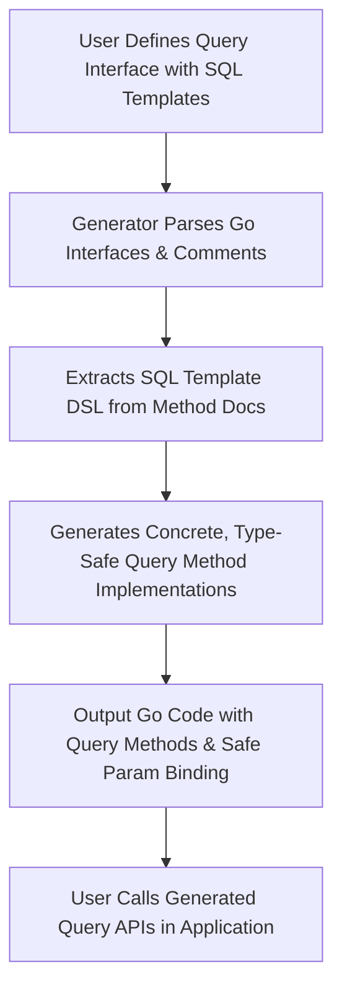

# Interface-Driven Query Generation

GORM CLI leverages Go interfaces enriched with SQL template comments to automatically generate concrete, type-safe query methods tailored to your models. This approach turns interface definitions and specially formatted comments into powerful, compile-time checked database access APIs, enabling you to write expressive queries with predictability and fluency.

---

## Concept Overview

At the core of GORM CLI's interface-driven query generation is the idea that you define query methods abstractly as Go interface functions, augmented with SQL template comments. The generator interprets these comments as instructions for creating safe, strongly typed implementations that integrate seamlessly with GORM.

This technique accomplishes several user-centric goals:

- **Clear Intent**: By writing method signatures and SQL templates side-by-side, you express the exact shape and purpose of each query.
- **Type Safety**: The generator ensures parameters and return types align safely with your model types, catching mismatches early.
- **Flexible Queries**: SQL templates support dynamic clauses, conditional fragments, and parameter binding to express complex logic cleanly.
- **Productivity**: Write your intent once and let the CLI handle boilerplate generation, allowing you to focus on data access logic rather than plumbing.


## How Interface-Driven Query Generation Works

### Defining Query Interfaces

Users create generic Go interfaces parameterized by the model type `T any`. Each method in the interface represents a database query or command. The method’s comment block contains SQL templates or directive annotations that specify the actual SQL executed.

Example:

```go
// Query represents a generic query interface for models.
type Query[T any] interface {

  // SELECT * FROM @@table WHERE id=@id
  GetByID(id int) (T, error)

  // SELECT * FROM @@table WHERE @@column=@value
  FilterWithColumn(column string, value string) (T, error)

  // More methods with dynamic SQL templates ...
}
```

- `@@table` is a special directive replaced by the model’s table name.
- `@id`, `@column`, etc. are placeholders automatically bound to method parameters for safe SQL injection.


### The Query Method DSL and Template Syntax

GORM CLI supports a rich template DSL inside method comment blocks to define parameterized queries flexibly:

| Directive   | Function                                         | Example Usage                                |
| ----------- | ------------------------------------------------ | -------------------------------------------- |
| `@@table`   | Replaced by the SQL table name of the model.     | `SELECT * FROM @@table WHERE id=@id`         |
| `@@column`  | Dynamically inserts a column name parameter.     | `WHERE @@column=@value`                        |
| `@param`    | Binds Go method parameters to SQL named params. | `WHERE name=@user.Name`                       |
| `{{where}}` | Conditionally inserts WHERE clause fragments.    | `{{where}} age > 18 {{end}}`                  |
| `{{set}}`   | Conditionally inserts SET clause fragments for UPDATE statements.
| `{{if}}`    | Inserts conditional logic inside templates.      | `{{if user.Age > 18}} is_adult=1 {{else}} is_adult=0 {{end}}` |
| `{{for}}`   | Loops over collections for dynamic query building.| `{{for _, tag := range tags}} ... {{end}}`   |

These directives allow you to express filtering, updating, and complex conditional logic clearly within comments.


### Template Parsing and Code Generation

When running the GORM CLI generator, it parses your interface files as follows:

1. **Extract Interfaces**: Parses all Go interfaces in the input directory.
2. **Extract Method SQL Templates**: Reads the commented SQL template from each method.
3. **Parse Template DSL**: Processes directives (`@@table`, `@param`, etc.) into Go code snippets that generate SQL with parameter binding.
4. **Generate Concrete Implementations**: Creates type-safe methods on generated structs implementing your interface for use in your application.

Behind the scenes, the generator converts each SQL template into a string builder logic, appending actual SQL and parameters in code efficiently.


## Practical User Workflow

### Step 1: Define Your Query Interface

Create or update your generic query interface in Go with methods and annotated SQL templates.

```go
// examples/query.go
type Query[T any] interface {
  // SELECT * FROM @@table WHERE id=@id
  GetByID(id int) (T, error)

  // UPDATE @@table
  // {{set}}
  //   {{if user.Name != ""}} name=@user.Name, {{end}}
  // {{end}}
  // WHERE id=@id
  UpdateInfo(user User, id int) error
}
```

### Step 2: Run GORM CLI to Generate Code

Execute the CLI command pointing to your interface files:

```bash
gorm gen -i ./examples -o ./generated
```

This outputs concrete query interface implementations into the specified directory.

### Step 3: Use Generated Query Clients

Use the concrete implementations in your application code with full compile-time checks.

```go
ctx := context.Background()
db := gormDBInstance // Your *gorm.DB
query := generated.Query[User](db)

// Retrieve user by ID
user, err := query.GetByID(ctx, 123)

// Update a user record
err = query.UpdateInfo(ctx, User{Name: "jinzhu"}, 123)
```


## Detailed Examples of Template DSL Usage

### Simple Parameter Binding

```go
// SELECT * FROM @@table WHERE id=@id AND name = "@name"
GetByID(id int, name string) (T, error)
```

Generates code that binds `id` and `name` safely as SQL params.


### Conditional WHERE Clauses

```sql
SELECT * FROM @@table
{{where}}
  {{if user.ID > 0}} id=@user.ID {{end}}
  {{if user.Name != ""}} AND name=@user.Name {{end}}
{{end}}
```

Generates dynamic WHERE clauses based on input struct fields.


### Dynamic UPDATE SET Example

```sql
UPDATE @@table
{{set}}
  {{if user.Name != ""}} name=@user.Name, {{end}}
  {{if user.Age > 0}} age=@user.Age {{end}}
{{end}}
WHERE id=@id
```

Allows conditional field updates, so only non-empty values are updated.


## Benefits and User Outcomes

By mastering interface-driven query generation with GORM CLI, developers unlock:

- **Rapid Development**: Define only the interface and markup comments; let generation automate the rest.
- **Safety and Confidence**: All parameters and results are type-checked and bound, reducing runtime SQL errors.
- **Readable Query Logic**: The SQL template syntax keeps queries explicit and easy to reason about.
- **Integration Friendliness**: Generated code aligns perfectly with GORM's idioms and fluent APIs.


## Troubleshooting and Common Pitfalls

<AccordionGroup title="Common Issues & Solutions">
<Accordion title="Method Return Types Mismatch">
Verify that:
- Methods with SQL templates that perform data retrieval return either `(T, error)` or `([]T, error)`.
- Methods that only chain query construction return the interface type.
- The last return value must always be `error` if more than one return value.
</Accordion>
<Accordion title="Missing or Malformed SQL Template Comments">
Make sure your method comments include valid SQL templates or directive annotations.
An empty doc or missing template will cause the generator to skip or fail those methods.
</Accordion>
<Accordion title="Incorrect Template Directive Usage">
Double-check the syntax of template directives such as `{{where}}`, `{{set}}`, and the correct use of `@param` bindings.
Incorrect syntax leads to parsing errors during generation.
</Accordion>
</AccordionGroup>


## Visualization: Interface-Driven Generation Flow




---

## Additional Resources

- [Template DSL Deep Dive Guide](/guides/advanced-usage/template-dsl) — Master complex template constructs.
- [Using Generated Code](/getting-started/initial-usage/use-generated-code) — Learn how to consume generated query APIs.
- [Code Generation Workflow](/overview/integration-and-use/generation-workflow) — Understand the full generation lifecycle.
- [Model-Driven Field Helpers](/concepts/data-models-apis/model-concepts) — Combine field helpers with queries for versatile access.


---

By internalizing interface-driven query generation, you leverage GORM CLI's full power to produce elegant, efficient, and safe database access layers with minimal manual code.


---

<Check>
Remember: This page focuses strictly on how interface definitions with SQL template comments drive generation of concrete query clients that you use in your app code.
For usage patterns and field helper details, see related guides linked above.
</Check>


---

## Summary

This page breaks down GORM CLI's interface-driven query generation technique, showing how Go interfaces with annotated SQL templates become concrete, type-safe query implementations. It details the special template DSL directives, binding mechanisms, method signature requirements, and how the generator processes the inputs to create robust query APIs. Practical examples and troubleshooting advice are provided to ensure a smooth developer experience.


---

<Source url="https://github.com/go-gorm/cli" branch="main" paths={[{"path": "examples/query.go", "range": "1-70"},{"path": "internal/gen/generator.go", "range": "1-400"}]}/>

---


