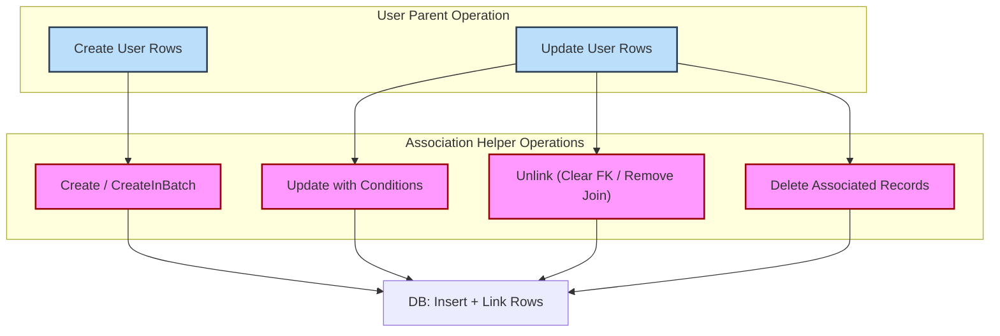

# Working with Associations

Learn how GORM CLI models and manipulates various association types such as has one, has many, belongs to, many2many, and polymorphic relationships. This guide explains the operations you can perform on these associations—create, update, unlink, delete—as well as how to use the generated helpers to seamlessly manage parent-child relationship semantics in your Go applications.

---

## Understanding Association Types

GORM CLI generates **association helpers** based on your Go model structs. These helpers encapsulate common types of database relationships, enabling expressive, type-safe operations with the GORM ORM.

### Supported Association Types

| Association Type | Description                                  | Go Model Representation                           |
|------------------|----------------------------------------------|--------------------------------------------------|
| Has One          | One-to-one relationship, parent to single child | A single struct field: e.g., `Account` in `User`  |
| Has Many         | One-to-many relationship, parent to multiple children | A slice or pointer slice field: e.g., `Pets []*Pet` in `User` |
| Belongs To       | Child owns foreign key pointing to parent     | Struct with foreign key field on child: e.g., `Company` in `User` |
| Many2Many        | Many-to-many via join table                     | Slice with `gorm:"many2many:<join_table>"`: e.g., `Languages []Language` |
| Polymorphic      | Association via dynamic owner type and ID     | Fields with `gorm:"polymorphic:Owner"`: e.g., `Toys []Toy` in `User`


### Modeling Associations Example

```go
// User has one Account, many Pets and Toys (polymorphic), belongs to Company and Manager, and many-many Languages and Friends.
type User struct {
	gorm.Model
	Name      string
	Account   Account          // Has One
	Pets      []*Pet           // Has Many
	Toys      []Toy            `gorm:"polymorphic:Owner"`   // Polymorphic Has Many
	CompanyID *int
	Company   Company          // Belongs To
	ManagerID *uint
	Manager   *User            // Belongs To
	Languages []Language       `gorm:"many2many:UserSpeak"`  // Many to Many
	Friends   []*User          `gorm:"many2many:user_friends"`  // Many to Many (self referential)
}
```

---

## Association Operations

Each association helper exposes a rich set of operations designed to cover common manipulation scenarios.

| Operation             | Description                                                                                   | Usage Context                                 |
|-----------------------|-----------------------------------------------------------------------------------------------|-----------------------------------------------|
| **Create**            | Create a new associated record and link it to the parent(s).                                  | Use `Set(...).Create(ctx)` on single or batch |
| **CreateInBatch**     | Efficiently create/link multiple associated records in batch for matched parents.             | Use for has many / many2many slice associations |
| **Update**            | Update associated records matching optional conditions.                                      | Use `Set(...).Update(ctx)` with conditions    |
| **Unlink**            | Remove the association without deleting records: clears foreign key or removes join rows only.| Use `Set(...).Update(ctx)` to unlink          |
| **Delete**            | Deletes associated records or join rows (many2many deletes only join rows).                    | Use `Set(...).Update(ctx)` to delete           |

### Parent Operation Semantics

- **Create(ctx):** Inserts new parent rows with given values and applies association creates.
- **Update(ctx):** Updates matched parent rows, then applies association updates, unlinks, or deletes.

---

## Using Generated Association Helpers

The generated code exposes your model fields as typed association helpers:

- `field.Struct[T]` for single associations (has one, belongs to)
- `field.Slice[T]` for multi-associations (has many, many2many)

### Example: Basic Association Usage

```go
// Create a user and a pet
gorm.G[User](db).
  Set(
    generated.User.Name.Set("alice"),
    generated.User.Pets.Create(generated.Pet.Name.Set("fido")),
  ).
  Create(ctx)

// Update pet named 'fido' owned by user ID=1
gorm.G[User](db).
  Where(generated.User.ID.Eq(1)).
  Set(
    generated.User.Pets.Where(generated.Pet.Name.Eq("fido")).Update(
      generated.Pet.Name.Set("rex"),
    ),
  ).
  Update(ctx)

// Unlink all pets from user ID=1 (nullify pet foreign keys, keep pet rows)
gorm.G[User](db).
  Where(generated.User.ID.Eq(1)).
  Set(generated.User.Pets.Unlink()).
  Update(ctx)

// Delete all pets named 'old' owned by user ID=1
gorm.G[User](db).
  Where(generated.User.ID.Eq(1)).
  Set(generated.User.Pets.Where(generated.Pet.Name.Eq("old")).Delete()).
  Update(ctx)
```

### Batch Create Example

```go
// Batch create two languages and link to all matched users
gorm.G[User](db).
  Set(
    generated.User.Languages.CreateInBatch([]models.Language{{Code: "EN"}, {Code: "FR"}}),
  ).
  Update(ctx)
```

---

## Semantics by Association Type

Understanding unlink and delete behaviors specific to each association type is vital for correct usage.

| Association | `Unlink()` Behavior                         | `Delete()` Behavior                            |
|-------------|-----------------------------------------------|------------------------------------------------|
| Belongs To  | Sets parent's foreign key to NULL             | Deletes associated child rows                   |
| Has One / Has Many | Sets child's foreign key to NULL (detaches)  | Deletes child rows                               |
| Many2Many   | Removes join table rows only                    | Removes join table rows only, leaves owned rows |

> **Note:** `Unlink` never deletes rows; it only removes associations by nullifying foreign keys or deleting join rows.

---

## Polymorphic Associations

Polymorphic associations point to different parent types using an owner type and owner ID.

- Unlink clears the polymorphic keys (`OwnerID`, `OwnerType`) to zero-values, keeping associated rows intact.
- Delete removes the polymorphic associated rows.

### Polymorphic Example

```go
// Pet toy is a polymorphic has one
// Update toy name
gorm.G[Pet](db).
  Where(generated.Pet.ID.Eq(petID)).
  Set(generated.Pet.Toy.Where(generated.Toy.Name.Eq("ball")).Update(generated.Toy.Name.Set("cube"))).
  Update(ctx)

// Unlink toy from pet (clears OwnerID and OwnerType columns)
gorm.G[Pet](db).
  Where(generated.Pet.ID.Eq(petID)).
  Set(generated.Pet.Toy.Unlink()).
  Update(ctx)

// Delete toy
gorm.G[Pet](db).
  Where(generated.Pet.ID.Eq(petID)).
  Set(generated.Pet.Toy.Delete()).
  Update(ctx)
```

---

## Best Practices and Tips

- Always use association helpers when manipulating related data to ensure compile-time safety and consistency.
- Use conditional filters with `Where` on association helpers to target specific child records.
- For batch operations on has many or many2many relations, prefer `CreateInBatch` for efficiency.
- Remember that `Unlink` will **not delete** records but only dissociate them; use `Delete` to remove records permanently.
- When working with polymorphic associations, `Unlink` clears owning keys, preserving the associated row.

---

## Troubleshooting Common Scenarios

<AccordionGroup title="Troubleshooting Frequently Encountered Issues">
<Accordion title="No Association Helper Generated">
Check that your model struct defines the association with correct GORM tags such as `gorm:"many2many:<join_table>"` or `gorm:"polymorphic:<Owner>"`. Ensure the generator ran successfully and included your struct.
</Accordion>
<Accordion title="Unlink Operation Doesn't Nullify Foreign Key">
Verify the association type: `belongs to` association sets parent's foreign key; `has many` sets child's foreign key. Confirm your foreign key fields are nullable to accept NULL values.
</Accordion>
<Accordion title="Batch Create Fails or Doesn't Link Correctly">
Confirm you are providing a slice of struct values to `CreateInBatch` and that the foreign keys are properly set or nullable. Check for database constraints that might reject inserts.
</Accordion>
</AccordionGroup>

---

## Summary

This page covers how GORM CLI models database associations and provides rich, type-safe helpers for managing linked data. You learned the key operations available per association type—create, batch create, update, unlink, delete—and the semantics that govern parent-child relationships. Using generated helpers ensures safer, clearer, and more maintainable data operations.

---

## Further Reading

- [Building Query APIs from Interfaces](/guides/core-workflows/query-api-guide) — Writing SQL templates inside interfaces to generate query methods
- [Model-Driven Field Helpers in Action](/guides/core-workflows/field-helper-workflows) — Leverage field helpers for predicates and updates
- [Configuring Code Generation](/guides/real-world-patterns/configuring-generation) — Customize generators for precise outputs
- [Troubleshooting & Common Issues](/getting-started/first-steps/troubleshooting) — Quickly diagnose common mistakes
- [Examples: models_relations_test.go](https://github.com/go-gorm/cli/blob/main/examples/output/models_relations_test.go) — Real end-to-end association usage tests

---

## Diagram: Association Operation Flow


