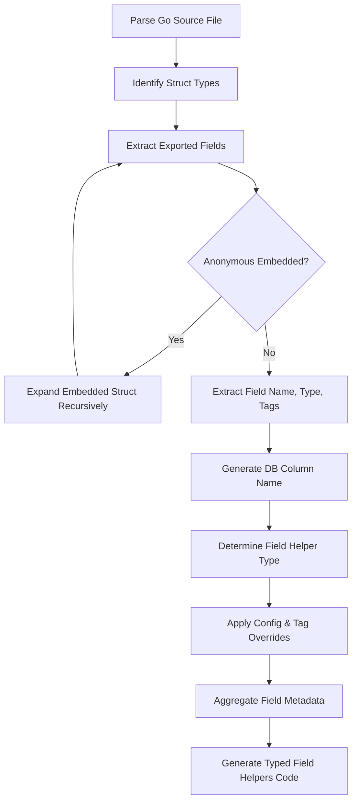

# From Go Models to Database Schema

Explore the process and assumptions behind translating Go structs into schema-aware code. This guide explains how GORM CLI transforms Go struct definitions into detailed schema metadata and type-safe field helpers, enabling rich database query and mutation capabilities. You’ll understand how primitive types, custom types, and tag-driven overrides are handled to produce accurate and practical schema mappings.

---

## Understanding Schema Translation

When you define a Go struct as a GORM model, GORM CLI analyzes the struct’s fields to produce a schema representation that captures the following:

- **Field Names and Types:** Both Go type and corresponding database column name.
- **Type Mappings:** Mapping Go types (including primitives, nullable types, time.Time, and custom types) to field helpers.
- **Field Tags:** Processing GORM tags and custom `gen` tags for overrides such as column names or custom field helper types.
- **Embedded Fields:** Handling anonymous fields and embedded structs.

This schema metadata underpins the generation of strongly typed helpers and query interfaces.

## Workflow: From Struct to Schema Metadata

1. **Parsing the Go AST**

   The Go source file containing your models is parsed to produce an AST representation.

2. **Locating Struct Types**

   Each `TypeSpec` node representing a struct is identified and processed.

3. **Extracting Fields**

   For every struct:

   - Non-exported fields are ignored.
   - Exported fields are processed for names, types, and tags.
   - Anonymous embedded structs are recursively expanded.

4. **Database Column Name Determination**

   The database column name for each field is derived from:

   - The `gorm:"column:<name>"` tag, if present.
   - Otherwise, GORM's naming strategy maps from the Go field name.

5. **Type Identification and Field Helper Assignment**

   Each field's Go type is examined to assign a corresponding field helper type:

   - **Basic Scalar Types:** string, int, bool, float, time.Time, []byte map to simple field helpers (e.g., `field.String`, `field.Number[int]`, `field.Time`).

   - **Nullable/Custom Types:** Types implementing `database/sql.Scanner`, `driver.Valuer`, or GORM’s `SerializerInterface` are mapped to generic `field.Field[T]` wrappers.

   - **Associations:** Slices or structs representing related models are mapped to association helpers like `field.Slice[T]` or `field.Struct[T]`.

   - **Custom Field Helper Overrides:** The generator consults configured maps (`FieldTypeMap` and `FieldNameMap`) and struct field `gen` tags to override helper types.

6. **Generating Field Metadata**

   Metadata includes the Go field name, DB column name, Go type, and resolved helper helper type.

7. **Preparing for Code Generation**

   The collected metadata is fed into templates to produce:

   - Constants representing the database columns.
   - Typed field helpers providing predicates and setters.

---

## Handling Basic and Complex Types

### Basic Field Types Mapping

| Go Type        | Generated Helper      | Example Usage                      |
|----------------|----------------------|-----------------------------------|
| `string`       | `field.String`       | `User.Name.Like("jinzhu")`      |
| `bool`         | `field.Bool`         | `User.IsActive.Eq(true)`           |
| `int`, `float` | `field.Number[int]`  | `User.Age.Gt(18)`                  |
| `time.Time`    | `field.Time`         | `User.CreatedAt.Before(t)`         |
| `[]byte`       | `field.Bytes`        | `User.Data.Eq([]byte{...})`        |

### Nullable and Custom Types

Objects implementing interfaces like `sql.Scanner` and `driver.Valuer` signal nullable or custom field behavior, mapped as generic `field.Field[T]` with their Go type:

```go
// Field helper for a nullable int64 (sql.NullInt64)
generated.User.Score.Eq(sql.NullInt64{Int64: 42, Valid: true})
```

### Association Field Types

- Slices (e.g., `[]*Pet`) generate `field.Slice[T]` helpers for batch and conditional association operations.
- Structs for related models generate `field.Struct[T]` helpers for managing `has one` or `belongs to` associations.

### Embedded and Anonymous Fields

Embedded structs are recursively expanded so all their exported fields become part of the parent schema metadata — providing flattened access and consistent helper generation.

---

## Using Struct Tags and Configuration

### GORM `column` Tag

The `gorm:"column:<name>"` tag instructs the generator to override the default naming strategy with the specified database column name.

Example:

```go
type User struct {
  ID uint `gorm:"column:user_id"`
}
```

This results in a field helper bound to the DB column `user_id` instead of `id`.

### Custom Field Helper Mapping via `gen` Tag

You can tag a field with `gen:"<helper>"` to request a specific helper type from the configuration, e.g.,

```go
Profile string `gen:"json"`
```

The generator then uses your declared custom JSON helper for this field.

### Configuration Overrides

The generator uses package-level or file-level `genconfig.Config` to adjust:

- **Output paths**
- **Field type mappings**
- **Field name mappings**
- **Include or exclude interfaces and structs for generation**

Example snippet enabling a JSON helper:

```go
var _ = genconfig.Config{
  FieldNameMap: map[string]any{
    "json": JSON{},
  },
}
```

This flexibility lets you adapt generation to complex project requirements.

---

## Practical Tips & Best Practices

- **Export All Model Fields You Wish to Generate**: Only exported fields produce helpers.
- **Use GORM Tags to Control Column Names Explicitly**: Avoid surprises due to naming conventions.
- **Customize Field Helper Types via Configuration for Specialized Cases**: For JSON or other complex fields.
- **Keep Embeddings Clear and Intentional**: Embedded structs expand automatically — ensure no naming collisions.
- **Test Generated Code to Confirm Mapping Accuracy**: Leverage provided test helpers to catch mismatches early.

---

## Common Pitfalls

- **Nil or Unexported Fields Are Omitted**: Embeddings or fields that are not visible will not have helpers.
- **Invalid or Absent Tags Can Cause Unexpected Column Names**: Review GORM tag syntax.
- **Unsupported Types Will Default to Generic Helpers, May Require Explicit Mapping**
- **Overlapping Field Names in Embeddings Can Cause Conflicts**: Avoid duplicate names across embedded structs.

---

## Example Walkthrough

Given the struct:

```go
package models

import "time"

type User struct {
  ID        uint
  CreatedAt time.Time
  Name      string
  Age       int
  Profile   string `gen:"json"`
  Pets      []*Pet
}
```

The generator observes:

- `ID`: maps to `field.Number[uint]`, column `id`.
- `CreatedAt`: maps to `field.Time`, column `created_at`.
- `Name`: maps to `field.String`, column `name`.
- `Age`: maps to `field.Number[int]`, column `age`.
- `Profile`: uses custom JSON `field.Field[string]` helper.
- `Pets`: maps to association `field.Slice[Pet]` for `has many`.

It produces code similar to:

```go
var User = struct {
  ID        field.Number[uint]
  CreatedAt field.Time
  Name      field.String
  Age       field.Number[int]
  Profile   JSON
  Pets      field.Slice[Pet]
}{
  ID:        field.Number[uint]{}.WithColumn("id"),
  CreatedAt: field.Time{}.WithColumn("created_at"),
  Name:      field.String{}.WithColumn("name"),
  Age:       field.Number[int]{}.WithColumn("age"),
  Profile:   JSON{}.WithName("Profile"),
  Pets:      field.Slice[Pet]{}.WithName("Pets"),
}
```

This set of fields empowers you to build expressive, type-safe queries and updates easily.

---

## Visual Diagram of Struct Processing Flow



---

## Troubleshooting

### Generated Fields Missing or Incorrect

- Confirm fields are exported (capitalized).
- Check GORM tags for correct `column` usage.
- Ensure custom types implement `Scanner` and `Valuer` where applicable or are mapped via config.

### Unexpected Column Names

- Validate naming strategies and overrides in tags.
- Check if config whitelists or blacklists are excluding your struct.

### Embedded Fields Not Expanding

- Ensure embedded structs’ fields are exported.
- Confirm no cyclical imports or parsing errors.

---

## Next Steps

- Review [Model-Driven Field Helpers](https://gorm.io/docs/cli/field-helper-design) for usage details.
- Explore [Working with Associations](https://gorm.io/docs/cli/associations-and-operations) to leverage association helpers from your schema.
- Consult [Configuring Code Generation](https://gorm.io/docs/cli/configuring-generation) to customize mappings and filters.
- Follow [Getting Started](https://gorm.io/docs/cli/getting-started) to integrate generated code into your GORM-based project.

---

## References

- [GORM CLI README.md](https://github.com/go-gorm/cli/blob/main/README.md)
- [Field Helper Design](https://gorm.io/docs/cli/field-helper-design)
- [Code Generator Internal](https://github.com/go-gorm/cli/blob/main/internal/gen/generator.go)
- [Configuring Generation](https://gorm.io/docs/cli/configuring-generation)

---

> Understanding how GORM CLI translates your Go models into detailed schema metadata is key to leveraging its powerful type-safe query and mutation generation. View this guide as your roadmap to mastering schema translation for safer and more expressive data access.
