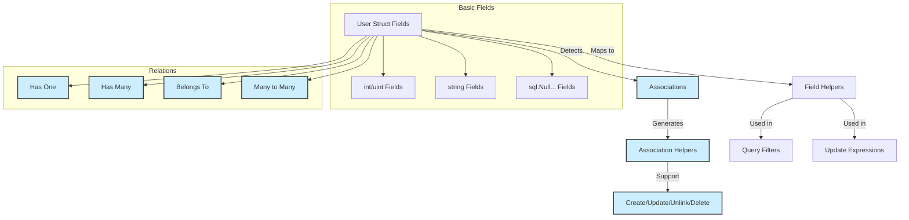

# Model Schemas & Field Types

Understanding how your Go struct fields and associations map into the GORM CLI-generated field helpers is essential for leveraging type-safe filters, updates, and association operations. This guide walks you through the rules and concepts that govern this process, helping you anticipate how models translate into fluent helper APIs that empower your queries and mutations.

---

## Introduction

When you define Go structs representing your database models, GORM CLI analyzes these to generate *model-driven field helpers*—strongly typed structures and methods to access fields and related entities in a compile-time safe way.

These helpers cover:
- Basic data fields (ints, strings, bools, time, nullable types, and custom wrappers).
- Associations, including belongs to, has one, has many, and many-to-many relationships.
- Custom field types via tags or configuration.

This documentation explains the mapping rules, supported types, and how you can customize or extend the defaults.

---

## Supported Field Types and Their Helpers

GORM CLI supports mapping various Go field types to pre-defined helper types that wrap the underlying column for use in predicates, updates, and ordering.

### Basic Field Mappings

| Go Field Type          | Generated Helper Type          | Description                                  |
|-----------------------|-------------------------------|----------------------------------------------|
| `int`, `int8`, `int64`| `field.Number[int]`            | Numeric fields allow predicates like Eq, Gt, Lt, Between, and update increments. |
| `float32`, `float64`  | `field.Number[float64]`         | Supports numeric query and update operations. |
| `string`              | `field.String`                 | Provides string-specific predicates like `Like`, `Eq`. |  
| `bool`                | `field.Bool`                   | Boolean predicates such as Eq, IsTrue, and IsFalse. |
| `time.Time`           | `field.Time`                   | Time-based predicates and ordering.       |
| `[]byte`              | `field.Bytes`                  | Raw byte field support via generic predicates. |
| Nullable types (e.g. `sql.NullInt64`) | `field.Field[sql.NullInt64]` | Supports SQL NULL-aware predicates like IsNull, NotNull. |

Fields with named or imported types implementing `database/sql.Scanner` and `driver.Valuer` interfaces are wrapped as generic `field.Field[CustomType]` if no direct mapping exists.

### Examples

```go
// Model definition
type User struct {
    ID        uint
    Name      string
    Score     sql.NullInt64
    CreatedAt time.Time
}
```

Generates helpers accessible as:

```go
generated.User.ID.Eq(123)             // field.Number[uint]
generated.User.Name.Like("%john%")  // field.String
generated.User.Score.IsNull()          // field.Field[sql.NullInt64]
generated.User.CreatedAt.Gt(time.Now())// field.Time
```

---

## Association Fields

Associations in your model structs produce specialized helpers that facilitate seamless linked operations such as creating, updating, unlinking, and deleting related records.

### Supported Association Types

| Association Type | Go Field Type               | Generated Helper Type        | Description                                                        |
|------------------|-----------------------------|-----------------------------|--------------------------------------------------------------------|
| **Has One**      | Struct (non-slice)          | `field.Struct[Model]`         | Single object reference, e.g., `User.Account`                      |
| **Has Many**     | Slice of struct pointers     | `field.Slice[Model]`          | One-to-many relationship, e.g., `User.Pets []*Pet`                 |
| **Belongs To**   | Struct or pointer            | `field.Struct[Model]`         | Parent reference, e.g., `User.Company`                             |
| **Many-to-Many** | Slice of structs             | `field.Slice[Model]`          | Multi-linked records via join table, e.g., `User.Languages`        |

### Association Helpers and Usage

- `.Create(...)` — Create and link related records
- `.CreateInBatch(...)` — Batch create/link multiple records
- `.Update(...)` — Update matching associated records
- `.Unlink()` — Remove link but keep related records
- `.Delete()` — Delete related records (for m2m deletes join rows only)
- `.Where(...)` — Scoped conditional filtering on association

#### Example: Creating and linking associations

```go
gorm.G[User](db).
  Set(
    generated.User.Name.Set("alice"),
    generated.User.Pets.Create(generated.Pet.Name.Set("fido")),
  ).
  Create(ctx)
```

#### Example: Unlinking associated pets

```go
gorm.G[User](db).
  Where(generated.User.ID.Eq(1)).
  Set(generated.User.Pets.Unlink()).
  Update(ctx)
```

### Semantics by Association Type

| Association | Unlink Behavior          | Delete Behavior                     |
|-------------|-------------------------|-----------------------------------|
| Belongs To  | Sets parent FK field to NULL | Deletes associated record          |
| Has One/Many | Sets child FK field to NULL | Deletes child records              |
| Many2Many  | Removes join table rows only | Removes join table rows only       |

### Identifying Associations

GORM CLI determines associations by detecting:
- Field types corresponding to model structs (for has one/belongs to)
- Slices of structs or struct pointers (has many, many2many)
- Presence of GORM tags like `gorm:"foreignkey:"`, `gorm:"many2many:"`, `gorm:"polymorphic:"`

The naming conventions and tag metadata influence the generated helper's shape and behavior.

---

## Customizing Field Helpers with Tags & Config

### The `gen` Struct Tag

You can specify a custom helper type for a field using the `gen` struct tag. This overrides the default mapping.

```go
type User struct {
    Profile string `gen:"json"` // Use JSON field helper
}
```

The generator will map this to your custom helper, e.g., `JSON`.

### Package-Level `genconfig.Config`

You can define a per-package generator config to customize how field types or tags map to helper types.

```go
var _ = genconfig.Config{
  FieldTypeMap: map[any]any{
    sql.NullTime{}: field.Time{},
  },
  FieldNameMap: map[string]any{
    "json": JSON{},
  },
}
```

- `FieldTypeMap`: Maps Go types to specific helpers.
- `FieldNameMap`: Maps `gen` tag names to helpers, prioritized over type mappings.

This allows you to extend or replace default helpers with your own implementations.

---

## Practical Tips & Best Practices

- **Use Pointer Types for Nullable Fields:** GORM CLI treats fields like `*time.Time` or `sql.NullInt64` as nullable and generates appropriate helpers.
- **Explicitly Specify `gen` Tags to Override Defaults:** Use when you want to handle a field with custom SQL logic (e.g., JSON queries).
- **Keep Models Consistent with GORM Conventions:** Accurate GORM tags ensure associations and foreign keys are recognized correctly.
- **Leverage Association Helpers to Maintain Data Integrity:** Use `.Unlink()` and `.Delete()` carefully to avoid unwanted data loss.

---

## Troubleshooting Common Issues

<AccordionGroup title="Common Pitfalls & Solutions">
<Accordion title="Field Does Not Generate Custom Helper">
Ensure you have:
- Declared the `genconfig.Config` correctly in the package.
- Used the `gen` tag on the field with exact key matching the config.
- Run the generator in the correct directory with config loaded.
</Accordion>
<Accordion title="Association Not Recognized">
Check:
- Field type is correctly defined (slice or struct pointer).
- GORM tags correctly specify foreign keys or many2many relationships.
- Imported model types are accessible and consistent.
</Accordion>
<Accordion title="Zero Update Values Are Ignored">
Use the generated `.Set()` helpers to explicitly set zero values in updates.
For example, `generated.User.Age.Set(0)` will correctly set age to zero.
</Accordion>
</AccordionGroup>

---

## Visual Overview of Model to Field Helper Mapping



---

## Summary

Use model field types and association declarations as the primary driver for generated helpers. Customize with `gen` tags and package configuration when needed. Association helpers enable powerful and concise data linkage operations, dramatically reducing boilerplate and ensuring type safety.

Mastering these mappings will unlock the full expressiveness of GORM CLI-generated code.

---

## See Also

- [Type-Safe Query API Concepts](/concepts/architecture-core-principles/query-api-concept)
- [Field Helpers & Model Mapping](/concepts/architecture-core-principles/field-helper-model)
- [Using Model-Driven Field Helpers](/guides/core-workflows/field-helper-usage)
- [Customizing Code Generation with genconfig](/guides/advanced-usage/generation-configuration)
- [Working with Associations](/guides/core-workflows/association-operations)

---

For practical examples of field helper usage and association management, review generated code under `examples/output/models/user.go`, and explore the sample models at `examples/models/user.go`.

This knowledge ensures precision in your data access layer built with GORM CLI.
