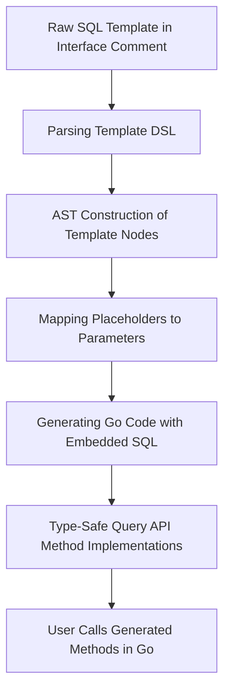

# Template & SQL DSL Syntax

Explore the powerful Template DSL that underpins GORM CLI's generation of your query methods. This guide demystifies the placeholders, control directives, and iteration constructs you use in interface comments to write flexible, secure, type-safe SQL templates for query generation.

---

## Introduction to Template DSL

GORM CLI enables you to embed SQL templates directly in your Go interface method comments. These templates use a custom DSL (Domain-Specific Language) with placeholders and control flow statements to bind Go parameters and generate dynamic, type-safe SQL code.

By mastering this syntax, you gain the ability to write highly expressive queries with conditional logic, secure parameter binding, dynamic column resolution, and iteration over collections—all seamlessly integrated into your generated APIs.

---

## Key Placeholders & Their Purpose

| Directive   | Description                                | Example Usage                                   |
| ----------- | ------------------------------------------ | ---------------------------------------------- |
| `@@table`   | Inserts the model's database table name    | `SELECT * FROM @@table WHERE id=@id`           |
| `@@column`  | Resolves to a dynamic column identifier    | `SELECT * FROM @@table WHERE @@column=@value`  |
| `@param`    | Binds a Go method parameter to SQL safely | `WHERE name=@user.Name AND age=@age`           |


### How Placeholders Work

- `@@table` resolves automatically to the table name associated with your model.
- `@@column` allows dynamic column selection at runtime.
- `@param` placeholders securely bind Go parameters, preventing SQL injection.

**Example:**
```sql
SELECT * FROM @@table WHERE id=@id AND status=@status
```

---

## Special Template Blocks

GORM CLI supports special blocks enclosed in double curly braces `{{ }}` that allow you to write conditional and iterative SQL. These include `{{where}}`, `{{set}}`, `{{if}}`, and `{{for}}` directives.

### `{{where}}` Block

Used to build conditional WHERE clauses dynamically depending on provided parameters.

```sql
SELECT * FROM @@table
{{where}}
  {{if name != ""}} name=@name {{end}}
  {{if age > 0}} AND age=@age {{end}}
{{end}}
```

- The generator trims leading/trailing AND/OR connectors.
- Empty or false conditions result in no WHERE clause — allowing safe optional filtering.

### `{{set}}` Block

Builds conditional `SET` clauses for SQL UPDATE statements.

```sql
UPDATE @@table
{{set}}
  {{if user.Name != ""}} name=@user.Name, {{end}}
  {{if user.Age > 0}} age=@user.Age, {{end}}
  {{if user.Age >= 18}} is_adult=1 {{else}} is_adult=0 {{end}}
{{end}}
WHERE id=@id
```

- Trims trailing commas.
- Supports nested `if-else` logic for complex assignments.

### `{{if}}` Conditional Blocks

Provides granular control for including or excluding SQL fragments based on conditions.

```sql
{{if @user.Name != ""}}
  AND name=@user.Name
{{else}}
  AND name IS NOT NULL
{{end}}
```

- Supports multiple branches with `else if` and `else`.
- Enables fallback or alternative expressions.

### `{{for}}` Looping

Allows iteration over collections passed as parameters to generate repeating SQL patterns.

```sql
SELECT * FROM @@table
{{where}}
  {{for _, tag := range tags}}
    {{if tag != ""}} tags LIKE concat('%',@tag,'%') OR {{end}}
  {{end}}
{{end}}
```

- Dynamically builds compound WHERE clauses for slices/arrays.
- You must handle trailing operators like OR carefully, usually relying on generator trimming.

---

## Practical Usage Tips

- Always use `@` prefix for parameters; this indicates secure binding.
- Use `@@table` for table names and `@@column` for dynamic column references.
- Combine `{{where}}` or `{{set}}` blocks with `{{if}}` to write clean, conditional SQL.
- Leverage `{{for}}` loops for array/slice filtering or building batch statements.
- Be mindful that control blocks must be properly closed with `{{end}}` to avoid generation errors.

---

## Example Query Interface with Template DSL

```go
type Query[T any] interface {
  // SELECT * FROM @@table WHERE id=@id
  GetByID(id int) (T, error)

  // SELECT * FROM @@table WHERE @@column=@value
  FilterWithColumn(column string, value string) (T, error)

  // SELECT * FROM @@table
  // {{where}}
  //   {{if user.Name != ""}} name=@user.Name {{end}}
  //   {{if user.Age > 0}} AND age=@user.Age {{end}}
  // {{end}}
  SearchUsers(user User) ([]T, error)

  // UPDATE @@table
  // {{set}}
  //   {{if user.Name != ""}} name=@user.Name, {{end}}
  //   {{if user.Age > 0}} age=@user.Age, {{end}}
  //   {{if user.Age >= 18}} is_adult=1 {{else}} is_adult=0 {{end}}
  // {{end}}
  // WHERE id=@id
  UpdateUser(user User, id int) error
}
```

---

## Common Pitfalls & Troubleshooting

<Tip>
Always close control blocks `{{if}}`, `{{for}}`, `{{where}}`, and `{{set}}` with `{{end}}` to avoid parsing errors.
</Tip>

<Warning>
Avoid using dynamic raw SQL concatenation outside the allowed DSL constructs as this risks SQL injection and generator conflicts.
</Warning>

<Note>
GORM CLI automatically injects `context.Context` if your method parameters lack it, ensuring context-aware execution.
</Note>

---

## How GORM CLI Translates Templates to Go Code

The generator parses your template comments into an abstract syntax tree (AST) representing text, function blocks, if-branches, and loops.

- Placeholders like `@param` become Go variables bound safely.
- `{{where}}` and `{{set}}` generate conditional code that builds SQL dynamically only if conditions are met.
- `if-else` branches produce Go `if` statements controlling SQL snippet emission.
- Loops produce Go `for` statements iterating over collections to append respective SQL fragments.

This process ensures correctness, param binding safety, and optimized SQL generation based on method inputs.

---

## Summary

- Use special placeholders `@@table`, `@@column`, and `@param` for dynamic SQL generation.
- Wrap conditional SQL fragments inside `{{where}}` or `{{set}}` blocks.
- Use `{{if}}`, `{{else if}}`, `{{else}}` for conditionals inside templates.
- Iterate over slices with `{{for}}` blocks for flexible query construction.
- Templates in interface method comments are parsed and compiled into efficient, type-safe Go code.

Mastering this DSL empowers you to write rich, maintainable SQL queries integrated with Go types, unlocking full power of GORM CLI.

---

## See Also

- [Writing Template-Based SQL for Complex Queries](../../guides/advanced-usage/template-based-sql) — practical guide with detailed usage examples.
- [Generating Type-Safe Query APIs](../../guides/core-workflows/type-safe-query-apis) — workflow for creating query interfaces.
- [Using Model-Driven Field Helpers](../../guides/core-workflows/field-helper-usage) — use helpers with generated queries.
- [Generation Configuration Patterns](../../concepts/data-models-config/generation-config) — customize DSL behavior and mappings.

---

## Visual Representation of Template Processing Flow



This flow illustrates the transformation from your annotated SQL template to the final generated, callable Go code.
