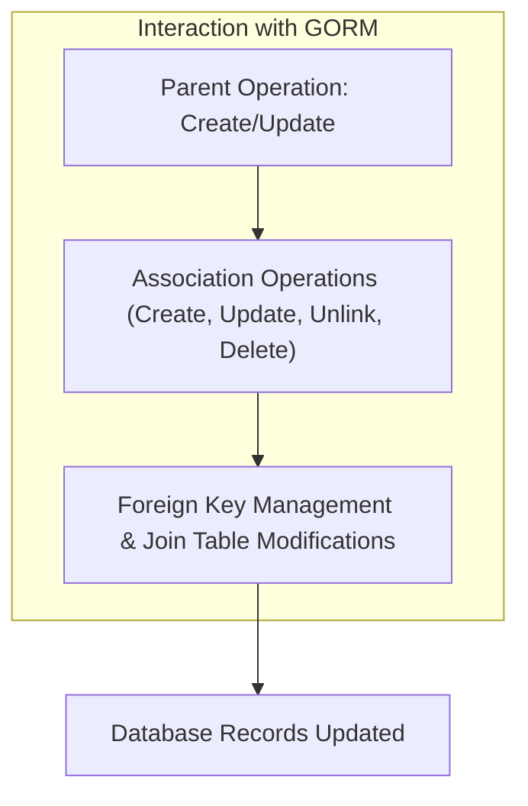

# Association Handling & Operations

Explore how GORM CLI understands relational associations such as `has one`, `has many`, `belongs to`, `many2many`, and polymorphic relationships. This guide reveals how GORM CLI generates helpers to safely create, update, unlink, and delete associated records, empowering you to handle complex relational data with confidence.

---

## Understanding Associations in GORM CLI

GORM CLI automatically detects your Go model associations using your struct definitions, including standard relationship types and polymorphic associations. Through this semantic understanding, it creates typed, intuitive helper methods for each association.

The generated helpers enable operations that maintain data integrity and respect relational constraints, directly from your Go code — no raw SQL needed.

### Supported Association Types

- **Has One**: One-to-one relationship from parent to child, e.g., `User.Account`.
- **Has Many**: One-to-many relationship, e.g., `User.Pets`.
- **Belongs To**: Child refers to a parent, e.g., `User.Company`.
- **Many2Many**: Many-to-many relationship via join table, e.g., `User.Languages`.
- **Polymorphic Associations**: Relations allowing different types via polymorphic keys, e.g., `Pet.Toy`.

<Info>
This semantic mapping is inferred from Go struct field types, GORM tags, and conventional patterns.
</Info>

## Generated Association Helpers

For each association on your model struct, GORM CLI generates companion helpers of type:

- `field.Struct[T]` for single association (Has One, Belongs To)
- `field.Slice[T]` for plural associations (Has Many, Many2Many)

These helpers expose methods for CRUD-like operations on the associated data.

### Key Methods per Association Helper

| Method          | Purpose                                                                    |
|-----------------|----------------------------------------------------------------------------|
| `Create()`      | Create and link one associated record per matched parent                    |
| `CreateInBatch()` | Batch create multiple associated records for each matched parent           |
| `Update()`      | Update matched associated records, optionally filtered by conditions       |
| `Unlink()`      | Remove association without deleting associated records (clears FK or join) |
| `Delete()`      | Delete matched associated records (join rows only for many2many)           |
| `Where()`       | Add conditions for filtering target associated records before operation    |

<Note>
All these methods return special `clause.Association` instances that integrate with `Set(...).Update(ctx)` or `Set(...).Create(ctx)` flows.
</Note>

### Examples

```go
// Create a new user with one pet (has many)
gorm.G[User](db).
  Set(
    generated.User.Name.Set("alice"),
    generated.User.Pets.Create(generated.Pet.Name.Set("fido")),
  ).
  Create(ctx)

// Update a user's pet where pet name is 'old'
gorm.G[User](db).
  Where(generated.User.ID.Eq(1)).
  Set(
    generated.User.Pets.Where(generated.Pet.Name.Eq("old")).Update(generated.Pet.Name.Set("new")),
  ).
  Update(ctx)

// Unlink all pets from a user (clear FK, keep pets)
gorm.G[User](db).
  Where(generated.User.ID.Eq(1)).
  Set(generated.User.Pets.Unlink()).
  Update(ctx)

// Delete a user's pets where the pet name is 'old'
gorm.G[User](db).
  Where(generated.User.ID.Eq(1)).
  Set(generated.User.Pets.Where(generated.Pet.Name.Eq("old")).Delete()).
  Update(ctx)

// Batch create multiple languages for a user (many2many)
gorm.G[User](db).
  Where(generated.User.ID.Eq(1)).
  Set(generated.User.Languages.CreateInBatch([]models.Language{{Code: "EN"}, {Code: "FR"}})).
  Update(ctx)
```

## Association Operation Semantics by Type

Understanding the underlying semantics is key to using the helpers correctly.

| Association Type | Create                                | Update                                   | Unlink                               | Delete                         |
|------------------|-------------------------------------|------------------------------------------|------------------------------------|--------------------------------|
| Has One          | Insert one child per parent          | Update matching child's attributes       | Sets child's FK to NULL             | Deletes child record            |
| Has Many         | Insert multiple children per parent | Update children matching filter          | Set child FKs to NULL             | Delete child records            |
| Belongs To       | Insert or link parent record         | Update parent record                      | Set parent's FK to NULL           | Delete parent records           |
| Many2Many        | Insert or link join table entries    | Update associated records or join table  | Remove join table rows           | Remove join rows only (keep records) |
| Polymorphic      | Operates like Has One/Has Many but handles polymorphic keys | Same as above | Zero out polymorphic FK fields | Delete polymorphic associated rows |

---

## Workflow: Creating and Updating Associations

### Step 1: Parent Entity Operation

- When calling `Create(ctx)` or `Update(ctx)` on a generated query, your parent entities are inserted or updated first.

### Step 2: Apply Association Operations

- The generator applies any specified association operations (`Create()`, `Update()`, `Unlink()`, `Delete()`) in the `Set(...)` call after the parent operation completes.

This separation ensures transactional consistency and safely manages related records.

---

## Practical Considerations and Best Practices

- **Use `Where` to Filter Target Associations**: When updating, unlinking, or deleting associations, always consider using `.Where(...)` to scope the affected related records and avoid unintended data modification.

- **Unlink vs Delete**: Use `Unlink()` to disassociate related records without removing them, preserving data integrity. Use `Delete()` when you want to remove associated rows (e.g., clearing child records).

- **Batch Operations**: Use `CreateInBatch()` for efficient bulk creation/linking, especially with many-to-many or has-many relationships.

- **Polymorphic Associations**: Polymorphic associations follow similar mutation semantics but involve polymorphic keys and require careful FK management.

- **Primary Key Nullability**: Be aware of nullable FKs, particularly in `belongsto` and `hasmany` setups—unlinking clears these keys.

---

## Troubleshooting Common Scenarios

### 1. Associations Not Linking Correctly

- Ensure foreign keys and associations are properly declared in your Go structs.
- Confirm correct use of `Set(...)` with association creation helpers.
- Verify your `Where(...)` filters match the intended associated records.

### 2. Unintended Deletes

- Confirm you are not using `Delete()` when you meant to unlink.
- Use `.Where(...)` filters carefully to target the correct associated records.

### 3. Batch Creation Failures

- Make sure the records passed to `CreateInBatch()` are correctly initialized.
- Check for DB constraints like unique keys or foreign key violations.

### 4. Polymorphic Association Issues

- Ensure the polymorphic keys (e.g., `OwnerID`, `OwnerType`) are correctly handled.
- Use unlink to clear polymorphic keys without deleting rows when desired.

<Warning>Always test association operations on a staging database to prevent accidental data loss.</Warning>

---

## Diving Deeper: Generated Helper Implementation

GORM CLI generates types and methods like these (simplified example):

```go
// Struct association helper for single associations
var User = struct {
  Pets field.Slice[models.Pet]
  Account field.Struct[models.Account]
}{
  Pets: field.Slice[models.Pet]{}.WithName("Pets"),
  Account: field.Struct[models.Account]{}.WithName("Account"),
}

// Usage example to create a pet
userQuery.Set(
  User.Pets.Create(
    Pet.Name.Set("Fido"),
  ),
).Update(ctx)
```

The helpers internally create `clause.Association` structs that GORM's `Update` and `Create` methods interpret to perform safe SQL operations maintaining the correct relational semantics.


## Summary Diagram: Association Operations Flow



This flow highlights how parent entity operations precede association modifications for each operation.

---

## Related Documentation

- [Working with Model-Driven Field Helpers](../guides/core-workflows/using-field-helpers) — Learn more about generated field helpers and composing queries.
- [Quickstart: Generate Type-Safe APIs](../guides/core-workflows/quickstart-generate) — Step-by-step introduction to generate and use helpers.
- [Guided: Managing Associations Safely](../guides/core-workflows/association-operations) — Practical guide with code examples for association operations.
- [Field Helper Generation Architecture](./field-helper-architecture) — Understand the design behind field helper generation.
- [Basic Usage Examples](../../examples/output/models_relations_test.go) — Real tests illustrating association usage in practice.

---

## Final Tips

- Always use the generated helpers for association operations instead of manual SQL or raw GORM association methods—this ensures type safety and consistency.
- Use `.Where(...)` when performing updates, deletes, or unlinks to precisely target associated records.
- For batch operations, prefer `CreateInBatch()` over multiple single creates.
- Pay attention to polymorphic associations, as their unlink semantics require zeroing polymorphic keys.

Harness GORM CLI's advanced association helpers to simplify your complex relational data management with type safety and minimal boilerplate.

---

Happy coding with safe and powerful association operations!
