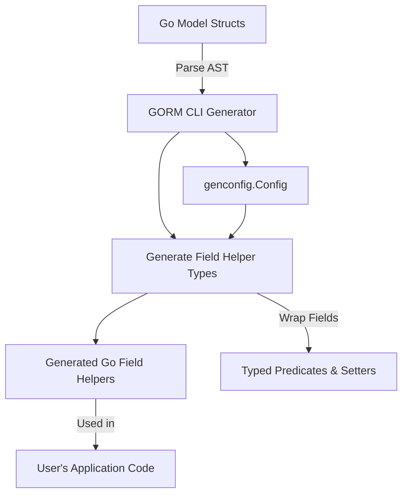

# Model-Driven Field Helpers

Explore how the GORM CLI generates strongly typed field helper objects from your Go model definitions. These helpers enable building type-safe queries for filtering, updating, ordering, and managing associations, empowering you to write expressive and reliable database code without losing compile-time safety.

---

## Understanding the Generation of Field Helpers

GORM CLI transforms your Go struct models into companion helper objects. These helpers expose strongly typed fields that correspond to your model's columns and associations. They allow you to write fluent, type-safe predicates and setters, replacing fragile string-based queries with compiler-verified expressions.

The field helpers are pivotal for:

- **Filtering:** Writing safe and expressive `WHERE` clauses
- **Updating:** Constructing update statements including zero-values and SQL expressions
- **Ordering and Sorting:** Applying order conditions
- **Association Management:** Handling relationships via sub-fields

This page unpacks the logic behind this generation, with a focus on how the CLI decides what counts as a "basic field" and how it respects user customization, e.g., through JSON tagging.

---

## What Constitutes a Basic Field?

Basic fields include primitive types and fields that can be directly mapped to underlying database columns with standard SQL operations. Common basic field types supported are:

- Numeric types: `int`, `int8`, `int64`, `uint`, `float32`, `float64`
- String types: `string`
- Boolean: `bool`
- Date/time types: `time.Time`
- Byte slices: `[]byte`
- Nullable types implementing `database/sql.Scanner` and `driver.Valuer`, for example `sql.NullInt64`, `sql.NullTime`
- Named Go types that implement GORM serializer or scanner interfaces, which are treated generically

The generator detects these types by examining the Go struct field types and applies specific wrappers for each, such as `field.Number[int]` for `int` or `field.Time` for `time.Time`.

— This mapping is illustrated via the internal `typeMap` and type detection logic that prioritize user configuration overrides (see next section).

---

## Handling Custom Field Mappings and Tags

Users can customize how certain fields are wrapped by declaring a `genconfig.Config` in their package source. This config supports:

- `FieldNameMap`: Allows mapping specific struct tag names (e.g., `gen:"json"`) to custom field helper types. For example, a string field tagged as `json` can be mapped to a custom JSON helper that generates dialect-specific SQL.

- `FieldTypeMap`: Enables mapping concrete Go types to wrapper types. For instance, `sql.NullTime{}` can be mapped to the `field.Time{}` helper for time fields.

When both maps assign a mapping, `FieldNameMap` takes precedence. This gives you fine-grained control over how fields in your models are exposed in the generated helpers.

<Info>
Example customization config snippet:

```go
var _ = genconfig.Config{
  OutPath: "examples/output",
  FieldTypeMap: map[any]any{
    sql.NullTime{}: field.Time{},
  },
  FieldNameMap: map[string]any{
    "json": JSON{}, // Use custom JSON helper for json tag
  },
}
```
</Info>

---

## Generated Helper Types: Structure and Naming

For each model struct, the generator creates a variable (e.g., `User`) containing typed fields named exactly after the struct fields (e.g., `User.ID`, `User.Name`). The generated fields have types like `field.Number[uint]` or `field.String` according to their underlying Go type.

- **Basic Fields:** Represent columns with `field.String`, `field.Number[T]`, `field.Time`, etc.

- **Associations:** Generated as special helpers:
  - `field.Struct[T]` for `has one` or `belongs to` relations
  - `field.Slice[T]` for `has many` or `many2many` relations

- **Nullable or Wrapped Fields:** Use `field.Field[T]`

Naming conventions for `WithColumn` and `WithName` reflect whether the field is a direct DB column or an association by name.

---

## How the CLI Infers Field Wrappers

The CLI applies the following logic internally:

1. **Check user mappings:** If a field's tag matches a name in `FieldNameMap`, that mapping is used.
2. **Otherwise, check `FieldTypeMap`:** If the Go type matches a key, use that.
3. **Primitive type lookup:** Use known mappings for types like `string`, `time.Time`, `int`.
4. **Composite and slice types:**
   - Slices are wrapped in `field.Slice[elementType]`
   - Structs (non-slice) are wrapped in `field.Struct[type]`
5. **Generic fallback:** Use `field.Field[type]` for unrecognized or complex types that might implement certain GORM interfaces.

This logic ensures the generated helpers reflect the semantics of your model fields accurately.

---

## Real-World Example

Given the following model excerpt:

```go
package models

type User struct {
  ID        uint
  Name      string
  Age       int
  Profile   string `gen:"json"`
  Pets      []Pet
  CompanyID int
  Company   Company
}
```

The generator produces something like:

```go
var User = struct {
  ID        field.Number[uint]
  Name      field.String
  Age       field.Number[int]
  Profile   examples.JSON
  Pets      field.Slice[models.Pet]
  CompanyID field.Number[int]
  Company   field.Struct[models.Company]
}{
  ID:        field.Number[uint]{}.WithColumn("id"),
  Name:      field.String{}.WithColumn("name"),
  Age:       field.Number[int]{}.WithColumn("age"),
  Profile:   examples.JSON{}.WithColumn("profile"),
  Pets:      field.Slice[models.Pet]{}.WithName("Pets"),
  CompanyID: field.Number[int]{}.WithColumn("company_id"),
  Company:   field.Struct[models.Company]{}.WithName("Company"),
}
```

where the `Profile` field uses a `JSON` helper mapped by the `gen:"json"` tag.

---

## Working with Basic Fields: Built-in Predicates and Setters

Each generated field helper provides a set of methods:

- **Predicates:** `Eq()`, `Gt()`, `Like()`, `IsNull()`, etc., that return query expressions.
- **Setters:** `Set(value)`, `SetExpr(clause.Expr)`, `Incr(n)`, etc., for update operations.

Example usage:

```go
gorm.G[models.User](db).
  Where(generated.User.Age.Gt(18), generated.User.Role.Eq("active")).
  Find(ctx)

// Update
err := gorm.G[models.User](db).
  Where(generated.User.Name.Eq("alice")).
  Set(generated.User.IsAdult.Set(true)).
  Update(ctx)
```

These helpers replace error-prone manual SQL clause construction.

---

## Handling Custom Types and Polymorphic Relations

When your models contain custom types or polymorphic relations, the CLI respects:

- **Custom field wrappers:** Via the `genconfig.Config`, users can define special Go types that map to their custom helpers.
- **Associations:** Represented via `field.Struct[T]` or `field.Slice[T]` with `.WithName()` for fluent navigation and association management.

This enables applying filters, updates, create/link, and unlink/delete actions on related data safely.

---

## Practical Tips and Best Practices

- **Always define `genconfig.Config` if you have custom types or want control over output.
- Use struct field tags like `gen:"json"` to indicate special treatment.
- Ensure model fields are exported, or they won’t generate helper fields.
- Understand the difference between `.WithColumn()` and `.WithName()` to avoid runtime issues.
- Utilize field helpers in conjunction with generated query interfaces for seamless type-safe coding.

---

## Common Pitfalls and How to Avoid Them

- **Missing fields in helpers:** Likely due to private (unexported) model fields or mismatched config excludes.
- **Unexpected field wrapper type:** Check your `genconfig.FieldTypeMap` and `FieldNameMap`.
- **Incorrect JSON query SQL:** Ensure your custom JSON helper implements dialect-specific SQL correctly and is mapped via `FieldNameMap`.
- **Association field name mismatches:** Confirm your struct field names match associations, especially with embedded structs.

---

## Summary Diagram: Generation Flow



This workflow highlights how your model structs feed into the generator, which consults configurations and produces helpers with typed predicates and setters.

---

## Next Steps

- See the [Working with Associations](../../advanced-patterns/working-with-associations) guide to handle relationship operations with helpers.
- Explore the [Customizing Generation](../../advanced-patterns/customizing-generation) guide for advanced field mapping.
- Combine field helpers with generated query interfaces: refer to [Using Type-Safe Query APIs](../core-workflows/using-type-safe-query-apis).

---

## Additional References

- [Project Configuration](../../getting-started/first-steps/project-configuration) for configuring generator behavior
- [Model-Driven Field Helpers and Updates](../../guides/core-workflows/model-driven-field-helpers) for practical usage
- [JSON Field Mapping Example](../../overview/intro-value/feature-overview#json-field-support)

---

This page provides the conceptual foundation for how model-driven field helpers are created and function within GORM CLI, setting you up to use them confidently in your database workflows.