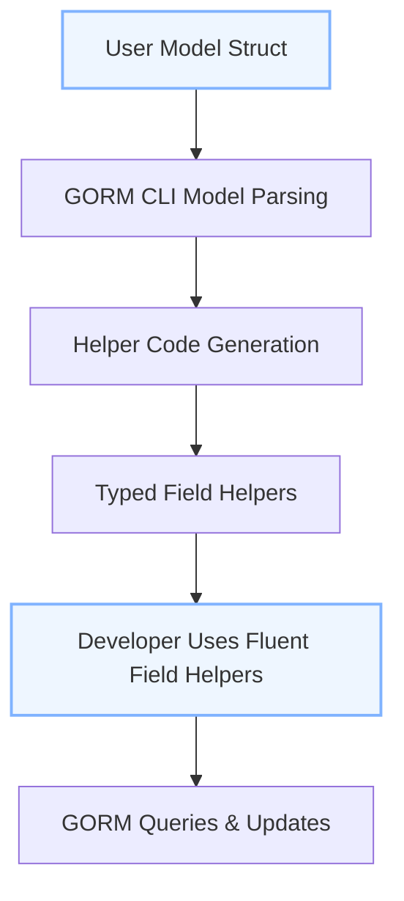

# Model-Driven Field Helpers

The **Model-Driven Field Helpers** page explains how GORM CLI generates strongly typed helpers from your Go model structs. These helpers enable expressive, type-safe, and concise fluent APIs for filtering, updating, creating, and managing associations through GORM. Understanding this helps you leverage the full power of generated helpers to write safer and more maintainable database operations.

---

## What Are Model-Driven Field Helpers?

Model-Driven Field Helpers are generated Go variables and types that correspond to the fields and associations of your database model structs. For each model struct field, the generator produces a typed helper with methods to build SQL predicates, update assignments, and association operations.

This transforms plain Go struct fields into rich, composable expressions for GORM queries, allowing you to write fluent and type-safe code instead of raw strings or generic interfaces.

### Key Benefits

- **Compile-time safety:** Prevent common SQL-building errors by leveraging typed predicates and setters.
- **Discoverability:** Auto-complete and IDE integration guide you to valid fields and operations.
- **Expressiveness:** Helpers provide methods for common SQL operations (e.g., equality, comparisons, LIKE, IS NULL).
- **Association support:** Seamlessly chain operations on related models with generated association helpers.

---

## How Model Structs Drive Helper Generation

GORM CLI parses your Go model struct declarations to understand fields, types, and annotations (such as `gen` tags). Based on that, it generates corresponding typed variables and structs that expose rich methods for working with those fields.

This process includes:

1. **Parsing Fields:**
   - Each exported struct field is mapped to a helper with a type based on its Go type.
   - Associations (has one, has many, belongs to, many2many) are recognized and produce specialized helper types.

2. **Determining Helper Types:**
   - Basic types (`string`, `int`, `bool`, `time.Time`, `[]byte`) map to standard helper types like `field.String`, `field.Number[int]`, `field.Bool`, `field.Time`, and `field.Bytes`.
   - Go types representing nullable fields like `sql.NullInt64` or custom types implementing `Scanner` and `Valuer` are mapped to generic `field.Field[T]` helpers.
   - Associations yield either `field.Struct[T]` for single relations or `field.Slice[T]` for collections.

3. **Tag & Config Overrides:**
   - Struct tags such as `gen:"json"` or configuration-driven mappings in `genconfig.Config` let you customize the generated helper type (e.g., using a custom JSON helper).

4. **Generating Field Variables:**
   - For each field, a variable with the field helper type is declared.
   - These variables expose methods like `.Eq()`, `.Gt()`, `.Set()`, `.Incr()`, `.IsNull()`, and more.

### Example: Generated Model Helpers

```go
var User = struct {
	ID        field.Number[uint]
	CreatedAt field.Time
	UpdatedAt field.Time
	DeletedAt field.Field[gorm.DeletedAt]
	Name      field.String
	Age       field.Number[int]
	Birthday  field.Time
	Score     field.Field[sql.NullInt64]
	LastLogin field.Time
	Account   field.Struct[models.Account]
	Pets      field.Slice[models.Pet]
	Toys      field.Slice[models.Toy]
	CompanyID field.Number[int]
	Company   field.Struct[models.Company]
	ManagerID field.Number[uint]
	Manager   field.Struct[models.User]
	Team      field.Slice[models.User]
	Languages field.Slice[models.Language]
	Friends   field.Slice[models.User]
	Role      field.String
	IsAdult   field.Bool
	Profile   examples.JSON
}{
	ID:        field.Number[uint]{}.WithColumn("id"),
	CreatedAt: field.Time{}.WithColumn("created_at"),
	// ... other fields similarly initialized ...
}
```

This snippet highlights how fields and associations become typed helpers with `.WithColumn()` or `.WithName()` bindings.

---

## Supported Field Types

### Basic Field Types

- **Numerics:** `int`, `uint`, `float32`, `float64`, wrapped as `field.Number[T]`.
- **String:** standard string fields as `field.String`.
- **Boolean:** `bool` fields as `field.Bool`.
- **Time:** `time.Time` fields and `sql.NullTime` as `field.Time`.
- **Nullable fields:** e.g., `sql.NullInt64` wrapped as `field.Field[T]` with nullable semantics.
- **Byte slices:** `[]byte` as `field.Bytes`.

### Associations

- **Single-valued Relation:** `field.Struct[T]` wrapping the related struct.
- **Collection Relation:** `field.Slice[T]` wrapping slices or arrays of related structs.

### Custom Field Helpers

- By using the `genconfig.Config` mapping or struct tags like `gen:"json"`, fields can be generated with custom helpers such as the JSON helper with database dialect-aware SQL generation.

---

## Fluent Helper Methods and User Workflow

Once generated, field helpers let you compose powerful and type-safe queries and mutations.

### Typical User Intent Scenarios

- Filtering or querying records with predicates:
  ```go
  gorm.G[User](db).Where(
      generated.User.Age.Gt(18),
      generated.User.Role.Eq("active"),
  ).Find(ctx)
  ```

- Updating fields with zero-values, expressions, or increments:
  ```go
  gorm.G[User](db).
    Where(generated.User.Name.Eq("alice")).
    Set(
      generated.User.Age.Set(0),
      generated.User.IsAdult.Set(false),
      generated.User.Score.Set(sql.NullInt64{}),
      generated.User.Age.Incr(1),
    ).
    Update(ctx)
  ```

- Creating records safely using `Set` assignments:
  ```go
  gorm.G[User](db).
    Set(
      generated.User.Name.Set("set_user"),
      generated.User.Age.Set(29),
      generated.User.Role.Set("active"),
    ).
    Create(ctx)
  ```

- Working with associations:
  ```go
  gorm.G[User](db).
    Set(
      generated.User.Pets.Create(generated.Pet.Name.Set("fido")),
      generated.User.Languages.CreateInBatch([]models.Language{{Code: "EN"}, {Code: "FR"}}),
    ).
    Update(ctx)
  ```

### Fluent API Highlights

- `.Eq(value)`, `.Gt(value)`, `.Between(low, high)`: Build SQL WHERE predicates.
- `.Set(value)`: Prepare an assignment for update or create.
- `.SetExpr(clause.Expr)`: Set using a raw SQL expression.
- `.Incr(delta)`: Increment a numeric field.
- `.IsNull() / .IsNotNull()`: Null checks.
- `.Like(pattern)`: SQL LIKE predicate for strings.
- Association helpers like `.Create()`, `.CreateInBatch()`, `.Update()`, `.Unlink()`, `.Delete()`.

---

## Extending and Customizing with Tags and Config

GORM CLI lets you extend or override field helper generation behavior via:

- **Struct Tags:**
  - Use `gen:"name"` on model fields to specify helper mapping.
  - Example: `gen:"json"` to generate a JSON field helper.

- **Generation Configuration:**
  - Define a package-level `genconfig.Config` object to override behavior.
  - `FieldNameMap` allows mapping tag names to specific helper instances.
  - `FieldTypeMap` lets you map Go field types directly to helpers.

Example config snippet:

```go
var _ = genconfig.Config{
	OutPath: "examples/output",
	FieldTypeMap: map[any]any{
		sql.NullTime{}: field.Time{},
	},
	FieldNameMap: map[string]any{
		"json": JSON{},
	},
}
```

This flexibility supports complex scenarios such as generating custom SQL for JSON columns or integrating third-party types.

---

## Common Pitfalls and Best Practices

### Pitfalls

- Forgetting to export model struct fields prevents helper generation.
- Not specifying `gen` tags or config mappings when using custom types results in default fallback helpers.
- For zero value updates (e.g., empty string or zero int), always use `.Set()` explicitly to avoid omission.

### Best Practices

- Use generated helpers instead of raw string conditions for safer queries.
- Combine multiple conditions using `.Where()` with helper predicates for readable filters.
- Leverage association helpers to manage related data in a composable manner.
- Add package-level `genconfig.Config` early to tailor helper generation to your data types.
- Use `.SetExpr()` or `.Incr()` for SQL expression-based updates to keep statements efficient.

---

## How It Fits: Workflow Overview



This flow shows user models as the source, generation of helpers, and how users then write clean, type-safe code invoking those helpers.

---

## Troubleshooting

**Helpers Missing or Incorrect:**
- Confirm all model fields are exported.
- Check your `genconfig.Config` for type or name mapping conflicts.
- Ensure your model's package is being scanned by the generator (`-i` flag input path).

**Generated Code Fails on Zero Value Updates:**
- Always use `.Set()` for zero values (e.g., empty string, zero int, `sql.NullInt64{}`) to force the update.

**Custom Field Not Behaving as Expected:**
- Verify your custom field helper properly implements necessary methods.
- Check the configuration for proper mapping by field name/tag or type.

---

## Summary

Model-Driven Field Helpers transform your Go models into a rich API surface for building SQL queries and updates with type safety and fluency. This page guides you through the principles, supported types, user workflows, and customization approaches so you can confidently use and extend helpers in your GORM-powered applications.

---

## See Also

- [Using Generated Field Helpers for Filtering and Updates](https://docs.gorm.io/guides/core-workflows/using-generated-field-helpers.html)
- [Association Handling & Semantics](https://docs.gorm.io/concepts/data-models-schemas/association-handling.html)
- [Configuring Generation with genconfig.Config](https://docs.gorm.io/guides/advanced-usage/configuring-generation.html)
- [Custom Field Helpers (JSON Fields Example)](https://docs.gorm.io/guides/advanced-usage/custom-field-helpers.html)
- [Defining Query Interfaces & SQL Templates](https://docs.gorm.io/guides/core-workflows/query-apis-and-templates.html)

---

<Info>
This page focuses exclusively on model-driven field helpers derived from your Go models. For details on interface-driven query APIs, please see the corresponding guides.
</Info>
