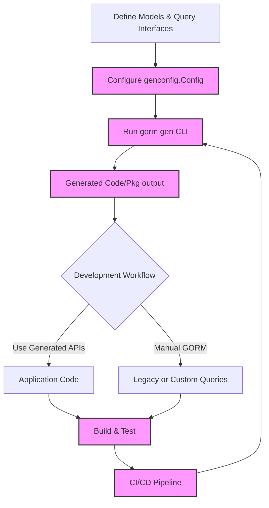

# Integration Patterns and Best Practices

GORM CLI is a powerful tool designed to generate type-safe query APIs and model-driven field helpers seamlessly integrating with Go projects using GORM. This guide focuses specifically on recommended patterns for integrating GORM CLI into your repositories, developer workflows, and CI/CD pipelines to maximize efficiency and maintainability.

Whether you are working with monorepos, managing code regeneration in build processes, or combining GORM CLI-generated APIs with existing GORM idioms, this documentation provides pragmatic insights and best practices that ensure a smooth developer experience.

---

## Table of Contents

- [Why Integration Patterns Matter](#why-integration-patterns-matter)
- [Repository Structure Considerations](#repository-structure-considerations)
  - [Monorepo and Multi-Module Repositories](#monorepo-and-multi-module-repositories)
  - [Package and Output Organization](#package-and-output-organization)
- [Regenerating Code in Build and CI/CD](#regenerating-code-in-build-and-cicd)
  - [Adding Code Generation to Build Scripts](#adding-code-generation-to-build-scripts)
  - [Handling Generated Code in Version Control](#handling-generated-code-in-version-control)
  - [Ensuring Deterministic and Repeatable Generation](#ensuring-deterministic-and-repeatable-generation)
- [Using GORM CLI Alongside Existing GORM Code](#using-gorm-cli-alongside-existing-gorm-code)
  - [Combining Generated APIs with Manual GORM Usage](#combining-generated-apis-with-manual-gorm-usage)
  - [Transition Strategies](#transition-strategies)
- [Best Practices Summary](#best-practices-summary)
- [Troubleshooting Common Integration Challenges](#troubleshooting-common-integration-challenges)

---

## Why Integration Patterns Matter

Integrating a code generation tool like GORM CLI into your software development lifecycle requires thoughtful planning. Without consistent integration patterns:

- Generated code can become fragmented and hard to locate or maintain.
- Build processes might fail or produce inconsistent outputs.
- Developers may struggle to blend generated APIs with existing GORM codebases.

This page empowers you with proven approaches and practical guidance to avoid these pitfalls and ensure smooth adoption of GORM CLI across different project structures and workflows.

---

## Repository Structure Considerations

### Monorepo and Multi-Module Repositories

For projects organized as monorepos or containing multiple Go modules, clear separation of source code, generated code, and configuration is essential.

- **Centralized Generation Location:** Choose a consistent output directory (configured via `genconfig.Config.OutPath`) for generated code within each module or package. This prevents scattering generated files and simplifies version control policies.

- **Scoped Generation:** Leverage the `IncludeInterfaces` and `IncludeStructs` filters in your `genconfig.Config` to restrict generation to relevant interfaces and structs per module, reducing unnecessary code bloat.

- **Package Naming and Import Paths:** Ensure generated code packages have correct import paths aligned with module boundaries to prevent conflicts and import errors.

- **Example:** 

```go
// In your generation config package-level variable (e.g., `genconfig`) to customize generation per submodule
var _ = genconfig.Config{
    OutPath: "generated",
    IncludeInterfaces: []any{"Query*"},
    IncludeStructs:    []any{"User", "Account*"},
}
```

### Package and Output Organization

- Organize the generated files in a dedicated folder, such as `/generated` or `/gen`, placed inside or alongside your source packages. This keeps generated code distinct from hand-written code.

- Maintain a consistent folder hierarchy mirroring your input source directories to aid discoverability and imports.

- Avoid mixing generated code into existing source folders without clear naming conventions or directory segmentation.

- Document this structure for your team to facilitate onboarding and tooling integration.

---

## Regenerating Code in Build and CI/CD

Continuous regeneration of code is a critical element of maintaining synchronization between your models/interfaces and generated artifacts.

### Adding Code Generation to Build Scripts

- Integrate `gorm gen` invocation into your build or makefiles with clear input (`-i`) and output (`-o`) paths.

- Example command inside a script:

```bash
# Assuming Go modules and generation config in place
gorm gen -i ./models -o ./generated
```

- Ensure the generation step runs before compilation or testing phases to keep code up to date.

- For large projects, consider incremental generation strategies via include/exclude patterns and parallelization.

### Handling Generated Code in Version Control

- **Option 1: Commit Generated Code:**
  - Check generated files into your repository.
  - Provides stability and easy access without requiring everyone to run generation.
  - Must coordinate generation on code changes to prevent drift.

- **Option 2: Generate at Build Time:**
  - Exclude generated files from VCS.
  - Generate fresh code during builds or inside CI pipelines.
  - Requires reliable generation environments and caching strategies.

- Choose the approach that fits your team’s workflow and infrastructure best.

### Ensuring Deterministic and Repeatable Generation

- Use fixed Go versions and dependencies to reduce variability in generated outputs.

- Leverage deterministic `genconfig.Config` settings and avoid dynamically changing inputs.

- Automate post-generation code formatting (e.g., via `gofmt`) as part of your generation step to ensure consistent styling.

---

## Using GORM CLI Alongside Existing GORM Code

Adopting GORM CLI does not require a complete rewrite. Instead, you can incrementally enhance your data access codebase.

### Combining Generated APIs with Manual GORM Usage

- Use the generated type-safe query APIs and field helpers where possible to gain safety and fluency.

- Continue writing custom GORM queries manually where unique or complex requirements exist.

- Both approaches can coexist in the same codebase, referencing common models.

- For example, use generated APIs for CRUD and typical queries while retaining full GORM flexibility for complex joins or raw SQL.

### Transition Strategies

- Start by generating field helpers for your models and using them in new code.

- Gradually add query interface definitions and generate method implementations to replace manual GORM queries.

- Use the `IncludeInterfaces` and `ExcludeInterfaces` configuration options to scope generation to new or refactored interfaces to avoid noise.

- Involve your development team early to set conventions for when and how to migrate to generated APIs.

---

## Best Practices Summary

- **Consistent Output Paths:** Define and document output paths via `genconfig.Config.OutPath` per module/package.

- **Scoped Generation:** Use inclusion/exclusion filters to generate code only where needed.

- **Version Control Strategy:** Decide whether to commit generated code or generate on-demand, and apply company-wide standards.

- **Automate Generation:** Integrate `gorm gen` commands into build scripts and CI/CD pipelines for reliability.

- **Coordinate With Existing Code:** Leverage generated APIs incrementally without disrupting existing GORM usage.

- **Maintain Developer Documentation:** Keep updated documentation describing code generation conventions and workflow.

---

## Troubleshooting Common Integration Challenges

<AccordionGroup title="Common Issues and Solutions">
<Accordion title="Imports and Package Path Errors">
Often, generated code fails to build due to incorrect import paths or package names. Ensure that your `genconfig.Config` settings and your module/package structure align properly. Use the generator’s logs to verify the resolved package paths.
</Accordion>
<Accordion title="Generation Produces No Files or Partial Output">
Check if your `IncludeInterfaces` and `IncludeStructs` configuration filters are too restrictive. Temporarily relax them or review interface and struct names. Also, ensure source files are correctly located and scanned.
</Accordion>
<Accordion title="Build Failures Due to Missing Generated Code">
If generated files are not committed or generated on CI, builds will fail. Confirm build steps generate code before compile and that the environment matches local development settings.
</Accordion>
<Accordion title="Version Drift and Inconsistent Outputs">
Pin versions of Go, GORM, and GORM CLI generator across environments. Use tooling like Go modules and containerized builds to stabilize generation.
</Accordion>
</AccordionGroup>

---

## Summary

Integration patterns for GORM CLI balance structure, automation, and coexistence with existing code. By adopting recommended practices, you enhance team productivity, ensure consistent builds, and unlock the full potential of your generated Go data access layers.

---

## Additional Resources

- [Defining Models and Query Interfaces](https://gorm.io/cli/defining-models-and-interfaces) — Learn how to prepare your models and interfaces to leverage GORM CLI generation.
- [Running the Code Generator](https://gorm.io/cli/running-generator) — Instructions and best practices for executing `gorm gen`.
- [Working with Associations: Patterns & Best Practices](https://gorm.io/guides/associations-best-practices) — Deep dive into using generated association helpers.
- [Template SQL DSL Guide](https://gorm.io/guides/template-sql-dsl) — Master dynamic SQL templating within generated query APIs.

---

## Example Snippet: Adding Generation to CI Build Script

```bash
#!/bin/bash
set -e

# Run GORM CLI generator before building
gorm gen -i ./internal/models -o ./internal/generated

# Build your project
go build ./...
```

---

## Illustrative Workflow Diagram


This loop highlights how generation integrates continuously into development and deployment pipelines.
