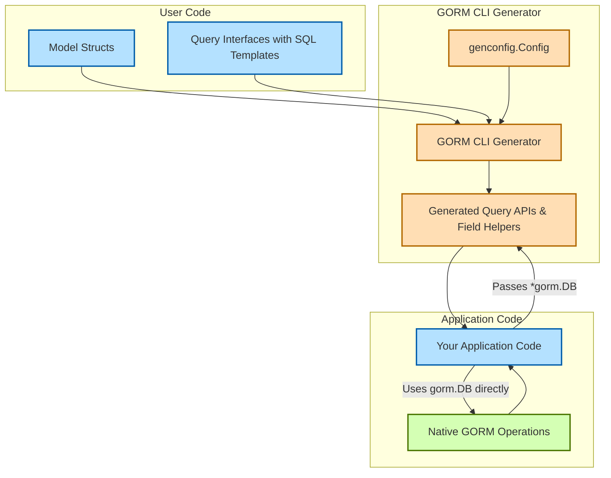

# Integration Patterns with GORM and Go Projects

## Introduction

This guide covers practical strategies for integrating GORM CLI-generated APIs into both new and existing Go codebases that use GORM. You will learn recommended project layouts, streamlined workflow automations, and how the code generated by GORM CLI works alongside native GORM operations such as filtering, updating, and managing associations.

By following these integration patterns, you will maximize type safety, maintain code clarity, and enable fluent database interactions with minimal manual boilerplate.

---

## 1. Project Layout Recommendations

Organizing your Go project structure for smooth integration with GORM CLI is key to maintainability and ease of generation.

### Separate Input and Output Directories

- **Input directory**: Contains your Go model structs and query interfaces with embedded SQL templates.
- **Output directory**: Holds the generated APIs and helpers after running the `gorm gen` command.

**Example:**

```
/project-root
  /models       # Your domain model structs here
  /queries      # Query interfaces with SQL templates
  /generated    # Generated code output location
  /cmd          # Application entry point
```

This structure keeps generated code neatly separated, preventing accidental edits and simplifying version control.

### Package Naming and Imports

- Input Go files should be organized into packages that logically group models and queries.
- Generated code retains package structure based on input, making imports predictable.
- Use explicit imports to refer to generated packages in your application code.

### Leveraging the `genconfig.Config`

- Define package-level `genconfig.Config` variables in your input packages to customize output paths dynamically.
- This allows you to organize generated code in subdirectories or alternative locations per package.

```go
package queries

import "gorm.io/cli/gorm/genconfig"

var _ = genconfig.Config{
  OutPath: "../generated/queries", // Redirect generated APIs here
}
```

### Tips

- Keep your model and query definitions clean and idiomatic to Go.
- Avoid putting generated code and hand-written code in the same package to prevent confusion.

---

## 2. Workflow Automation and CLI Usage

Integrating the generator into your development workflow ensures your generated APIs stay in sync with your data models and queries.

### Running the Generator

Invoke generation with:

```bash
gorm gen -i ./models -i ./queries -o ./generated
```

- Use `-i` flags to specify multiple input directories/packages.
- Use `-o` to specify a root output directory where generated code files are placed, respecting package structure.

### Continuous Integration

- Automate generation as part of your build or CI pipelines to catch breaking changes early.
- Use the generator's error output to detect invalid query templates or interface signatures.

### Code Regeneration Strategy

- Regenerate after any significant model or query interface change.
- Commit generated code or treat it as fully generated artifacts depending on your version control preferences.

### Best Practice

- Use Go tooling (`go generate`) with a directive in your input package for one-command regeneration:

```go
//go:generate gorm gen -i . -o ../generated
```

Run:

```bash
go generate ./models
```

---

## 3. Using Generated APIs Alongside Native GORM

GORM CLI-generated APIs integrate seamlessly into your existing GORM-based code because they return and consume standard GORM types.

### Instantiating Generated Query APIs

Use the generated constructor function by passing a `*gorm.DB` instance:

```go
import (
  "context"
  "gorm.io/gorm"
  "project/generated/queries"
  "project/models"
)

func findUserByID(db *gorm.DB, ctx context.Context, id int) (*models.User, error) {
  user, err := queries.Query[models.User](db).GetByID(ctx, id)
  return &user, err
}
```

### Fluent Filtering with Field Helpers

Generated field helpers allow expressive, type-safe query construction:

```go
// Retrieve adults with a name matching "Alice"
users, err := gorm.G[models.User](db).
  Where(generated.User.Name.Like("%Alice%"),
        generated.User.Age.Gte(18)).
  Find(ctx)
```

You can combine native GORM clauses with these helpers:

```go
users, err := queries.Query[models.User](db).
  Where(generated.User.Status.Eq("active"))
  .Find(ctx)
```

### Creating and Updating Records

Use the generated setter helpers as parameters for `.Set()` on the standard `gorm.G` interface:

```go
err := gorm.G[models.User](db).
  Set(
    generated.User.Name.Set("Alice"),
    generated.User.Age.Set(30),
  ).
  Create(ctx)

// Update example
err = gorm.G[models.User](db).
  Where(generated.User.ID.Eq(1)).
  Set(generated.User.Age.Set(31)).
  Update(ctx)
```

### Handling Associations

Association helpers allow type-safe operations on related data such as has-many or many-to-many relationships.

Example: Creating associated pets for a user

```go
gorm.G[models.User](db).
  Set(
    generated.User.Name.Set("Bob"),
    generated.User.Pets.Create(generated.Pet.Name.Set("Fido")),
  ).
  Create(ctx)
```

Updating linked pets conditionally:

```go
gorm.G[models.User](db).
  Where(generated.User.ID.Eq(1)).
  Set(
    generated.User.Pets.Where(generated.Pet.Name.Eq("Fido")).
      Update(generated.Pet.Name.Set("Rex")),
  ).
  Update(ctx)
```

### Mixing Generated APIs with GORM Core

- Use generated predicates and setters for safety and discoverability.
- Fall back to native GORM methods for complicated cases or raw SQL.
- Generated query APIs return standard types allowing interoperability.

### Automatic Context Injection

Generated APIs automatically insert a `context.Context` parameter if missing, simplifying method calls.

---

## 4. Managing Code Generation Scope and Filtering

Control what parts of your codebase are covered by the generator to prevent unwanted code generation and keep builds lean.

### Using `genconfig.Config` Filters

Define whitelist and blacklist patterns for interfaces and structures.

```go
var _ = genconfig.Config{
  IncludeInterfaces: []any{"Query*"},  // Only generate for interfaces with prefix 'Query'
  ExcludeInterfaces: []any{"*Deprecated*"},
  IncludeStructs:    []any{"User", "Account*"},
  ExcludeStructs:    []any{"*DTO"},
}
```

### File-level vs Package-level Configuration

- `FileLevel: true` applies configuration only to the specific file.
- `FileLevel: false` (default) applies config to all files in the package.

### Practical Filtering Example

Exclude nested package interfaces and structs:

```go
var _ = genconfig.Config{
  ExcludeInterfaces: []any{"nested.I2"},
  ExcludeStructs: []any{"nested.S2"},
  FileLevel: false,
}
```

---

## 5. Troubleshooting Common Integration Issues

### 5.1 Generated Code Not Found or Import Errors

- Verify output directory `-o` matches your import paths.
- Ensure generated packages are built or vendor-ed.
- Refresh imports after regeneration.

### 5.2 Methods Missing or Have Wrong Signatures

- Check your interface method comments for correct SQL templates.
- Validate method return types match generator expectations (return error, optional data).
- Regenerate and inspect logs for parsing errors.

### 5.3 Association Operations Fail or Are Unexpected

- Confirm association fields are properly defined in your model struct.
- Use generated association helpers only with compatible association types.
- Review documentation on association semantics (Create, Unlink, Delete).

### 5.4 Conflicts Between Manual and Generated Code

- Avoid modifying generated files directly.
- Keep generated code isolated in dedicated directories.
- Use selective config filters to limit generation scope.

---

## 6. Summary Diagram: Integration Flow



---

## Additional Resources

- [How GORM CLI Works (High-Level Architecture)](/overview/concepts-architecture/how-it-works-highlevel)
- [Using Generated APIs in Your Application](/guides/getting-started/using-generated-apis)
- [Customizing Generation with genconfig.Config](/guides/customization-integration/genconfig-config-guide)
- [Managing Associations: Patterns and Examples](/guides/generation-patterns/association-operations-guide)
- [Quickstart Workflow](/overview/quick-features/quickstart)

---

## Final Tips

- Start integration by generating code for a small package or module before rolling out globally.
- Adopt consistent naming conventions for packages and generated code output.
- Combine generated APIs with idiomatic GORM usage to leverage the best of both worlds.
- Use filtering capabilities to keep generated code relevant and maintainable.

By following these integration patterns, your Go projects gain powerful, type-safe data layer abstractions that scale naturally with your application's growth.