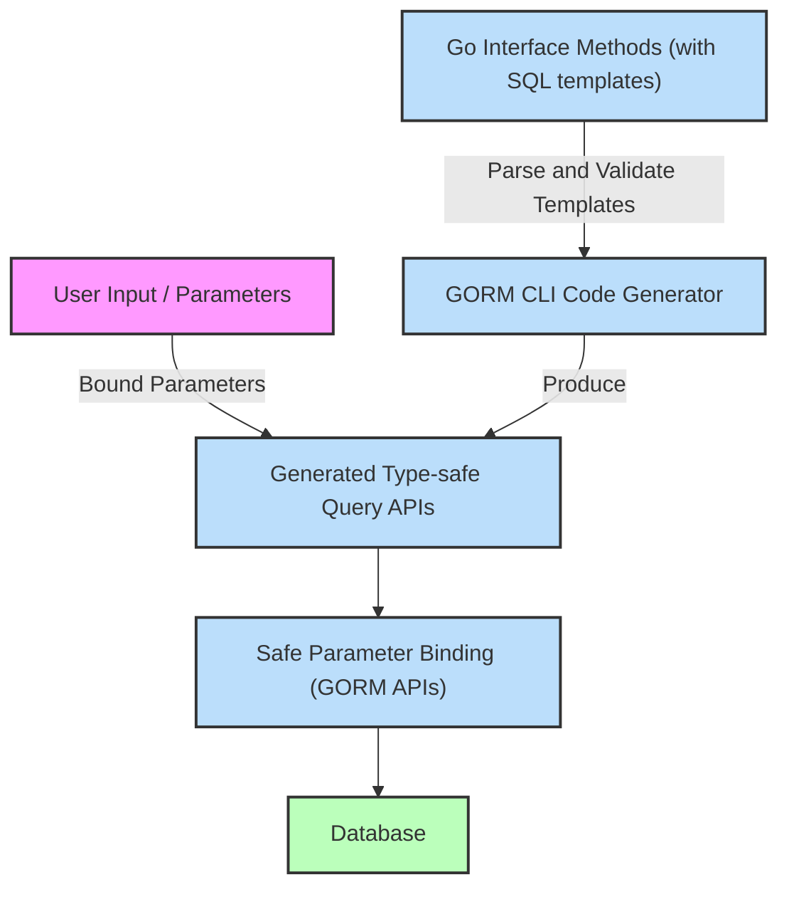

# Security Model and Safe Code Generation

GORM CLI is designed with a strong emphasis on security and safety in generating database query APIs. This guide explains how the tool ensures that generated SQL code is secure, highlighting safe parameter binding techniques, prevention of SQL injection, and how type safety enhances code reviewability and maintenance.

---

## Why Security Matters in Code Generation

When generating code that interacts directly with databases, security is paramount. Unsafe interpolation of user inputs can lead to critical vulnerabilities such as SQL injection attacks. GORM CLI systematically eliminates these risks by enforcing patterns and safeguards in the code it generates.

> **User Story:**
> Imagine a Go developer who needs to write multiple complex SQL queries with filtering, updating, and association operations. Manually concatenating SQL strings for these operations risks injecting unsafe parameters, potentially exposing the application to attacks. GORM CLI abstracts this complexity by generating type-safe query APIs that handle parameters securely and automatically.

---

## Core Security Principles in GORM CLI

### 1. Safe Parameter Binding

All user-supplied values and variables in generated query methods are bound using parameter placeholders rather than concatenated directly into SQL strings.

- SQL templates in interfaces use `@param` syntax to denote bound variables.
- The generated code uses GORM's parameterized queries, ensuring inputs are never directly embedded into SQL, neutralizing injection vectors.

**Example:**
```go
// SQL template fragment:
// SELECT * FROM @@table WHERE id=@id
GetByID(id int) (T, error)
```
The parameter `id` is safely bound, never concatenated.


### 2. Template DSL with Conditional and Dynamic SQL

GORM CLI offers templating constructs such as `{{if}}`, `{{where}}`, and `{{set}}` that generate conditional SQL fragments. This approach:

- Enforces structure in SQL generation
- Prevents manual unsafe string building
- Only inserts verified and bound parameters

**Example:**
```sql
// {{where}}
//   {{if user.Age > 0}} age=@user.Age {{end}}
// {{end}}
```
The generated query only includes the clause if the condition is met, binding `user.Age` safely.

### 3. Type Safety and Compile-Time Guarantees

Generated APIs are strongly typed, ensuring:

- Only parameters of the correct type are accepted
- Field helper predicates enforce proper value and operation types
- Method signatures require error handling, enforcing runtime safety

This type safety promotes safer code, easier reviews, and fewer runtime surprises.

---

## How GORM CLI Enforces Security in Generated Code

### Generation Pipeline Safeguards

- **Parsing and Validation:** The generator parses Go interfaces and struct models, extracting typed parameters before any code generation.
- **SQL Template Extraction:** SQL fragments extracted from comments are parsed through a template engine that validates bound placeholders and their usage.
- **Parameter Binding Enforcement:** Generated code never performs string concatenation with user inputs; instead, all inputs are passed as parameters to GORM’s safe query methods.

### Example Generated Method Body

Consider a method with a raw SQL query:

```go
func (m *YourGeneratedType) GetByID(ctx context.Context, id int) (T, error) {
    sb := &strings.Builder{}
    sb.WriteString("SELECT * FROM users WHERE id=?")
    params := []any{id}
    var result T
    err := m.db.Raw(sb.String(), params...).Scan(ctx, &result)
    return result, err
}
```

Notice that the value of `id` is passed as a parameter, never concatenated, ensuring safe execution.

---

## Minimizing Risks of Unsafe Code and SQL Injection

GORM CLI’s design prevents common pitfalls:

| Risk Area                   | GORM CLI Approach                                                |
|----------------------------|-----------------------------------------------------------------|
| Direct string concatenation | Disallowed in generated code                                     |
| Unescaped user input        | Always bound via placeholders                                    |
| Dynamic SQL injection via cols | Uses `@@column` carefully with validation (user code generates interface) |
| Unsafe raw SQL injections   | Tool requires explicit raw SQL methods; otherwise uses safe GORM chaining |

### Important Tip
Always carefully review any manually written raw SQL templates embedded in interfaces, especially where dynamic identifiers (e.g., `@@column`) are used. While the generator ensures safe binding of values, dynamic column or table names must be controlled by developers to prevent injection via untrusted input.

---

## Security Advantages of End-to-End Type-Safe Workflows

- **Compile-Time Errors:** Incorrect usage such as passing the wrong type or missing parameters leads to compiler errors, preventing deployment of unsafe code.
- **Centralized Safety Logic:** The generated APIs encapsulate safe binding, reducing libraries and modules that need to re-implement secure coding.
- **Easier Code Review:** The clear method signatures and generated code patterns simplify audits and automated checks.

---

## Best Practices for Secure Use of GORM CLI

- **Define SQL Templates Carefully:** Avoid embedding raw user input directly into SQL templates. Use placeholders exclusively.
- **Use Field and Association Helpers:** Leverage the generated fluent APIs for filter, update, and association operations to get safe parameter handling by default.
- **Review Dynamic Column/Table Use:** When using `@@column` or `@@table`, ensure dynamic values are not user-input or are thoroughly validated.
- **Validate Generated Code:** After generation, inspect critical queries for expected parameter patterns.
- **Keep Dependencies Updated:** Use the latest GORM and GORM CLI versions to benefit from ongoing security improvements.

---

## Troubleshooting Common Security Concerns

<AccordionGroup title="Troubleshooting Security & Safety Issues">
  <Accordion title="Generated Code Uses Unexpected String Concatenation">
    Verify your SQL template comments. GORM CLI never generates unsafe concatenations if templates are correctly formed. Check for raw SQL injected in method bodies manually.
  </Accordion>
  <Accordion title="Dynamic Column/Table Names Accept User Input">
    Never pass user input directly as dynamic column names. Refactor to use parameters or whitelist acceptable identifiers.
  </Accordion>
  <Accordion title="Parameter Binding Fails or Runtime Errors Occur">
    Check parameter types match the interface method signatures exactly. Missing or mismatched types lead to generation errors or unsafe SQL.
  </Accordion>
  <Accordion title="Need to Extend with Custom Unsafe SQL">
    In scenarios requiring raw SQL, isolate and review such templates carefully. Prefer wrapping in safe APIs or helper methods.
  </Accordion>
</AccordionGroup>

---

## Visual Overview of Secure Code Flow in GORM CLI



This flow ensures all database interactions use safely bound user-supplied inputs.

---

## Conclusion

GORM CLI’s security model is built atop safe SQL templating, parameter binding, and strong typing. These mechanisms collectively prevent SQL injection vulnerabilities and unsafe code patterns, empowering developers to confidently generate database APIs that are both efficient and secure.

To maximize security:

- Use parameter placeholders in templates
- Avoid uncontrolled dynamic SQL
- Leverage the generated field and association helpers
- Review generated code for unusual raw SQL fragments

For a seamless, secure database coding experience in Go, GORM CLI is your trusted partner.

---

## Related Documentation

- [How GORM CLI Works (High-Level Architecture)](/overview/concepts-architecture/how-it-works-highlevel): Understand the generation pipeline and safety features.
- [Template-based Query Generation Guide](/guides/generation-patterns/template-sql-gen): Learn how to write safe SQL templates.
- [Field Helper Best Practices](/guides/generation-patterns/field-helper-best-practices): Use typed helpers securely.
- [Using Generated APIs in Your Application](/guides/getting-started/using-generated-apis): See secure usage patterns.

---

## Next Steps

- Validate your generated APIs by running examples from the [Validate Generated APIs Guide](/getting-started/first-generation/validate-generated-apis).
- Explore configuration options to customize generation and enforce project-specific security policies using `genconfig.Config`.
- Regularly review and update your SQL templates to maintain best security practices as your project evolves.

---

For detailed examples and community discussions, visit GORM CLI’s GitHub repository: https://github.com/go-gorm/cli

---