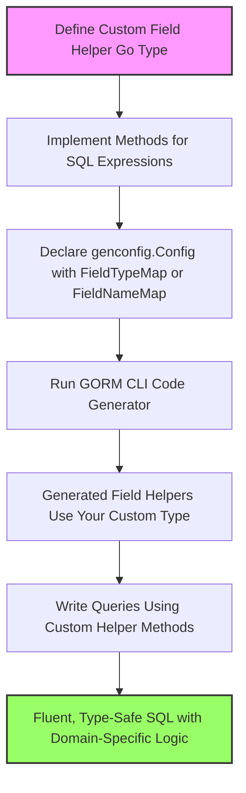

# Custom Field Helpers and Data Types

Extend the power of GORM CLI by creating **custom field helpers** that map your Go struct types or struct tags to specialized query expressions. This page guides you through the process of mapping domain-specific data types (such as JSON fields or serialized formats) to safe, expressive helpers while preserving query fluency and type safety.

---

## Why Custom Field Helpers?

GORM CLI generates built-in field helpers for common Go types like `int`, `string`, `bool`, and `time.Time` to produce type-safe SQL conditions and updates. However, many applications use custom types or require specialized SQL for fields such as:

- JSON columns
- Complex serialized data
- Nullable wrappers and custom scanner/valuer implementations

Custom field helpers enable you to customize how fields are queried, filtered, updated, or ordered with tailored SQL snippets and database-specific logic without sacrificing fluent API usage.

### User Story: 
Imagine you have a `User` model with a JSON-encoded `Profile` column that contains structured data like a VIP flag or preferences. You'd want to query this JSON data efficiently in your database using native JSON functions. The default string or `[]byte` helpers can't generate this specialized JSON SQL for you — a custom JSON field helper solves this gap elegantly.

---

## Core Concepts of Custom Field Helpers

### 1. Mapping Go Types or Struct Tags to Helpers
Custom helpers are linked to Go fields either by explicit type mappings or by struct tag names via the generation configuration:

- **FieldTypeMap**: Maps from a Go type instance (e.g., `sql.NullTime{}`) to a helper type instance (e.g., `field.Time{}`).
- **FieldNameMap**: Maps from custom `gen` struct tag names (e.g., `gen:"json"`) to helper types.

The generator prioritizes `FieldNameMap` over `FieldTypeMap` for a given field.

### 2. Defining Your Custom Helper
A custom helper is a Go type that holds a `clause.Column` reference and provides methods to build SQL expressions during query construction.

Key points:

- Embed or wrap `clause.Column` to retain column metadata.
- Provide methods for common expressions (equality, inequality, null checks) adapted to your data domain.
- Use custom SQL with placeholders (`?`) and `clause.Expr` for database-specific SQL generation.


### 3. Integrating with GORM CLI Generation
Declare a `genconfig.Config` in your package to specify how fields map to your custom helpers. For example:

```go
var _ = genconfig.Config{
  FieldNameMap: map[string]any{
    "json": JSON{}, // map fields tagged with `gen:"json"` to your JSON helper
  },
}
```

This enables your custom helper to be recognized and generated automatically during code generation for all mapped fields.

---

## Step-by-Step Example: JSON Field Helper

This example shows how to implement a `JSON` field helper for JSON columns across different databases.

### 1. Tag Your Model Struct Field
In your model, mark the JSON field with a special tag:

```go
package models

// User model with JSON profile field

type User struct {
  // ... other fields ...
  Profile string `gen:"json"`
}
```

### 2. Create the JSON Helper Type
Define `JSON` field helper with methods that generate database-specific JSON query expressions:

```go
package examples

import (
  "encoding/json"
  "gorm.io/gorm"
  "gorm.io/gorm/clause"
)

// JSON is a custom field helper for JSON columns that generates SQL using database JSON functions.
type JSON struct { column clause.Column }

// WithColumn creates a new helper with the specified column name.
func (j JSON) WithColumn(name string) JSON {
  c := j.column
  c.Name = name
  return JSON{column: c}
}

// Equal creates an expression that tests JSON attribute equality.
func (j JSON) Equal(path string, value any) clause.Expression {
  return jsonEqualExpr{col: j.column, path: path, val: value}
}

// jsonEqualExpr implements clause.Expression to render DB-specific JSON comparison SQL

type jsonEqualExpr struct {
  col  clause.Column
  path string
  val  any
}

func (e jsonEqualExpr) Build(builder clause.Builder) {
  if stmt, ok := builder.(*gorm.Statement); ok {
    switch stmt.Dialector.Name() {
    case "mysql":
      // Use JSON_EXTRACT and CAST for JSON equality
      v, _ := json.Marshal(e.val)
      clause.Expr{SQL: "JSON_EXTRACT(?, ?) = CAST(? AS JSON)", Vars: []any{e.col, e.path, string(v)}}.Build(builder)
    case "sqlite":
      // Use json_valid and json_extract
      clause.Expr{SQL: "json_valid(?) AND json_extract(?, ?) = ?", Vars: []any{e.col, e.col, e.path, e.val}}.Build(builder)
    default:
      // PostgreSQL jsonb path
      clause.Expr{SQL: "jsonb_extract_path_text(?, ?) = ?", Vars: []any{e.col, e.path[2:], e.val}}.Build(builder)
    }
  }
}
```

### 3. Declare Generator Configuration
In the same package, expose `genconfig.Config` with your tag mapping:

```go
var _ = genconfig.Config{
  OutPath: "examples/output",
  FieldNameMap: map[string]any{
    "json": JSON{},
  },
}
```

### 4. Use Generated Helpers in Queries
After code generation, your `User.Profile` field will be mapped to the `JSON` helper type, allowing intuitive queries:

```go
// Filter users whose profile JSON has "vip" flag set to true

ctx := context.Background()
got, err := gorm.G[models.User](db).
  Where(generated.User.Profile.Equal("$.vip", true)).
  Take(ctx)
if err != nil {
  // Handle error
}
fmt.Println("VIP user:", got.Name)
```
The generated SQL will use the appropriate JSON functions depending on your database dialect.

---

## Best Practices and Tips

- **Prefer explicit mapping by tag** when your custom helper applies only to specific fields with distinct semantics.
- **Reuse existing helpers** for standard types (e.g., `field.Time`, `field.String`) wherever possible for consistency.
- **Test SQL generated** by your helpers against your database to ensure compatibility and correctness.
- **Use helper methods** like `WithColumn` and `WithTable` when necessary to disambiguate fields in joins or queries.
- **Document your custom helper methods clearly** so users understand available filters and operations.

---

## Common Pitfalls to Avoid

- Avoid assuming all databases support identical JSON or serialization SQL functions; always implement conditional SQL generation.
- Don’t map every field blindly; restrict custom helpers to only relevant fields via tag or type to keep the API clear.
- Be cautious with pointer or nullable fields; ensure your helper properly handles NULL values.
- Avoid mixing internal implementation details in helpers; expose only expressive query methods relevant for users.

---

## Summary

Custom field helpers empower your Go projects to elegantly express domain-specific queries, updates, and filters with compile-time safety and fluent APIs. Leveraging mapping via `genconfig.Config`, you can extend GORM CLI to support JSON, serialized, or complex data types with specialized SQL generation tailored to your database.

Explore existing examples such as JSON field helpers and design your own for your project’s unique needs.

---

## Related Documentation

- [Field Helper Basics: Filters, Updates & Associations](../guides/core-workflows/field-helper-basics)
- [Working with Associations: Create, Update, Unlink & Delete](../guides/advanced-patterns/associations-deep-dive)
- [Template-Based Queries: From Interface to Custom SQL](../guides/advanced-patterns/template-sql-workflows)
- [Generation Configuration and Filtering](../concepts/extensibility-templates-config/generation-configuration)
- [JSON Field Helpers](../guides/advanced-patterns/json-field-helpers)

---

## Visualizing the Custom Field Helper Workflow



This flow guides you from helper definition to fluent usage in type-safe queries.


