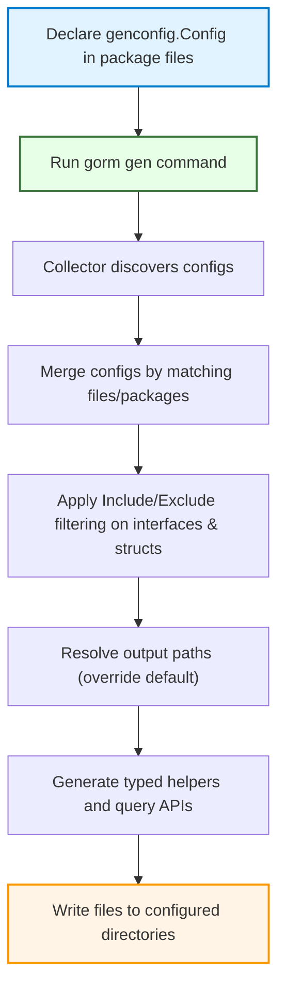

# Generation Configuration and Filtering

GORM CLI includes a powerful and flexible configuration mechanism via the `genconfig.Config` struct, enabling you to control how code generation behaves across your project. This page explains how to leverage the `genconfig.Config` for fine-grained customization of output paths, inclusion and exclusion of interfaces and structs, file-level versus package-level configuration, and custom field type mappings.

---

## Why Use Generation Configuration?

Imagine your project contains several packages, each with its own models and query interfaces. By default, GORM CLI generates code into a general output directory, including everything it finds. But what if you want:

- To produce generated code into different directories per package?
- To limit generation only to certain interfaces or structs?
- To assign custom field helpers for specific data types or tagged fields?
- To isolate configuration file-wise, affecting only a single file?

`genconfig.Config` is your key to all these scenarios, empowering you with precise control over generation behavior.

<Check>
Using `genconfig.Config`, you tailor your generation process to project conventions, reduce unnecessary code, and improve maintainability.
</Check>

---

## Overview of `genconfig.Config`

`genconfig.Config` is a Go struct you declare at a package level in any source file within the package where generation occurs. The generator automatically detects and applies it according to these rules. The struct contains fields to:

- Override output directory (`OutPath`)
- Map Go field types or `gen`-tag names to field helper types (`FieldTypeMap`, `FieldNameMap`)
- Control filtering of interfaces and structs included or excluded in generation (`IncludeInterfaces`, `ExcludeInterfaces`, `IncludeStructs`, `ExcludeStructs`)
- Define whether the config applies per-file or per-package basis (`FileLevel`)

### Basic structure

```go
import "gorm.io/cli/gorm/genconfig"

var _ = genconfig.Config{
    OutPath: "examples/output",
    FieldTypeMap: map[any]any{
        sql.NullTime{}: field.Time{},
    },
    FieldNameMap: map[string]any{
        "json": JSON{},
        "date": field.Time{},
    },
    IncludeInterfaces: []any{"Query*"},
    ExcludeStructs: []any{"*DTO"},
    FileLevel: false,
}
```

---

## Output Path Control (`OutPath`)

By default, GORM CLI generates output files relative to the CLI invocation directory or a default `./g` directory. Setting `OutPath` in `genconfig.Config`:

- Overrides the output directory **for files in the same package** where the config is declared
- Allows grouping generated code into logical directories or modules

### Example

```go
var _ = genconfig.Config{
    OutPath: "internal/generated",
}
```

This setup directs generated files from this package into `internal/generated` instead of the default.

<Info>
If multiple configs match a file, the closest directory or file-level configuration takes precedence.
</Info>

---

## Field Helper Type Mapping

GORM CLI generates pre-typed field helpers to enhance type safety and fluent querying. You can customize generated types using:

### `FieldTypeMap`

- Maps Go type instances to wrapper field helper instances
- Useful for non-standard or complex types implementing `Scanner/Valuer` or GORM Serializer

Example:

```go
FieldTypeMap: map[any]any{
  sql.NullTime{}: field.Time{},
}
```

This causes all `sql.NullTime` fields in your models to generate using the `field.Time` helper.

### `FieldNameMap`

- Maps `gen` struct tag names (strings) to helper types
- Takes precedence over `FieldTypeMap` when both match

Example: 

```go
FieldNameMap: map[string]any{
  "json": JSON{},  // Assigns custom JSON field helper to fields tagged `gen:"json"`
  "date": field.Time{},
}
```

Field mappings allow custom extensions and fine-tuning of generated APIs for domain-specific data.

<Note>
To implement custom helpers like `JSON{}`, see the [Custom Field Helpers documentation](/guides/advanced-patterns/json-field-helpers).
</Note>

---

## Inclusion and Exclusion Filtering

Control exactly which interfaces and structs generate code via four optional whitelists and blacklists:

| Filter           | Description                                          | Behavior                                                                                   |
|------------------|------------------------------------------------------|-------------------------------------------------------------------------------------------|
| `IncludeInterfaces` | Whitelist interface types to generate              | If non-empty, only interfaces matching these selectors are generated                      |
| `ExcludeInterfaces` | Blacklist interface types to skip                   | Applied only if IncludeInterfaces is empty; removes matching interfaces                   |
| `IncludeStructs`     | Whitelist struct types to generate                   | If non-empty, only structs matching these selectors are generated                         |
| `ExcludeStructs`     | Blacklist struct types to skip                        | Applied only if IncludeStructs is empty; removes matching structs                         |

### Selector Syntax

Filters support:

- Shell-style wildcard patterns (e.g., `Query*`, `*Repo`, `models.User`)
- Type literals or conversions (e.g., `models.User{}`, `pkg.Query(nil)`)

### How Filtering Works

1. If an Include list is defined, only that list is generated; Exclude is ignored for that type
2. If no Include list, Exclude is applied to remove unwanted types

### Example

Limit generation to interfaces starting with `Query` and exclude structs ending with `DTO`:

```go
var _ = genconfig.Config{
    IncludeInterfaces: []any{"Query*"},
    ExcludeStructs: []any{"*DTO"},
}
```

---

## File-Level vs Package-Level Configuration

- **FileLevel = false (default)**
  - The config applies to the entire package and all files within it
  - Allows cross-file consistent configuration

- **FileLevel = true**
  - Restricts the config to the file in which it is declared
  - Useful for granular control when multiple conflicting configs exist in a package

<Warning>
Use `FileLevel: true` sparingly to avoid confusion about where configs apply.
</Warning>

---

## Real-World User Flow: How Configuration Shapes Generation

1. **You define `genconfig.Config` in your package's Go source files, tailoring properties like `OutPath` and inclusion/exclusion filters.**
2. **Run the `gorm gen` CLI command pointing at your input file or directory.**
3. **The generator discovers all `genconfig.Config` declarations applicable to files.**
4. **It merges and applies these configurations according to the nearest matching directory and file-level rules.**
5. **Your output is generated in the specified directories, containing only the filtered structs/interfaces, with custom typed field helpers as mapped.**

This ensures generated code fits your project conventions and keeps your workspace tidy.

---

## Common Use Cases with Configuration

<AccordionGroup title="Typical Configuration Scenarios">
<Accordion title="1. Overriding Output Path for Specific Packages">
To place generated code for `examples` package into `examples/output` directory:

```go
var _ = genconfig.Config{
    OutPath: "examples/output",
}
```
</Accordion>
<Accordion title="2. Mapping Custom Types or Tags to Field Helpers">
If you use a special JSON field with `gen:"json"` tag, map it to a custom helper:

```go
var _ = genconfig.Config{
    FieldNameMap: map[string]any{
        "json": JSON{},
    },
}
```
</Accordion>
<Accordion title="3. Filtering Interfaces by Naming Pattern">
To generate only interfaces with names starting with `Query`:

```go
var _ = genconfig.Config{
    IncludeInterfaces: []any{"Query*"},
}
```
</Accordion>
<Accordion title="4. Excluding Deprecated or DTO Structs">
Exclude structs with suffix `DTO` to avoid generating extra helpers for transient data:

```go
var _ = genconfig.Config{
    ExcludeStructs: []any{"*DTO"},
}
```
</Accordion>
</AccordionGroup>

---

## Best Practices & Tips

- **Place `genconfig.Config` near your query interfaces or model structs** to keep configuration contextually relevant.
- **Use wildcards wisely** for inclusion and exclusion filters to manage large projects gracefully.
- **Test incremental changes** by running generation with and without config to verify effects.
- When using *custom field helpers*, always ensure you implement corresponding helper types and methods.
- **FileLevel config** is powerful but should be used with care to avoid fragmented or conflicting setups.

---

## Troubleshooting Common Issues

<AccordionGroup title="Troubleshooting Generation Configuration">
<Accordion title="No Generated Code Appears">
Verify that your interface or struct names match the filters. Remember that Include* filters override Exclude*.
<br>The patterns are case-sensitive and may need exact package qualifiers.
</Accordion>
<Accordion title="Config Not Applying as Expected">
Check if multiple configs exist in parent directories with conflicting `OutPath` or filters.
<br>Use verbose CLI flags or logging to see which configs were applied.
</Accordion>
<Accordion title="Custom Field Types Not Mapped"><p>
Ensure the Go types in `FieldTypeMap` keys match exactly with model field types, including pointers and package prefixes.
<br>Also verify your custom helper types implement necessary interfaces.
</p></Accordion>
</AccordionGroup>

---

## Visualizing Configuration Application Workflow



---

## Related Documentation

- [Customizing Code Generation with genconfig.Config](/guides/advanced-patterns/customizing-generation) — For deeper configuration examples and strategies
- [Getting Started: Run Code Generation](/getting-started/first-run-and-validation/run-code-generation) — Learn how to invoke generation with configs
- [Model-Driven Field Helpers](/guides/core-workflows/field-helper-basics) — Understand generated field helpers influenced by configs
- [Template-Based Queries](/guides/advanced-patterns/template-sql-workflows) — Learn to write SQL interfaces that work with generated code

---

## Summary

`genconfig.Config` is the cornerstone for adapting GORM CLI generation to your unique project needs. It streamlines output management, selective generation, and type mappings so you confidently produce exactly the code your application requires.

Keep your configs close to your code, test changes incrementally, and use wildcards and filters to tame large-scale generation.

> Configuration is your control panel to transform GORM CLI generation into a precise, predictable, and maintainable process.

---