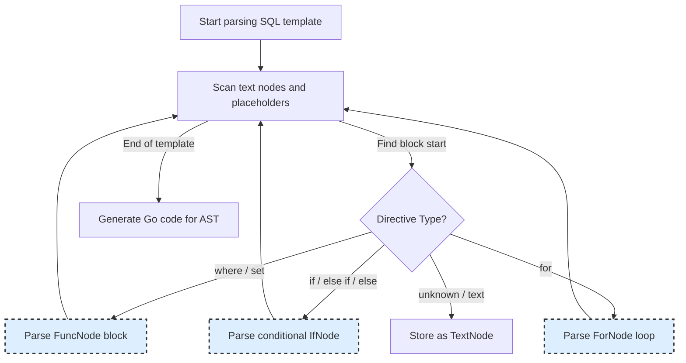

# SQL Template DSL and Placeholders

GORM CLI empowers you to write SQL queries and commands directly inside Go interface method comments using a lightweight, expressive SQL Template Domain-Specific Language (DSL). This mini-DSL simplifies query definition, enables safe parameter binding, and supports powerful conditional and looping constructs without sacrificing type safety or flexibility.

In this document, you'll master the key concepts of this template DSL, understand each directive's role, and learn how to craft dynamic, composable SQL statements that integrate seamlessly with your Go code.

---

## Why Use the SQL Template DSL?

The SQL Template DSL transforms annotated SQL in Go method comments into fully generated, type-safe Go methods behind the scenes. This approach:

- Minimizes boilerplate while maximizing expressiveness
- Prevents SQL injection by automatic safe parameter binding
- Enables fine-grained control with conditional blocks and loops
- Supports dynamic table and column references that adapt to models

Consider it a powerful, intuitive way to embed SQL logic within Go interfaces that drives GORM CLI's code generation.

---

## Key Concepts and Directives

The DSL revolves around directives embedded within `//` comment lines immediately preceding interface method declarations. These become templates that the generator parses, compiles, and converts into Go code.

### 1. Placeholders

Placeholders allow dynamic binding of parameters, table names, and columns safely into SQL.

| Placeholder       | Description                                | Example                                           |
| ----------------- | ------------------------------------------ | ------------------------------------------------- |
| `@@table`         | Resolves to the GORM table name of the model referenced by the interface | `SELECT * FROM @@table WHERE id=@id`              |
| `@@column`        | Represents a dynamic column name, usually passed as a method parameter   | `WHERE @@column=@value`                            |
| `@param`          | Maps a Go method parameter (or struct field) into a safe SQL parameter   | `WHERE name=@user.Name`                            |


#### Example
```sql
// SELECT * FROM @@table WHERE id=@id AND name = "\@name"
GetByID(id int) (T, error)
```
- `@@table` converts to the current model's table name
- `@id` binds the method parameter `id` safely as a SQL parameter
- `\@name` escapes the at-symbol to be included literally as text


### 2. Control Flow Directives

These allow embedding conditional and iterative logic inside SQL templates.

Directives are expressed with double curly braces `{{ }}` with optional keywords.

| Directive        | Purpose                                               | Usage Example                                                   |
| ---------------- | ----------------------------------------------------- | --------------------------------------------------------------- |
| `{{where}}...{{end}}` | Defines a conditional WHERE clause block that only emits if content inside is non-empty | 
```
{{where}}
  {{if name != ""}} name=@name {{end}}
  {{if age > 0}} AND age=@age {{end}}
{{end}}
```
| `{{set}}...{{end}}`   | Defines a conditional SET clause block, typically for UPDATE statements, trims trailing commas | 
```
{{set}}
  {{if user.Name != ""}} name=@user.Name, {{end}}
  {{if user.Age > 0}} age=@user.Age, {{end}}
{{end}}
```
| `{{if ...}}...{{else if ...}}...{{else}}...{{end}}` | Supports branching conditionals with `if`, `else if`, and `else` segments | 
```
{{if user.Age >= 18}} is_adult=1 {{else}} is_adult=0 {{end}}
```
| `{{for ...}}...{{end}}` | Iterates over slices or collections, emitting repeated fragments | 
```
{{for _, tag := range tags}}
  {{if tag != ""}} tags LIKE concat("%",@tag,"%") OR {{end}}
{{end}}
```


### 3. Escape Sequences

To write literal `@` symbols inside SQL templates (without triggering parameter binding), use a backslash escape: `\@`.

Example:

```sql
// SELECT * FROM @@table WHERE id=@id AND name = "\@name"
GetByID(id int) (T, error)
```
This outputs `name = "@name"` literally in SQL, without interpreting it as a placeholder.

---

## Putting It All Together: Real-World Scenarios

### Example 1: Simple Query by ID
```go
// SELECT * FROM @@table WHERE id=@id AND name = "\@name"
GetByID(id int) (T, error)
```
- Selects all columns from the table associated with the model.
- Binds `id` safely as a parameter.
- Uses `\@name` to output literal `@name` string.

### Example 2: Dynamic Column Filtering
```go
// SELECT * FROM @@table WHERE @@column=@value
FilterWithColumn(column string, value string) (T, error)
```
- `@@column` dynamically binds to the passed column name.
- `@value` binds the value for the column.

### Example 3: Conditional WHERE with Multiple Filters
```go
// SELECT * FROM @@table
// {{where}}
//   {{if name != ""}} name=@name {{end}}
//   {{if age > 0}} AND age=@age {{end}}
// {{end}}
FilterByNameAndAge(name string, age int)
```
- Generates `WHERE` clause only if at least one condition applies.
- Supports multiple filter conditions that concatenate safely.

### Example 4: Dynamic UPDATE Statement
```go
// UPDATE @@table
// {{set}}
//   {{if user.Name != ""}} name=@user.Name, {{end}}
//   {{if user.Age > 0}} age=@user.Age, {{end}}
//   {{if user.Age >= 18}} is_adult=1 {{else}} is_adult=0 {{end}}
// {{end}}
// WHERE id=@id
UpdateUser(user User, id int) error
```
- Sets fields conditionally, only including those with valid values.
- Normalizes comma placement automatically.
- Graciously handles branching logic inside `set` blocks.

### Example 5: Iteration for Complex Filtering
```go
// SELECT * FROM @@table
// {{where}}
//   {{for _, user := range users}}
//     {{if user.Name != "" && user.Age > 0}}
//       (name = @user.Name AND age=@user.Age AND role LIKE concat("%",@user.Role,"%")) OR
//     {{end}}
//   {{end}}
// {{end}}
Filter(users []User) ([]T, error)
```
- Iterates over a slice, adding grouped filter conditions.
- Constructs complex dynamic SQL safely.

---

## Practical Tips & Best Practices

- **Always Use Placeholders for Parameters:** Never concatenate user input directly into SQL. Use `@param` placeholders for safe bindings.

- **Use `@@table` and `@@column` for Dynamic Schema Mapping:** Avoid hardcoding table or column names; these placeholders adapt automatically.

- **Leverage `{{where}}` and `{{set}}` Blocks for Clean Conditionals:** These blocks manage the presence or absence of clauses gracefully, avoiding dangling `AND` or trailing commas.

- **Escape Literal `@` with `\@`:** If the SQL includes literal `@` symbols (e.g., user identifiers or email-like strings), escape them.

- **Test Your Templates Incrementally:** Start simple, then add conditionals or loops as needed.

- **Check Generated Code for Correctness:** Generated Go code uses `strings.Builder` and parameter slices to assemble SQL safely.

- **Add Context Parameters Explicitly:** The generator adds `ctx context.Context` to method signatures if missing.

- **Use Consistent Naming:** Parameter names in templates must match method parameter names or nested struct field names exactly.


---

## Behind the Scenes: How Templates Are Rendered

GORM CLI’s `RenderSQLTemplate` function parses templates into an Abstract Syntax Tree (AST) of nodes representing:

- **TextNodes:** Ordinary SQL text with placeholders.
- **FuncNodes:** Blocks like `where` or `set` managing conditional SQL fragment emission.
- **ForNodes:** Iteration over slices enabling repeated SQL fragments.
- **IfNodes:** Conditional branching including `if`, `else if`, and `else`.

Via these nodes, the generator emits Go code with safe parameter appending and string concatenations, managing trimming and normalization for clean SQL.

This design shields you from manual SQL string concatenations, mitigating injection risks and keeping your generated code clean and idiomatic.

---

## Troubleshooting Common Issues

<AccordionGroup title="Common Problems and Solutions">
<Accordion title="Why does my placeholder not get replaced?">
Ensure your placeholders follow the DSL form exactly, e.g., `@paramName` or `@@table`. Also, verify that parameter names in the method signature match those used in templates.
</Accordion>
<Accordion title="I get trailing commas or dangling ANDs in SQL. How to fix?">
Make sure to wrap conditionals inside `{{where}}` or `{{set}}` blocks. They automatically trim unnecessary commas and leading/trailing logical operators.
</Accordion>
<Accordion title="How do I include literal SQL text with an '@'?">
Escape literals with a backslash: use `\@` in the template to output a literal `@` symbol.
</Accordion>
<Accordion title="My template parser reports unmatched block errors.">
Check that every `{{if}}` has a matching `{{end}}`, and `{{else if}}`/`{{else}}` blocks follow strictly inside an `if`. Blocks like `where` and `set` must also be properly closed.
</Accordion>
</AccordionGroup>

---

## Visualizing the Template Parsing Flow



---

## Summary

The SQL Template DSL in GORM CLI unlocks dynamic, safe, and maintainable SQL generation tied directly to your Go method signatures via intuitive annotations. By mastering placeholders (`@@table`, `@@column`, `@param`), control flow directives (`{{where}}`, `{{set}}`, `{{if}}`, `{{for}}`), and escape sequences, you empower code generators to produce robust, type-safe query implementations automatically.

When used thoughtfully, this mini-DSL streamlines your database integration with GORM, turning SQL templates into fluent, error-resistant Go APIs.

---

## See Also

- [Template-Based Queries: From Interface to Custom SQL](/guides/advanced-patterns/template-sql-workflows) — detailed workflow and examples
- [Getting Started: Generate Your First Query API](/guides/core-workflows/getting-started) — initial user workflow
- [How GORM CLI Works]( /concepts/core-architecture/architecture-overview) — architecture overview with workflow
- [Custom Field Helpers and Data Types](/concepts/extensibility-templates-config/field-helper-extensibility) — extend templates with custom types

---

## Recommended Next Steps

- Define your Go interfaces with annotated SQL comments and apply control flow directives for flexible filtering.
- Use `gorm gen` command to generate Go query APIs automatically.
- Explore the generated code for insights into how templates compile down to safe Go methods.
- Dive into association helpers and advanced configuration to tailor generation further.


---