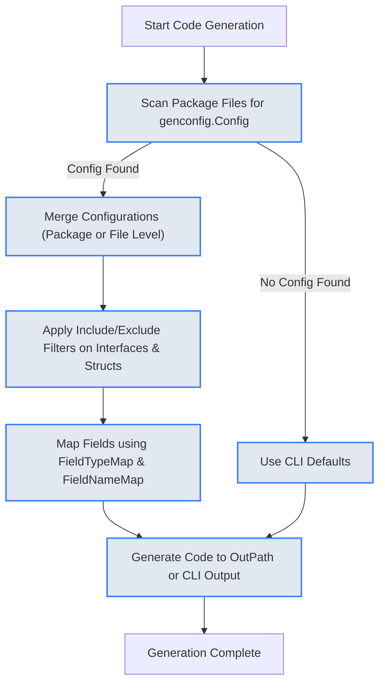

# Configuration and Customization

Unlock the full potential of GORM CLI by mastering the flexible configuration and customization options available through the `genconfig.Config` struct. This page guides you through tailoring the generator’s behavior to suit your project’s specific needs—from controlling output directories to selectively including or excluding interfaces and structs, and extending field helpers for specialized domain types like JSON.

---

## Why Customize Generation?

Imagine you're generating code for a large codebase where you want to:

- Output generated files to a specific folder different from the CLI default
- Only generate code for interfaces beginning with `Query` or exclude deprecated ones
- Map certain Go standard library or custom types to specialized field helpers
- Override field helpers for certain fields identified by tags (like customizing JSON handling)

GORM CLI's configuration system empowers you to precisely control these aspects, ensuring the generated code aligns with your project architecture and coding standards.


---

## Introducing `genconfig.Config`

The heart of generation customization lies in the package-level variable of type `genconfig.Config`. Declared in the package where you want to influence generation, this struct allows you to set various parameters:

- `OutPath`: Redirect generated code output directory
- `FieldTypeMap`: Map Go types to field helper wrappers
- `FieldNameMap`: Map `gen` tag names to custom field helpers
- `FileLevel`: Generate per-file or per-package
- Inclusion/exclusion lists for interfaces and structs


### Basic Example

```go
package examples

import (
	"database/sql"
	"gorm.io/cli/gorm/field"
	"gorm.io/cli/gorm/genconfig"
)

var _ = genconfig.Config{
	OutPath: "examples/output",
	FieldTypeMap: map[any]any{
		sql.NullTime{}: field.Time{},
	},
	FieldNameMap: map[string]any{
		"date": field.Time{},
		"json": JSON{}, // custom JSON field helper
	},
	FileLevel: false, // apply to entire package
	IncludeInterfaces: []any{}, // generate all by default
}
```


---

## Key Configuration Fields

### 1. Output Path (`OutPath`)

Overrides the CLI default output directory for files generated within the package. Useful for directing generated files to a separate directory to keep source neat.

```go
OutPath: "examples/output"
```


### 2. Field Type Mapping (`FieldTypeMap`)

Allows you to associate Go types with specialized field helpers that define how predicates and updates are generated for those types.

- Map an instance of a Go type (e.g. `sql.NullTime{}`) to a wrapper type instance (e.g. `field.Time{}`)
- The generator uses the AST for imports and method rendering


### 3. Field Name Mapping (`FieldNameMap`)

Enables mapping based on `gen` struct tag names (e.g., `gen:"json"`), overriding `FieldTypeMap`.

Scenario:

- You want fields tagged `gen:"json"` to use a custom JSON field helper instead of the default mapping.

Example:

```go
FieldNameMap: map[string]any{
	"json": JSON{},
}
```


### 4. File-Level Generation (`FileLevel`)

When set to `true`, the configuration applies only to the source file where defined rather than the entire package. Use when you want fine-grained control in monolithic packages.

---

### 5. Inclusion and Exclusion of Interfaces and Structs

Control **which** Go interfaces and structs are generated by specifying allowlists (`Include*`) or blocklists (`Exclude*`).

Rules:

- If an `Include` list is non-empty, only those matching patterns/types are generated.
- If empty, generator processes all, then applies exclusions to filter.

Selector Types:

- Shell-style string patterns (e.g., `"Query*"`, `"models.User"`)
- Concrete literals (e.g., `models.User{}`)
- Interface types via type conversion (e.g., `models.Query(nil)`) for interfaces

Examples:

```go
IncludeInterfaces: []any{"Query*", models.Query(nil)},
ExcludeInterfaces: []any{"*Deprecated*"},
IncludeStructs: []any{"User", "Account*", models.User{}},
ExcludeStructs: []any{"*DTO"},
```

---

## Using Configuration in Practice

Let's review common patterns with concrete examples.

### Selectively Generating Interfaces by Name Pattern

Generate only interfaces starting with `Query`:

```go
package pattern

import "gorm.io/cli/gorm/genconfig"

var _ = genconfig.Config{
	IncludeInterfaces: []any{"Query*"},
}
```


### Excluding Specific Structs and Interfaces

Prevent generation for interfaces or structs marked as deprecated:

```go
package blacklist

import "gorm.io/cli/gorm/genconfig"

var _ = genconfig.Config{
	ExcludeInterfaces: []any{I2[any](nil)},
	ExcludeStructs:   []any{S2{}},
}
```


### Nested Configuration and Hierarchies

In a directory tree, use configs to exclude or include types per directory:

```go
package nested

import "gorm.io/cli/gorm/genconfig"

var _ = genconfig.Config{
	FileLevel:         false,
	ExcludeInterfaces: []any{"I3"},
	ExcludeStructs:    []any{"S3"},
}
```


### Overriding Field Helpers for JSON Types

To use a specialized JSON SQL generator on a field:

0) Configure in the generator config with a tag to map to a custom JSON helper:

```go
var _ = genconfig.Config{
	FieldNameMap: map[string]any{
		"json": JSON{}, // custom field helper for JSON
	},
}
```

1) Tag your model field:

```go
package models

type User struct {
	Profile string `gen:"json"`
}
```

2) Implement the JSON helper (dialect-aware SQL generation — see `guides/advanced-patterns/extending-field-helpers-json` for the full example).


---

## How the Generator Applies Configuration

1. **Scanning**: The CLI scans your Go package files for `genconfig.Config` declarations.
2. **Merging**: Configuration applies at package-level by default, or per-file if `FileLevel` is true.
3. **Filtering**: Based on inclusion/exclusion lists, interfaces and structs are selected or skipped.
4. **Field Mapping**: Field types and `gen` tags are mapped to helper wrappers via `FieldTypeMap` and `FieldNameMap`.
5. **Code Output**: Generated files are placed in the `OutPath` if set, otherwise the CLI default.


---

## Practical Tips & Best Practices

- **Use explicit type literals** in inclusion/exclusion lists to avoid ambiguity.
- **Prefer inclusion lists over exclusion** for stricter control.
- **Declare configuration only in packages where generation is needed** to avoid unintended effects.
- **Use `FileLevel` cautiously**: setting it to `true` can fragment configuration and make behavior harder to predict.
- **Map common standard types (`sql.NullTime`, etc.)** to existing field helpers for clean generated code.
- **Use `FieldNameMap` to handle domain-specific fields like JSON, enums, or custom serialized fields**.
- **Test generated code output after changes to configuration**, especially inclusion and exclusion patterns.


---

## Common Pitfalls & Troubleshooting

<AccordionGroup title="Troubleshooting Configuration Issues">
<Accordion title="Why are some of my interfaces not generating?">
Make sure your inclusion and exclusion lists do not conflict. Inclusion list has priority; if empty, exclusions apply. Use fully qualified names or type literals for precise matching.
</Accordion>
<Accordion title="My custom field helper mapping is not applied">
Verify the `FieldNameMap` keys match the `gen` struct tag exactly. Also ensure the helper type is correctly implemented and imported.
</Accordion>
<Accordion title="Files are generating in unexpected directories">
Check the `OutPath` setting and remember it overrides the CLI's `-o` flag for the package where it is declared.
</Accordion>
</AccordionGroup>


---

## Visualizing the Config Application Flow




---

## Summary

The `genconfig.Config` struct is your gateway to finely control how GORM CLI generates code:

- Specify where files go with `OutPath`
- Target specific interfaces/structs with inclusion/exclusion patterns
- Customize field helper types like `Time{}` or `JSON{}` using `FieldTypeMap` and `FieldNameMap`
- Control granularity with `FileLevel`

Use these tools to generate clean, maintainable, and exactly tailored code that fits your project architecture and domain requirements.


---

## Related Documentation

- [Customizing Code Generation Output](../guides/advanced-patterns/customizing-generation-output) — practical step-by-step customization guide
- [Extending Field Helpers: JSON Fields](../guides/advanced-patterns/extending-field-helpers-json) — build DSL support for specialized fields
- [Field Helper & Association Helper Concepts](../concepts/features-integration/field-helper-concepts) — understanding how field helpers work
- [Generating Type-Safe Query APIs](../guides/core-workflows/generating-type-safe-queries) — context of generation with config
- [Project Setup & Structure](../getting-started/first-steps-with-gorm-cli/project-setup) — organizing your package for generation


---

## Next Steps

To make the most of configuration:

- Try creating a `genconfig.Config` in your model or interface package.
- Experiment with mapping a custom type like JSON using `FieldNameMap`.
- Use inclusion/exclusion lists to generate only selected interfaces.
- Combine with your `gorm gen` CLI invocation for streamlined workflows.

For deep mastery, the guides on customizing generation output and extending field helpers provide detailed workflows and practical examples.


---

For comprehensive details on GORM CLI features and workflow integrations, visit the [GORM CLI documentation homepage](../overview/introduction-and-value/what-is-gorm-cli).