# Field Helper & Association Helper Concepts

Welcome to the foundational guide on field helpers and association helpers within GORM CLI. This page clarifies how model struct fields translate into fluent, strongly typed helpers for constructing type-safe filters, updates, and managing associations like has one, has many, belongs to, and many-to-many relationships.

---

## Introduction to Field Helpers

Field helpers provide a user-friendly, type-safe API to build SQL queries on your GORM model fields. They transform your model struct fields into expressive Go types that encapsulate columns and expose common predicate and assignment methods.

### How Fields Map to Helpers

- **Basic Fields:** Primitive or common Go types (e.g., `int`, `string`, `bool`, `time.Time`, `[]byte`) and custom named types implementing relevant interfaces map to specialized field helpers such as `field.Number[T]`, `field.String`, `field.Bool`, or `field.Time`.
- **Relations:** Fields representing associations become either `field.Struct[T]` or `field.Slice[T]` depending on whether the association is single or multiple.
- **Custom Mappings:** The generator supports mapping Go fields via tags or generator configuration for advanced or special types (see Customizing Code Generation).

### Fluent API for Predicate and Update Building

Each helper exposes methods tailored to typical SQL clauses:

- **Predicates for Filtering:**
  - Equality: `.Eq(value)`, Inequality: `.Neq(value)`
  - Null Checks: `.IsNull()`, `.IsNotNull()`
  - Comparison: `.Gt(value)`, `.Lt(value)`, etc.
  - Custom Expressions: `.Expr(expr, values...)`
  - Ordering: `.Asc()`, `.Desc()`, `.OrderExpr(expr, values...)`

- **Update Assignments:**
  - Set Value: `.Set(value)`
  - Set Expression: `.SetExpr(expr)`

#### Example: Using Field Helpers

```go
// Filtering users with age greater than 18 and role active
users, err := gorm.G[models.User](db).
    Where(
        generated.User.Age.Gt(18),
        generated.User.Role.Eq("active"),
    ).
    Find(ctx)

// Setting user status to active
err := gorm.G[models.User](db).
    Where(generated.User.Name.Eq("alice")).
    Set(generated.User.Role.Set("active")).
    Update(ctx)
```

---

## Association Helper Concepts

Associations between models (e.g., has one, has many, belongs to, many-to-many) produce specialized association helpers. These are generated as `field.Struct[T]` for single-target relations and `field.Slice[T]` for multi-target relations.

### Association Helper Features and Operations

Association helpers enable fluent, typesafe manipulation of related records through these operations, typically chained into `Set(...).Update(ctx)` or `Set(...).Create(ctx)` calls:

- `Create(assignments...)` — Create and associate new records per matched parent.
- `CreateInBatch(records)` — Batch create multiple associated records for each matched parent (only for `Slice` associations).
- `Update(assignments...)` — Update associated records filtered by optional conditions.
- `Unlink()` — Remove associations but keep associated records intact.
- `Delete()` — Delete associated records (with behavior varying by association type).

### Semantics by Association Type

| Association Type | Typical Helper Type  | Unlink Operation                       | Delete Operation                     |
|------------------|---------------------|--------------------------------------|------------------------------------|
| **Belongs To**   | `field.Struct[T]`    | Sets parent foreign key (FK) to NULL | Deletes associated records          |
| **Has One / Has Many** | `field.Struct[T]` / `field.Slice[T]` | Sets child FK to NULL                | Deletes child records               |
| **Many-to-Many** | `field.Slice[T]`     | Removes join table rows only          | Removes join table rows only        |

### Condition Scoping

Association helper methods like `.Where(...)` allow narrowing updates, deletes, or unlinking to subsets of related records:

```go
gorm.G[User](db).
  Where(generated.User.ID.Eq(1)).
  Set(
    generated.User.Pets.Where(generated.Pet.Name.Eq("fido")).Update(generated.Pet.Name.Set("rex")),
  ).
  Update(ctx)
```

This example updates only the pet named 'fido' associated with user ID 1.

### Creating and Linking Associations

- **Single association create:** Use `.Create` with assignment expressions per matched parent.
- **Batch create for multi associations:** Use `.CreateInBatch` to add multiple associated records at once.

```go
// Create a user with one pet and link
gorm.G[User](db).
  Set(
    generated.User.Name.Set("alice"),
    generated.User.Pets.Create(generated.Pet.Name.Set("fido")),
  ).
  Create(ctx)

// Create a user and link multiple languages (many2many)
gorm.G[User](db).
  Set(
    generated.User.Name.Set("polyglot"),
    generated.User.Languages.CreateInBatch([]models.Language{{Code: "EN"}, {Code: "FR"}}),
  ).
  Create(ctx)
```

---

## Practical Tips & Best Practices

- Use the generated helpers to gain full compile-time checking and avoid error-prone raw SQL strings.
- Scope association operations carefully with `.Where` to avoid unintended database changes.
- Remember unlinking does not delete associated records; use `.Delete()` when you want to remove them.
- Apply multiple `.Set(...)` assignments and association operations in one fluent chain before calling `.Create()` or `.Update()`.
- Consult the generator config and model tags to customize helper types and behavior.

<Check>
Keep your query logic clear and explicit by leveraging these helpers for readable, maintainable code. Take advantage of conditional chaining with `.Where` on associations for advanced filtering.
</Check>

---

## Summary of Key Concepts

| Concept                | Description                                       |
|------------------------|-------------------------------------------------| 
| Field Helpers          | Type-safe query/update operations per model field|
| Association Helpers    | Strongly typed helpers for managing relationships|
| Operations             | Create, Update, Unlink, Delete, CreateInBatch    |
| Associations covered   | Belongs To, Has One, Has Many, Many-to-Many      |
| Condition Filtering on Associations | Scoped operations via `.Where`                 |

---

## Related Documentation

- [Using Field Helpers and Building Filters](/guides/core-workflows/field-helpers-and-filters) — Practical guide on leveraging generated field helpers.
- [Working with Associations](/guides/advanced-patterns/working-with-associations) — Deep dive into association helpers with examples.
- [Customizing Code Generation](/guides/advanced-patterns/customizing-generation-output) — For advanced mapping and customization.
- [System Architecture Overview](/overview/architecture-and-concepts/system-architecture) — Background on underlying architecture supporting helpers.
- [Template DSL & Query Specification](/concepts/architecture-dataflow/template-dsl) — How query interfaces work alongside helpers.

---

## Troubleshooting Common Issues

<AccordionGroup title="Troubleshooting Field and Association Helpers">
<Accordion title="Helpers Not Generated for Fields or Associations">
Check your model struct visibility and tags. Fields must be exported and follow GORM conventions. Rename or add the `gen` struct tag for custom helper mapping.
</Accordion>
<Accordion title="Type Mismatch Errors in Queries Using Helpers">
Verify your model types and generated code are in sync. Regenerate code after schema or interface changes. Review your config mappings for custom types.
</Accordion>
<Accordion title="Unexpected Behavior When Unlinking Associations">
Remember that Unlink only removes links (e.g., nullifies FKs or removes join records), it does not delete associated data. Use `.Delete()` for removal.
</Accordion>
</AccordionGroup>

---

## Visualizing Relationships

```mermaid
graph TD
  UserModel["User Model Fields"] -->|maps to| UserFields["User Field Helpers"]
  AccountModel["Account Model Fields"] --> AccountFields["Account Field Helpers"]

  UserFields -->|has one| AccountField["field.Struct[Account]"]
  UserFields -->|has many| PetsField["field.Slice[Pet]"]
  UserFields -->|belongs to| CompanyField["field.Struct[Company]"]
  UserFields -->|many-to-many| LanguagesField["field.Slice[Language]"]

  subgraph Association Operations
    CreateOp["Create"]
    UpdateOp["Update"]
    UnlinkOp["Unlink"]
    DeleteOp["Delete"]
  end

  PetsField --> CreateOp
  PetsField --> UpdateOp
  PetsField --> UnlinkOp
  PetsField --> DeleteOp

  CompanyField --> CreateOp
  CompanyField --> UpdateOp
  CompanyField --> UnlinkOp
  CompanyField --> DeleteOp
```



This diagram illustrates the connection from model fields into generated field helpers and their supported association operations.

---

Explore these helpers to build safer, clearer, and more maintainable queries and updates in GORM-powered Go applications. The intuitive API reduces errors while maintaining full power of SQL expressiveness behind the scenes.


---

## Code References

The concepts here reflect the APIs in the `field` package such as:

- [`field.Field[T]`](https://github.com/go-gorm/cli/blob/main/field/field.go) — Basic field helper for scalar columns
- [`field.Struct[T]` and `field.Slice[T]`](https://github.com/go-gorm/cli/blob/main/field/association.go) — Association helpers

These are used in generated code like:

```go
var User = struct {
	ID       field.Number[uint]
	Name     field.String
	Pets     field.Slice[models.Pet]
	Company  field.Struct[models.Company]
}{
	ID:       field.Number[uint]{}.WithColumn("id"),
	Name:     field.String{}.WithColumn("name"),
	Pets:     field.Slice[models.Pet]{}.WithName("Pets"),
	Company:  field.Struct[models.Company]{}.WithName("Company"),
}
```

You can then write:

```go
gorm.G[models.User](db).
  Where(User.Name.Eq("alice"), User.Age.Gt(18)).
  Set(
    User.Role.Set("active"),
    User.Pets.Create(Pet.Name.Set("fido")),
  ).
  Update(ctx)
```

---


<div style="font-size: small; color: #666; margin-top:2rem;">Documentation automatically generated and maintained. For updates, see source in the <code>field</code> package and generator configuration.</div>
