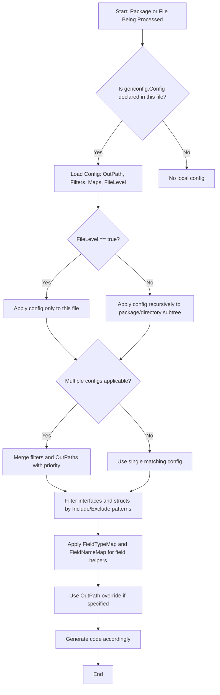

# Generation Configuration

Customize what and how the GORM CLI generates code using the `genconfig.Config` structure. This powerful configuration lets you control output locations, selectively include or exclude interfaces and structs, map custom types and tags to generated field helpers, and fine-tune generation scope at the file or package level.

---

## Overview of `genconfig.Config`

The `genconfig.Config` type is a package-level configuration literal that GORM CLI automatically discovers during scanning. It controls generation behavior specific to the package or directory it is declared in. Declaring this config allows you to tailor the following:

- Output path for generated code in a package
- Which interfaces and structs to generate (via include/exclude filters using shell-style patterns or type literals)
- Custom field type mappings to specialized field helpers
- File-level vs package-level scope for configuration application

```go
var _ = genconfig.Config{
    OutPath:          "examples/output",
    IncludeInterfaces: []any{"Query*"},
    ExcludeStructs:    []any{"*DTO"},
    FieldTypeMap: map[any]any{
        sql.NullTime{}: field.Time{},
    },
    FieldNameMap: map[string]any{
        "json": JSON{},
    },
    FileLevel: false, // or true
}
```

This config literal is placed inside any Go source file within the package or directory subtree that you want it to affect.

---

## Key Configuration Fields Explained

### Output Path (`OutPath`)
Overrides the CLI command output path (`-o` flag) for all generated files associated with the package where this config is declared. Useful to redirect generated code to dedicated folders per package.

### Inclusion and Exclusion Filters
These let you whitelist or blacklist interfaces and structs from generation, supporting precise narrowing or broad exclusion.

- `IncludeInterfaces` / `ExcludeInterfaces`: Filter interfaces by name patterns (shell-style, e.g., `"Query*"`, `"*Repo"`) or typed literals (e.g., `models.Query(nil)`).
- `IncludeStructs` / `ExcludeStructs`: Filter structs by patterns or type literals (e.g., `"User"`, `"Account*"`, `models.User{}`).

**Filter Priority**:
- If `Include*` lists are non-empty, only matching items are generated, and `Exclude*` lists are ignored.
- If `Include*` lists are empty, `Exclude*` lists are applied after allowing everything else.

#### Example: Whitelist Only I1 Interface and S1 Struct
```go
var _ = genconfig.Config{
    IncludeInterfaces: []any{"I1"},
    IncludeStructs:    []any{"S1"},
}
```

#### Example: Include only interfaces with names starting with "Query"
```go
var _ = genconfig.Config{
    IncludeInterfaces: []any{"Query*"},
}
```

#### Example: Exclude nested interfaces and structs recursively
```go
var _ = genconfig.Config{
    ExcludeInterfaces: []any{"I3"},
    ExcludeStructs:    []any{"S3"},
}
```

### Field Type and Name Mappings
Customize how your Go struct fields map to generated field helpers.

- `FieldTypeMap`: Map Go type instances (e.g., `sql.NullTime{}`) to a wrapper field helper type (e.g., `field.Time{}`). Useful for wrapping standard or custom types with specialized field behavior.

- `FieldNameMap`: Map struct tag `gen` names (strings) to field helper types. This overrides `FieldTypeMap` and is handy for applying different field helpers based on struct tags.

```go
FieldTypeMap: map[any]any{
    sql.NullTime{}: field.Time{},
},
FieldNameMap: map[string]any{
    "date": field.Time{},
    "json": JSON{},
}
```

---

## File-Level vs Package-Level Configuration

The `FileLevel` boolean controls whether the config applies only to the current file (`true`) or the whole package/directory subtree (`false`).

- `FileLevel: false` (default): The config cascades to all files under the package directory in generation.
- `FileLevel: true`: The config scopes only to the single file in which it is declared.

Use file-level when you need very granular control over generation in specific source files.


---

## How Configuration Filters are Applied During Generation

1. The CLI scans input source files recursively.
2. Any `genconfig.Config` literals found are recorded and associated with their source file paths.
3. For each generation target file, the system finds applicable configs based on directory/file matching and `FileLevel` flags.
4. It merges filters from all applicable configs.
5. When including or excluding interfaces or structs:
   - If any `IncludeInterfaces` or `IncludeStructs` values exist, only those matching items are generated.
   - Otherwise, any matching `ExcludeInterfaces` or `ExcludeStructs` are removed.
6. The output path can be overridden by the config where relevant.

Filtering patterns support shell-style glob matching and typed values with exact or partial package scoping.


---

## Practical Examples

### Whitelist Specific Interfaces and Structs
Generate only interface `I1` and struct `S1` from this package.

```go
package whitelist

import (
	"gorm.io/cli/gorm/genconfig"
)

var _ = genconfig.Config{
	IncludeInterfaces: []any{"I1"},
	IncludeStructs:    []any{"S1"},
}
```

### Include Interfaces Starting with "Query"

```go
package pattern

import "gorm.io/cli/gorm/genconfig"

var _ = genconfig.Config{
	IncludeInterfaces: []any{"Query*"},
}
```

### Recursive Exclusion of Nested Items

```go
package nested

import "gorm.io/cli/gorm/genconfig"

var _ = genconfig.Config{
	FileLevel:         false,
	ExcludeInterfaces: []any{"I3"},
	ExcludeStructs:    []any{"S3"},
}
```

---

## Tips and Best Practices

- **Use Include filters when you want explicit control** and only want to generate a subset of interfaces or structs. This eliminates unintended generation and speeds up generation.
- **Use Exclude filters for broad packages where most types are needed except for some edge cases.**
- Prefer **field name mappings** for tag-driven customization over type mappings if you want to apply specialized fields conditionally.
- Remember to **set `OutPath` per-package** to isolate generated code if your projects have complex module layouts.
- Combine filters with **`FileLevel` = true** to fine-tune per-file generation in large packages.
- Use shell-style wildcards (`*`, `?`) in filters to target groups of types by name patterns.

---

## Troubleshooting Common Scenarios

<AccordionGroup title="Troubleshooting Generation Configuration">
<Accordion title="Config Not Applying as Expected">
Ensure your config literal is declared at the package level in a scanned source file. Package must be part of the CLI input path.

If you rely on directory-wide config, confirm `FileLevel` is set to `false` (default).

Verify your inclusion/exclusion filters match the produced type names with package prefixes or use literal types for precision.
</Accordion>
<Accordion title="Custom Field Types Not Picking Up">
Check that your `FieldTypeMap` keys are typed composite literals like `sql.NullTime{}` and values are appropriately typed wrapper instances.

Use `FieldNameMap` if you rely on struct tag names instead and confirm tag naming in source structs.

Also confirm that the generated code imports relevant field helper packages for your custom types.
</Accordion>
<Accordion title="Output Directory Overridden Incorrectly">
Multiple `genconfig.Config` declarations across files may override `OutPath`. The last matching config found in directory tree applies.

Make sure only one config specifies `OutPath`, or organize configs with file-level granularity if multiple outputs are required.

Run the CLI with verbose output to trace which config files are being used.
</Accordion>
</AccordionGroup>

---

## Summary

`genconfig.Config` is your central tool for customizing how GORM CLI generates code per package or file. Through flexible filtering, targeted output control, and custom field mapping, it empowers you to scale generation to fit your project's structure and domain complexity.

By mastering config filters and mappings, you ensure only relevant query interfaces and structs are generated, tailored precisely to your application's needs.

Explore related configuration guides to deepen your expertise:

- [Basic Generation Configuration](/getting-started/configuration-troubleshooting/basic-configuration)
- [Customizing Code Generation with Config](/guides/advanced-patterns/customizing-generation)
- [Working with Model-Driven Field Helpers](/guides/core-workflows/using-field-helpers)


---

## Diagram: Generation Configuration Application Flow




---

## Additional Examples From the Official Repository

### Whitelist Example (only generate interface I1 and struct S1)
```go
package whitelist

import (
	"gorm.io/cli/gorm/genconfig"
)

var _ = genconfig.Config{
	IncludeInterfaces: []any{"I1"},
	IncludeStructs:    []any{"S1"},
}
```

### Pattern Example (include only interfaces starting with "Query")
```go
package pattern

import "gorm.io/cli/gorm/genconfig"

var _ = genconfig.Config{
	IncludeInterfaces: []any{"Query*"},
}
```

### Two-Level Nested Example (exclude nested interface I3 and struct S3)
```go
package nested

import "gorm.io/cli/gorm/genconfig"

var _ = genconfig.Config{
	FileLevel:         false,
	ExcludeInterfaces: []any{"I3"},
	ExcludeStructs:    []any{"S3"},
}
```

---

## See Also

- [Using Generated APIs: First Query](/getting-started/core-workflow-quickstart/using-generated-code) for practical examples
- [Template DSL and SQL Templating](/concepts/core-architecture/template-dsl-concepts) to learn query customization
- [Field Helpers & Type Mapping](/concepts/data-models-fields/field-helper-architecture) for field helper customization patterns


## Source
You can review the `genconfig.Config` source and examples in the GORM CLI repository:

- `genconfig/config.go`
- `examples/filters/whitelist/config.go`
- `examples/filters/pattern/config.go`
- `examples/filters/twolevel/nested/config.go`


For any changes, visit the repository:
<Source url="https://github.com/go-gorm/cli" branch="main" paths={[{"path":"gorm.io/cli/gorm/genconfig/config.go","range":"1-70"},{"path":"gorm.io/cli/gorm/examples/filters/whitelist/config.go","range":"1-11"}]}/>

---

For deep mastery, combine this configuration with understanding the overall [Generation Workflow](https://docs.gorm.io/concepts/core-architecture/cli-generation-flow).