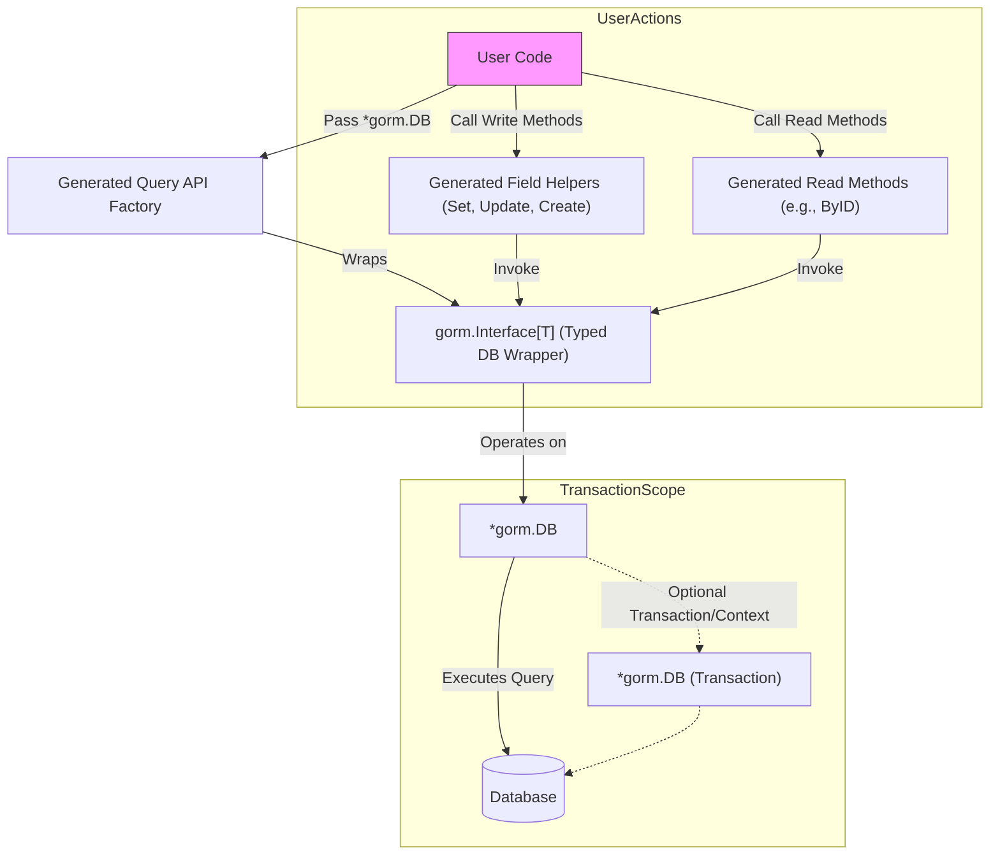

# GORM Integration Patterns

GORM CLI is designed to seamlessly integrate with the GORM ORM, enabling users to generate type-safe, fluent query APIs and model-driven field helpers that work directly on GORM's core `*gorm.DB` objects. This page explains how generated code layers onto GORM, the interaction patterns between generated APIs and GORM's database access, transaction management, and context propagation. The goal is to empower users to leverage both the power of GORM ORM and the type safety of generated code without friction.

---

## Overview

At its core, GORM CLI-generated code builds on top of the standard GORM `*gorm.DB` instance, wrapping or extending it with generated interfaces and helper methods. This enables a smooth and idiomatic usage pattern for both read and write operations.

Users write idiomatic Go code working with GORM's `*gorm.DB` and then delegate specific queries or updates to generated query APIs or field helpers. The generated APIs ensure compile-time safety, fluent chaining, and a declarative style, all while maintaining access to underlying GORM features such as transactions, preloading, and context awareness.


## Key Integration Concepts

### 1. Embedding GORM Interfaces in Generated APIs

Generated query interfaces embed `gorm.Interface[T]`, a core abstraction wrapping GORM operations for type `T`. This allows the generated interfaces to expose the full power of GORM’s fluent API while adding custom typed methods from SQL templates.

For example, a generated interface might look like:

```go
// Generated query interface embedding gorm.Interface
type _QueryUserInterface[T any] interface {
    gorm.Interface[T]
    ByID(ctx context.Context, id int) (T, error)
}
```

The implementation typically wraps a `gorm.G[T](db, opts...)` call, where:

- `db` is the `*gorm.DB` instance user provides
- `opts...` allows additional GORM expressions or clauses

This approach ensures the generated API can interoperate with any valid GORM configuration and lifecycle.


### 2. Using GORM’s Core DB Object

The starting point is a typical GORM instance holding DB connection state:

```go
var db *gorm.DB = // initialized GORM database instance
```

Generated code exposes functions like:

```go
// QueryUser returns a query interface wrapping *gorm.DB
func QueryUser[T any](db *gorm.DB, opts ...clause.Expression) _QueryUserInterface[T] {
    return _QueryUserImpl[T]{
        Interface: gorm.G[T](db, opts...),
    }
}
```

Here, `gorm.G[T](db, opts...)` returns a typed wrapper over GORM's DB scoped to the model type `T` (e.g., `models.User`). This wrapper includes fluent methods like `Where`, `Find`, `Set`, and others, enabling chaining.


### 3. Context Propagation

All generated methods include `context.Context` as the first parameter, enabling context-aware database operations. GORM itself respects context for cancellation and tracing, so generated APIs transparently support:

- Request timeouts
- Distributed tracing
- Cancellation propagation

Example usage:

```go
user, err := generated.Query[models.User](db).ByID(ctx, 123)
```

By requiring explicit context, the generated code encourages best practices in modern Go development.


### 4. Transaction Handling

Because generated code wraps a `*gorm.DB`, it seamlessly supports transactions by passing in a transaction-scoped database object.

Example:

```go
tx := db.Begin()
userQuery := generated.Query[models.User](tx)
err := tx.Commit().Error
```

Generated APIs operate on the provided `*gorm.DB` (which can be a root db or transaction), so transactional boundaries and rollbacks behave as expected without any extra ceremony.


### 5. Read vs Write Operation Semantics

- **Reads** typically use methods returning data along with error. These methods execute queries using GORM’s `Raw` or `Scan` internally, chained from the embedded interface.
- **Writes** use generated field helpers combined with `Set` and `Update` or `Create` calls on the wrapped interface.

Example write using field helpers:

```go
gorm.G[models.User](db).
    Where(generated.User.ID.Eq(1)).
    Set(generated.User.Age.Set(40), generated.User.IsAdult.Set(true)).
    Update(ctx)
```

This approach uses fluent chaining with generated field predicates and setters while relying on standard GORM write operations.


### 6. Flexible GORM Options via Variadic Parameters

Most generated API factory functions accept variadic `clause.Expression` options, allowing users to pass any GORM clause or modifiers such as:

- Preloading related models
- Ordering
- Limit, Offset
- Custom SQL clauses

This preserves flexibility while still benefiting from strong typing.

---

## Real-World Usage Scenarios

### Scenario: Fetching by ID

To fetch a user by ID using a generated query, you:

1. Pass the main `*gorm.DB` as source
2. Use the generated `QueryUser` factory to obtain a typed query interface
3. Call the custom method for fetching

```go
// Fetch a user by ID
user, err := generated.QueryUser[models.User](db).ByID(ctx, 123)
if err != nil {
    // handle error
}
```

Behind the scenes, this method executes raw SQL but uses GORM’s `Scan` via the embedded interface, ensuring the model maps correctly.

### Scenario: Updating User Info

To update user data, use generated field helpers combined with `Set` and `Update`:

```go
// Update user age and is_adult flag
err := gorm.G[models.User](db).
    Where(generated.User.ID.Eq(userID)).
    Set(
      generated.User.Age.Set(40),
      generated.User.IsAdult.Set(true),
    ).
    Update(ctx)
if err != nil {
    // handle update failure
}
```

This approach merges standard GORM updating with compile-time safety and fluent API.

### Scenario: Using Transactions

```go
tx := db.Begin()
userAPI := generated.QueryUser[models.User](tx)
user, err := userAPI.ByID(ctx, 123)
if err != nil {
    tx.Rollback()
    return err
}
// perform multiple update operations
err = userAPI.UpdateInfo(ctx, models.User{Age: 40}, 123)
if err != nil {
    tx.Rollback()
    return err
}
tx.Commit()
```

Using the `tx` object ensures all generated method calls participate in the transaction.

---

## Best Practices & Tips

- **Always pass a context** when invoking generated queries or updates for proper propagation.

- **Use the original GORM `*gorm.DB` object** or a transactional scope when creating the generated query interface.

- **Chain generated field helpers and predicates** for strongly typed conditions instead of raw strings to avoid SQL injection and improve discoverability.

- **Combine generated SQL template methods with GORM capabilities** like preloading, eager loading, or additional custom clauses using `opts ...clause.Expression` or fluent chaining.

- **Apply transactions explicitly** by passing a transaction `*gorm.DB` to the generated query API factory to ensure atomic operations.

- **Leverage variadic clause expressions** in generated code to extend queries with ordering, limits, or joins as needed.

- **Inspect generated methods carefully** as they reflect interface definitions you provide with SQL template comments.

---

## Troubleshooting

- **Generated methods missing `ctx context.Context`**: Generated code automatically inserts context if absent. Ensure your interface methods and generator version are up to date.

- **Unexpected runtime errors in queries**: Check your SQL templates syntax and parameter bindings in interface method comments.

- **Transaction behaviors not taking effect**: Verify you pass the transaction `*gorm.DB` instance to the generated query interface functions.

- **Field helpers not recognizing updated fields**: Ensure your model struct field mappings and genconfig configuration align properly.

- **Preloading or eager loading not triggered**: Pass GORM clause expressions like `db.Preload(...)` as options during query interface creation.

---

## Diagram: Interaction Flow Between Generated APIs and GORM DB



This illustrates how user code provides a GORM DB instance (possibly transaction-scoped) to the generated query factory, which produces a typed wrapper exposing custom query methods and field helpers that operate on and extend the underlying GORM DB, which finally executes queries to the database.

---

## Related Documentation

- [System Architecture](https://docs.gorm.io/concepts/architecture-overview/system-architecture): Understand the overall GORM CLI flow and architecture.
- [Core Concepts and Terminology](https://docs.gorm.io/overview/system-architecture-concepts/core-concepts-terminology): Learn key concepts underpinning GORM CLI and GORM interaction.
- [Using Generated Field Helpers for Filtering and Updates](https://docs.gorm.io/guides/core-workflows/using-generated-field-helpers): Detailed usage patterns for field helpers that integrate with GORM.
- [Defining Query Interfaces & SQL Templates](https://docs.gorm.io/guides/core-workflows/query-apis-and-templates): How to write interfaces that generate these integrated APIs.
- [Configuring and Overriding Generation](https://docs.gorm.io/concepts/integration-and-extensibility/configuration-and-overrides): Customizing the generated code, including field mappings and SQL.

---

By understanding how generated code interfaces directly with GORM’s native DB objects and transactional context, users can write clean, idiomatic Go code that combines compile-time safety with GORM’s powerful ORM features, enabling robust, maintainable, and high-performance database access patterns.
