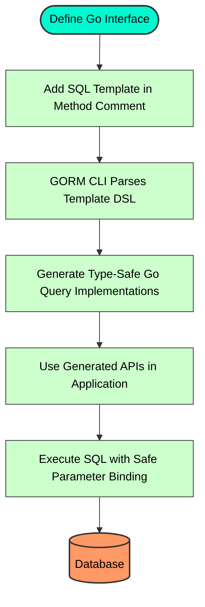

# Template DSL and Query Extensibility

Master the GORM CLI's SQL template domain-specific language (DSL), empowering you to create advanced, dynamic, and conditional SQL queries safely and expressively. This guide walks you through the powerful templating system provided by GORM CLI for query interface methods, showing how to leverage directives, bind parameters, and generate complex SQL logic with confidence.

---

## Introduction

When working with database queries in Go using GORM CLI, the `Template DSL` empowers you to embed SQL templates directly within your interface method comments. These templates are parsed and compiled by the CLI to generate type-safe, fluent query methods. This system goes beyond static SQL by enabling conditional logic, iteration, and dynamic SQL construction to handle complex business requirements elegantly.

This page focuses exclusively on mastering the SQL template DSL, explaining how to write sophisticated query templates with advanced directives such as `{{where}}`, `{{set}}`, and conditional logic (`{{if}}`, `{{else}}`, `{{end}}`). You'll learn how these directives facilitate conditional query components, dynamic parameter binding, and looping, all while preserving safety and maintainability.

---

## Understanding the Template DSL

The template DSL accepts SQL fragments embedded directly as Go interface method comments. This approach allows you to declare intent in a natural SQL style, enriched with Go-like templating logic.

### Core Template Directives

| Directive   | Purpose                                         | Example                                   |
|-------------|-------------------------------------------------|-------------------------------------------|
| `@@table`   | Resolves automatically to the model's SQL table name based on interfaces' generic type.
| `@@column`  | Enables dynamic column name binding from method parameters.
| `@param`    | Maps Go function parameters to SQL query parameters safely.
| `{{where}}` | Adds a conditional `WHERE` clause if the inner block generates content.
| `{{set}}`   | Adds a conditional `SET` clause useful for `UPDATE` statements, omitting if empty.
| `{{if}}`    | Conditionals to include SQL snippets based on runtime parameter values.
| `{{else}}`/
`{{else if}}` | Branching for alternative SQL fragments.
| `{{for}}`   | Iterates over slices or collections to generate repeated SQL segments.
| `{{end}}`   | Terminates control structures such as conditionals or loops.

### How the Template DSL Operates

- **Safe Parameter Binding**: Every parameter prefixed with `@` injects a user-supplied value safely, using Go's parameterized query mechanisms to avoid SQL injection risks.
- **Table and Column Placeholders**: `@@table` and `@@column` are substituted contextually by the generator, linking your Go types and field helpers directly to your queries.
- **Conditional Logic**: Use `{{if}}` blocks to add SQL fragments only when conditions are met, for example filtering by a field only if that value is meaningful.
- **Dynamic Constructs**: The `{{for}}` loop enables filtering or joining on collections by iterating over slices, generating complex `WHERE` clauses dynamically.

---

## Writing Queries Using the Template DSL

To illustrate the template DSL's capabilities, consider the following method within a Go interface:

```go
// SELECT * FROM @@table WHERE id=@id AND name = "@name"
GetByID(id int, name string) (T, error)
```

This template instructs the generator to create a method fetching a record by `id` and `name`, binding SQL parameters safely.

### Conditional WHERE Clause

Use the `{{where}}` directive to add filters only when needed:

```sql
SELECT * FROM @@table
{{where}}
  {{if user.Name != ""}} name=@user.Name {{end}}
  {{if user.Age > 0}} AND age=@user.Age {{end}}
{{end}}
```

This generates a `WHERE` clause only if either condition is true, avoiding empty or invalid SQL.

### Dynamic SET Clause for Updates

For update queries, `{{set}}` helps build the `SET` list conditionally:

```sql
UPDATE @@table
{{set}}
  {{if user.Name != ""}} name=@user.Name, {{end}}
  {{if user.Age > 0}} age=@user.Age, {{end}}
  {{if user.Age >= 18}} is_adult=1 {{else}} is_adult=0 {{end}}
{{end}}
WHERE id=@id
```

The generated SQL will only include changed fields and assign `is_adult` based on age.

### Looping with `{{for}}`

To filter by multiple values in a slice, iterate over the slice and construct dynamic conditions:

```sql
SELECT * FROM @@table
{{where}}
  {{for _, user := range users}}
    {{if user.Name != "" && user.Age > 0}}
      (name=@user.Name AND age=@user.Age) OR
    {{end}}
  {{end}}
{{end}}
```

This creates an `OR` condition list matching any user in the slice.

---

## Practical Examples

```go
// Interface method with raw SQL template using advanced directives
//
// SELECT * FROM @@table WHERE id=@id AND status=@status
GetByIDAndStatus(id int, status string) (T, error)

// Dynamic column and value binding
//
// SELECT * FROM @@table WHERE @@column=@value
FilterWithColumn(column string, value string) ([]T, error)

// Complex query with conditional logic
//
// SELECT * FROM @@table
// {{where}}
//   {{if user.ID > 0}}
//     WHERE id=@user.ID
//   {{else if user.Name != ""}}
//     WHERE name=@user.Name
//   {{end}}
QueryWith(user models.User) ([]T, error)

// Update with conditional SET
//
// UPDATE @@table
// {{set}}
//   {{if user.Name != ""}} name=@user.Name, {{end}}
//   {{if user.Age > 0}} age=@user.Age, {{end}}
//   {{if user.Age >= 18}} is_adult=1 {{else}} is_adult=0 {{end}}
// {{end}}
// WHERE id=@id
UpdateUserInfo(user models.User, id int) error

// Filtering with iteration and conditionals
//
// SELECT * FROM @@table
// {{where}}
//   {{for _, user := range users}}
//     {{if user.Name != "" && user.Age > 0}}
//       (name=@user.Name AND age=@user.Age AND role LIKE concat("%",@user.Role,"%")) OR
//     {{end}}
//   {{end}}
// {{end}}
FilterUsers(users []models.User) ([]T, error)
```

---

## Best Practices

- **Use `@@table` and `@@column` for dynamic metadata**: Always prefer these placeholders instead of hardcoding table or column names to maintain consistency and compatibility with generated models.
- **Prefer `{{where}}` and `{{set}}` for optional clauses**: These directives prevent generating invalid SQL when conditions or sets are empty.
- **Bind using `@param` syntax carefully**
  - Match parameter names exactly to method signature parameter names or struct fields.
  - For nested structs, use dot notation, e.g., `@user.Name`.
- **Leverage `{{if}}` and `{{for}}` to express complex logic**
  - Avoid complex string concatenations in SQL; use control directives for clarity and correctness.
- **Keep SQL templates concise and readable**
  - Comment extensively inside method doc strings if needed.
  - Align indentation sensibly to improve generated SQL quality.
- **Remember the generator adds implicit context injection**
  - All generated methods receive `context.Context` automatically (even if not declared).

---

## Common Pitfalls and Troubleshooting

<Warning>
- **Empty clauses generate invalid SQL** if you omit `{{where}}` or `{{set}}` when conditions are optional.
- **Mismatched param names cause runtime panics or errors** when generating SQL.
- **Complex expressions involving side effects are not supported**; keep conditions pure.
- **Do not hardcode table or column names:** rely on `@@table` and `@@column` for portability.
- **Loops must handle empty collections gracefully**; use conditionals inside loops.
</Warning>

<Info>
If generation fails or templates don't produce expected SQL, review the raw SQL string in interface method comments, then inspect the generated Go code using verbose logging or debug output.
</Info>

---

## How It Fits in Your Development Workflow

1. Define your query interfaces in Go, embedding SQL templates in comments for each method.
2. Use built-in directives (`@@table`, `@param`, `{{where}}`, `{{set}}`, `{{if}}`, `{{for}}`) to express dynamic and conditional query logic.
3. Run the GORM CLI tool (`gorm gen`) with your input files.
4. Examine the generated type-safe query APIs that implement your template logic.
5. Use these APIs confidently in your application code, relying on compile-time checks and automatic safe parameter binding.

By mastering template DSL techniques described here, you're empowered to represent complex business queries, update logic, and filters with minimal boilerplate, strong correctness guarantees, and maintainability.

---

## Visual Overview of Template Processing



---

## Reference

- **Directive Summary**: See the directive table above for quick syntax overview.
- **Examples**: Look at `examples/query.go` in the GORM CLI repository for realistic SQL template use cases.
- **Configuration**: Use generation config to customize field mappings and output locations to complement your templates.

---

## Additional Resources

- [Quick Feature Overview](/overview/features-and-workflow-overview/quick-feature-overview)
- [Template-Based SQL Queries Guide](/guides/advanced-usage-patterns/template-sql-queries)
- [Using Type-Safe Query APIs](/guides/getting-started-workflows/using-type-safe-queries)
- [Generation Configuration Reference](/concepts/data-modeling-and-generation/generation-configuration)

Explore these to deepen mastery and integrate templated queries seamlessly into your workflow.
