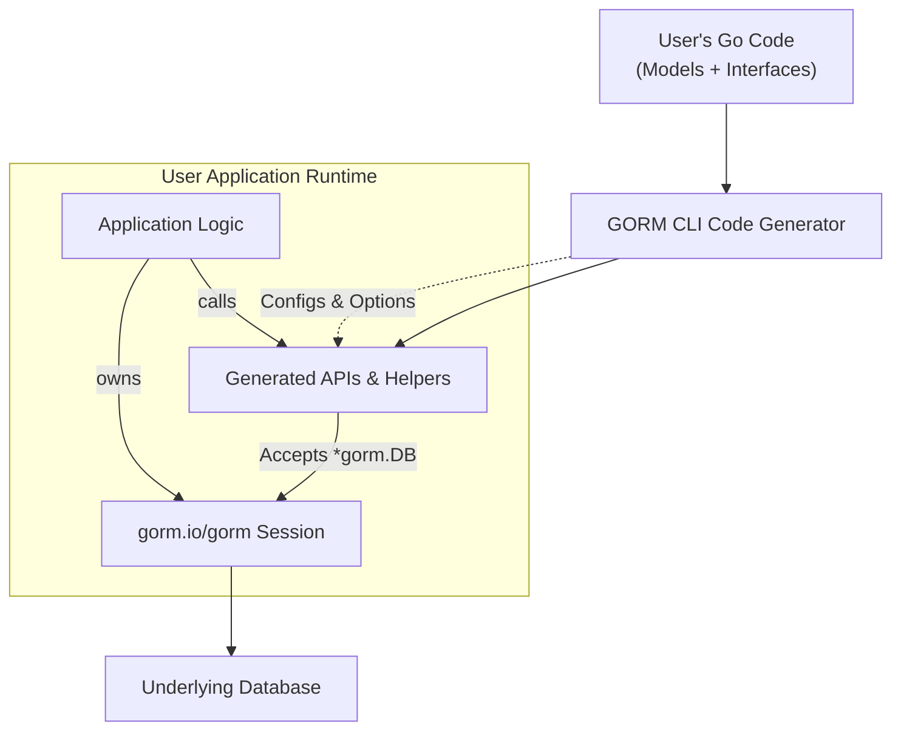

# Integration with GORM

Understanding how GORM CLI-generated APIs integrate seamlessly with the core `gorm.io/gorm` ORM is crucial for maximizing productivity and maintaining clean, type-safe database access code. This guide walks you through the fundamental concepts of integration, how generics play a pivotal role, and best practices for incorporating the generated code into your existing Go projects.

---

## Why Integration Matters

At its heart, GORM CLI is designed to generate type-safe query APIs and model-driven field helpers tailored for GORM. But these generated components are not standalone — they tightly weave into your existing GORM sessions and workflows to enhance type safety, reduce boilerplate, and streamline data operations.

Seamless integration means:

- Generated APIs operate as natural extensions of your existing `*gorm.DB` instances.
- The use of Go generics enables flexible yet strongly typed query and mutation interfaces.
- Association helpers and field helpers enrich standard GORM models with fluent, discoverable operations.
- The generator respects and cooperates with the existing GORM configurations, scopes, and context propagation.


## Core Concepts of Integration

### 1. Generated APIs Wrap Existing GORM Sessions

The generated APIs from your interface definitions or models always accept a `*gorm.DB` reference — your existing database session or transaction. This design empowers you to:

- Start queries or mutations on your current DB context, including transactions, debug mode, or specific scopes.
- Compose queries fluidly by applying where conditions using generated field helpers.

For example:

```go
// `db` is your *gorm.DB instance
// Fetch a User record by ID safely using the generated Query[User] API
user, err := generated.Query[models.User](db).GetByID(ctx, 123)
```

Here, the `Query[User](db)` call returns a strongly typed query interface bound to your current DB session.

### 2. Leveraging Go Generics for Type Safety and Flexibility

The use of generics is a foundational element that enables generated code to remain clean and type-safe:

- **Generic Query Interfaces**: For example, `Query[T any]` allows methods like `GetByID` to return concrete typed objects while seamlessly operating on any model type `T`.
- **Field Helpers**: Typed fields such as `generated.User.Name` are strongly typed to the underlying Go struct fields for compiling safe queries.

This eliminates the cumbersome manual crafting of SQL strings or use of untyped `map[string]interface{}`.

### 3. Model-Driven Field and Association Helpers Extend GORM

The generator derives fluent helper objects from your model structs:

- **Basic Fields** (ints, strings, times, nullable types) receive expressive predicate and update methods.
- **Associations** (`has one`, `has many`, `belongs to`, `many2many`, polymorphic) have specialized methods for Create, Update, Unlink, Delete operations with compile-time safety.

Using these helpers, you extend your GORM queries with:

- Intuitive, chainable predicates.
- Type-safe association manipulation built seamlessly on top of GORM.

Example: creating a user with a pet linked in one transaction

```go
gorm.G[models.User](db).
  Set(
    generated.User.Name.Set("alice"),
    generated.User.Pets.Create(generated.Pet.Name.Set("fido")),
  ).
  Create(ctx)
```

### 4. Configuration and Override Points for Integration

To fit your app structure, the generator and generated code support:

- **Output directory control**: Map generated packages and files into your desired module layout.
- **Generation config (`genconfig.Config`)**: Customize field helper mappings, include/exclude filters, file-level granularity.
- Generated code includes imports and references to `gorm.io/gorm` ensuring all integration points are honored.

---

## Typical User Workflow for Integration

<Steps>
<Step title="Define Your Models and Query Interfaces">
Create or maintain your standard Go structs as GORM models and write query interfaces with embedded SQL templates.
</Step>
<Step title="Run the GORM CLI Generator">
Invoke `gorm gen -i ./path/to/interfaces -o ./generated` to generate the type-safe query APIs and field helpers tied to your GORM models.
</Step>
<Step title="Use Generated APIs in Your Application">
Inject your existing `*gorm.DB` instances into generated APIs — e.g., `generated.Query[User](db)` or `gorm.G[User](db)` — to perform queries and mutations with enhanced typing and convenience.
</Step>
<Step title="Employ Association Helpers and Field Helpers">
Use the generated fields and associations to construct conditions, updates, and create or update associated records with fluent type-safe code.
</Step>
</Steps>

---

## Integration Best Practices

### Always Pass Your Active `*gorm.DB` Session

To ensure correct transaction scoping, context propagation, and configuration, always start generated API calls by passing the current DB instance — including any transaction or debug mode wrappers.

### Use Context-Aware API Methods

Generated methods inject or require `context.Context` parameters automatically, facilitating request-scoped operations and logger propagation.

### Organize Generated Code by Packages for Clarity

Align the `OutPath` config with your project organization to keep generated code maintainable and discoverable.

### Leverage Field and Association Helpers for Updates

Instead of manual `Update` or `Where` with strings, use generated helpers to compose predicate expressions and updates — making your code more resilient to schema changes.

### Avoid Manually Editing Generated Code

The generated code is a derived artifact. Customize generation via configuration (`genconfig.Config`) or model/interface definitions.

---

## Troubleshooting Integration Issues

<AccordionGroup title="Common Integration Issues and Solutions">
<Accordion title="Generated Code Not Recognized in Your Project">
Ensure your module path and package import paths match your configured `OutPath`. Run `go mod tidy` after generating code.
</Accordion>
<Accordion title="Passing Wrong DB Instance Results in Missing Context or Scope">
Always pass your active `*gorm.DB` instance — including transactions or debug mode wrappers — to the generated APIs.
</Accordion>
<Accordion title="Type Errors with Generated APIs">
Verify that the model and interface definitions are consistent and that the CLI runs against the latest source. Use compatible Go versions (1.18+ for generics).
</Accordion>
<Accordion title="Association Operations Not Behaving as Expected">
Review association helper usage—understand the semantics of `Unlink()` vs `Delete()`. Ensure proper foreign key relationships exist in your models and DB schema.
</Accordion>
</AccordionGroup>

---

## Visual Overview of Integration Flow



This diagram illustrates how your model and interface definitions feed into the generator, producing code that interoperates directly with your GORM sessions during runtime.

---

## Summary

Integration with GORM through GORM CLI enables you to use generated, strongly typed query APIs and model-driven helpers as first-class citizens in your Go codebase, leveraging your current `*gorm.DB` instances. This approach enhances developer productivity, query safety, and offers fluent, expressive data manipulation tightly aligned with your schema.

---

## Additional Resources

- [Core Concepts & Terminology](overview/core-concepts-architecture/core-concepts-terminology) — Foundational knowledge of APIs and helpers
- [Type-Safe Query API Concepts](concepts/architecture-core-principles/query-api-concept) — Detailed explanation of query API generation
- [Field Helpers & Model Mapping](concepts/architecture-core-principles/field-helper-model) — How models map to generated helpers
- [Using Generated APIs](getting-started/first-run-generation/first-usage) — Practical usage guidance
- [Configuring Generation](guides/advanced-usage/generation-configuration) — Customize code generation to your project layout
- [Troubleshooting Common Issues](getting-started/configuration-validation/troubleshooting) — Resolve common integration problems


---

## Key Takeaways

- Always inject your current `*gorm.DB` to retain transactional and scope integrity.
- Use generated field and association helpers to compose safe, maintainable queries.
- Harness generics-based APIs for flexible yet strongly typed data operations.
- Control generated output and mapping through `genconfig.Config` for seamless project integration.
- Treat generated code as a derived layer and adapt your workflow to maximize integration benefits.

With this foundation, your GORM CLI setup can elevate the maintainability, clarity, and robustness of your Go data access codework.


---

*End of Integration with GORM concepts guide.*
