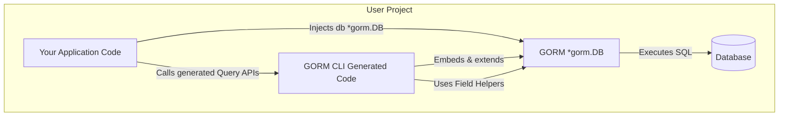

# Integration with GORM and Your Workflows

GORM CLI generates type-safe, interface-driven query APIs and model-driven field helpers specifically designed to integrate deeply with the GORM ORM framework. This page clarifies how the generated code fits seamlessly into GORM's ecosystem, explains best practices for structuring and sharing generated code across multiple packages, and offers guidance on maintaining and evolving your generated APIs as your database schema changes.

---

## How Generated Code Extends GORM

At its core, GORM CLI wraps and extends the familiar GORM `*gorm.DB` type to provide compile-time safety, fluent APIs, and maintainable code generation. When you run `gorm gen`, it creates two main artifacts:

- **Interface-driven Query APIs**: Concrete implementations of your Go interfaces with embedded SQL templates. These generated types embed `gorm.Interface[T]`, enriching native GORM methods with type-safe, method-specific queries.
- **Model-driven Field Helpers**: Strongly-typed field helper variables and structs matching your data model—intuitive building blocks for filtering, updating, and managing associations.

The generated query structs embed `gorm.G[T]`, which is a type-safe wrapper over `*gorm.DB`. This means you can freely use GORM operations alongside the generated methods without losing type safety or fluid syntax.

```go
// Using generated query interface
user, err := generated.Query[models.User](db).GetByID(ctx, 123)

// Using field helpers with GORM
err = gorm.G[models.User](db).
  Where(generated.User.Name.Eq("alice"), generated.User.Age.Gt(18)).
  Find(ctx, &users)
```

This embedding ensures seamless interaction between custom SQL templates, generated predicates, and native GORM functionality.

> **Value to You:** You get type-safe code generation without giving up GORM’s full expressive power.

---

## Organizing Generated Code in Your Project

To maximize maintainability and collaboration efficiency, consider these recommended organization patterns:

### 1. Use Dedicated Packages for Generated Code

Generate your GORM CLI output into a dedicated subpackage or folder, e.g., `./generated` or `./internal/generated`. This separation clarifies boundaries between hand-written and generated code.

### 2. Use Module-Level or Package-Level Configurations

You can define package-level `genconfig.Config` configurations close to your source models or interfaces. The generator merges configurations intelligently, enabling fine-grained control over output paths and inclusion/exclusion filters per directory or package.

Example configuration:

```go
package examples

import "gorm.io/cli/gorm/genconfig"

var _ = genconfig.Config{
    OutPath: "examples/generated",
    IncludeInterfaces: []any{"Query*"},
}
```

### 3. Share Common Models and Helpers Across Packages

Models and generated code can be imported between packages to reuse common query interfaces and field helpers. To do this:

- Generate from your models and query interfaces once.
- Import the generated package wherever needed.
- Avoid generating the same types multiple times to prevent conflicts.

### 4. Incremental and Layered Generation

For large projects, consider splitting generation into layers:

- Core domain models and queries in foundational packages.
- Feature-specific interfaces and helpers in subpackages.

This structure facilitates faster incremental builds and avoids overly large generated files.

---

## Staying in Sync with Your Schema Evolution

As your database schema and Go models evolve, your generated code must keep pace.

### Best Practices:

- **Run `gorm gen` frequently during development** — ideally integrate it into your CI/CD or build pipeline to prevent drift.
- **Use inclusion/exclusion filters** to limit regeneration scope, which accelerates builds and reduces merge conflicts.
- **Review generated code outputs regularly** to catch naming or mapping surprises early.
- **Treat generated code as an artifact** — do not manually edit generated files; instead, update your interfaces, models, or configs and regenerate.

<Tip>
Automate generation through Makefiles, scripts, or build hooks to ensure your generated APIs are always current and consistent.
</Tip>

---

## Practical Example: Integrating Generated Queries and Field Helpers

Consider a `User` model and an associated query interface.

### Define Your Model and Interface

```go
package models

type User struct {
    ID   uint
    Name string
    Age  int
}

package queries

type Query[T any] interface {
    // SELECT * FROM @@table WHERE id=@id
    GetByID(id int) (T, error)
    
    // WHERE name=@name AND age > @age
    FilterByNameAndAge(name string, age int)
}
```

### Generate the Code

```bash
gorm gen -i ./queries -o ./generated
```

### Use in Your Application

```go
import (
    "context"
    "yourproject/generated"
    "yourproject/models"
    "gorm.io/gorm"
)

func GetUserByID(ctx context.Context, db *gorm.DB, id int) (*models.User, error) {
    return generated.Query[models.User](db).GetByID(ctx, id)
}

func FindUsers(ctx context.Context, db *gorm.DB) ([]models.User, error) {
    q := generated.Query[models.User](db)
    q.FilterByNameAndAge("alice", 18)
    var users []models.User
    err := q.Find(ctx, &users)
    return users, err
}
```

This example highlights how the generated query interfaces and fluent APIs augment your GORM usage without extra boilerplate.

---

## Troubleshooting Common Integration Issues

<AccordionGroup title="Common Challenges and Solutions">
<Accordion title="Generated Code Not Found or Import Errors">
Check that the `-o` output path is correctly specified during generation. If generating in nested folders, verify that your Go module paths reflect the location for imports.

- Confirm `go.mod` settings.
- Ensure your IDE or build tools are refreshed after generation.
</Accordion>

<Accordion title="Conflicts from Duplicate Generated Files">
Avoid generating code for the same interfaces/models in multiple places. Use include/exclude filters in `genconfig.Config` to narrow generation scope.

- Consider centralizing generation for shared models.
- Use patterns like `IncludeInterfaces: []any{"Query*"}` to restrict.
</Accordion>

<Accordion title="Runtime Errors from Outdated Generated Code">
Regenerate whenever your models or interfaces change.

- Automate regeneration in your build pipeline.
- Review logs for generator warnings.
</Accordion>

</AccordionGroup>

---

## Visualizing Integration Flow



This diagram shows your app using generated code built on top of GORM, communicating with the database through the ORM.

---

## Next Steps & Related Reading

- Explore [Quickstart Workflow](/overview/integration-getting-started/quickstart-workflow) to see end-to-end project setup
- Learn to write [Type-Safe Queries](/guides/core-workflows/type-safe-queries) with interface SQL templates
- Master [Model-Driven Field Helpers](/guides/core-workflows/field-helpers) to manage filter and association details
- Configure generation in [Configuring the Generator](/getting-started/configuration/generator-configuration) for tailoring your output
- Troubleshoot generation in [Troubleshooting Common Issues](/getting-started/validation/troubleshooting)

<Tip>
Adopt an iterative workflow: define your models & queries, generate, integrate, test, then refine. This cycle will unlock the most value from GORM CLI’s seamless GORM integration.
</Tip>
