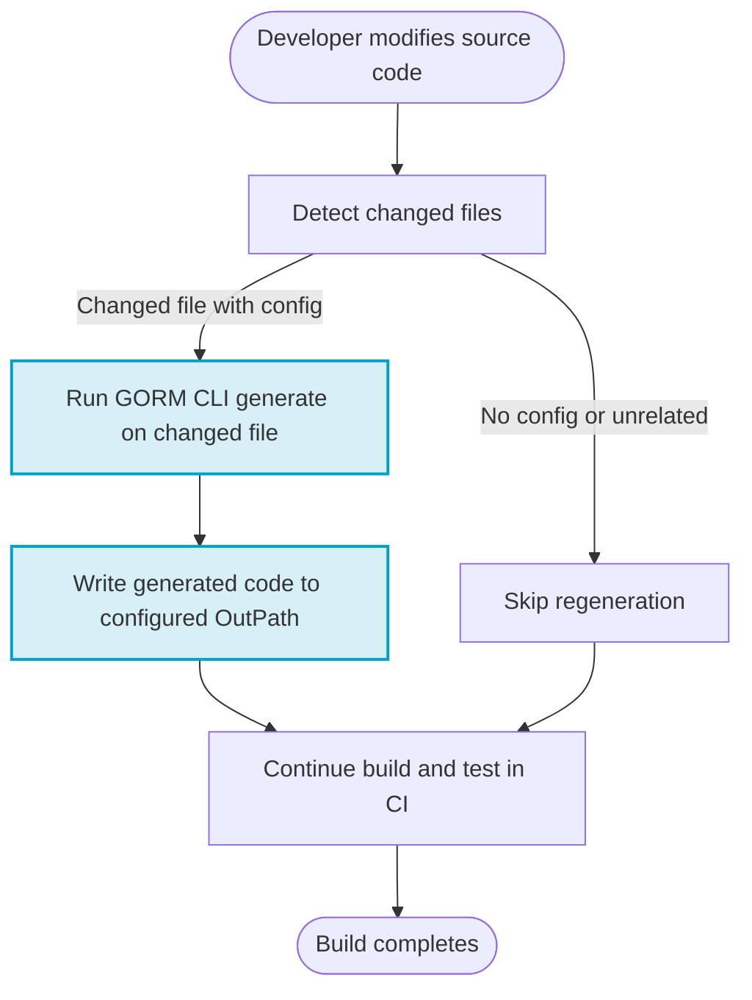

# Scaling Code Generation Safely and Efficiently

GORM CLI is engineered to deliver **high-speed, scalable code generation** tailored to projects of any size. This page unpacks how GORM CLI achieves this through **incremental generation patterns**, **file-level configuration**, and **practical techniques** for managing large codebases and CI workflows. Whether you’re bootstrapping a new project or maintaining a substantial, evolving codebase, understanding these concepts helps you **leverage GORM CLI efficiently while keeping iteration times low and your generated code manageable**.

---

## Why Scalability Matters

As projects scale, generating code for numerous query interfaces, models, and configurations demands an approach that avoids unnecessary rework. Without scalability, code generation can slow down CI pipelines, consume excessive resources, or cause confusion due to unexpectedly wide regeneration of code.

GORM CLI addresses this by enabling **incremental, targeted generation** and offering **fine-grained configuration control** to scope generation precisely. This ensures that only the needed files are updated, maintaining fast developer feedback loops and clean project organization.

---

## Incremental Generation Patterns

GORM CLI supports incremental generation by recognizing **changes within your source files and configurations** and applies the following core principles:

- **Per-file granularity:** The generator processes individual files separately, preserving unchanged files and only regenerating those with modifications.
- **Config-driven scoping:** When configuration (`genconfig.Config`) is present, it scopes generation according to inclusion/exclusion patterns — so only relevant interfaces and structs are regenerated.
- **Output path mapping:** Generated code lands in designated output directories that mirror the source structure, enabling parallel and incremental builds.

### How Incremental Generation Benefits You

- Speeds up build pipelines by avoiding full regeneration.
- Confines changes to localized areas, minimizing merge conflicts in generated sources.
- Enables targeted regeneration during active development on individual packages or files.

<Tip>
For the best incremental performance, keep your configuration declarations close to the code they affect (ideally in the same package) to leverage file-level scoping.
</Tip>

---

## File-Level vs. Package-Level Configuration: Performance Impact

The generator's ability to respect configuration scope profoundly affects scalability:

| Scope           | Description                                               | Performance Impact                                   |
|-----------------|-----------------------------------------------------------|-----------------------------------------------------|
| **Package-Level** | A single `genconfig.Config` declared for the whole package or directory subtree. | Wider scope means more files share this config; may cause more files to regenerate when config changes, but simpler to manage. |
| **File-Level**    | Config with `FileLevel: true`, applies only to the current file. | Highest granularity; files outside this config's scope are unaffected by changes, enabling fastest incremental builds. |

**Choosing File-Level Configuration** is recommended for large repositories with many packages, where minimizing regeneration across unrelated files matters.

<Info>
When `FileLevel` is set to `true`, GORM CLI treats the config as applying only to the file declaring it, rather than the whole directory or package.
</Info>

---

## Strategies for Managing Large Codebases

### 1. Organize Your Code and Configuration With Clear Boundaries

- Place interface and model code in well-structured packages.
- Declare configuration (`genconfig.Config`) close to the source files it targets.
- Use include/exclude lists in configuration to limit scope explicitly for interfaces and structs.

Example:

```go
// In package examples/user
var _ = genconfig.Config{
    OutPath: "generated/examples/user",
    FileLevel: true,             // limits config application to this file
    IncludeInterfaces: []any{"UserQuery*"},
    ExcludeStructs: []any{"UserDTO"},
}
```

### 2. Use Output Paths to Separate Generated From Handwritten Code

Configure `OutPath` in your config to place generated code in distinct folders. This reduces conflicts, clarifies what’s generated, and can improve build cache efficiency.

### 3. Filter Interfaces and Structs to Minimize Code

Apply `IncludeInterfaces` and `ExcludeInterfaces` filters to pinpoint which query interfaces to generate. Similarly, use `IncludeStructs` and `ExcludeStructs` for models.

This greatly reduces unnecessary generation, especially in codebases with experimental or deprecated components.

<Warning>
Avoid very broad include patterns unless you intend to generate all code, as it may significantly slow down generation.
</Warning>

### 4. Integrate Generation Into CI Workflows Thoughtfully

- Cache generated output directories when possible.
- Run generation only on changed packages or files (using git diff or build tools).
- Separate generation step before build to catch generation issues early.

---

## Practical Example: Incremental Generation Flow



---

## Best Practices to Ensure Efficient Code Generation

- **Limit scope using configurations:** Prefer explicit lists over wide glob patterns.
- **Keep configurations localized:** Use file-level configs (`FileLevel: true`) when possible.
- **Avoid unnecessary dependencies:** Large `OutPath` sharing or broad config scope causes cascading regeneration.
- **Test generation time:** Measure generation times when scaling projects; reorganize if times grow unmanageably.

---

## Troubleshooting Common Scalability Issues

<AccordionGroup title="Common Challenges & Solutions">
<Accordion title="Generation takes too long on large projects">

- Verify if `FileLevel` config is used appropriately.
- Review include/exclude filters for overly broad patterns.
- Confirm that output paths (`OutPath`) do not overlap excessively.
- Use file watcher or CI diff tools to regenerate selectively.
- Consider splitting large packages into smaller ones to narrow config application.
</Accordion>

<Accordion title="Unintended regeneration of unrelated code">

- Check that `FileLevel` is not disabled (false). When false, config applies to whole package subtree.
- Look for multiple config files with conflicting overlapping `Include*` and `Exclude*` patterns.
- Ensure `Exclude*` patterns correctly cover deprecated or unwanted interfaces/structs.

</Accordion>

<Accordion title="Generated files missing or misplaced">

- Confirm `OutPath` in the config matches intended output directory.
- Check that relative paths from source to output are consistent.
- Ensure file permissions and filesystem paths permit writing.
- Validate no conflicts from partial generation causing overwrite.
</Accordion>
</AccordionGroup>

---

## Summary

Scaling GORM CLI code generation is achieved by leveraging:

- **Incremental per-file generation** to avoid costly full rebuilds
- **File-level configuration** (`FileLevel: true`) to narrow config scope
- **Include/exclude filtering** to precisely target interfaces and models
- **Strategic output path organization** for clarity and cache efficiency

Following these strategies keeps your code generation fast and manageable, even across large or complex Go projects.

---

## Additional Resources

- [Configuration & Customization](/getting-started/configuration/generator-configuration) — Learn how to configure the generator fully.
- [Code Generation Workflow](/concepts/architecture-core-concepts/generation-workflow) — Understand the lifecycle of generation.
- [Integration with GORM and Your Workflows](/concepts/integration-scaling-and-security/gorm-integration-patterns) — Best practices for integrating generated code.
- [Troubleshooting Common Issues](/getting-started/validation/troubleshooting) — Resolve common pitfalls.

---

## Quick Links

- [Incremental Generation Patterns](#incremental-generation-patterns)
- [File-Level vs Package-Level Config](#file-level-vs-package-level-configuration-performance-impact)
- [Managing Large Codebases](#strategies-for-managing-large-codebases)
- [Troubleshooting](#troubleshooting-common-scalability-issues)


---

If you want to deepen your understanding of GORM CLI's architecture and optimizations, consider visiting the [GORM CLI Architecture Overview](/concepts/architecture-core-concepts/architecture-overview).


---

# Summary

Scaling code generation with GORM CLI ensures efficient, incremental updates and supports large, complex projects without sacrificing performance. This page guides you through leveraging configuration scopes, incremental patterns, and project organization strategies to maintain speedy code generation in your CI and local development workflows.

**Key sections covered:**

- Incremental Generation Patterns
- File-Level vs Package-Level Configuration
- Managing Large Codebases
- Troubleshooting Common Scalability Issues

**Important links:**

- [Configuring the Generator](/getting-started/configuration/generator-configuration)
- [Generation Workflow](/concepts/architecture-core-concepts/generation-workflow)
- [Integration Patterns](/concepts/integration-scaling-and-security/gorm-integration-patterns)
- [Troubleshooting](/getting-started/validation/troubleshooting)

For best results, balance granular configuration with thoughtful project structure, and integrate generation tightly with your CI workflows to realize all the speed and scalability benefits GORM CLI offers.