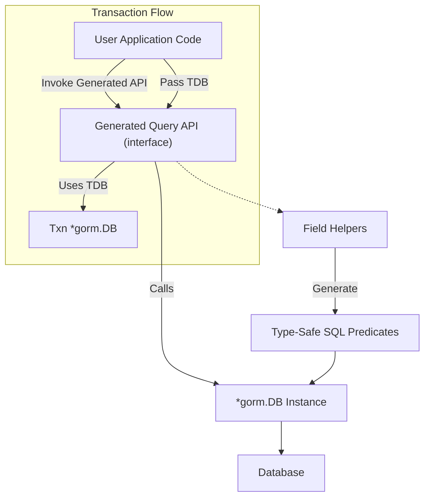

# Integration Patterns with GORM

Explore best practices and advanced integration patterns for incorporating the generated type-safe query APIs and model-driven field helpers into your applications using GORM. This guide explains how to seamlessly blend GORM CLI-generated code with your existing GORM workflows, maximize compatibility, customize behavior, and handle complex scenarios like transactions, contexts, and query composition.

---

## Why Integration Patterns Matter

Using GORM CLI-generated APIs strengthens type safety and code maintainability, but it’s essential to integrate these capabilities thoughtfully to maximize productivity and avoid common pitfalls. This guide focuses on practical patterns that help you:

- Use generated query interfaces and field helpers alongside native GORM APIs
- Customize and extend generated code behavior for real-world applications
- Compose queries fluently while preserving compile-time validation
- Work cleanly with transactions and context propagation

---

## Core Integration Concepts

### 1. Generated APIs as First-Class GORM Extensions

GORM CLI generates interfaces and helpers that integrate tightly with `gorm.io/gorm`’s core API:

- **Query Interfaces:** Generated as generic, type-safe wrappers around `gorm.Interface[T]`, enabling fluent calls like `generated.Query[User](db).GetByID(ctx, 123)`.
- **Field Helpers:** Structured as static instances corresponding to model fields, providing methods like `generated.User.Age.Gt(18)` for building predicates.

These generated components behave as natural extensions of GORM’s `*gorm.DB`, preserving idiomatic workflows.

### 2. Customizing Database Access with Context

Context propagation is implicit but critical for request-scoped operations (timeouts, cancellation, tracing):

- **Auto-Injection:** If you omit `ctx context.Context` in interface method definitions, GORM CLI automatically includes it in generated signatures.
- **Explicit Passing:** You can pass custom contexts to generated methods for controlling transaction scope or cancellation.

Always ensure generated methods are called with an appropriate context, especially within HTTP request handlers or background jobs.

### 3. Composing Queries with Generated Predicates

Field helpers generate predicates that are directly usable with GORM’s `Where`, `Select`, and other clauses. Use them to build expressive, type-safe filters:

```go
users, err := gorm.G[User](db).
  Where(generated.User.Age.Gt(18)).
  Where(generated.User.Status.Eq("active")).
  Find(ctx)
```

Don't mix string SQL directly with generated predicates to maintain type safety and reduce SQL injection risks.

### 4. Transactions and Generated APIs

The generated APIs accept any `*gorm.DB` instance, so you can:

- Use them inside transactions by passing transactional `*gorm.DB` instances:

```go
err := db.Transaction(func(tx *gorm.DB) error {
  userAPI := generated.Query[User](tx)
  u, err := userAPI.GetByID(ctx, 42)
  if err != nil {
    return err
  }
  // ... perform updates
  return nil
})
```

- Compose transactional chains without losing type safety.


---

## Advanced Integration Patterns

### Pattern 1: Layered Query Composition

You can build composable query chains by combining field helper predicates and generated interface methods:

```go
func ActiveAdults(db *gorm.DB, ctx context.Context) ([]User, error) {
  baseQuery := generated.Query[User](db).
    Where(generated.User.Age.Gt(18)).
    Where(generated.User.Status.Eq("active"))

  return baseQuery.FilterByNameAndAge("Alice", 30).Find(ctx)
}
```

This pattern encourages modular, readable query functions while leveraging the type-safe API surface.

### Pattern 2: Using Generated Association Helpers Within Context

Association helpers enable safe relational data manipulation with intuitive semantics:

```go
// Link pets to a user inside a transaction
func AddPets(ctx context.Context, db *gorm.DB, userID uint, pets []Pet) error {
  return db.Transaction(func(tx *gorm.DB) error {
    userAPI := generated.Query[User](tx)
    return userAPI.Where(generated.User.ID.Eq(int(userID))).
      Set(generated.User.Pets.CreateInBatch(pets)).
      Update(ctx)
  })
}
```

This pattern ensures consistent state and rollback capabilities when working with complex object graphs.

### Pattern 3: Selective Generation Configuration for Complex Applications

Adjust generation behavior per package or file using `genconfig.Config` to tailor output to large or modular codebases:

- Use `OutPath` to direct code to specific directories.
- Apply `IncludeInterfaces` / `ExcludeStructs` filters to reduce generation scope.
- Map custom field helpers for special data types.

Example configuration snippet:

```go
var _ = genconfig.Config{
  OutPath: "generated/core",
  IncludeInterfaces: []any{"Query*"},
  FieldTypeMap: map[any]any{
    sql.NullTime{}: field.Time{},
    // custom JSON field mapping
  },
}
```

### Pattern 4: Template DSL for Runtime-Driven Queries

Use SQL templates in interfaces to write safe, dynamic queries with placeholders and conditionals. The generator processes these into concrete, type-safe methods that you call like:

```go
user, err := generated.Query[User](db).
  QueryWith(models.User{Name: "jinzhu"}).
  Find(ctx)
```

This pattern is ideal for complex filtering logic without losing the benefits of compile-time verification.

---

## Practical Tips & Best Practices

- **Context Awareness:** Always propagate `context.Context` through your call stack when using generated methods to avoid leaks or stuck goroutines.
- **Avoid Raw SQL Strings:** Use generated field helpers and query interfaces whenever possible to benefit from compile-time safety.
- **Filter Generation:** Use `genconfig.Config` to fine-tune what interfaces and struct helpers are generated, improving build times and code clarity.
- **Testing:** Write integration tests invoking generated APIs with transactions and contexts to validate expected DB state changes.
- **Debugging:** Trace SQL output by enabling GORM logging; correlate generated method calls to produced SQL.

---

## Common Pitfalls and Troubleshooting

<AccordionGroup title="Common Integration Issues">
<Accordion title="Context Not Passed Correctly">

If you forget to supply `context.Context` when calling generated methods, the generator auto-injects it, but you must pass your operational context.

**Symptom:** Operations hang or do not respect deadlines.

**Solution:** Always pass a valid context, e.g., from your HTTP requests or background jobs.

</Accordion>
<Accordion title="Mixing Raw SQL and Generated APIs">

Adding raw WHERE clauses as strings alongside generated predicates can lead to confusing or unsafe code.

**Symptom:** Type safety warnings or runtime SQL errors.

**Solution:** Prefer combining only generated predicates and interfaces. If raw SQL is necessary, isolate it carefully.

</Accordion>
<Accordion title="Transaction Usage Mistakes">

Passing the wrong `*gorm.DB` instance (outside transaction scope) causes unexpected behavior.

**Symptom:** Changes outside transactions or inconsistent data.

**Solution:** Always pass the transactional DB instance down to the generated API layers.

</Accordion>
<Accordion title="Misconfigured Output Paths or Filters">

Improper `genconfig.Config` settings can cause no code generation or missing helpers.

**Symptom:** Missing generated files or incomplete APIs.

**Solution:** Review your configuration in the target package, validate paths, and filters.

Refer to [Troubleshooting Common Setup Issues](https://gorm.io/cli/gorm/getting-started/validation-and-troubleshooting/troubleshooting-common-issues) for detailed steps.

</Accordion>
</AccordionGroup>

---

## Related Concepts and Documentation

| Section                              | Link                                                                                         |
|------------------------------------|----------------------------------------------------------------------------------------------|
| Basic Quickstart and Usage          | [/guides/core-workflows/quickstart-guide](https://gorm.io/cli/gorm/guides/core-workflows/quickstart-guide)         |
| Working With Field Helpers          | [/guides/core-workflows/working-with-field-helpers](https://gorm.io/cli/gorm/guides/core-workflows/working-with-field-helpers) |
| Managing Associations               | [/guides/core-workflows/associations-guide](https://gorm.io/cli/gorm/guides/core-workflows/associations-guide)               |
| Template DSL for Query Interfaces   | [/guides/advanced-patterns/template-dsl-guide](https://gorm.io/cli/gorm/guides/advanced-patterns/template-dsl-guide)         |
| Customizing Generation Behavior     | [/guides/advanced-patterns/customizing-generation](https://gorm.io/cli/gorm/guides/advanced-patterns/customizing-generation)   |
| Integration and Dependencies Overview | [/overview/product-architecture-overview/integration-and-dependencies](https://gorm.io/cli/gorm/overview/product-architecture-overview/integration-and-dependencies) |

---

### Diagram: Integration Flow of Generated APIs with GORM



This flow shows how user code calls the generated query APIs, optionally passing a transactional `*gorm.DB`, which in turn utilizes field helpers to build safe SQL predicates executed via GORM's core methods.

---

By applying these integration patterns, you harness the full power of GORM CLI-generated code within your GORM projects, leading to safer, easier-to-maintain, and more expressive database operations.

---