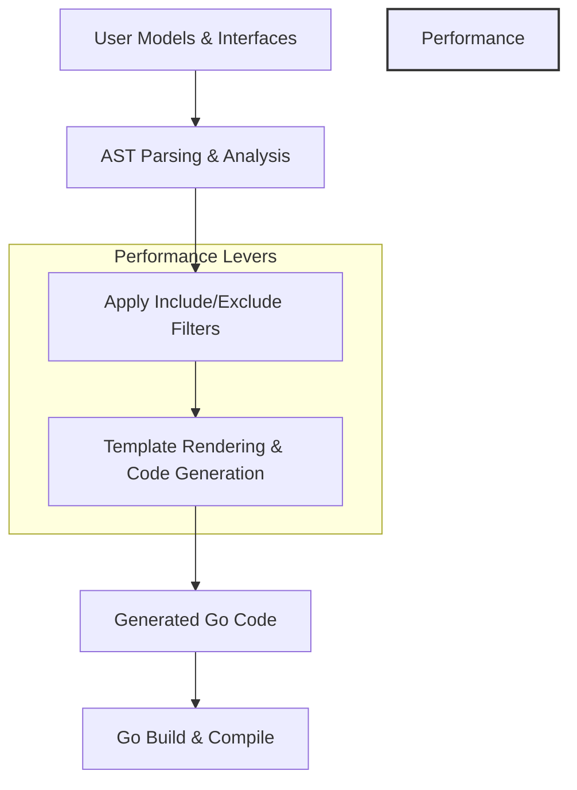

# Scalability and Performance Considerations

Efficient generation of type-safe query APIs and field helpers is paramount when working with large data models and complex query interfaces using GORM CLI. This page explores the design principles and strategic choices that ensure your code generation process remains performant and your codebase manageable as it scales.

---

## Why Scalability Matters in GORM CLI

Many projects start small but grow quickly — more models, more database tables, more complex query requirements. With GORM CLI's approach of generating strongly typed code from your Go interfaces and structs, the amount of generated code can increase substantially with model complexity. Without deliberate design, this growth can slow down build times and clutter your codebase.

This page helps you understand:

- The costs and benefits of using code generation for type safety at scale
- How GORM CLI maintains generation speed even with many models and queries
- Recommended patterns for structuring your projects to keep builds fast
- Best practices to maintain readable, maintainable generated code


## Balancing Type Safety with Generation Costs

Type safety and expressive query APIs come with overhead — the generator must parse and analyze your models and interfaces, rendering Go code customized for each method and field. As your codebase grows, this work expands, affecting:

- **Code Generation Time:** Parsing and template rendering can take longer
- **Build Times:** More generated code means longer compile times
- **Code Size:** Generated code occupies disk space and may impact editor responsiveness

However, the benefits include:

- **Compile-Time Safety:** Bugs caught early during compilation
- **Fluent APIs:** Easy discoverability and use of strongly typed helpers
- **Maintainability:** Standardized patterns reduce human errors

The key is knowing how to manage growth to preserve these benefits without degradation.


## Strategies Employed by GORM CLI for Performance

### 1. Incremental and Selective Generation

GORM CLI supports configurations to control which interfaces and structs are included in code generation:

- **Filtering by Include/Exclude Patterns:**
  - Narrow generation to specific interface or struct sets using shell-style patterns or explicit type names.
  - Useful for large repositories with many unrelated types.

- **Package- or File-Level Output Override:**
  - Customize output folder structure via `genconfig.Config.OutPath` and `FileLevel` settings to segregate code.

This selective approach prevents unnecessary processing, reducing both generation and build time.

### 2. Caching and Reuse of AST Parsing

The generator internally uses Go's AST parsing and visitor patterns efficiently:

- It avoids redundant parsing of files.
- It reuses parsed structures when processing multiple related interfaces or models.

This careful reuse prevents CPU waste during large-scale scans.

### 3. Streamlined Template Rendering

Code generation uses a single, robust Go `text/template` instance with well-structured templates:

- Modular code for methods and structs minimizes duplication in output.
- Imports and package paths are merged to avoid conflicts.

This reduces template execution time and keeps generated files concise.

### 4. Automatic Context Injection and Signature Normalization

To simplify user code and avoid extra boilerplate, GORM CLI:

- Auto-injects `context.Context` parameters if missing.
- Normalizes method signatures and return types.

This consistent output reduces conditional logic in templates, improving maintainability and generation speed.


## Patterns to Keep Your Codebase and Builds Manageable

### Organize by Package or Module

Segment your data models and query interfaces logically into packages where possible. Use the generator's configuration to specify output paths and filter the target interfaces/structs per package.

This containment narrows the scope of each generation run and the size of generated files.

### Use Include and Exclude Filters Wisely

- Define `IncludeInterfaces` and `IncludeStructs` filters to generate only what you need.
- Use wildcard patterns to cover groups, e.g., `Query*` for all query interfaces.
- Exclude deprecated or temporary interfaces to avoid clutter.

### Keep SQL Templates Focused and Reusable

- Limit the size and complexity of SQL templates in your interfaces.
- Extract common SQL snippets or use SQL template directives (`{{where}}`, `{{if}}`) for conditionals rather than duplicating methods.

This helps keep generated method bodies manageable and reduces code bloat.

### Modularize Complex Queries

If you have very large interfaces with many methods, consider splitting them into smaller composable interface subsets.


## Example: Efficient Generation with Config Filters

```go
package nested

import "gorm.io/cli/gorm/genconfig"

// Child config excludes certain interfaces and structs in nested package
var _ = genconfig.Config{
    FileLevel:         false,
    ExcludeInterfaces: []any{"I3"},
    ExcludeStructs:    []any{"S3"},
}
```

Run the generator targeting the root with careful filters to avoid generating unnecessary code.


## Troubleshooting Common Performance Issues

### Slow Generation

- **Cause:** Large packages with many interfaces and structs
- **Solution:** Apply include/exclude filters in `genconfig.Config` to narrow generation.

### Excessive Build Times

- **Cause:** Huge generated code files with many methods
- **Solution:** Break large interfaces into smaller ones; configure `OutPath` to isolate generation per package.

### Generated Code Conflicts or Import Issues

- Check that `FieldTypeMap` and `FieldNameMap` are consistent and do not cause excessive imports.
- Merge imports via config or in code to avoid redundant import declarations.

### Unexpected Interface Exclusion

- Confirm filters do not exclude needed types by mistake.
- Use verbose logging from CLI to understand which files and interfaces are processed.


## Summary Diagram of Generation Workflow Impact on Performance



This flow emphasizes control points where filtering and templating impact overall performance.


## Best Practices Summary

- Leverage `genconfig.Config` for fine-grained include/exclude filtering.
- Structure your codebase into focused packages/modules to scope generation.
- Compose complex SQL with template directives to minimize method explosion.
- Regularly monitor build and generation time; optimize config accordingly.
- Use contextual code organization to keep generated files readable.


## Next Steps

Explore these related documentation pages for deeper mastery:

- [Core Concepts & Terminology](/overview/introduction-and-key-concepts/core-concepts-and-terminology) — Understand foundational elements.
- [Configuration Basics](/getting-started/essential-setup/configuration-basics) — Learn to customize generation behavior.
- [Quickstart: Generate and Use Type-Safe APIs](/guides/core-workflows/quickstart-guide) — Apply code generation workflows.
- [Customizing Generation](/guides/advanced-patterns/customizing-generation) — Fine-tune your generator settings.


<Tip>
When scaling your schema and queries, always start with filtering interfaces and models to the minimal working set. Iteratively expand the scope while measuring generation time and build speed.
</Tip>

---

This guide empowers you to leverage GORM CLI’s type safety and expressive APIs confidently, even as your project grows in size and complexity, ensuring your productivity and code quality remain high.
