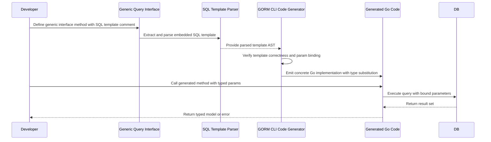

# Type Safety and Query API Design

GORM CLI is engineered to empower Go developers with **fully type-safe, discoverable, and fluent query APIs** generated from generic interfaces and SQL templates. This page demystifies how GORM CLI establishes a strong contract between your interface method signatures, generic type parameters, and embedded SQL templates to deliver seamless compile-time safety across queries, updates, and association operations.

---

## Achieving Compile-Time Safety with Generics and Templates

At the heart of GORM CLI’s safety guarantees is the fusion of Go 1.18+ generics with interface-driven SQL templates. Developers define generic interface methods parameterized with model types that represent SQL operations, then annotate these methods with embedded SQL templates. GORM CLI parses, validates, and generates concrete implementations that enforce:

- The result types exactly match the generic type parameter (e.g., `T any` in `Query[T any]`).
- SQL parameters correspond strictly to method parameters by name and type.
- Output is strongly typed to model structs or slices thereof, eliminating runtime assertion errors.

This contract ensures your application gains **compiler-checked correctness** instead of the typical runtime uncertainties of raw SQL or string-based query builders.

### Example Interface Defining a Type-Safe Query API

```go
// Query defines the interface for querying User entities with type safety.
type Query[T any] interface {
  // SELECT * FROM @@table WHERE id=@id AND name = "@name"
  GetByID(id int) (T, error)

  // SELECT * FROM @@table WHERE @@column=@value
  FilterWithColumn(column string, value string) (T, error)

  // SELECT * FROM users
  //   {{if user.ID > 0}}
  //       WHERE id=@user.ID
  //   {{else if user.Name != ""}}
  //       WHERE name=@user.Name
  //   {{end}}
  QueryWith(user models.User) (T, error)

  // UPDATE @@table
  //  {{set}}
  //    {{if user.Name != ""}} name=@user.Name, {{end}}
  //    {{if user.Age > 0}} age=@user.Age, {{end}}
  //    {{if user.Age >= 18}} is_adult=1 {{else}} is_adult=0 {{end}}
  //  {{end}}
  // WHERE id=@id
  UpdateInfo(user models.User, id int) error

  // SELECT * FROM @@table
  // {{where}}
  //   {{for _, user := range users}}
  //     {{if user.Name != "" && user.Age > 0}}
  //       (name = @user.Name AND age=@user.Age AND role LIKE concat("%",@user.Role,"%")) OR
  //     {{end}}
  //   {{end}}
  // {{end}}
  Filter(users []models.User) ([]T, error)

  // where("name=@name AND age=@age")
  FilterByNameAndAge(name string, age int)

  // SELECT * FROM @@table
  //  {{where}}
  //    {{if !start.IsZero()}}
  //      created_at > @start
  //    {{end}}
  //    {{if !end.IsZero()}}
  //      AND created_at < @end
  //    {{end}}
  //  {{end}}
  FilterWithTime(start, end time.Time) ([]T, error)
}
```

This interface exemplifies the core ideas:

- `T any` provides compile-time binding to the model type (e.g., `User`).
- Embedded SQL templates leverage directives like `@@table` for table names and `@param` binding.
- Conditional clauses (`{{if}}`, `{{for}}`) enable dynamic SQL generation.
- Generated code strictly respects these contracts, producing type-safe, context-aware query methods.

---

## How SQL Templates and Method Signatures Work Together

### 1. **Interface Method Parameters**

Method parameters map directly as input to the SQL templates, with named `@param` placeholders binding safely. For example, `GetByID(id int)` uses the `id` parameter in the SQL comment as `@id`.

### 2. **Generic Type Parameters**

Each interface is declared with a generic type `T any`, tying the method return types to your model structs. This avoids the need for manual casting or unsafe conversions.

### 3. **SQL Template Placeholders and DSL**

The SQL templates support a rich DSL to dynamically construct safe SQL with inputs:

- `@@table` expands to the model’s SQL table name at generation.
- `@@column` dynamically resolves to a column name.
- `@param` binds method parameters with type and name checks.
- Conditionals (`{{if}} ... {{end}}`), loops (`{{for}} ... {{end}}`), and set/where clauses (`{{set}}`, `{{where}}`) are parsed and translated into boilerplate Go code.

These templates are not runtime string operations. They compile into Go code ensuring parameter presence and type correctness.

---

## Usability Benefits: Fluent, Self-Documenting APIs

Generated query APIs reflect your interface and SQL definitions:

- Method signatures are *discoverable* and *autocompleted* in IDEs.
- Developers benefit from parameter and return type inference.
- Errors of missing or mismatched SQL parameters are caught at compile time.
- Examples:

```go
// Fetch a user by ID; guaranteed to return a typed User struct or error.
u, err := generated.Query[models.User](db).GetByID(ctx, 123)

// Filter for a user with a dynamic column condition.
u, err = generated.Query[models.User](db).FilterWithColumn(ctx, "role", "special")

// Update user info with type-safe input, error checked at compile time.
err = generated.Query[models.User](db).UpdateInfo(ctx, models.User{Name: "alice", Age: 20}, 1)
```

Each call involves no unsafe casting or stringly typed errors, dramatically reducing runtime bugs.

---

## Underlying Safety Mechanisms

- **Parameter Binding Checks:** Method parameters must have corresponding placeholders in the SQL template; otherwise, the generator emits errors.
- **Result Types Bound by Generic Type:** Return values strictly adhere to `T` (struct or slice `[]T`), preventing misinterpretation.
- **Context Injection:** If a method’s signature lacks `context.Context`, the generator adds it automatically for consistent cancellation and deadlines.
- **Static Validation of Template Syntax:** The SQL template DSL is parsed and validated for correctness before generation.

---

## Workflow Summary

1. **Write Interface with SQL Template Comments**
2. **Define Model Structs with GORM Annotations**
3. **Run GORM CLI Generator (`gorm gen`)**
4. **Use Generated APIs in Your Application**

Each generation cycle produces:
- Go source files implementing your interfaces with validated SQL
- Helper types to safely build queries against your models

---

## Practical Tips and Best Practices

- Always **name interface method parameters clearly** and use matching `@name` placeholders.
- Use the **generic `T any`** pattern for maximum safety and reuse.
- Prefer **concrete models** for type parameters to maximize fluent API benefits.
- Use the **template DSL conditionals** to create flexible queries without losing safety.
- Avoid raw SQL strings in application code — move all queries to interfaces for clarity.

---

## Common Pitfalls and Troubleshooting

<AccordionGroup title="Common Type Safety and Query API Issues">
<Accordion title="Mismatch Between Method Parameters and SQL Placeholders">
Ensure every parameter declared in your interface method signature has a corresponding `@param` placeholder in the SQL comment. The generator validates this and will fail if you omit parameters or misspell placeholders.
</Accordion>
<Accordion title="Invalid or Unsupported Template DSL Syntax">
Check your embedded SQL templating syntax using `{{if}}`, `{{for}}`, `{{set}}`, and other directives carefully. Errors in these template directives will prevent generation.
</Accordion>
<Accordion title="Generic Type Parameter Not Matching Model">
All interfaces using generics must consistently bind `T` to your model struct when invoking generated query methods, e.g., `Query[User]`. Using incompatible types will produce compile-time type errors.
</Accordion>
<Accordion title="Implicit Context Injection Not Needed">
You don’t need to declare `ctx context.Context` in interface methods; GORM CLI adds it automatically. Adding it manually or forgetting it will not break the generation, but be consistent for clarity.
</Accordion>
</AccordionGroup>

---

## Visualizing the Contract



This flow captures the safety guarantees from design to usage.

---

### Related Concepts and Next Steps

- See [Working with Field Helpers](/guides/core-workflows/working-with-field-helpers) to understand generated predicates and updates.
- Explore [Template-Based Queries](/guides/advanced-patterns/template-dsl-guide) to master the SQL template DSL syntax.
- Learn about [Managing Associations](/guides/core-workflows/associations-guide) for safe relational updates.

---

This foundation empowers you to write **robust, maintainable, and expressive database code** in Go with confidence and precision.

---