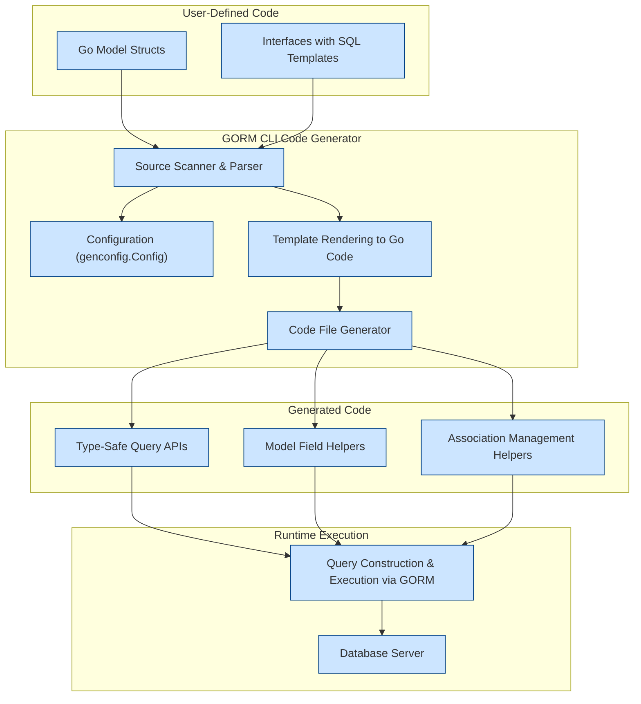

# Performance Characteristics of Generated Code

GORM CLI generates highly efficient, type-safe Go code designed for building database queries, managing ORM interactions, and ensuring compile-time correctness. This guide explores how the generated artifacts perform during runtime and compilation, identifies potential bottlenecks, and explains how the use of templates impacts overall efficiency.

---

## Overview of Generated Code Efficiency

At its core, the generated code provides a fluent and intuitive API for querying and manipulating database records via GORM. This code is:

- **Compile-time type-checked**: Preventing many common runtime errors
- **Lightweight**: Leveraging Go’s static typing and generics
- **Optimized for common use cases**: Designed to minimize overhead during typical query construction

### How Generated Code Works at Runtime

- **SQL generation**: Each query method composes SQL statements based on embedded templates that use conditional logic.
- **Parameter binding**: Dynamic parameters in queries are safely bound using GORM’s clause builders, avoiding SQL injection and promoting prepared statement efficiency.
- **Fluent chaining**: Enables composing complex filters and associations without costly reflection or interface{}-based operations.
- **Association helpers**: Provide additional compile-time safety for managing related records with minimal runtime overhead.


## Template Usage and Its Impact

The generator translates SQL templates from interface method comments into Go code that builds SQL strings and parameters efficiently. The templates use progressive disclosure constructs (`{{if}}`, `{{for}}`, `{{where}}`, `{{set}}`) embedded in Go code, resulting in:

- **Minimal string concatenation overhead**: Conditions in templates ensure generated code builds only required SQL fragments.
- **Pre-allocated slices for SQL parameters**: Reduces dynamic reallocation during runtime.
- **Efficient conditional logic**: Generated Go code closely mirrors the declared SQL structure but uses Go control-flow natively.

### Example: Generated Method Snippet

For the SQL template:

```sql
SELECT * FROM @@table WHERE id=@id AND name = "\@name"
```

The generated code uses a strings.Builder and parameter slices to build the query safely and efficiently.

---

## Runtime Performance Considerations

While the generated code is performant, users should be aware of potential bottlenecks:

### 1. Large Dynamic Conditions

When SQL templates contain loops or multiple `{{if}}` blocks over large slices (e.g., filtering many users), the generated code builds a long WHERE clause with repeated OR conditions. This can cause:

- Increased string building time
- Larger memory use for parameter slices

**Best Practice:** Limit the size of slices used in such dynamic conditions or refactor queries to use joins or subqueries when dealing with many elements.

### 2. Frequent Use of Complex Association Helpers

Association helpers generate additional SQL for related data management:

- Operations like batch insertions or complex unlink/delete with filters involve multiple SQL commands
- These helpers rely on efficient GORM interaction but can amplify database load if used unwisely

**Tip:** Batch association operations where possible and use filtering carefully to avoid unintended wide-ranging effects.

### 3. Reflection in GORM Itself

Although generated code minimizes reflection, GORM’s runtime internally uses reflection to some extent, especially when scanning results or managing hooks.

**Mitigation:** Keep models simple and avoid complex embedded types where possible.

---

## Compilation Characteristics

The generated code is fully typed and strongly typed, leveraging Go generics when applicable. This results in:

- **Fast compilation times** relative to handwritten reflection-heavy alternatives
- **Predictable code navigation** allowing IDEs and tools to optimize developer productivity

Because of the structure:

- Template processing increases initial generation time but not compilation
- Generated code files are standalone and do not include runtime reflection wrappers


---

## Practical Tips and Best Practices for Performance

- **Use Config to Control Generated Output**: Customize generation with `genconfig.Config` to exclude unnecessary interfaces or structs, reducing code size and compile time.
- **Avoid Overloading Templates**: Keep SQL templates clean; avoid extremely complex inline conditionals or large loop constructs.
- **Leverage Field Helpers and Associations Wisely**: They add expressiveness but can introduce database-layer complexity; test queries for database execution cost.
- **Batch Operations**: Use provided batch create/link helpers to minimize roundtrips.
- **Validate Generated Code Early**: Use tools such as `go vet` and `go test` against generated code before integrating.


## Troubleshooting Performance Issues

<AccordionGroup title="Common Performance Concerns and Solutions">
<Accordion title="Query Construction Slowdowns">
**Symptom:** Long delays during query construction or high memory usage.

**Cause:** Excessive use of dynamic loops or large input slices in templated `{{for}}` or `{{if}}`.

**Solution:** Limit the input size, use indexed columns instead, or perform client-side pre-filtering.
</Accordion>
<Accordion title="Database Load and Latency Spikes">
**Symptom:** Increasing latency or load at the database during association operations.

**Cause:** Unoptimized batch or repeated association management operations.

**Solution:** Use batch helpers like `CreateInBatch`, and apply filtering to association operations precisely.
</Accordion>
<Accordion title="Compilation Time Bottlenecks">
**Symptom:** Slower build times after code generation.

**Cause:** Large generated files or generating code for many included interfaces and structs.

**Solution:** Refine `IncludeInterfaces` and `IncludeStructs` in configuration to generate only what’s necessary.
</Accordion>
</AccordionGroup>

---

## Summary Diagram: Generation to Runtime Flow



---

## References & Further Reading

- [Code Generation Workflow](https://github.com/go-gorm/cli/tree/main/docs/concepts/architecture-overview/generation-workflow)
- [Using the Generated Code](https://github.com/go-gorm/cli/tree/main/docs/guides/core-workflows/using-generated-code)
- [Configuration Guide](https://github.com/go-gorm/cli/tree/main/docs/concepts/data-and-model-concepts/configuration)
- [Working with Associations](https://github.com/go-gorm/cli/tree/main/docs/concepts/data-and-model-concepts/associations)

---

## Final Notes

The GORM CLI-generated code focuses on balancing expressiveness, correctness, and runtime efficiency. While the generator produces code optimized for typical workloads, being mindful of input size and query complexity ensures your applications remain performant both in development and production.

Embrace the template DSL and field helpers to write clean, safe, and efficient data access layers without compromising performance.