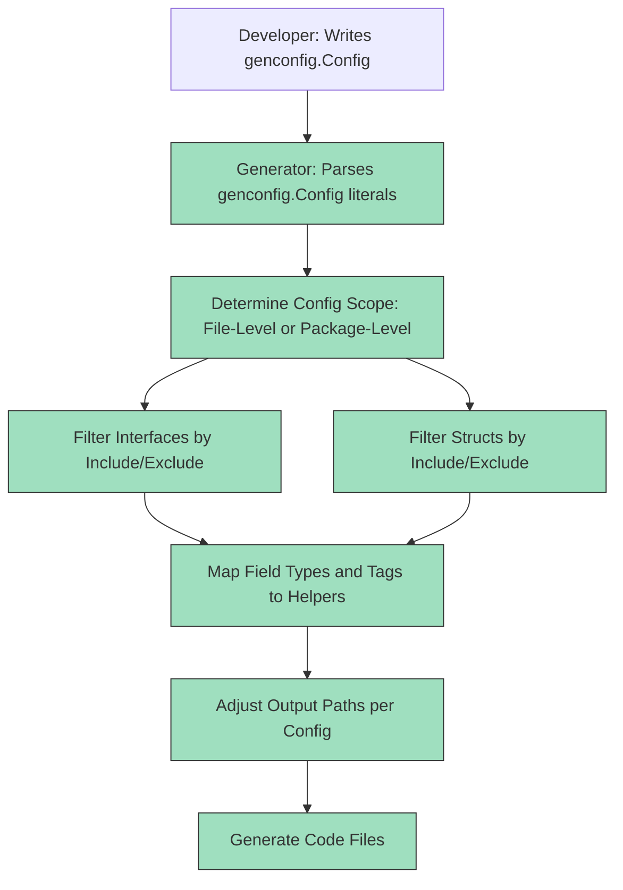

# Configurable Generation & Extensibility

Discover how GORM CLI empowers you to customize your code generation process flexibly and precisely through the `genconfig.Config` struct. This configuration interface lets you tailor output directories, selectively include or exclude interfaces and structs from generation, and extend the system with custom field helper mappings for special cases like JSON columns or custom tagging.

---

## Understanding genconfig.Config

At the heart of generation customization lies the `genconfig.Config`. It is a package-level struct configuration you declare in your Go source files, which the GORM CLI generator automatically detects and applies at generation time.

This config enables you to:

- Override the output directory for generated files within a package
- Include or exclude specific interfaces or structs by name or type pattern
- Map Go field types and custom struct tags to custom field helpers
- Control whether the configuration is applied at the file or package level


## How Configurable Generation Works: User Workflow

Imagine you have a large project with many interfaces and structs, but you only want to generate code for some of them — or you want different output locations per package. You also have some non-standard fields, like JSON columns, which need special handling.

Your typical workflow looks like this:

1. **Declare a genconfig.Config literal in your package**

   Place a package-level variable with type `genconfig.Config` anywhere in the source files where generation should be affected.

   ```go
   package examples

   import (
    	"database/sql"
    	"gorm.io/cli/gorm/genconfig"
    	"gorm.io/cli/gorm/field"
   )

   var _ = genconfig.Config{
    	OutPath: "examples/output",

    	FieldTypeMap: map[any]any{
    		sql.NullTime{}: field.Time{},
    	},

    	FieldNameMap: map[string]any{
    		"date": field.Time{},
    		"json": JSON{},
    	},

    	FileLevel: false, // Applies to whole package

    	IncludeInterfaces: []any{"Query*"},
    	ExcludeInterfaces: []any{"*Deprecated*"},

    	IncludeStructs: []any{"User", "Account*"},
    	ExcludeStructs: []any{"*DTO"},
   }
   ```

2. **Use filters to scope generation**

   - **Interface and Struct Filtering:** The config supports shell-style pattern matching or direct type literals to include or exclude specific interfaces and structs.
   - **Whitelist takes priority:** When `Include*` slices have values, only those matching are generated; `Exclude*` is ignored.
   - Filters support both name strings (with wildcards) and literal Go type expressions for precision.

3. **Customize field helper mappings**

   - You can tell the generator to treat a Go type (e.g., `sql.NullTime{}`) as a specific field helper (e.g., `field.Time{}`) via `FieldTypeMap`.
   - You can override by tag name via `FieldNameMap`, which takes precedence over type mappings.

4. **Control config scope**

   - The `FileLevel` boolean determines whether the config applies only to the declaring source file (`true`) or to the whole package subtree (`false`). This is useful for precise modular control.

5. **Run the generator normally**

   The CLI command or programmatic generator execution will automatically pick up all declared `genconfig.Config` literals to apply filtering, output path changes, and helper mappings.

6. **Inspect the output**

   Generated files will be placed accordingly, and only configured interfaces and structs will appear. Fields mapped with custom helpers (like for JSON) will gain field helper types with their associated special behaviors.

---

## Selective Generation: Inclusion and Exclusion Filters

### Filtering Interfaces and Structs

You control exactly which interfaces and structs appear in the generated code via the following config fields:

- `IncludeInterfaces []any`
- `ExcludeInterfaces []any`
- `IncludeStructs []any`
- `ExcludeStructs []any`

#### How They Work

- If `Include*` lists are non-empty, ***only*** those matching interfaces or structs are processed.
- If `Include*` is empty, then `Exclude*` is applied to remove matches from the full set.

#### Matching Rules

- Strings use shell-style wildcard patterns, e.g., `"Query*"`, "Account*", or "*Deprecated*".
- You can also specify Go type literals or converted values for more precision, e.g. `models.Query(nil)`, `models.User{}`.

#### Use Case Example

```go
var _ = genconfig.Config{
	IncludeInterfaces: []any{"I1", "Query*"},
	ExcludeInterfaces: []any{"*Deprecated*"},
	IncludeStructs:    []any{"User", models.Account{}},
	ExcludeStructs:    []any{"*DTO"},
}
```

This configuration generates code only for interfaces starting with "I1" or "Query" (excluding deprecated ones) and structs exactly named "User" or the full type `models.Account`.


### Output Control: Custom Output Paths

By default, generated code files go to a CLI-supplied `-o` output directory.

Use `OutPath` in your `genconfig.Config` to overwrite this output path for all files in the package/subtree where the config is declared. This lets you:

- Split generated code into logical directories per package
- Align generation outputs with monorepo, module, or layered project structures

#### Example

```go
var _ = genconfig.Config{
    OutPath: "examples/generated/output",
}
```

After generation, all files within this package will appear under `examples/generated/output` instead of the CLI default.


## Extending Field Helpers: Mapping Types and Tags

### FieldTypeMap: Map Go Types to Your Field Helpers

If some Go struct fields use types that need special handling, map them from raw Go types to your custom or existing field helpers.

**Example:** Mapping `sql.NullTime` to the built-in `field.Time` helper.

```go
FieldTypeMap: map[any]any{
	sql.NullTime{}: field.Time{},
},
```

This instructs the generator to replace all fields with Go type `sql.NullTime` with the field helper wrapper `field.Time`.


### FieldNameMap: Map Custom `gen` Tags to Helpers

When a field struct tag specifies a key-value like `gen:"json"`, you can map that name to a field helper.

**Example:** Map any struct field tagged as `gen:"json"` to your custom `JSON` helper type.

```go
FieldNameMap: map[string]any{
	"json": JSON{},
},
```

In your models:

```go
// models/user.go

// Profile is stored as JSON with special SQL generation
Profile string `gen:"json"`
```

This overrides the default generation for this field, injecting your JSON-specific field helper.

### Defining a Custom JSON Field Helper

```go
type JSON struct{ column clause.Column }

func (j JSON) WithColumn(name string) JSON {
	c := j.column
	c.Name = name
	return JSON{column: c}
}

func (j JSON) Equal(path string, value any) clause.Expression {
	return jsonEqualExpr{col: j.column, path: path, val: value}
}

// jsonEqualExpr builds dialect-specific JSON comparison expressions
// with build logic for MySQL, SQLite, and Postgres
```

Use this helper in generated code to produce database-specific JSON query SQL.


## File-Level vs. Package-Level Configuration

The boolean field `FileLevel` in the config dictates the scope of its application:

- `FileLevel: false` (default): Config applies to all files in the same package or directory subtree. Use for broad package-wide generation rules.
- `FileLevel: true`: Config applies only to the declaring file. Use this for granular, per-file overrides.

This enables multi-level configuration when combining general package rules with precise exceptions.

## Practical Example: Fine-Tuning Generation

```go
package examples

import (
	"gorm.io/cli/gorm/genconfig"
	"database/sql"
	"gorm.io/cli/gorm/field"
)

var _ = genconfig.Config{
	OutPath: "examples/generated",

	FieldTypeMap: map[any]any{
		sql.NullTime{}: field.Time{},
	},

	FieldNameMap: map[string]any{
		"json": JSON{},
	},

	IncludeInterfaces: []any{"Query*", CustomQuery(nil)},
	ExcludeInterfaces: []any{"*Deprecated*"},

	IncludeStructs: []any{"User", models.Account{}},
	ExcludeStructs: []any{"*DTO"},

	FileLevel: false,
}
```

## Common Pitfalls and Best Practices

- **Always use typed instances (`Type{}` or `nil` conversion) in filters**: This enables the generator to infer import paths and handle field helper mapping correctly.

- **FieldNameMap takes precedence over FieldTypeMap**: Use `gen` tags for the most specific field helper override.

- **Verify your include/exclude patterns carefully**: It’s easy to accidentally exclude needed types or include unwanted ones.

- **Use FileLevel selectively**: Prefer package-level configs (`FileLevel: false`) for project-wide consistency, and file-level only for edge cases.

- **Custom helpers require proper implementation**: Define all methods for your custom helpers to work seamlessly with GORM.

- **Check relative output paths**: Be sure your `OutPath` fits your repository layout to avoid generation scatter.


## Troubleshooting Configurations

<AccordionGroup title="Common Configuration Issues & Solutions">
<Accordion title="Why am I not seeing code for my interfaces or structs?">
Check your `IncludeInterfaces` and `IncludeStructs` filters — if these are non-empty, only matching items are generated. Adjust patterns or clear the lists to include more.
</Accordion>
<Accordion title="Custom field types are not mapping as expected">
Ensure your `FieldTypeMap` or `FieldNameMap` uses correctly typed zero values (e.g., `sql.NullTime{}`) and that field tags correctly match your `FieldNameMap` keys. Also verify your custom helper is properly defined with required methods.
</Accordion>
<Accordion title="Output files are generated in unexpected locations">
Confirm your `OutPath` is set relative to the generator invocation directory. When using multiple configs, the nearest `OutPath` config with highest precedence decides the output location.
</Accordion>
<Accordion title="Config does not apply at all to some files">
Check your `FileLevel` setting and ensure configs are placed in package source files scanned during generation. File-level config only applies to the exact file where declared.
</Accordion>
</AccordionGroup>

---

## Summary Diagram: Configurable Generation Workflow



---

## Further Reading and Related Topics

- [Configuring Code Generation via genconfig](https://gorm.io/docs/cli.html#Configuring-Code-Generation) — Practical guide to using `genconfig.Config`.
- [Working with Associations Patterns and Pitfalls](/guides/real-world-patterns/advanced-associations) — Understand filtering related to models and associations.
- [Model-driven Field Helpers Design](/concepts/arch-core-patterns/field-helper-design) — Deep dive into how field helpers work.
- [JSON and Custom Fields](/guides/real-world-patterns/json-and-custom-fields) — Learn how to extend field helpers for JSON.
- [Template DSL & Dynamic SQL](/concepts/data-models-behaviors/template-dsl-concepts) — For writing expressive query interfaces.


---

Continue your mastery by exploring how the generator leverages configs in filtering and type mappings to optimize your code output and accommodate special cases, unlocking powerful extensibility in GORM CLI’s generation process.