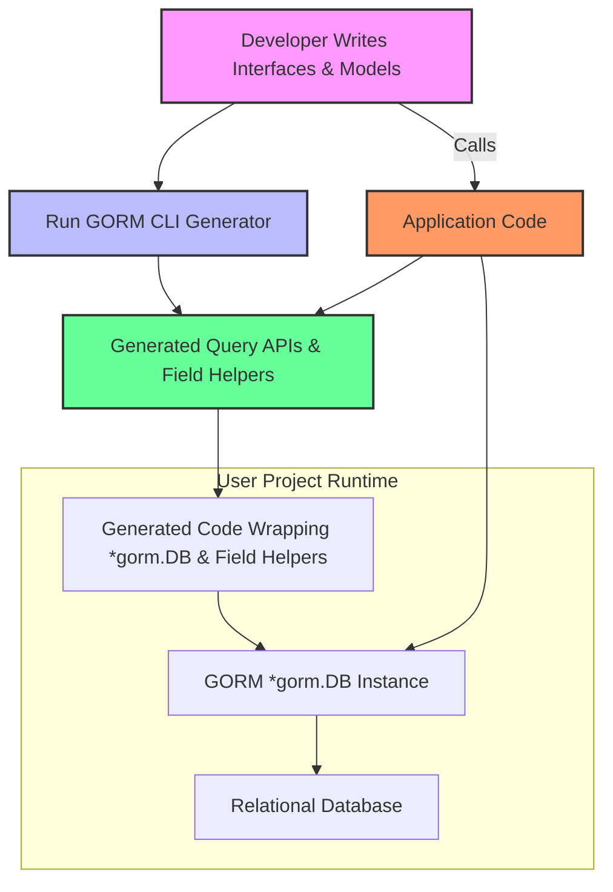

# Seamless Integration with GORM

Discover how the GORM CLI-generated APIs integrate deeply and natively within your existing GORM workflows, patterns, and context management strategies. This guide explains how you can incrementally adopt GORM CLI generated code alongside your current GORM usage, maintaining maximum compatibility and unlocking type-safe query APIs and model-driven helpers without disrupting the flow you already know.

---

## Why Seamless Integration Matters

As a developer using GORM, you rely on idiomatic patterns and the familiar `*gorm.DB` object to build queries, manage associations, and execute database operations. The GORM CLI enhances this experience by generating strongly-typed query interfaces and model field helpers that fit naturally into these workflows.

You don’t have to replace your existing GORM code—you augment it. Generated code uses the same foundational `*gorm.DB` as its backing store, lets you apply existing `clause.Expression`s, and returns results using the same idioms and `context.Context` integration you expect.

> This design allows your team to adopt GORM CLI in stages—gradually migrating to typed APIs while preserving your current ecosystem and tooling.

---

## Core Integration Concepts

### Generated APIs Wrap `*gorm.DB`

The core principle of integration lies in the way generated APIs represent queries. Each generated interface method operates on and returns a `gorm.Interface[T]` implementation that is a thin wrapper around a `*gorm.DB` instance:

```go
func {{.Name}}[T any](db *gorm.DB, opts ...clause.Expression) {{$IfaceName}}Interface[T] {
  return {{$IfaceName}}Impl[T]{
    Interface: gorm.G[T](db, opts...),
  }
}
```

This means you can seamlessly start with a raw `*gorm.DB` (your usual GORM entry point) and transition into using generated query methods without switching contexts or adapters.

### Full Compatibility with GORM Patterns

- **Where Clauses & Predicates:** You can apply your familiar predicate expressions as usual alongside generated field helpers:

  ```go
  db = db.Where(generated.User.Name.Eq("alice"))
  users, err := generated.Query[User](db).FilterByNameAndAge(ctx, "alice", 30)
  ```

- **Context Passing:** Generated methods inject `context.Context` automatically if omitted, and accept it explicitly, maintaining idiomatic Go concurrency and cancellation patterns.

- **Chainability:** Generated interfaces return themselves or related interfaces, supporting fluent chaining of filters and query builders consistent with GORM’s chainable methods.

- **Association Helpers:** Generated model-driven field helpers expose association operations (`Create`, `Update`, `Unlink`, `Delete`, `CreateInBatch`) that invoke standard GORM semantics under the hood, preserving foreign key and join table logic.

### Incremental Adoption

You can mix and match calls to raw `*gorm.DB`, generated query APIs, and model-driven field helpers without conflict:

1. Use your existing raw `*gorm.DB` for simple queries.
2. Gradually introduce generated query interfaces for complex, type-safe SQL operations.
3. Adopt model-generated field helpers for filters, updates, and associations when ready.

This layered approach means no wholesale refactoring is necessary.

### Example Flow: Using Generated Query APIs with GORM

```go
// Start with your existing GORM DB
db := gorm.Open(...)

// Generate and use your query interface
query := generated.Query[models.User](db)

// Use generated typed methods with context
user, err := query.GetByID(ctx, 123)

// Apply additional GORM where clause via generated fields
users, err := query.FilterByNameAndAge(ctx, "jinzhu", 25)

// Use field helpers with expressions for granular filters/updates
gorm.G[models.User](db).
  Where(generated.User.Age.Gt(18)).
  Set(generated.User.Role.Set("active")).
  Update(ctx)
```

In this scenario, you smoothly combine raw `*gorm.DB` with generated methods, leveraging type safety and fluent API calls.

---

## Understanding GORM CLI Code Structure in Integration

The GORM CLI generates code consisting of two primary pieces which work together to deepen GORM integration:

### 1. Query Interface Implementations from Go Interfaces

- These are type-safe bindings generated from user-defined Go interfaces with embedded SQL templates.
- Methods return strongly typed structs that embed or wrap a `gorm.Interface[T]` — itself a generic interface built on top of `*gorm.DB`.
- The generated implementations use GORM’s fluent API (`Where`, `Select`, `Raw`) internally while exposing strong typing and efficient, compile-time checked signatures.

### 2. Model-Driven Field Helpers

- Generated from your existing Go model structs, these provide strongly typed field predicates (`Eq`, `Gt`, `Like`, etc.), setters (`Set`), and association operations (`Create`, `Unlink`, `Delete`).
- They conform to and extend GORM’s `clause.Expression` interface, meaning they plug directly into `*gorm.DB` query chains transparently.

### Code Snippet Example

In the generated code, you see helpers like this:

```go
var User = struct {
  Name field.String
  Age  field.Number[int]
  Pets field.Slice[models.Pet]
}{
  Name: field.String{}.WithColumn("name"),
  Age:  field.Number[int]{}.WithColumn("age"),
  Pets: field.Slice[models.Pet]{}.WithName("Pets"),
}
```

These helpers are drop-in for use in `Where`, `Set`, or association methods.

---

## Best Practices for Integration

- **Start Small:** Begin integrating generated query interfaces only where type-safety or complex templated SQL is beneficial.
- **Use Field Helpers for Safety:** Employ model-driven helpers for filter and update predicates to reduce typos and runtime SQL errors.
- **Leverage Existing DB Contexts:** Pass your existing `*gorm.DB` instance or context-aware variants into generated constructors; no special wrapping is needed.
- **Adopt Incrementally:** Keep using vanilla GORM alongside generated code; they are designed to work together seamlessly.
- **Configure Thoughtfully:** Utilize `genconfig.Config` to customize output paths, filtering of generated interfaces or structs, and field type mappings to align generated code with your domain.

---

## Common Pitfalls and Troubleshooting Tips

<AccordionGroup title="Integration Challenges and How to Address Them">
<Accordion title="Mismatch Between Generated Code and Your GORM Version">
Ensure your GORM library version is compatible with the generated code. The GORM CLI and generated code expect `gorm.io/gorm` structures from v1.24+ that support generics and `clause.Expression` interfaces.
</Accordion>
<Accordion title="Context Passing Errors">
Generated methods auto-add `context.Context` parameters if missing in interfaces, but explicit context management is recommended. Always pass `context.Context` to avoid unexpected behavior in queries and cancellations.
</Accordion>
<Accordion title="Missing Association Synchronization">
When manipulating associations via generated helpers, ensure you correctly chain operations within `Set(...).Create(ctx)` or `Set(...).Update(ctx)`. Forgetting these chains might result in missing or inconsistent association states.
</Accordion>
<Accordion title="Confusing Output Directory Structure">
Use the `-o` flag and configure `genconfig.Config.OutPath` carefully to maintain a clear and manageable project structure when integrating generated code.
</Accordion>
</AccordionGroup>

---

## Visualizing Integration Flow



This diagram shows how the developer’s interface and model definitions flow through the CLI to generate code that, at runtime, enhances calls into the existing GORM core and underlying database.

---

## Summary

By leveraging the GORM CLI’s generated APIs, you gain type-safe, fluent query interfaces and model-driven helpers that fit naturally and seamlessly into existing GORM patterns. The generated code wraps and extends the familiar `*gorm.DB`, respects context propagation, supports association management, and enables incremental adoption without disruption.

Focus on gradual integration, use field helpers as a safety net for your queries, and configure generation to fit your codebase. This enables a productive, scalable, and future-proof enhancement of your data access layer in Go projects using GORM.

---

## Additional Resources

- [Model-Driven Field Helpers Concepts Guide](/concepts/arch-core-patterns/field-helper-design)
- [Building Query APIs from Interfaces](/guides/core-workflows/query-api-guide)
- [Working with Associations: Patterns and Pitfalls](/guides/real-world-patterns/advanced-associations)
- [Template DSL & Dynamic SQL](/concepts/data-models-behaviors/template-dsl-concepts)
- [Configuring Code Generation](/guides/real-world-patterns/configuring-generation)
- [Getting Started: Generate Your First API](/guides/core-workflows/getting-started)

---

## How to Get Started

1. Write your Go model structs as usual.
2. Define Go interfaces with SQL templates for your queries.
3. Run `gorm gen -i ./yourpkg -o ./generated` to create generated query and helper code.
4. Inject your existing `*gorm.DB` into the generated API constructors.
5. Use generated query methods and model field helpers alongside raw GORM methods.
6. Gradually refactor and expand usage based on needs and complexity.

---

Unlock the full power of GORM CLI-generated code by embracing seamless integration, maximizing compatibility with GORM, and boosting developer productivity with strong typing and fluent, safe query patterns.
