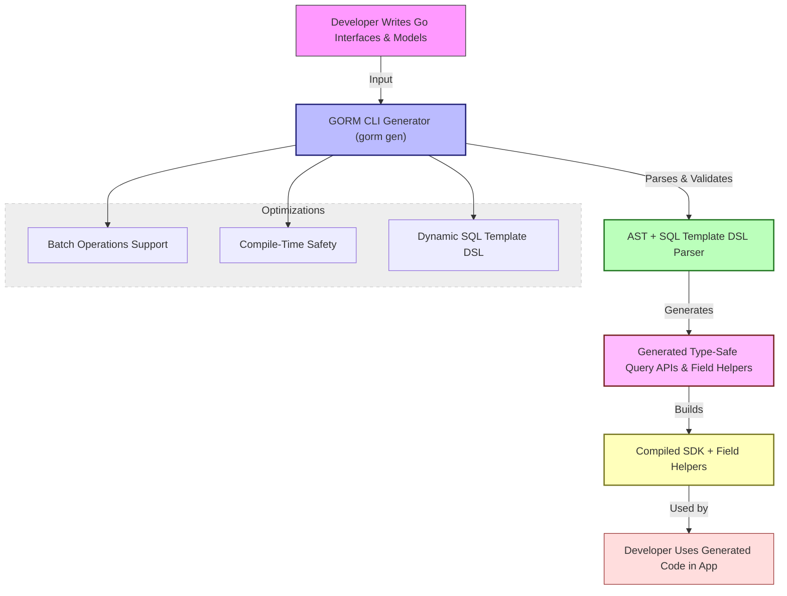

# Scalability & Performance Considerations

This guide dives into how GORM CLI supports scalability and performance through compile-time safety, efficient code generation, and strategies for handling large models and batch operations. Understanding these characteristics will help you leverage GORM CLI to produce robust, maintainable, and performant database query code.

---

## Compile-Time Checked APIs: Avoiding Runtime Panics

One of GORM CLI’s core strengths is its ability to generate type-safe query APIs from Go interfaces with embedded SQL templates. This approach ensures that most errors — including method signatures, SQL placeholders, and type mismatches — are caught at compile time rather than causing unexpected runtime panics. 

### How Compile-Time Safety Works

- **Interface-Driven Generation:** You define Go interfaces with method signatures that include SQL templates in comments. The generator parses these interfaces and verifies parameter and return types.
- **Strongly Typed Method Implementations:** Generated code strictly enforces parameter types, return types, and error handling.
- **Context Injection:** If methods omit `context.Context`, the generator injects it automatically, ensuring consistent and safe database context handling.

### User Impact

This compile-time enforcement brings confidence to developers by eliminating a large class of runtime errors, streamlining debugging, and improving productivity.

<Tip>
Write clear, complete interface methods with accurate Go types to maximize compile-time safety benefits and avoid generation failures.
</Tip>

---

## Impact of Generated Code on Build and Runtime Size

Generating code introduces additional source files in your project, with implications for build times and application binary size.

### Key Characteristics

- **Source Code Volume:** Generated files include implementations of all your query interface methods and model-driven field helpers.
- **Modular Output Per Package:** Generation respects package boundaries and output paths, organizing files to minimize recompilation where possible.
- **Import Management:** The generator deduplicates and merges imports, producing clean and minimal source to reduce unnecessary dependencies.
- **Build System Compatibility:** Generated code complies with standard Go tooling (`go build`, `go test`, etc.), making integration seamless.

### Managing Build Impact

- Use **`OutPath` configuration** to separate generated code from handwritten code to optimize build caching.
- Leverage **include/exclude filters** to generate only necessary interfaces and structs, minimizing unused code.
- Regularly review and prune interfaces or models that are no longer used to avoid code bloat.

<Note>
While the generated code adds source files, the type-safe APIs it provides reduce the need for complex runtime reflection or dynamic query building, which can be more costly in performance.
</Note>

---

## Strategies for Efficient Queries and Batch Operations

GORM CLI is designed to handle complex and batched database operations while maintaining efficiency and clarity in generated code.

### Efficient Query Generation

- **Dynamic SQL Templates:** Use the flexible template DSL (`{{where}}`, `{{set}}`, conditional clauses) to build optimized queries that emit only relevant SQL fragments.
- **Parameterized Queries:** All query parameters are safely mapped and bound, preventing SQL injection and enabling query plan caching at the database.
- **Field Helpers for Fluent Filters:** Generated field helpers allow you to compose precise, type-safe filter expressions without redundant SQL construction.

### Batch Operations

- Support for batching appears mainly in generated association helpers, e.g., creating multiple associated records via `CreateInBatch`.
- Batch creates and updates reduce round-trips and improve database load balancing.
- Generated code seamlessly integrates batching with GORM’s own ORM capabilities, ensuring transactional consistency.

### Best Practices

- Use SQL template conditions and loops efficiently—avoid generating redundant WHERE clauses or empty sets.
- For large model sets, batch operations significantly improve speed and reduce overhead.
- When possible, push filtering logic into SQL to leverage database indices and avoid client-side iteration.

<Check>
Profile your queries with real data to detect slow or inefficient SQL, then refine your SQL templates accordingly.
</Check>

---

## Best Practices for Large Models and Extensive Code Generation

When working with large data models or generating code for many interfaces and structs, follow these recommendations:

### Organize for Maintainability

- **Incremental Generation:** Use configuration filters (`IncludeInterfaces`, `ExcludeInterfaces`, `IncludeStructs`, `ExcludeStructs`) to control the scope of generation, keeping output manageable.
- **File-Level vs. Package-Level Config:** Choose `FileLevel: true` in your `genconfig.Config` to scope generation narrowly when needed, reducing code churn.
- **Separate Custom and Generated Code:** Maintain clear boundaries in your repository structure.

### Optimize Generator Performance

- Avoid overly complex SQL templates with nested loops and many conditionals when performance is critical.
- Model your structs to minimize redundant embedded fields or anonymous structs which can increase generation complexity.

### Handling Large Batch Operations

- Break very large batch operations into smaller batches if your database or driver has limits on query size.
- Use generated association helpers’ built-in batch create and update methods to leverage efficient bulk operations.

### Troubleshooting Generation at Scale

- Compilation errors often arise when interfaces or models are not filtered correctly — double-check your config mappings.
- When code size or build time grows, audit generated files to remove obsolete query interfaces or structs.

<Tip>
Automate your generation and build process to catch issues early, and keep configs up to date with your evolving codebase.
</Tip>

---

## Summary

GORM CLI’s scalability characteristics center on leveraging compile-time checked, type-safe APIs that prevent runtime issues while producing efficient, maintainable code. By designing generated queries around flexible, dynamic SQL templates and providing robust support for batch operations, GORM CLI empowers teams to build performant data access layers even with large models and complex interfaces. Thoughtful configuration and best practices help you balance generation scope and build impact for optimal development workflows.

---

## See Also

- [Writing Models and Query Interfaces](/getting-started/first-steps/write-models-interfaces) — Best practices that impact scalability
- [Running the Generator](/getting-started/first-steps/run-generator) — Managing output and config filters
- [Configuring Generation](/guides/real-world-patterns/configuring-generation) — Fine-tuning generation scope
- [SQL Template DSL Guide](/guides/real-world-patterns/template-dsl) — Writing efficient dynamic SQL
- [Field Helper Workflows](/guides/core-workflows/field-helper-workflows) — Type-safe, efficient filter and update helpers
- [Working with Associations](/concepts/data-models-behaviors/associations-and-operations) — Batch creates and updates

---

## Diagram: How Scalability Features Fit in GORM CLI Workflow

