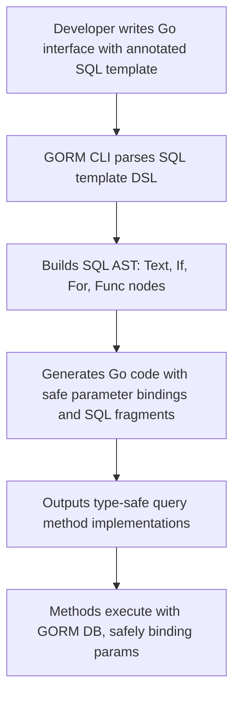

# SQL Template DSL Concepts

Understand how GORM CLI’s SQL Template Domain-Specific Language (DSL) empowers you to define database-agnostic, type-safe, and flexible SQL queries inside Go interface method comments. This page breaks down the core DSL features including table and column resolution, parameter binding, conditional SQL blocks, and iterative constructs — all designed to generate expressive, maintainable query APIs.

---

## Introduction to the SQL Template DSL

GORM CLI extends Go interfaces with annotation-based SQL templates that are parsed and transformed into fully type-safe query methods during code generation. The SQL Template DSL lets you embed dynamic SQL fragments, safely bind parameters, and conditionally build queries based on method inputs — all inline as method comments.

This expressive syntax enables:  

- **Automatic table and column resolution** aligned with your Go models
- **Strongly typed parameter bindings**, reducing runtime SQL injection and type mismatch errors
- Constructing **conditional WHERE/SET clauses** that adjust based on input values
- Iterating over slices or collections for complex query conditions

By mastering this DSL, you create powerful, reusable query methods tightly integrated with GORM’s runtime.

---

## Core DSL Elements & Their Semantics

### 1. Table and Column Resolution

The DSL supports special placeholders that resolve dynamically when the query is generated:

| Placeholder | Description                                          | Example                             |
|-------------|------------------------------------------------------|-----------------------------------|
| `@@table`   | Expands to the database table name for the current model. | `SELECT * FROM @@table WHERE id=@id` |
| `@@column`  | Expands to a dynamic column name, typically for filtering on an arbitrary column.  | `WHERE @@column=@value`              |

These placeholders leverage GORM model metadata to generate correct table/column names for all supported databases, ensuring your code stays consistent even if schema names change.

### 2. Parameter Binding

Parameters in the Go interface method signature can be referenced using `@param` syntax within SQL templates. This allows for safe, automatic injection of bind variables:

```sql
SELECT * FROM @@table WHERE id=@id AND status=@status
```

Here, `@id` and `@status` directly map to Go method parameters named `id` and `status`. The generator produces SQL with parameter placeholders (`?`) and passes arguments accordingly.

> **Tip:** Use `\@` in SQL comments to escape literal at symbols.

### 3. Conditional Blocks: `{{where}}` and `{{set}}`

Two major conditional containers allow complex clause generation:

| Directive  | Purpose                                   | Usage Example                              |
|------------|-------------------------------------------|--------------------------------------------|
| `{{where}}` | Builds a flexible `WHERE` clause from nested conditions | ```sql
{{where}}
  {{if name != ""}} name=@name {{end}}
  {{if age > 0}} AND age=@age {{end}}
{{end}}
``` |
| `{{set}}`   | Builds a dynamic `SET` clause for UPDATE statements | ```sql
{{set}}
  {{if user.Name != ""}} name=@user.Name, {{end}}
  {{if user.Email != ""}} email=@user.Email {{end}}
{{end}}
```     |

The DSL syntax automatically trims superfluous connectors (AND/OR) and commas ensuring the generated SQL is syntactically valid even with optional input parameters.

### 4. `{{if}}` / `{{else if}}` / `{{else}}` / `{{end}}` Conditionals

Control the presence of individual SQL fragments based on Go expressions within method parameters.

- Supports common comparison operators, boolean checks, and negations.
- Can be nested and combined inside `{{where}}` or `{{set}}` blocks.

Example:

```sql
{{where}}
  {{if user.Age >= 18}} is_adult=1 {{else}} is_adult=0 {{end}}
{{end}}
```

### 5. Iteration with `{{for}}`

You can iterate over slices or collections to generate repeated SQL fragments:

```sql
{{where}}
  {{for _, tag := range tags}}
    {{if tag != ""}} tags LIKE concat('%',@tag,'%') OR {{end}}
  {{end}}
{{end}}
```

This generates a series of OR-ed LIKE conditions for each tag in the slice, skipping empty tags.

---

## How the DSL Enhances Your Workflow

### Example: Defining a Query Interface Method

```go
// Example interface method:
//
// SELECT * FROM @@table WHERE id=@id AND status=@status
GetByID(id int, status string) (T, error)
```

This annotation tells GORM CLI to generate a method that runs the SQL with safe parameter binding, automatically resolving the table name.

### Complex Conditional Query Example

```go
// SearchUsers performs conditional filtering based on user fields.
//
// SELECT * FROM @@table
// {{where}}
//   {{if @user.Name != ""}} name=@user.Name {{end}}
//   {{if @user.Age > 0}} AND age=@user.Age {{end}}
// {{end}}
SearchUsers(user User) ([]T, error)
```

If the caller sets the `Name` field, the generated query filters on `name`, otherwise it is omitted.

### Update Example Using `{{set}}` and Conditionals

```go
// UpdateInfo updates user info dynamically.
//
// UPDATE @@table
// {{set}}
//   {{if user.Name != ""}} name=@user.Name, {{end}}
//   {{if user.Age > 0}} age=@user.Age, {{end}}
//   {{if user.Age >= 18}} is_adult=1 {{else}} is_adult=0 {{end}}
// {{end}}
// WHERE id=@id
UpdateInfo(user User, id int) error
```

This dynamically creates a SET clause matching the non-empty fields and appropriately sets `is_adult`.

---

## Implementation Details (Simplified)

- Your SQL template comments are parsed into an abstract syntax tree consisting of text nodes, conditional blocks, loops, and function nodes.
- Placeholders like `@@table` or `@param` are translated into parameterized SQL fragments using placeholders (`?`) and Go expressions.
- The DSL renderer automatically generates boilerplate code that builds SQL strings and assembles the parameter list.
- It trims redundant logical operators and separators like commas to keep SQL valid.

This parsing and code generation process ensures you get safe, readable, and optimized query methods without manually crafting SQL strings at runtime.

---

## Best Practices & Tips

- Use `@@table` and `@@column` to avoid hardcoding schema names; this helps with cross-database compatibility.
- Keep method parameters clearly named and use those names in your `@param` bindings.
- Leverage `{{where}}` and `{{set}}` for optional filtering and updates, combined with `{{if}}` wherever conditions vary.
- When iterating with `{{for}}`, filter out empty or invalid elements inside the loop for clear SQL generation.
- Always return proper result types from methods to maintain type safety.

---

## Common Pitfalls

- Forgetting to include a `WHERE` clause guard can cause accidental full-table updates.
- Incorrect parameter references (typos or mismatched names) cause compilation errors during generation.
- Nested conditionals must be properly paired with `{{end}}` or the generation fails.
- Overcomplicating templates decreases readability—extract complex queries into multiple methods instead.

---

## Further Learning & Related Documentation

- **[Interface-Driven Query API](https://gorm.io/cli/overview/concepts/query-generation-templates/interface-driven-query-api)** — Learn how to define Go interfaces that drive the generation of these DSL-based query methods.
- **[Using Generated APIs](https://gorm.io/cli/guides/core-workflows/using-generated-apis)** — How to work with and compose the generated methods in your Go code.
- **[Advanced Template Queries](https://gorm.io/cli/guides/advanced-patterns/template-queries)** — For mastering complex SQL template DSL scenarios.
- **[Generation Configuration](https://gorm.io/cli/concepts/extensibility-configuration/generation-configuration)** — Customizing generator behavior for project-specific needs.

---

## Diagram: DSL Processing Flow



---

Mastering the SQL Template DSL in GORM CLI unlocks the full power of static, safe query generation tightly coupled with your Go application’s data models. Leveraging these constructs leads to maintainable, efficient, and robust query code, significantly reducing runtime bugs and increasing developer velocity.


---