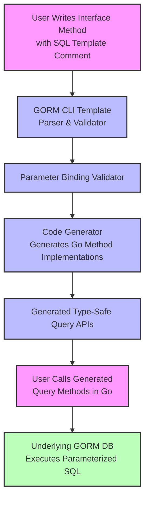

# Template-Based Query Definitions

Explore how GORM CLI empowers you to write dynamic, type-safe SQL queries directly within Go interface comments. This page focuses on the interface-driven API model where SQL templates, embedded as method comments, are transformed into robust, parameterized query methods by the generator.

---

## Overview of Template-Driven Query APIs

At the heart of GORM CLI’s power is the ability to define query logic as SQL templates inside method comments on Go interfaces. Each method corresponds to a parameterized query where placeholders bind seamlessly to method parameters. This design delivers:

- **Type safety** through Go interfaces
- **Automatic parameter binding** without manual SQL string concatenation
- **Dynamic SQL generation using rich template directives**
- **Fluent, idiomatic usage in your Go code**

### Your Workflow

1. Define a generic query interface where method comments contain SQL templates.
2. Run the `gorm gen` command targeting your interface file.
3. Use the generated code, calling methods that execute parameterized SQL with compile-time checked arguments.

This flow replaces manual string-based queries with safe, maintainable APIs that integrate naturally with your models and ORM.

---

## Key Concepts in SQL Template Definitions

### Method Comments as SQL Templates

- SQL is embedded as comments immediately above interface methods.
- The generator parses these comments, extracting raw SQL combined with template directives.
- Placeholders like `@paramName` correspond to method parameters.

Example:

```go
// SELECT * FROM @@table WHERE id=@id
GetByID(id int) (T, error)
```

This produces a method executing a safe query selecting by `id`.

### Template Directives and Placeholders

GORM CLI’s SQL Template DSL provides powerful constructs:

| Directive  | Purpose                        | Example                                           |
|------------|-------------------------------|--------------------------------------------------|
| `@@table`  | Inserts the model’s table name | `SELECT * FROM @@table WHERE id=@id`             |
| `@@column` | Dynamic column name binding    | `WHERE @@column=@value`                           |
| `@param`   | Binds Go method parameters     | `WHERE name=@user.Name`                           |
| `{{where}}`| Conditional WHERE wrapper      | `{{where}} age > 18 {{end}}`                      |
| `{{set}}`  | Conditional SET for UPDATE     | `{{set}} name=@name {{end}}`                      |
| `{{if}}`   | Conditional SQL fragments      | `{{if age > 0}} AND age=@age {{end}}`             |
| `{{for}}`  | Loop over collections          | `{{for _, tag := range tags}} ... {{end}}`       |

### Binding and Safety

- Parameters in method signatures are automatically bound to placeholders by matching `@param` names.
- The generator validates parameter presence and types.
- It safely escapes values to prevent injection risks.

### Context Injection

- If the interface method signature lacks `ctx context.Context`, the generator prepends it automatically, ensuring your queries support cancellation and timeout.

---

## How Template-Based Queries Work: Examples

### Basic Select with Static WHERE Clause

```go
// SELECT * FROM @@table WHERE id=@id
GetByID(id int) (T, error)
```

Usage:

```go
user, err := generated.Query[User](db).GetByID(ctx, 123)
```

Generated SQL:

```sql
SELECT * FROM users WHERE id=123
```

### Dynamic Column Filtering

```go
// SELECT * FROM @@table WHERE @@column=@value
FilterWithColumn(column string, value string) (T, error)
```

Illustrates dynamic column binding:

```go
user, err := generated.Query[User](db).FilterWithColumn("email", "foo@example.com")
```

Generates:

```sql
SELECT * FROM users WHERE email='foo@example.com'
```

### Conditional WHERE Clauses

```go
// SELECT * FROM users
//   {{if user.ID > 0}}
//       WHERE id=@user.ID
//   {{else if user.Name != ""}}
//       WHERE name=@user.Name
//   {{end}}
QueryWith(user models.User) (T, error)
```

This dynamic approach lets you generate different SQL based on parameter values.

### Conditional Updates

```go
// UPDATE @@table
//  {{set}}
//    {{if user.Name != ""}} name=@user.Name, {{end}}
//    {{if user.Age > 0}} age=@user.Age, {{end}}
//    {{if user.Age >= 18}} is_adult=1 {{else}} is_adult=0 {{end}}
//  {{end}}
// WHERE id=@id
UpdateInfo(user models.User, id int) error
```

Use this template-driven method to only update fields with meaningful values.

### Iteration with `for` and Complex Filters

```go
// SELECT * FROM @@table
// {{where}}
//   {{for _, user := range users}}
//     {{if user.Name != "" && user.Age > 0}}
//       (name = @user.Name AND age=@user.Age AND role LIKE concat("%",@user.Role,"%")) OR
//     {{end}}
//   {{end}}
// {{end}}
Filter(users []models.User) ([]T, error)
```

This handles complex filters over collections, producing a composite WHERE clause.

---

## Detailed Explanation of Template DSL Features

### @@table and @@column

- `@@table` dynamically resolves to the table name of the model struct used.
- `@@column` resolves to a column name, typically bound dynamically via a method argument.

### Parameter Placeholders

- Any method parameter can be referenced via `@paramName` in the SQL comment.
- For nested structs, dot notation applies (e.g., `@user.Name`).

### Conditional Blocks: `{{where}}`, `{{set}}`, `{{if}}` and `{{else}}`

- `{{where}}` and `{{set}}` define context-specific SQL clauses.
- `{{if}}` conditions control whether SQL fragments are included.
- SQL generation strips trailing conjunctions and trims whitespace automatically.

### Looping: `{{for}}`

Enables iterating over slices or arrays to generate repeated SQL segments, e.g., OR-combined filters.

---

## Using Generated Query APIs

Once your interfaces are defined and code is generated, your usage pattern is:

```go
// Create a typed query instance
query := generated.Query[User](db)

// Call generated methods directly
user, err := query.GetByID(ctx, 42)

if err != nil {
    // handle error
}

// Compose filtering
users, err := query.FilterByNameAndAge(ctx, "Alice", 30).Find(ctx)
```

This style ensures:
- No raw SQL strings in runtime code
- Full IDE code completion and type-checking
- Auto-injected support for `context.Context`

---

## Practical Tips & Best Practices

- **Name your interface methods clearly**, reflecting the query intent.
- Use templating conditionals to **handle optional or nullable parameters gracefully**.
- Prefer `@@table` and `@@column` for dynamic table/column references to ensure generated SQL matches your models.
- Test edge cases by running the generator and reviewing the produced code when your templates become complex.
- Use the `genconfig.Config` to customize generation settings (e.g., output paths, field mappings).

---

## Common Pitfalls and Troubleshooting

<AccordionGroup title="Common Pitfalls">
<Accordion title="Missing or Incorrect Parameter Binding">
Ensure the placeholder names inside your SQL comments exactly match method parameter names, including nested fields.
</Accordion>
<Accordion title="Unbalanced or Incorrect Template Tags">
Watch for unclosed `{{if}}` or `{{end}}` tags which can cause generation errors.
</Accordion>
<Accordion title="Dynamic Column Injection Security">
Avoid untrusted user input for `@@column` or template arguments as these bypass parameter binding and can lead to SQL injection.
</Accordion>
<Accordion title="Methods Without Proper Return Values">
Methods defining raw SQL templates that perform queries must have a return type compatible with `(T, error)` or `error` as appropriate.
</Accordion>
</AccordionGroup>

For detailed troubleshooting, refer to the [Troubleshooting Common Issues](../../getting-started/troubleshooting/common-issues) guide.

---

## Behind the Scenes: How the Generator Processes Templates

- The generator parses Go source files to identify methods on interfaces.
- It extracts and parses SQL comment blocks as templates.
- It validates parameter usage against method signatures.
- It transforms templates into Go method implementations featuring string builders and parameter slices ensuring safe, efficient queries.

This process is transparent to you but critical for delivering a rich developer experience.

---

## Visualization of Template-Driven Query Generation Process



---

## Next Steps

- Dive deeper into [Advanced SQL Templates and DSL usage](../../guides/advanced-patterns/template-sql-dsl) to leverage full expressive power.
- Combine these query APIs with [Model-Driven Field Helpers](../data-models-helpers/model-driven-field-helpers) for rich filtering and updates.
- Customize generator behavior through [Generation Configuration](../query-templates-config/generation-configuration).

Explore related guides and deepen your mastery to supercharge your project’s data access layer.

---

## References and Related Documentation

- [Getting Started: Generating Code](../../getting-started/first-steps/generating-code): How to run the generator
- [Using Type-Safe Query APIs](../../guides/core-workflows/using-type-safe-query-apis): Practical usage patterns
- [Model-Driven Field Helpers](../data-models-helpers/model-driven-field-helpers): For building type-safe filters and updates
- [Template SQL DSL](../../guides/advanced-patterns/template-sql-dsl): In-depth guide to SQL template syntax
- [Project Configuration](../../getting-started/first-steps/project-configuration): Customizing generator behavior
- [Troubleshooting Common Issues](../../getting-started/troubleshooting/common-issues): Resolve errors

---

## Summary
This page explained how to define powerful, safe query methods by writing SQL templates in Go interface comments, how placeholders bind to method parameters, and the sketch of the code generation process that turns comments into real query methods. Through practical examples, best practices, and troubleshooting tips, you now understand how to utilize GORM CLI’s template-based query definitions to write expressive, maintainable database code.
