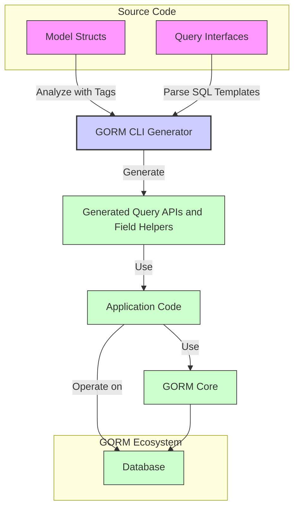

# Integration with GORM and Application Code

GORM CLI produces generated code that seamlessly integrates with your existing GORM-based repositories. This page guides you through how the generated query APIs and model-driven field helpers align with GORM conventions, what expectations exist around struct tags and method signatures, and best practices for smooth adoption within your Go projects.

---

## Introduction

GORM CLI transforms your annotated Go interfaces and models into type-safe, fluent APIs that work directly on top of `gorm.io/gorm`. The integration fully leverages Go generics, GORM's extensibility, and idiomatic Go patterns to ensure your database operations remain safe, expressive, and performant.

By adopting the generated code, you unlock:

- Compile-time validation of your SQL queries and model field usages
- Fluent filtering, updating, and association management with generated field helpers
- Idiomatic context propagation for request lifecycle control
- Fully compatible method signatures to use interchangeably with regular GORM code


## Expectations for Your Models and Struct Tags

Integration begins at your model struct declarations. GORM CLI observes standard GORM struct tags for schema metadata but offers expanded flexibility through the `gen` struct tag. Understanding these is critical for proper generation and integration:

### GORM Tags

- Define table columns, foreign keys, and relationships using familiar GORM tags such as `gorm:"column:name"`, `gorm:"primarykey"`, and association tags like `gorm:"many2many:user_friends"`.
- These tags control how GORM reads/writes to the database and how the generated helper fields map to columns and associations.

### `gen` Tags for Field Helper Overrides

- Use the `gen` struct tag to instruct GORM CLI to generate custom field helpers rather than default ones.
- Example: `Profile string `gen:"json"`` tells the generator to map this field to a JSON-specific field helper.

### Composite and Embedded Fields

- Embedded structs and anonymous fields in models are flattened and their fields become part of the model, consistent with GORM's behavior.
- Associations embedded inline will be properly detected and exposed via generated association helpers.

### Go Generic Structs and Types

- The generator supports using Go generics in interfaces and struct helpers, maintaining type safety.
- Generated queries and helpers leverage generics for flexible yet strongly-typed APIs.


## Generated Query Interfaces: Method Signatures and Context

All generated query interface methods follow consistent method signatures designed for idiomatic integration:

- **Context Parameter:** Each method accepts a `context.Context` as the first parameter. If missing in the interface definition, it is auto-injected in the generated implementation.
- **Input Parameters:** Parameters map one-to-one to your interface definition, supporting basic types, models, slices, and time types.
- **Return Values:** Methods either return `(<ModelType>, error)`, `([]<ModelType>, error)`, or `error` based on the query semantics.

### Example Generated Method Signature

```go
func (q QueryImpl[T]) GetByID(ctx context.Context, id int) (T, error) {
    // implementation
}
```

### Benefits

- This pattern fits naturally into Go's context-aware request handling.
- Enables cancellation, deadlines, and tracing to be propagated.
- Aligns with GORM's approach and ensures API familiarity for users.


## Using Generated Field Helpers with GORM

The generated field helpers correspond directly to your model's fields and associations, offering a fluent API for building queries, updates, and managing relations. 

### Accessing Field Helpers

The generator produces variables named after your model struct, exposing strongly typed helpers for each field:

```go
var User = struct {
    ID        field.Number[uint]
    Name      field.String
    Age       field.Number[int]
    Profile   JSON
    Pets      field.Slice[Pet]
    Account   field.Struct[Account]
}{
    ID:    field.Number[uint]{}.WithColumn("id"),
    Name:  field.String{}.WithColumn("name"),
    Age:   field.Number[int]{}.WithColumn("age"),
    Profile: JSON{}.WithName("Profile"),
    Pets:  field.Slice[Pet]{}.WithName("Pets"),
    Account: field.Struct[Account]{}.WithName("Account"),
}
```

### Using Helpers in Queries

- Filter records using expressions such as `User.Age.Gt(18)`, which get converted to SQL `WHERE` clauses.
- Use association helpers for related structs, e.g., `User.Pets.Create(...)`, `User.Account.Update(...)`.
- Compose complex predicates fluently and with compiler-checked types.

### Example: Filtering and Updating

```go
// Fetch all adult users
adults, err := gorm.G[User](db).Where(User.Age.Gte(18)).Find(ctx)

// Update user name and unlink all pets
err := gorm.G[User](db).
  Where(User.ID.Eq(userID)).
  Set(
    User.Name.Set("Alice"),
    User.Pets.Unlink(),
  ).
  Update(ctx)
```


## Integration Workflow Best Practices

### 1. Organize your code

- **Models and interfaces** should be placed logically in your project so that GORM CLI can discover and generate related files into your chosen output directory.
- Use package-level `genconfig.Config` to customize output paths and tweak generation scope.

### 2. Use consistent struct tags

- Ensure your models use GORM conventions consistently.
- Use the `gen` tag only when you need custom helpers (e.g., JSON mapping).

### 3. Run generation as part of your build or CI process

- Embed `gorm gen` commands in your build pipeline, so your generated query APIs and helpers stay updated.

### 4. Write interfaces with embedded SQL comments

- Define your query interface methods using SQL templates for precise control.
- Use the SQL Template DSL to incorporate dynamic filters and conditional clauses.

### 5. Access generated APIs from your application code

- Instantiate generated query interfaces via constructors like `generated.Query[User](db)`.
- Use the provided field helpers for building conditions and managing associations.

### 6. Testing and validation

- Use the generated code for writing compile-time safe database operations.
- Structure tests to use the generated helpers and methods directly for integration validation.


## Context Propagation and Cancellation

Each generated method accepts a `context.Context` as the first argument, even if not declared in your interface methods. This supports:

- Request-scoped cancellation
- Timeouts
- Tracing and logging integration

**Example:**

```go
user, err := generated.Query[User](db).GetByID(ctx, 42)
```

This design ensures your database operations align with your app’s lifecycle controls.


## Association Helper Semantics in Integration

Association helpers generated by GORM CLI expose powerful methods for managing relations with type safety.

### Supported operations:

- **Create / CreateInBatch:** Insert related records and link them
- **Update:** Modify related records with optional filtering
- **Unlink:** Detach associations without deleting data
- **Delete:** Remove related records or join rows for many-to-many

### Clear operation boundaries:

- `Unlink()` affects only the link (e.g., sets foreign keys to NULL or deletes join table entries).
- `Delete()` removes the related records (child rows or join entries).

This distinction lets you precisely control relation lifecycles.


## Sample Flow: Using the Generated Query and Association APIs

```go
func updateUserPetName(ctx context.Context, db *gorm.DB, userID uint, oldPetName, newPetName string) error {
    userQuery := generated.Query[User](db)
    petField := generated.Pet

    // Update the pet's name where user ID and pet name match
    return userQuery.Where(generated.User.ID.Eq(userID)).
        Set(generated.User.Pets.Where(petField.Name.Eq(oldPetName)).Update(petField.Name.Set(newPetName))).
        Update(ctx)
}
```

This code combines query conditions with association helpers to perform a targeted update on related data.


## Troubleshooting Common Integration Issues

<AccordionGroup title="Common Problems & Solutions">
<Accordion title="Generated code not found or does not compile">
- Verify your `genconfig.Config.OutPath` matches your import paths.
- Confirm that your generation command targets the correct input paths.
- Ensure Go modules are properly initialized and dependencies resolved.
</Accordion>
<Accordion title="Context parameter missing in custom interfaces">
- The generator injects `context.Context` automatically if not present.
- Avoid manually specifying `context.Context` as the first parameter to prevent signature conflicts.
</Accordion>
<Accordion title="Association operations have no effect">
- Confirm correct use of association helpers, e.g., `Unlink()`, `Delete()`, and `CreateInBatch()`.
- Use explicit conditions on associations when filtering.
- Check model `gorm` tags for proper FK and relationship declarations.
</Accordion>
<Accordion title="Custom field helpers not working as expected">
- Confirm the `gen:"<tag>"` attribute is set properly on the model field.
- Verify configuration maps your `gen` tag to the custom helper type.
- Test custom helpers independently to isolate DSL or SQL generation issues.
</Accordion>
</AccordionGroup>


## Summary Diagram: Integration Workflow




## Additional References

To deepen your understanding and master full integration workflows, consult these related pages:

- [Interface-Driven Query APIs: From Template to Usage](https://gorm.io/cli/gorm/docs/guides/query-and-model-helpers/interface-driven-queries)
- [Model Field Helpers: Filters, Updates, and Predicates](https://gorm.io/cli/gorm/docs/guides/query-and-model-helpers/model-driven-field-helpers)
- [Working with Associations: Patterns and Pitfalls](https://gorm.io/cli/gorm/docs/guides/query-and-model-helpers/association-guides)
- [Basic Configuration](https://gorm.io/cli/gorm/docs/getting-started/initial-configuration-and-first-use/basic-configuration)
- [Quick Start: From Models to Queries](https://gorm.io/cli/gorm/docs/overview/quickstart-features/quickstart-workflow)


---

By understanding and applying these integration practices, you ensure that the powerful, generated APIs form a robust, maintainable bridge between your Go application logic and the underlying database using GORM’s proven ecosystem.


---