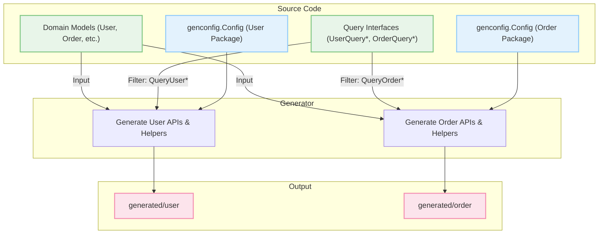

# Scalability Considerations

GORM CLI is designed to empower medium- to large-scale Go projects with type-safe, maintainable, and performant database query generation and usage. As your codebase and development team grow, carefully applying architectural patterns and configuration strategies is essential to keep your generated codebase scalable, comprehensible, and efficient.

This guide walks you through core scalability patterns and practical approaches for configuration and modular generator runs, helping you optimize GORM CLI generation workflows and maintain high-quality code in expanding teams.

---

## Why Scalability Matters in Code Generation

Scaling your Go project’s data access layers involves more than writing efficient SQL or GORM queries; it requires structuring and configuring your code generation process to:

- Manage large numbers of models and query interfaces gracefully
- Allow fast iterations without full regeneration delays
- Facilitate targeted updates and logical separation
- Support collaborative development across teams

Without scalable patterns, large generation runs can become slow, error-prone, and harder to maintain.


## Modular Generation Configuration

A fundamental approach to scalability is modularizing your generation configuration. Instead of generating all APIs and helpers in a single massive batch, divide your project’s models and interfaces into manageable groups with distinct generation settings.

### How Modular Configurations Help

- **Focused Regeneration**: Change detection and regeneration apply only to relevant modules, cutting build time.
- **Cleaner Code Output**: Organized output directories and files reflect project domains or features.
- **Team Collaboration**: Different teams can own different modules independently.


### Practical Steps for Modular Configurations

1. **Split Your Interfaces and Models by Domain or Feature**
   For example:
   - `user` domain: user.go, user_interface.go
   - `order` domain: order.go, order_interface.go

2. **Declare Separate `genconfig.Config` Instances per Package or Subpackage**

```go
// user/genconfig.go
package user

import "gorm.io/cli/gorm/genconfig"

var _ = genconfig.Config{
  OutPath: "generated/user",
  IncludeInterfaces: []any{"UserQuery*"},
  IncludeStructs: []any{"User", "Account"},
}
```

3. **Run Generation Per Module**
   Use CLI commands targeting each module if your project layout requires it:

```bash
gorm gen -i ./user -o ./generated/user
gorm gen -i ./order -o ./generated/order
```

This modular approach promotes faster generation cycles and cleaner project organization.


## Selective Interface Filtering Patterns

When working with many query interfaces in shared packages, you can finely control which interfaces get generated using include/exclude patterns.

### Interface Naming Conventions and Filters

Use shell-style wildcard patterns to include or exclude interfaces based on naming conventions:

- Prefix interfaces intended for generation with a common pattern (e.g., `Query*`)
- Exclude deprecated or internal interfaces with patterns like `*Deprecated*`

Example from `examples/filters/pattern/config.go`:

```go
var _ = genconfig.Config{
  IncludeInterfaces: []any{"Query*"},
}
```

This filters interfaces so only those starting with "Query" are generated, reducing unnecessary code and improving maintainability.


## Efficient Handling of Large Struct Models

As your models become more complex with many fields and associations, consider these best practices:

- Use configuration fields like `IncludeStructs` and `ExcludeStructs` to control generation scope.
- Map custom or complex field types to appropriate field helpers via `FieldTypeMap` for consistent and performant code.
- Avoid generating on transient or DTO structs by excluding them explicitly.

Example:

```go
var _ = genconfig.Config{
  IncludeStructs: []any{"User", "Account*"},
  ExcludeStructs: []any{"*DTO"},
  FieldTypeMap: map[any]any{
    sql.NullTime{}: field.Time{},
  },
}
```


## Incremental Generation Strategy

For very large projects, consider incremental generation workflows to optimize developer feedback loops:

- Separate the generation of model-driven field helpers from interface-driven query APIs.
- Run generation only on changed interfaces or models leveraging package-level config and build cache.
- Script generation commands into build pipelines to run automatically or on-demand.


## Workflow Example

Imagine a growing project where your team maintains three main domains: Users, Orders, and Inventory.

- Each domain has distinct model structs and query interfaces with SQL templates.
- You create a dedicated package with its own `genconfig.Config` for each domain.
- Generation outputs into separate folders: `generated/user`, `generated/order`, `generated/inventory`.
- Local development builds run generation only on the domain under active development.
- CI pipelines run full generation to ensure consistency.

This modular, filtered approach ensures scalability, clarity, and team agility.


## Common Pitfalls and How to Avoid Them

<AccordionGroup title="Common Scalability Pitfalls">
<Accordion title="Generating Too Broadly Without Filters">
Avoid generating all interfaces or structs every time, as it leads to long build times and cluttered output. Use `IncludeInterfaces` and `ExcludeInterfaces` to scope generation.
</Accordion>
<Accordion title="Mixing Different Domain Models in One Package">
Keep domain models, interfaces, and configs separated by package or subpackage to facilitate modular generation. This separation helps target builds and prevents entanglement.
</Accordion>
<Accordion title="Ignoring Custom Field Mappings for Complex Types">
Failing to map complex Go types, such as `sql.NullTime` or JSON fields, can produce inefficient or incorrect helpers. Use `FieldTypeMap` and custom helpers to manage this cleanly.
</Accordion>
<Accordion title="Overloading Configuration in Single Files">
Avoid cramming all generation options in one global config for very large projects. It becomes harder to maintain and reason about. Use multiple configs localized to concern areas.
</Accordion>
</AccordionGroup>


## How GORM CLI Supports Scalability

- **Pattern-Based Interface Inclusion:** Match multiple interfaces for generation using prefixes or wildcards.
- **Configurable Output Paths:** Map generation outputs to domain-specific folders.
- **Field & Interface Scoping:** Include or exclude structs and interfaces precisely.
- **Custom Field Helpers:** Enable mapping complex types to maintain clean APIs.


---

## Visual Summary: Modular Generation Flow




---

## Best Practices for Scaling Your GORM CLI Application

- Establish clear domain boundaries and organize code accordingly.
- Adopt consistent naming conventions for interfaces to leverage pattern filtering.
- Use package-level configs instead of file-level when multiple files in a package share logic.
- Map custom types explicitly to ensure generation correctness and maintainability.
- Use incremental generation during development to shorten iteration cycles.
- Integrate generation commands into CI/CD pipelines to enforce code consistency.


## Troubleshooting Scalability Issues

If you notice slow generation or excessive output:

- Review your `genconfig.Config` settings to confirm filtering settings correctly narrow targets.
- Verify your inclusion and exclusion patterns do not inadvertently match too many or too few interfaces.
- Check for duplicated or overlapping configs causing confusion.
- Inspect custom field mappings for missing or incorrect entries.


<Check>
When encountering errors or slow performance, isolate your config and interface sets into smaller modules to identify bottlenecks.
</Check>


## Summary

Scaling your use of GORM CLI in medium-to-large Go projects hinges on modular configuration, pattern-based interface filtering, clear domain separation, and custom field mappings. These strategies reduce build times, improve maintainability, and enable your growing teams to work efficiently with generated type-safe query APIs and field helpers.

Apply these principles early in your project to harness GORM CLI’s full potential as your codebase and team expand.

---

## Additional Resources

- [How GORM CLI Works: Architecture Overview](/overview/architecture-concepts/architecture-overview)
- [Interface-Driven Query APIs: From Template to Usage](/guides/query-and-model-helpers/interface-driven-queries)
- [Model Field Helpers: Filters, Updates, and Predicates](/guides/query-and-model-helpers/model-driven-field-helpers)
- [Essential Configuration: Tweaking Code Generation](/guides/getting-started/generation-config-basics)
- [Performance and Scalability Tips](/guides/advanced-integration/performance-tips)


## See Also

- [Core Concepts & Terminology](/overview/architecture-concepts/core-concepts-terminology)
- [Generation Workflow Overview](/concepts/core-architecture/generation-workflow)
- [Customizing Generation with Config](/concepts/data-modeling-and-extensibility/customization-via-config)

---