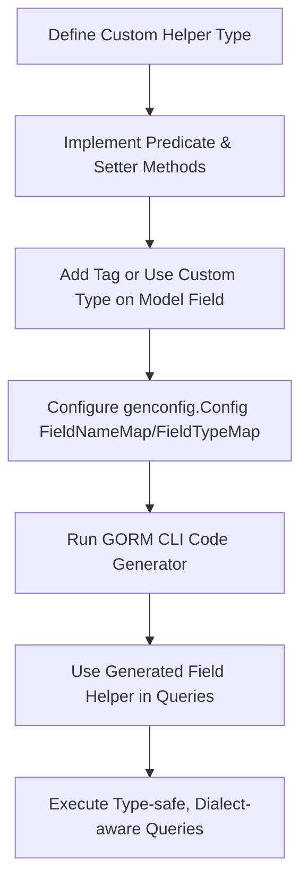

# Advanced Fields and Custom Helpers

GORM CLI goes beyond basic field types by supporting complex or non-standard database fields through a flexible custom field helper system. This guide explains how you can extend GORM CLI to handle fields like JSON columns, specialized SQL types, or any data that requires custom predicate and setter logic beyond what is automatically generated.

---

## Why Use Custom Field Helpers?

Out-of-the-box, GORM CLI generates type-safe helpers for common Go basic types such as integers, strings, booleans, and time types, as well as for struct relations like `field.Struct[T]` and slices `field.Slice[T]`.

However, certain field types require specialized SQL syntax or behavior that cannot be expressed with standard predicates or setters. Examples include:

- JSON fields requiring database-specific JSON operators
- Custom serialized columns with specialized database types
- Nullable and complex types embedding more expressive logic

By providing your own custom field helpers, you gain full control to define how predicates and updates are generated, enabling safer and more expressive queries.

---

## How Custom Field Helpers Work

Custom field helpers are regular Go types that implement predicate and setter methods returning GORM clause expressions. GORM CLI recognizes these types during code generation to produce field helpers with the desired domain logic.

You map your custom helpers to struct fields in your model by using the `genconfig.Config` configuration with `FieldNameMap` or `FieldTypeMap` settings. During generation, these mappings override the default helper generation for the matched fields.

### Typical Workflow

1. **Define your custom helper type:**
   - Implement methods like `WithColumn`, predicate builders, and setters that return `clause.Expression`.

2. **Mark fields on your model:**
   - Use struct tags or naming conventions to indicate which fields use custom helpers.
   - Example: the `gen:"json"` tag to assign the JSON helper.

3. **Configure the generator:**
   - Declare a package-level `genconfig.Config` with proper mappings.
   - Specify your custom helper types under `FieldNameMap` (by tag) or `FieldTypeMap` (by Go type).

4. **Generate code:**
   - Run the GORM CLI tool with your interfaces and models.
   - Generated code uses your custom helpers accordingly.

---

## Defining a Custom Field Helper: Example with JSON

Here is an example of a JSON field helper designed for filtered queries across different databases.

```go
// JSON is a field helper for JSON columns with database-specific predicate semantics.
type JSON struct {
    column clause.Column
}

// WithColumn sets the column name for the field helper.
func (j JSON) WithColumn(name string) JSON {
    c := j.column
    c.Name = name
    return JSON{column: c}
}

// Equal builds a JSON equality expression suitable for different databases.
func (j JSON) Equal(path string, value any) clause.Expression {
    return jsonEqualExpr{col: j.column, path: path, val: value}
}

// jsonEqualExpr is a private struct implementing clause.Expression
// that generates the correct SQL depending on the dialect.
type jsonEqualExpr struct {
    col  clause.Column
    path string
    val  any
}

func (e jsonEqualExpr) Build(builder clause.Builder) {
    if stmt, ok := builder.(*gorm.Statement); ok {
        switch stmt.Dialector.Name() {
        case "mysql":
            v, _ := json.Marshal(e.val)
            clause.Expr{SQL: "JSON_EXTRACT(?, ?) = CAST(? AS JSON)", Vars: []any{e.col, e.path, string(v)}}.Build(builder)
        case "sqlite":
            clause.Expr{SQL: "json_valid(?) AND json_extract(?, ?) = ?", Vars: []any{e.col, e.col, e.path, e.val}}.Build(builder)
        default: // PostgreSQL
            clause.Expr{SQL: "jsonb_extract_path_text(?, ?) = ?", Vars: []any{e.col, e.path[2:], e.val}}.Build(builder)
        }
    }
}
```

This helper:
- Implements `WithColumn` to assign the target column name.
- Includes a custom predicate method `Equal` that builds dialect-aware JSON equality SQL.

---

## Configuring GORM CLI to Use Custom Helpers

To activate custom helpers, declare a `genconfig.Config` in your package to map your types or tags. For example:

```go
package examples

import ("gorm.io/cli/gorm/field" "gorm.io/cli/gorm/genconfig")

var _ = genconfig.Config{
    OutPath: "examples/output",
    FieldNameMap: map[string]any{
        "json": JSON{}, // Map fields tagged with `gen:"json"` to JSON helper
    },
}
```

### How the Mapping Works

- `FieldNameMap` maps string tags to helper types.
- `FieldTypeMap` maps full Go field types to helper types.

If your field struct tags include `gen:"json"`, the generator will assign the `JSON` helper there instead of a generic string or other default.

---

## Using Custom Helpers in Models

Update your model fields to include the marker tag or use a specific Go type:

```go
package models

type User struct {
    // ... other fields ...

    Profile string `gen:"json"` // Tells the generator to use the JSON helper
}
```

During generation, the `Profile` field will receive a helper of type `JSON` with all predicates and setters.

---

## Benefits of Custom Field Helpers

- **Type safety:** Strongly-typed predicates and setters reduce runtime errors.
- **Dialect awareness:** Embed database-specific SQL fragments to generate valid queries across MySQL, SQLite, Postgres, and others.
- **Expressiveness:** Enable complex operations like JSON path querying or specialized filters as first-class citizens.
- **Extensibility:** Easily support other complex types unique to your domain.

---

## Troubleshooting and Best Practices

- **Ensure configuration is package-level:** `genconfig.Config` must be declared in the generation target package.
- **Use clear and unique tags:** Avoid conflicts and ambiguous mappings.
- **Test generated code:** Run your queries to validate dialect-specific behaviors.
- **Keep helpers focused:** One helper per domain-specific need (e.g., JSON, monetary types, encrypted fields).

---

## Summary

Custom field helpers unlock advanced capabilities in GORM CLI by extending type-safe querying and updating to non-standard database fields. By defining your own types and mapping them through the configuration system, you create fluent, expressive, and dialect-aware APIs that integrate seamlessly with your existing GORM models and generated query interfaces.

To deepen your knowledge, see related documentation on [Configuration and Customization](https://gorm.io/docs/concepts) and [Template-Driven Queries](https://gorm.io/docs/template_sql).

---

## Additional Resources

- [Using Custom Field Helpers in JSON Fields](./guides/advanced-usage-best-practices/json-fields-and-custom-helpers)
- [genconfig.Config Customization](./concepts/scalability-extension/generation-configurability)
- [Field Helpers Basics](./guides/using-generated-apis/field-helpers-basics)
- [Template SQL DSL](./concepts/core-data-concepts/template-sql)

---

## Visual Workflow for Custom Field Helper Usage



This flow shows the user journey from implementing custom logic to leveraging generated APIs.

---

<Check>
Custom field helpers elevate GORM CLI to handle your unique database access needs by bridging Go types with precise and expressive SQL generation.
</Check>
