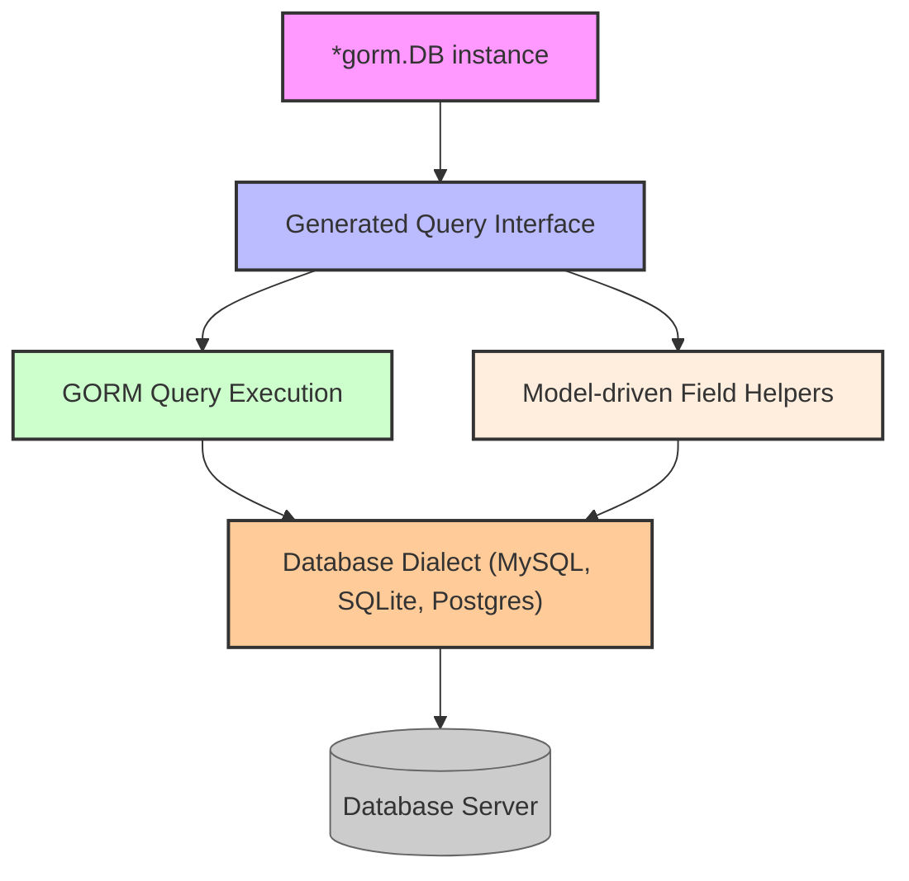

# Integration with GORM & Database Backends

This guide explains how GORM CLI-generated code integrates seamlessly with the official [gorm.io/gorm](https://gorm.io) library and various database backends. You will learn about how generated query APIs use GORM's `DB` context, how database dialect differences affect field helper behaviors, and strategies to scale your project with many models or multiple databases.

---

## Overview

GORM CLI enhances your GORM-based Go projects by generating two complementary types of code:

- **Type-safe query interfaces** that wrap GORM's `*gorm.DB` with strongly-typed, fluent query methods.
- **Model-driven field helpers** that provide type-safe predicates, setters, and association operations hardwired to your database schema.

Behind the scenes, the generated APIs and helpers directly leverage the standard GORM `*gorm.DB` context. This means you retain the full power and flexibility of GORM along with an added layer of compile-time safety and discoverability.

## How Generated Code Uses GORM's DB Context

### DB Context Propagation

Every generated query interface implementation embeds a `gorm.Interface[T]`, which is essentially a wrapper around a `*gorm.DB` bound to the model type:

```go
func Query[T any](db *gorm.DB, opts ...clause.Expression) QueryInterface[T] {
  return QueryImpl[T]{
    Interface: gorm.G[T](db, opts...),
  }
}
```

This design means:
- Your existing initialized `*gorm.DB` instance flows smoothly into the generated API.
- Context, transaction state, prepared statements, logger settings, and other GORM features are naturally respected.
- You can chain queries with the generated methods just as you would with plain GORM.

### Using Context

Method signatures in generated query interfaces automatically add `context.Context` if omitted, ensuring compatibility with GORM's context-aware execution:

```go
user, err := generated.Query[User](db).GetByID(ctx, 123)
```

This enables cancellation, timeouts, and tracing.

## Database Dialect Awareness in Field Helpers

Field helpers generated by GORM CLI are aware of common SQL types, nullable variants, and special field types. Certain helpers behave differently based on the targeted database's dialect.

### Dialect Abstraction Example: JSON Fields

If your model includes JSON fields (e.g., a string tagged with `gen:"json"`), the generated helper encapsulates dialect-specific JSON functions:

```go
// Querying JSON attribute equality:
gorm.G[User](db).
  Where(generated.User.Profile.Equal("$.vip", true)).
  Take(ctx)
```

- **MySQL** generates expressions like `JSON_EXTRACT(profile, "$.vip") = CAST(true AS JSON)`
- **SQLite** generates `json_valid(profile) AND json_extract(profile, "$.vip") = 1`
- **Postgres** translates to `profile->>'vip' = 'true'`

This abstraction ensures your queries behave predictably across supported databases without manual SQL tuning.

### Field Helper Coverage

Helpers are generated for:
- Basic scalar types (`int`, `string`, `bool`, `time.Time`, etc.) including nullable types (`sql.NullInt64`, `sql.NullTime`)
- Association relationships (`has one`, `has many`, `belongs to`, `many2many`, and polymorphic associations)
- Advanced types, customizable via `genconfig.Config`

## Managing Multi-Database and Large Model Projects

### Scaling With Large Models

For projects with extensive models, GORM CLI supports incremental and package-level generation with flexible configuration:

- Use the `genconfig.Config` to specify output folders, included structs, and interfaces.
- Filter generation by package, interface name patterns, or type literals.
- This modular approach helps keep generated code maintainable and scales CI/CD workflows.

### Multi-Database Setup

Since generated query implementations rely exclusively on `*gorm.DB`, you can:

- Instantiate separate `*gorm.DB` instances per database backend.
- Pass the corresponding DB instance to the generated API for each database.
- Configure `genconfig` to generate helpers tailored for specific dialects in multi-db setups.

This flexibility allows service architectures supporting multiple data stores to share a unified, type-safe API layer.

## Practical Example

Using the generated query and helpers with an initialized GORM `*gorm.DB`:

```go
import (
  "context"
  "gorm.io/cli/gorm/examples/models"
  generated "gorm.io/cli/gorm/examples/output/models"
  "gorm.io/gorm"
)

func fetchVipUser(ctx context.Context, db *gorm.DB) (*models.User, error) {
  return gorm.G[models.User](db).
    Where(generated.User.Profile.Equal("$.vip", true)).
    Take(ctx)
}

func updateUserAge(ctx context.Context, db *gorm.DB, id uint, newAge int) error {
  return generated.Query[models.User](db).UpdateInfo(ctx, models.User{Age: newAge}, int(id))
}
```

These operations handle all query details, dialect differences, and compile-time validations automatically.

## Best Practices & Tips

- **Pass your existing `*gorm.DB` instance** to generated query constructors to keep connection configurations consistent.
- **Leverage context propagation** for cancellation and timeout control.
- **Use field helpers for conditions** rather than raw strings to prevent SQL syntax errors and injection risks.
- **Batch database operations** using the generated `CreateInBatch` association helpers to optimize performance.
- **For JSON and custom complex types, extend with `genconfig` to define appropriate helpers**, ensuring cross-dialect compatibility.

## Troubleshooting Common Issues

<AccordionGroup title="Common Integration Issues">  <Accordion title="Generated Code Does Not Compile with My GORM Version">Ensure that you are using GORM v1.23+ which supports generics and `gorm.Interface[T]`. Older GORM versions may not be compatible.</Accordion>  <Accordion title="Queries Return Empty Results Unexpectedly">Verify that your database connections are correctly configured and tables are migrated. Also, check that predicates use the correct field helpers matching your model fields.</Accordion>  <Accordion title="JSON Field Queries Fail on SQLite">Make sure you have configured the JSON field helper to emit SQLite-specific JSON functions and that the SQLite dialect is selected in your GORM DB.</Accordion>  <Accordion title="Multiple Database Instances Causing Conflicts">Maintain separate GORM `*gorm.DB` instances per database and always pass the correct instance to query constructors to avoid query routing mistakes.</Accordion></AccordionGroup>

## Diagram: Generated Query API Integration Flow



## Additional Resources

For a deeper understanding and complementary knowledge, see these related documentation pages:

- [Writing Type-Safe Queries from Interfaces](/guides/core-workflows/writing-type-safe-queries) explains how to author raw SQL query interfaces.
- [Using Field Helpers for Filters & Updates](/guides/core-workflows/using-field-helpers) covers the generated helper APIs.
- [Managing Associations with Helpers](/guides/core-workflows/association-operations) demonstrates working with related records.
- [Configuration & Customization](/concepts/scalability-integration/configuration-and-customization) to adapt generation for complex projects.
- [Working with JSON Columns](/guides/advanced-usage-patterns/working-with-json-fields) for advanced JSON integration.

---

This page is part of the **Scalability & Integration** concept grouping, focusing on bridging generated code to real database backends effectively.


---