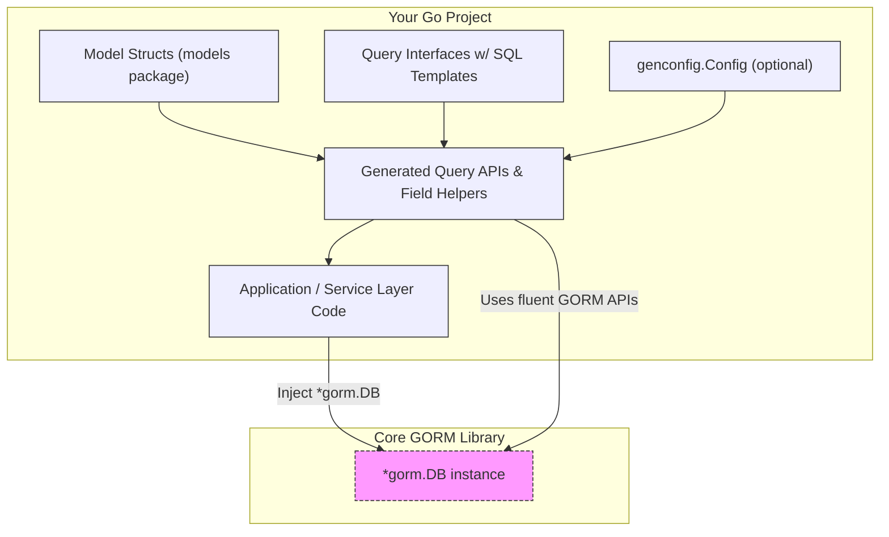

# Integration Patterns with GORM and Your Codebase

GORM CLI outputs generated code that complements and extends your existing GORM projects. This page guides you through practical patterns for composing the generated query interfaces and model-driven field helpers with core GORM APIs, custom extensions, and other tools in your ecosystem. It covers recommended file placements, usage conventions, code maintenance approaches, and evolution strategies for scalable, maintainable data access layers.

---

## Why Integration Patterns Matter

GORM CLI produces two main outputs:

- **Type-safe query APIs** generated from Go interfaces annotated with SQL templates.
- **Model-driven field helpers** generated from your Go structs for filters, updates, and associations.

These sources of code work cohesively but must be integrated thoughtfully into your codebase for maximum benefit. This ensures:

- Clear project structure and discoverability of generated code.
- Seamless extension of GORM’s fluent APIs with generated helpers.
- Maintainable and scalable code as your schema and queries grow.
- Minimal manual editing while preserving type safety and productivity.


## Recommended File Placement

To keep generated code organized and clear:

- **Source Models and Interfaces:** Place Go model structs and SQL-annotated query interfaces in well-defined packages or directories relevant to your business domain. For example, `models/` and `queries/`.

- **Generated Output:** Use GORM CLI’s `-o` (output path) flag or the `genconfig.Config.OutPath` field to place generated code separately from handwritten source code.

  Typical patterns:

  ```
  /models                # Your Go models
  /queries               # Your SQL-annotated query interfaces
  /generated             # GORM CLI-generated code (queries + helpers)
  ```

- **Configuration:** If you need different settings per package or sub-package, place a package-level `genconfig.Config` in the respective directory to control generation output location, filtering, and customizations.

This structure enables clear separation between handwritten and generated code, preventing accidental edits to generated files and simplifying code navigation.

## Using Generated Code Alongside Core GORM APIs

Generated APIs are designed to extend and integrate seamlessly with GORM. Consider these usage patterns:

### Initializing Generated Query Interfaces

Use the generated constructor with your existing gorm.DB instance:

```go
query := generated.Query[models.User](db)
```

This gives you access to the type-safe methods annotated by your interfaces, composable with GORM calls.

### Using Field Helpers in Fluent Queries

Field helpers provide expressive predicate builders, setters, and association helpers:

```go
// Basic filtering
users, err := gorm.G[models.User](db).
  Where(generated.User.Age.Gt(18)).
  Find(ctx)

// Updates with setters
err := gorm.G[models.User](db).
  Where(generated.User.Name.Eq("alice")).
  Set(generated.User.Status.Set("active"),
      generated.User.Score.Incr(10)).
  Update(ctx)
```

### Managing Associations

Use association helpers for create, update, unlink, delete operations in a type-safe, fluent style:

```go
// Create user with pet
err := gorm.G[models.User](db).
  Set(
    generated.User.Name.Set("alice"),
    generated.User.Pets.Create(generated.Pet.Name.Set("fido")),
  ).
  Create(ctx)

// Unlink pets from user
err := gorm.G[models.User](db).
  Where(generated.User.ID.Eq(1)).
  Set(generated.User.Pets.Unlink()).
  Update(ctx)
```

### Composing with Other GORM Features

Generated code naturally composes with GORM’s:

- Preload
- Transaction management
- Custom scopes
- Hooks and callbacks

Example:

```go
err := db.Transaction(func(tx *gorm.DB) error {
  userQuery := generated.Query[models.User](tx)

  user, err := userQuery.GetByID(ctx, 42)
  if err != nil {
    return err
  }

  // Business logic
  if user.Age < 18 {
    return fmt.Errorf("user is underage")
  }

  return nil
})
```


## Best Practices for Maintainability and Discoverability

### 1. Avoid Manual Edits in Generated Code

Never manually edit files in your generated output directories. Changes should originate from models, query interfaces, or the generation configuration.

### 2. Source Control and Regeneration

Commit generated code to your version control repository so that CI and other developers have consistent access. Regenerate after any model or interface changes.

### 3. Use Configurations for Customization

Apply package-level `genconfig.Config` files to control:
- Output paths
- Included or excluded interfaces/structs for generation
- Custom field helper mappings

See [Customizing Code Generation](../guides/advanced-usage/customizing-generation) for details.

### 4. Layer Generated Code Behind Domain Services

Build repository or service layers over generated code to encapsulate database logic and accommodate future schema or query evolution.

This also decouples business logic from raw data access, improving testability.

### 5. Keep Query Interfaces and Models Synchronized

Keep your query interfaces and models updated together to ensure generated code matches your evolving data schema and query needs.

Run validation or tests (see [Validating Your First Code Generation](../getting-started/troubleshooting-validation/quick-validation)) as part of your developer workflow.

### 6. Organize for Large Projects

For large codebases:

- Organize models and queries by domain or feature packages.
- Use generator filtering (Include/Exclude patterns) per package or file to generate only relevant code.
- Manage the output directory structure to mirror source project layout.

See [Scalability and Performance Considerations](../concepts/scalability-integration/scalability-best-practices) for strategies.


## Adjusting to Schema and Query Evolution

As your application grows, update models and interfaces as needed:

- Refactor query interfaces by adding/removing methods with well-documented SQL templates.
- Add or change field definitions in models, including associations.
- Use the generation process consistently to keep derived code fresh.

GORM CLI’s type safety and fluent APIs highlight compile-time mismatches early, avoiding run-time surprises.


## Example Workflow Summary

<Steps>
<Step title="Edit Models and Query Interfaces">
Define or adjust your Go structs and SQL-annotated query interfaces reflecting new requirements.
</Step>
<Step title="Run GORM CLI Generator">
Invoke `gorm gen -i ./path/to/your/interfaces -o ./generated/code` or use package-level configs for generation.
</Step>
<Step title="Use Generated Code in Business Logic">
Import and use generated query interfaces and field helpers in your application code alongside GORM.
</Step>
<Step title="Test and Validate">
Build and run your tests or validation commands to confirm generated code correctness and integration.
</Step>
</Steps>


## Troubleshooting Tips

- **Generated code not reflecting changes?** Ensure you run the generator pointing to the correct input files and output directory.
- **Compilation errors in generated code?** Check your models and interfaces for mismatched types or missing imports.
- **Unexpected SQL behavior?** Review SQL template DSL comments for syntax and correctness.

Consult [Troubleshooting and Best Practices](../guides/advanced-usage/troubleshooting-and-patterns) for detailed patterns.


---

## Visual Diagram: Integration Workflow



---

## Summary

By organizing your source and generated code cleanly, using generated APIs alongside GORM’s fluent interface, and employing configuration-driven generation, you gain a scalable, maintainable, and reliable data access foundation. This pattern empowers rapid development with safety and clarity throughout your project lifecycle.


---

## Further Reading and Related Documentation

- [Using the Generated APIs](../guides/getting-started/using-generated-apis) – practical usage patterns
- [Writing Models & Query Interfaces](../getting-started/first-code-gen/writing-models-interfaces) – how to create inputs for generation
- [Customizing Code Generation](../guides/advanced-usage/customizing-generation) – configure generation to fit your needs
- [Managing Associations](../guides/advanced-usage/advanced-associations) – deeply control model relationships safely
- [Troubleshooting and Best Practices](../guides/advanced-usage/troubleshooting-and-patterns) – diagnose and fix common issues
- [Scalability and Performance Considerations](../concepts/scalability-integration/scalability-best-practices) – scale GORM CLI in big projects


---

<Note>
Always run the GORM CLI generation command again whenever you change your model structs or query interfaces to keep your generated code in sync and maintain correctness.
</Note>