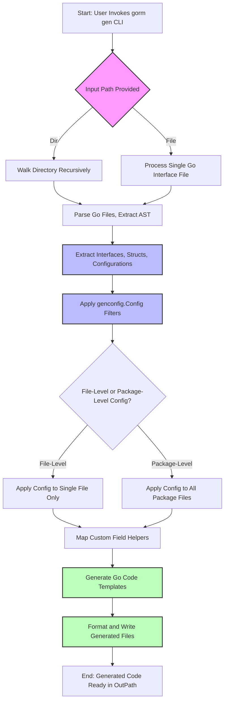

# Scalability and Performance Considerations

Optimizing your usage of GORM CLI in high-scale projects requires thoughtful organization, configuration, and database-aware tuning. This guide walks you through best practices to efficiently structure your codebase, configure the generator for minimal churn, leverage database-specific optimizations, and enhance runtime performance of generated code.

---

## Organizing Your Codebase for Scale

### Structure Models and Interfaces Logically

Start by grouping your model structs and SQL-annotated query interfaces in coherent package or directory structures. This organization reduces build times and streamlines code generation scopes.

- **Package-level genconfig.Config:** Place configuration literals at the package root to control generation and output paths consistently.
- **Separation of concerns:** Keep models, interfaces, and configuration files clearly separated to avoid confusion and unnecessary file scanning.
- **Subdirectories:** Use subpackage or nested directories for domain-specific models and queries, applying granular configuration as needed.

### Whitelist and Blacklist Use

Applying inclusion and exclusion filters via generator configuration can dramatically cut down the amount of code generated, minimizing downstream build impact.

- Use `IncludeInterfaces` and `IncludeStructs` patterns to specify exactly which interfaces and structs you want generated.
- Combine with `ExcludeInterfaces` and `ExcludeStructs` to omit legacy or irrelevant types.
- Whitelist patterns take precedence and are especially useful when scaling large codebases.


<CodeGroup>
```go
var _ = genconfig.Config{
    OutPath: "generated/",

    IncludeInterfaces: []any{"Query*"},
    ExcludeInterfaces: []any{"*Deprecated*"},

    IncludeStructs: []any{"User", "Account*"},
    ExcludeStructs: []any{"*DTO"},
}
```
</CodeGroup>

### File-Level vs Package-Level Configurations

Set the `FileLevel` flag in your `genconfig.Config` to true when you want the config to apply only to the specific file rather than the entire package. This enables fine-tuning generation in multi-file packages, helping manage incremental generation as your project grows.

<Info>
When `FileLevel` is false (default), configurations apply to all files under the package directory, enabling broader but less granular control.
</Info>

---

## Generator Configuration Best Practices

### Leverage Pattern Matching

GORM CLI supports shell-style pattern matching for interface and struct inclusions/exclusions. Use patterns with `*` wildcards to flexibly express broad or narrow selection rules, minimizing manual updates as your codebase evolves.

### Minimize Generated File Churn

To keep your generated code stable and maintainable:

- Apply consistent include/exclude filters to avoid regenerating files unnecessarily.
- Use dedicated output directories (`OutPath`) separated from source.
- Name interfaces and structs consistently to align with your patterns.
- Avoid renaming generated components frequently.

### Map Custom Field Helpers

Configure `FieldTypeMap` and `FieldNameMap` to map Go types or struct field tags to specialized field helpers. This enhances performance by using targeted SQL fragment generation and reduces runtime logic complexity.

Example mapping for JSON and nullable types:

<CodeGroup>
```go
var _ = genconfig.Config{
    FieldTypeMap: map[any]any{
        sql.NullTime{}: field.Time{},
    },
    FieldNameMap: map[string]any{
        "json": JSON{},
    },
}
```
</CodeGroup>

---

## Database-Specific Optimization Tips

GORM CLI's generated code can be tuned to better suit specific database engines.

### Use Database-Aware Field Helpers

Map custom field helpers (e.g., JSON fields) that generate optimized, dialect-aware SQL using `FieldNameMap` or `FieldTypeMap`.
This avoids fallback to generic SQL and leverages native JSON functions, improving query speed.

### Avoid Over-Complex SQL in Templates

- Use simpler SQL templates in interface comments where possible.
- Leverage generator features like `{{where}}` and `{{set}}` clauses to conditionally generate only required WHERE or SET fragments.
- Minimize use of expensive operations inside templates that combine many conditions or complex expressions.

### Tune Indexes and Schema Outside GORM CLI

Though code generation does not manage database schema, ensure your models and queries leverage adequate indexing, especially on columns used in frequent filters or joins.

---

## Minimizing Runtime Overhead

### Generate Focused Interfaces

Avoid generating overly broad interfaces with many methods if only a subset is used in your application. Tailored interfaces reduce code size and improve readability.

### Understand Lazy Execution

Generated methods primarily build GORM query chains; actual SQL execution happens when you call `.Find(ctx)`, `.Take(ctx)`, or `.Exec(ctx)` on the returned interfaces.

Keep heavy filtering and data retrieval logic in generated interfaces to benefit from compile-time checks and runtime efficiency.

### Use the Context Injection Feature

If your interface methods omit `context.Context` parameters, the generator injects them automatically, ensuring consistent context propagation without manual additions, which stabilizes method signatures and generated code.

---

## Practical Tips and Common Pitfalls

<AccordionGroup title="Tips & Best Practices">
<Accordion title="Tip: Plan Your Output Paths">
Define distinct output directories per module or domain to avoid overwriting unrelated generated code. This also aids tracking generated files and cleaning stale files.
</Accordion>
<Accordion title="Tip: Use Whitelists to Control Generation Scope">
Especially in large repositories, always prefer whitelist patterns in your config to restrict generated code precisely, reducing build times and preventing unnecessary file generation.
</Accordion>
<Accordion title="Common Pitfall: Inconsistent Interface Naming">
Avoid renaming interfaces after code generation as it breaks generator filtering and output path resolution. Keep interface names stable and predictable.
</Accordion>
<Accordion title="Common Pitfall: Overuse of Raw SQL Templates">
Excessive or complex raw SQL fragments can slow generation and add runtime parsing overhead. Prefer template directives and parameterized SQL styles supported by GORM CLI.
</Accordion>
</AccordionGroup>

---

## Summary Diagram: Generator Processing and Configuration Flow



---

## Troubleshooting Common Scalability Issues

<AccordionGroup title="Troubleshooting">
<Accordion title="Large Codebase Generates Slowly or Produces Massive Output">
- Narrow generation scope with `IncludeInterfaces` and `IncludeStructs`.
- Verify no broad patterns inadvertently include large sets of files.
- Confirm output directories do not overlap and cause conflicts.
</Accordion>
<Accordion title="Generated Files Change Too Often After Minor Source Changes">
- Check if configuration filtering is set correctly.
- Avoid changing interface or struct names frequently.
- Use `FileLevel` config to isolate changes.
</Accordion>
<Accordion title="Performance of Generated Query Methods Is Slow at Runtime">
- Inspect generated SQL templates for complexity.
- Use mapped field helpers optimized for your database.
- Profile generated code and queries directly in your database.
</Accordion>
</AccordionGroup>

---

## Next Steps and Related Documentation

- **[Core Concepts & Terminology](/concepts/core-architecture/core-concepts-terminology)** — Understand fundamental GORM CLI concepts for better configuration and scaling.
- **[Customizing Code Generation](/guides/advanced-usage/customizing-generation)** — Dive deeper into advanced configurations to optimize output.
- **[Managing Associations](/guides/advanced-usage/advanced-associations)** — Learn best practices for association helpers impacting runtime performance.
- **[Writing Templated Queries](/guides/advanced-usage/template-dsl-guide)** — Craft efficient SQL templates minimizing code and runtime overhead.
- **[System Architecture Overview](/overview/architecture-concepts/system-architecture)** — See how GORM CLI fits into the overall architecture for scalability considerations.


<Tip>
Following these guidelines ensures your GORM CLI usage remains maintainable and performant even as your Go codebase and database workload grow significantly.
</Tip>
