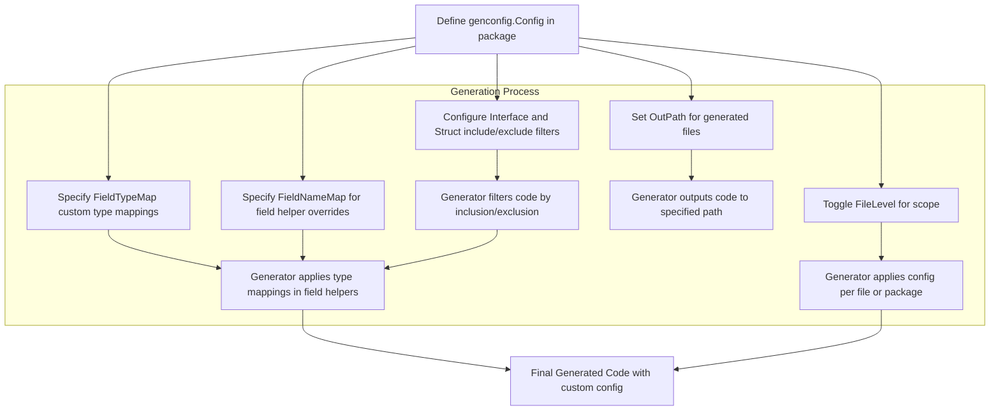

# Basic Configuration with genconfig

Customize your generation process using a `genconfig.Config` file. Understand the fundamentals of configuring output paths, type mappings, and file/package-level generation settings. This guide includes a hands-on minimal example for beginners to get you started effectively.

---

## 1. What is genconfig.Config?

`genconfig.Config` is a package-level configuration structure that allows you to customize how GORM CLI generates your code, including:

- **Output Directory:** Specify where generated code files will be saved.
- **Type Mappings:** Define custom mappings from Go types to field helper types.
- **Field Name Mappings:** Customize field helpers by specifying custom helpers for fields with particular names or tags.
- **Inclusion/Exclusion Rules:** Filter which interfaces or structs are processed, by name patterns or explicit types.
- **File-Level vs Package-Level Configuration:** Control whether configuration applies only to a single source file or the entire package.

Using `genconfig.Config`, you can tailor your code generation to match your project's conventions and requirements.

---

## 2. Why Configure with genconfig.Config?

Default generation behavior covers most projects. However, real-world models often have special cases like custom field tags, unusual types, or the need to generate code only for selected interfaces. This configuration helps you:

- **Centralize generation settings** for ease of management.
- **Reduce boilerplate and errors** by automatically adapting generated code to your types.
- **Optimize generation scope** for large codebases by including/excluding files, interfaces, or structs.

---

## 3. Basic Components of genconfig.Config

Here’s a breakdown of key fields you can configure:

| Field Name           | Purpose                                                                                       |
|----------------------|-----------------------------------------------------------------------------------------------|
| `OutPath`            | Directory to output generated code (relative or absolute).                                     |
| `FieldTypeMap`       | Map Go types (e.g., `sql.NullTime{}`) to custom field helpers (e.g., `field.Time{}`).          |
| `FieldNameMap`       | Map field names or tags (e.g., `json`, `date`) to specific field helpers.                     |
| `IncludeInterfaces`  | Whitelist of interface names or patterns to include in generation.                            |
| `ExcludeInterfaces`  | Blacklist of interfaces to exclude. Ignored if whitelist is non-empty.                        |
| `IncludeStructs`     | Whitelist of structs by name, pattern, or type literal.                                      |
| `ExcludeStructs`     | Exclude specific structs by name or pattern.                                                  |
| `FileLevel`          | Boolean to apply config only within the source file instead of the entire package.            |

---

## 4. Minimal Example: Defining genconfig.Config

Place this configuration in a `config.go` inside the package where you want to customize generation.

```go
package examples

import (
    "database/sql"

    "gorm.io/cli/gorm/field"
    "gorm.io/cli/gorm/genconfig"
)

// Minimal genconfig for output path and field mappings
var _ = genconfig.Config{
    // Change output directory for generated files
    OutPath: "examples/output",

    // Map Go types to specific field helpers
    FieldTypeMap: map[any]any{
        sql.NullTime{}: field.Time{}, // Treat sql.NullTime as Time field helper
    },

    // Map special field tags or names to helpers
    FieldNameMap: map[string]any{
        "date": field.Time{},  // Fields tagged with `gen:"date"` use Time helper
        "json": JSON{},       // Custom JSON field helper (must be defined)
    },

    // Control file-level vs package-level application
    FileLevel: false, // Apply to the whole package (default)

    // Whitelist or blacklist interfaces and structs (optional)
    IncludeInterfaces: []any{}, // Empty means include all by default
    ExcludeInterfaces: []any{},
    IncludeStructs:    []any{},
    ExcludeStructs:    []any{},
}
```

<Note>
The above example maps `sql.NullTime` to the `field.Time{}` helper, which enables date/time predicates in generated queries. You can add further mappings following this pattern.
</Note>

---

## 5. How Configuration Controls Code Generation

### 5.1 Output Path

Setting `OutPath` changes where the generator writes the files, keeping your generated code neatly separated from handwritten code.

### 5.2 Type and Field Mappings

Customize the behavior of certain Go types or field names to generate richer query helpers, e.g., JSON, time, or custom serialized fields.

### 5.3 Inclusion and Exclusion

Narrow down generation scope by specifying which interfaces or structs to generate code for. This helps manage large codebases and keeps generated code targeted.

### 5.4 File-Level vs Package-Level

When `FileLevel` is true, the config only applies to the current source file — useful for fine-grained control in multi-file packages.

---

## 6. Step-by-Step Setup Workflow

<Steps>
  <Step title="Create the Configuration File">
  Add a `config.go` file inside your package directory.

  Define a package-level variable `_` assigned to your `genconfig.Config` struct.
  </Step>
  <Step title="Customize Output Directory">
  Set the `OutPath` field to specify the output folder for generated files.
  This can be relative to your project workspace or an absolute path.
  </Step>
  <Step title="Map Go Types to Field Helpers">
  Use `FieldTypeMap` to specify custom mappings.
  For example, map `sql.NullTime{}` to the `field.Time{}` helper for time-related predicates.
  </Step>
  <Step title="Map Field Names to Field Helpers">
  Use `FieldNameMap` to specify mappings based on field names or struct tags.
  For example, fields tagged with `gen:"json"` can be mapped to your custom JSON helper.
  </Step>
  <Step title="Control Generated Interfaces and Structs">
  Use `IncludeInterfaces` and `ExcludeInterfaces` to control interfaces targetted for generation.
  Similarly, use `IncludeStructs` and `ExcludeStructs` for models.
  </Step>
  <Step title="Choose Between File-Level and Package-Level">
  Set `FileLevel` to `true` to restrict config to a single file, or `false` to apply it package-wide.
  </Step>
  <Step title="Run the Generator">
  Invoke the generator CLI as usual (`gorm gen -i ./your/package -o ./generated`) and the config will be automatically picked up.
  </Step>
</Steps>

---

## 7. Example in Practice

Assuming your project layout:

```
/myproject
  /examples
    config.go       # contains your genconfig.Config
    models.go       # model structs
    query.go        # query interfaces
```

**config.go sample:**

```go
package examples

import (
    "database/sql"

    "gorm.io/cli/gorm/field"
    "gorm.io/cli/gorm/genconfig"
)

var _ = genconfig.Config{
    OutPath: "examples/output",
    FieldTypeMap: map[any]any{
        sql.NullTime{}: field.Time{},
    },
    FieldNameMap: map[string]any{
        "date": field.Time{},
    },
}
```

Run generation:

```bash
gorm gen -i ./examples -o ./generated
```

The generator applies your configuration and outputs generated code with correct type mappings, cleanly placed in the designated folder.

---

## 8. Practical Tips & Best Practices

- **Keep configuration close to your sources.** Put `genconfig.Config` in the package directory to avoid confusion.
- **Use patterns in Include/Exclude.** For large projects, use shell-style patterns like `Query*` or `Account*`.
- **Combine with custom helpers.** When mapping custom field helpers (like JSON), ensure helpers are defined and imported.
- **Leverage FileLevel for granularity.** If you want different rules per file, set `FileLevel: true`.
- **Test your generated code regularly.** Run `go test` or your own validation tests in the output folder.

<Warning>
Avoid empty or conflicting inclusion/exclusion lists that could prevent generation entirely. When using whitelists (`Include*`), exclusions are ignored.
</Warning>

---

## 9. Common Pitfalls & Troubleshooting

<AccordionGroup title="Troubleshooting genconfig.Common Issues">
<Accordion title="Generated Code Not Appearing in Expected Directory">
Verify your `OutPath` in `genconfig.Config` is set correctly relative to your working directory.
Check for typos or permission issues on the directory.
If unset, default is `./g`.
</Accordion>
<Accordion title="Custom Field Helper Not Recognized in Generated Code">
Make sure your custom helper type is defined and properly imported.
Also, confirm your `FieldNameMap` or `FieldTypeMap` correctly maps the field's type or tag.
</Accordion>
<Accordion title="Interfaces or Structs Not Generating as Expected">
Check if your inclusion/exclusion lists are filtering out the items you want.
Remember: When `IncludeInterfaces` or `IncludeStructs` are non-empty, exclusions are ignored.
Patterns must match exactly with interface or struct names.
</Accordion>
<Accordion title="File-Level Configuration Not Applying">
Set `FileLevel: true` only if you want config scope limited to one file.
Otherwise, your config applies at the package level.
In multi-file packages, file-level config may not behave as expected if not set consistently.
</Accordion>
</AccordionGroup>

---

## 10. Additional Resources

- [Minimal Project Setup](getting-started/config-gen-first-run/minimal-setup) — Prepare your project for generation
- [Generate Code: Your First Run](getting-started/config-gen-first-run/run-generator) — Step-by-step code generation guide
- [Using the Generated APIs](getting-started/config-gen-first-run/using-generated) — Learn to use your generated code
- [Customizing Code Generation](guides/customization-integration/generation-config) — Deeper genconfig customization techniques 

Explore these resources to expand your mastery of GORM CLI generation customization.

---

## Summary Diagram: Configuration Impact



---

You are now equipped to customize your generation process with confidence using `genconfig.Config`. Start with a minimal setup and progressively tailor your generation for best fit.

---