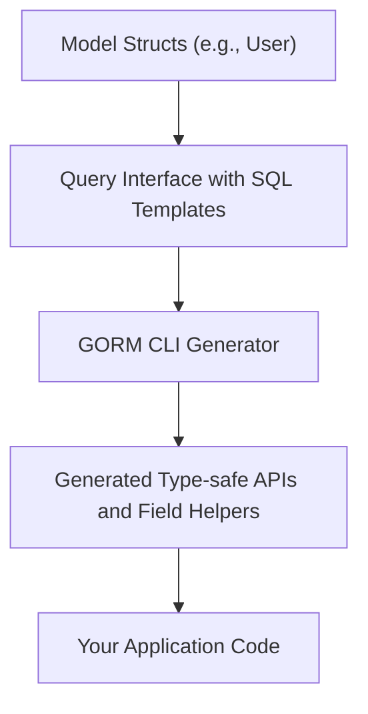

# Minimal Project Setup

Prepare your Go project with the essential model structs and query interfaces so that GORM CLI can generate type-safe query APIs and field helpers. This guide ensures your project is organized correctly for a smooth first code generation.

---

## 1. Define Your Models

Your models should be standard Go structs representing your database tables. Include GORM struct tags as usual to configure table mapping, relationships, and column properties.

### Example Model Definition

```go
package models

import (
	"gorm.io/gorm"
)

type User struct {
	gorm.Model
	Name    string
	Age     int
	Role    string
	IsAdult bool
}
```

- Models can reside in their own package (e.g., `models`) or alongside interfaces.
- Include related structs for associations if needed.

---

## 2. Write Your Query Interfaces

Declare Go interfaces with generic type parameters that specify your query methods. Annotate methods by embedding SQL queries or templating inside comments directly above each method.

### Key Points for Interface Setup

- Use a generic type parameter `T` to link the interface to your models.
- Document each method with raw SQL or SQL template DSL in the comments.
- Method signatures should return model types or slices and errors as appropriate.

### Example Query Interface

```go
package examples

import (
	"time"
	"gorm.io/cli/gorm/examples/models"
)

type Query[T any] interface {
	// SELECT * FROM @@table WHERE id=@id AND name = "\@name"
	GetByID(id int) (T, error)

	// SELECT * FROM @@table WHERE @@column=@value
	FilterWithColumn(column string, value string) (T, error)

	// SELECT * FROM users
	//   {{if user.ID > 0}}
	//       WHERE id=@user.ID
	//   {{else if user.Name != ""}}
	//       WHERE name=@user.Name
	//   {{end}}
	QueryWith(user models.User) (T, error)

	// UPDATE @@table
	//  {{set}}
	//    {{if user.Name != ""}} name=@user.Name, {{end}}
	//    {{if user.Age > 0}} age=@user.Age, {{end}}
	//    {{if user.Age >= 18}} is_adult=1 {{else}} is_adult=0 {{end}}
	//  {{end}}
	// WHERE id=@id
	UpdateInfo(user models.User, id int) error

	// SELECT * FROM @@table
	// {{where}}
	//   {{for _, user := range users}}
	//     {{if user.Name != "" && user.Age > 0}}
	//       (name = @user.Name AND age=@user.Age AND role LIKE concat("%",@user.Role,"%")) OR
	//     {{end}}
	//   {{end}}
	// {{end}}
	Filter(users []models.User) ([]T, error)

	// where("name=@name AND age=@age")
	FilterByNameAndAge(name string, age int)

	// SELECT * FROM @@table
	//  {{where}}
	//    {{if !start.IsZero()}}
	//      created_at > @start
	//    {{end}}
	//    {{if !end.IsZero()}}
	//      AND created_at < @end
	//    {{end}}
	//  {{end}}
	FilterWithTime(start, end time.Time) ([]T, error)
}
```

---

## 3. Organize Your Project Directory

Structure your Go files so that GORM CLI can locate both models and query interfaces easily:

- Group related interfaces and models in the same package or directory.
- The CLI accepts a path to the directory or Go files with the `-i` or `--input` flag.

Example:

```
/myproject
  /models
    user.go
  /examples
    query.go
```

- Point CLI input to `/examples` if interfaces and models coexist there.

---

## 4. Optional: Use `genconfig.Config` for Advanced Options

You can customize code generation behavior by declaring a package-level `genconfig.Config` variable. This allows you to:

- Set custom output directories
- Include or exclude specific interfaces or structs
- Map Go types to field helper types
- Adjust file-level generation control

### Simple Config Example

```go
package examples

import "gorm.io/cli/gorm/genconfig"

var _ = genconfig.Config{
	OutPath: "examples/output",
	IncludeInterfaces: []any{"Query*"},
	FieldTypeMap: map[any]any{
		sql.NullTime{}: field.Time{},
	},
}
```

---

## 5. Next Steps

Once your models and interfaces are ready:

1. Run the GORM CLI generator to output the generated code.
2. Use the generated type-safe APIs in your application code.

For detailed instructions, proceed to the next guide: [Generate Code: Your First Run](/getting-started/config-gen-first-run/run-generator).

---

## Troubleshooting Tips

- **Interfaces not detected?** Ensure interface files are in the specified input path and annotated with SQL templates.
- **Models missing fields?** Confirm your Go structs are correctly defined and imported.
- **Output directory empty?** Verify the `-o` flag is set or defaults to `./g`.

---

## Summary Diagram: Minimal Project Setup Flow



---

## Additional Resources

- [Quickstart Workflow](/overview/getting-started-examples/quickstart-workflow) — See a full example from start to finish
- [Generation Config](/guides/customization-integration/generation-config) — Customize generation
- [Integration with GORM](/overview/getting-started-examples/integration-with-gorm) — Use generated code alongside GORM

---

By following these minimal setup steps, you position yourself for efficient and error-free code generation with GORM CLI, unlocking compile-time safety and productivity improvements in your data layer.


