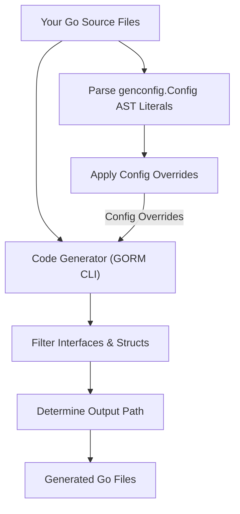

# Basic Configuration

Welcome to the first step in customizing how GORM CLI generates code tailored to your project. This guide introduces you to configuring the GORM CLI with zero setup for default behaviors, then progressively moving to simple overrides via the `genconfig.Config` struct. By the end of this guide, you will understand how to control key aspects such as output directories and filtering of interfaces and structs, enabling seamless integration of configuration files into your workflow.

---

## 1. Configuration Overview

GORM CLI is designed to work out-of-the-box without requiring configuration. However, to tailor generated code to your project conventions or special needs, you can declare a `genconfig.Config` package-level variable in any source file within the package being generated. This package configures generation paths, included/excluded interfaces and structs, and field mapping rules.

The configuration is optional but offers powerful, non-intrusive control over how code is generated per package or file.

<Info>
The generator automatically discovers and applies configuration based on your Go source files' AST, ensuring that configs integrate smoothly without additional CLI parameters.
</Info>

---

## 2. Zero Config Defaults

By default, if you do not declare a configuration, GORM CLI uses standard defaults:

- **Output Directory:** `./g` relative to your project root or execution directory.
- **Generation Scope:** All detected interfaces and structs in your input path.
- **Field Mappings:** Standard Go types mapped to corresponding field helpers (e.g., `string` to `field.String`).

Running the generator with zero config example:

```bash
gorm gen -i ./examples
```

This command scans the `./examples` directory, generates code for all interfaces and structs without filtering, and places output under `./g`.

<Check>
Zero configuration is perfect for quick projects or initial explorations before introducing customized behaviors.
</Check>

---

## 3. Declaring Custom Configuration

You customize the generation with a Go source file defining a package-level `genconfig.Config` variable. The generator reads this and applies overrides.

### 3.1 Basic Configuration Fields

| Field             | Description |
|-------------------|-------------|
| `OutPath`         | Overrides the output directory for generated code in this package.
| `FieldTypeMap`    | Maps specific Go types to your custom field helpers for precise semantics.
| `FieldNameMap`    | Maps the `gen:"name"` struct tag values to custom field helpers.
| `FileLevel`       | If true, apply configs only to the current file instead of the whole package.
| `IncludeInterfaces` | Whitelist interfaces to generate, using shell patterns or type selectors.
| `ExcludeInterfaces` | Blacklist interfaces to skip.
| `IncludeStructs`  | Whitelist structs to generate.
| `ExcludeStructs`  | Blacklist structs to skip.

<Note>
Include lists have priority over excludes. If you specify an Include list, only those matching entries are generated; excludes are ignored for that kind.
</Note>

### 3.2 Example Configuration

```go
package examples

import (
    "database/sql"
    "gorm.io/cli/gorm/field"
    "gorm.io/cli/gorm/genconfig"
)

var _ = genconfig.Config{
    // Override CLI output for this package
    OutPath: "examples/output",

    // Map sql.NullTime fields to the field.Time helper
    FieldTypeMap: map[any]any{
        sql.NullTime{}: field.Time{},
    },

    // Map gen:"date" tag fields to field.Time helper
    FieldNameMap: map[string]any{
        "date": field.Time{},
        "json": JSON{}, // assuming JSON helper defined
    },

    // Restrict generation to interfaces starting with "Query"
    IncludeInterfaces: []any{"Query*"},

    // Exclude deprecated interfaces or structs
    ExcludeInterfaces: []any{"*Deprecated*"},
    ExcludeStructs:    []any{"*DTO"},
}
```

This example configures generation to:

- Output all generated code under `examples/output` instead of default `./g`.
- Replace `sql.NullTime` with typed time helpers.
- Use custom JSON field helpers for fields tagged with `gen:"json"`.
- Generate only interfaces whose names start with "Query".
- Skip those matching "*Deprecated*" or "*DTO" patterns.

---

## 4. How Configuration Files Integrate Into Workflow

The GORM CLI generator automatically detects any `genconfig.Config` declared in the scanned source files and applies them as follows:

- If multiple configs are present in a directory tree, the most specific one (file-level if specified, or package-level otherwise) applies.
- Config Snippets aggregate upward, allowing fine-grained control in sub-packages or specific files.
- Output path settings override CLI `-o` flags when config is applied to that package.

<Tip>
You do not have to pass any CLI flags for these config files — they are an embedded part of your package source, seamlessly integrated.
</Tip>

---

## 5. Key Config Fields in Detail

### 5.1 Output Path (`OutPath`)
Controls where the generated `.go` files are saved relative to your project root or process working directory.

```go
OutPath: "generated/code",
```

### 5.2 Inclusion & Exclusion Patterns
Control *what* the generator processes to reduce noise or scope generation.

- **Include Interfaces:** Only generate these interfaces.

  ```go
  IncludeInterfaces: []any{"Query*", models.Query(nil)},
  ```

- **Exclude Interfaces:** Skip interfaces matching these patterns.

  ```go
  ExcludeInterfaces: []any{"*Deprecated*"},
  ```

- Similar fields exist for structs to filter model helpers.

### 5.3 Type and Tag Field Overrides
Allows specifying custom mapping from Go types or field tags (`gen:""`) to specialized helpers replacing defaults.

```go
FieldTypeMap: map[any]any{
  sql.NullTime{}: field.Time{},
},
FieldNameMap: map[string]any{
  "json": JSON{},
},
```

### 5.4 File-Level Configuration
By default, configs apply to entire packages. You can restrict override to just the single file defining the config:

```go
FileLevel: true,
```

Useful for complex projects with varied generation needs.

---

## 6. Best Practices & Tips

- **Start with zero config**: Run the CLI without configuration to verify your inputs and basic output.
- **Introduce `genconfig.Config` gradually**: Add output paths and simple include/exclude filters first.
- **Use shell-style glob patterns**: Convenient for filtering names (`"Query*"`, "*DTO")
- **Map common database types early**: For example, `sql.NullTime{}` to `field.Time{}` for proper SQL predicate generation.
- **Keep configs near your source code**: Embed overrides as package-level variables to keep generation aligned with code.

<Warning>
Avoid conflicting configs in the same package that might override each other unexpectedly. Prefer one authoritative config per package or file.
</Warning>

---

## 7. Troubleshooting Configuration

<AccordionGroup title="Common Configuration Issues and Solutions">
<Accordion title="Output Path Not Changing After Config Update">
Verify that your config file is in the correct package and directory scanned by the generator. The generator applies the most specific config based on file location.

Run the generator with verbose logging to confirm which configs it loads.
</Accordion>
<Accordion title="Interfaces or Structs Not Being Generated">
Ensure Include/Exclude patterns in your config correctly match the interface or struct names.

Patterns are shell globs, so case and wildcards are significant. Use quotes for any patterns that include special characters.
</Accordion>
<Accordion title="Custom Field Types Not Applied">
Confirm your `FieldTypeMap` and `FieldNameMap` have valid initialized values and types.

The map keys are type instances (e.g., `sql.NullTime{}`) and values are field helper instances (e.g., `field.Time{}`).
</Accordion>
</AccordionGroup>

---

## 8. Summary Diagram: Configuration Flow



---

## 9. Next Steps

- Try running the generator with a minimal config and observe outputs.
- Proceed to [Your First Code Generation](../Your%20First%20Code%20Generation) to practice generating code with your config.
- Explore [Customizing Code Generation with Config](../../guides/core-workflows/customizing-generation-config) for advanced customization scenarios.

<Check>
Applying configuration empowers you to tailor GORM CLI to your project's structure and coding standards, ensuring maintainable and predictable generated code.
</Check>

---

## 10. Additional Resources

- [GORM CLI README](https://github.com/go-gorm/cli/blob/main/README.md) — Comprehensive project overview and advanced examples.
- [genconfig.Config source](https://github.com/go-gorm/cli/blob/main/genconfig/config.go) — See exact struct fields and comments.
- Related Documentation:
  - [First Code Generation](../Your%20First%20Code%20Generation)
  - [Generation Configuration Guide](../../guides/core-workflows/customizing-generation-config)

---

With these foundations, you can confidently configure GORM CLI generation to fit your needs precisely and keep your codebase clean, scalable, and type-safe.

---