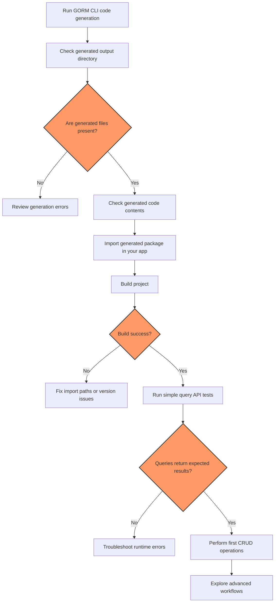

# Validating Setup & Next Steps

This guide helps you verify your GORM CLI generated code is correctly integrated, discoverable in your Go project, and functional. It also points you to your first CRUD operations and outlines next explorations into more advanced capabilities.

---

## 1. Confirm Generated Code Visibility

After running `gorm gen`, you must ensure GORM CLI's output is accessible and correctly linked in your project.

### Steps

1. **Check the output directory**

   The generator's default output is `./g` (or your configured `OutPath`). Verify files exist:

   ```bash
   ls ./g
   # Expected: generated Go files mirroring your input packages, e.g., 'query.go'
   ```

2. **Review generated files contents**

   Open a generated file and confirm it contains:

   - Query API implementations with your interface method names
   - Structs with model-driven field helpers

3. **Import the generated package in your code**

   For example, if output is `./generated`, import it:

   ```go
   import "your/module/generated"
   ```

4. **Build your project**

   Run `go build` or `go test` to ensure the generated code compiles and is discoverable by your IDE or tooling.

<Tip>
If you encounter "cannot find package" errors, confirm your `OutPath` aligns with your Go module and import path structure.
</Tip>

---

## 2. Verify Basic Functionality of Generated APIs

Run simple tests or main application routines using generated type-safe query interfaces and field helpers.

### Example Check – Fetch by ID

Assuming you have generated code for `User` model and `Query[T]` interface:

```go
// Example: Fetch a user by ID
u, err := generated.Query[User](db).GetByID(ctx, 123)
if err != nil {
    // Handle error
}
fmt.Println(u)
```

### Example Check – Use Field Helpers in Query

```go
users, err := gorm.G[User](db).Where(generated.User.Age.Gt(18)).Find(ctx)
if err != nil {
    // Handle error
}
fmt.Println(users)
```

### Expected Result

- Query executes without error
- Returns appropriate results or empty slice

<Tip>
If errors occur, check database connection, migration status, and that your model corresponds to existing tables.
</Tip>

---

## 3. Handle Common Early Usage Issues

<Tip>
Here are troubleshooting tips to resolve common problems right after generation.
</Tip>

<AccordionGroup title="Troubleshooting Common Issues">
<Accordion title="Generated code not found or import errors">

- Verify your `OutPath` in config matches your import statements
- Run `go mod tidy` to refresh module dependencies
- Ensure `gorm gen` completed without errors
</Accordion>

<Accordion title="Compilation errors referencing generated code">

- Confirm Go version 1.18+ is in use (required for generics)
- Check all interface methods return types align with generation rules
- Review configured include/exclude patterns for interfaces and structs
</Accordion>

<Accordion title="Queries fail at runtime with nil refs or bad SQL">

- Check that SQL templates in interface comments are correctly written
- Ensure input parameters correspond to used SQL placeholders
- Confirm proper context (`ctx`) usage when calling generated methods
</Accordion>
</AccordionGroup>

---

## 4. Run Your First CRUD Operation

To get hands-on with generated code, perform basic Create, Read, Update, and Delete operations.

### Create a Record with Field Helpers and Associations

```go
err := gorm.G[User](db).Set(
    generated.User.Name.Set("alice"),
    generated.User.Age.Set(30),
    generated.User.Pets.Create(generated.Pet.Name.Set("fido")),
).Create(ctx)
if err != nil {
    // Handle error
}
```

### Read/Search Records Using Queries

```go
user, err := generated.Query[User](db).GetByID(ctx, 1)
users, err := generated.Query[User](db).FilterByNameAndAge("alice", 30).Find(ctx)
```

### Update a Record

```go
err := generated.Query[User](db).UpdateInfo(ctx, User{Name: "alice_updated", Age: 31}, 1)
```

### Delete or Unlink Associations

```go
// Unlink pets from user
err := gorm.G[User](db).
    Where(generated.User.ID.Eq(1)).
    Set(generated.User.Pets.Unlink()).
    Update(ctx)
```

<Tip>
Start small and incrementally run these operations; watch for SQL errors, permissions, or foreign key constraints failures.
</Tip>

---

## 5. Exploring More Advanced Workflows

After validating basic setup and CRUD, dive deeper to unlock GORM CLI’s advanced capabilities:

- **Template-Based Queries**: Learn to build dynamic SQL using the powerful DSL in interface comments.
- **Associations and Relations**: Use generated helpers for complex operations on has-many, belongs-to, and many-to-many relations.
- **Customizing Generation**: Explore the optional `genconfig.Config` to tailor generation paths, filtering, and field mappings.

Refer to these guides:

- [Your First Code Generation](/getting-started/configuration-first-usage/first-generation-run)
- [Basic Configuration](/getting-started/configuration-first-usage/basic-configuration)
- [Working With Associations](/guides/best-practices-patterns/associations-and-relations)
- [Writing Template-Based Queries](/guides/best-practices-patterns/template-based-queries)

---

## 6. Where to Get Help

- Join the GORM GitHub discussions and issues: [github.com/go-gorm/cli](https://github.com/go-gorm/cli)
- Refer to installation and troubleshooting sections if setup issues persist
- Use logs and error messages from generator and generated code to pinpoint faults


---

By following this validation and next steps guide, you ensure your GORM CLI setup is sound, easing your path toward productive, type-safe database access in Go applications.

---

### Helpful Commands Recap

```bash
# Check Go version
go version

# Generate code (adjust paths as needed)
gorm gen -i ./examples -o ./generated

# Build your project to verify
go build ./...

# Run tests
go test ./...
```

---

<Check>
GORM CLI generated code is visible, usable, and supports first CRUD operations successfully.
</Check>


---

###### This page fits into Getting Started > Configuration & First Usage, linking from:
- Installation
- Basic Configuration
- Your First Code Generation

Next, explore guides on using generated APIs and customizing generation.


---

# Diagram: Setup & Validation Workflow


