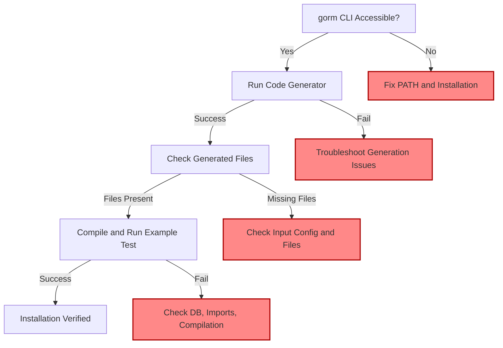

# Verifying Your Installation

Ensure your GORM CLI installation is correctly set up and fully operational before you begin generating code. This page guides you through practical, hands-on checks using CLI commands and sample code snippets to validate your installation’s responsiveness and output correctness. Follow these simple steps to gain confidence that your environment is ready for productive development.

---

## 1. Verify CLI Accessibility

### Step 1: Confirm GORM CLI is in Your PATH

Open your terminal or command prompt and run:

```bash
gorm version
```

**Expected Outcome:**

- CLI should print the current version number without error.

**If you see a "command not found" or similar error:**

- Check your Go bin directory (usually `$GOPATH/bin` or `$HOME/go/bin`) is correctly added to your system PATH.

- Review the [Installation](/getting-started/essential-setup/installation) guide.

### Step 2: Check Help Command

Run:

```bash
gorm --help
```

**Expected Outcome:**

- Displays help information listing available commands like `gen`.

This confirms that the CLI binary is functional and responsive.

---

## 2. Test Code Generation with a Sample

We’ll quickly run a basic code generation command using example models and queries to verify the generator operates as expected.

### Prepare Your Working Directory

Clone or have the example setup ready, or create the following minimal files:

#### Sample Model (`models/user.go`):

```go
package models

type User struct {
    ID   uint
    Name string
    Age  int
}
```

#### Sample Query Interface (`examples/query.go`):

```go
package examples

type Query[T any] interface {
  // SELECT * FROM @@table WHERE id=@id
  GetByID(id int) (T, error)
}
```

### Step 3: Run the Generator

Execute:

```bash
gorm gen -i ./examples -o ./generated
```

- `-i ./examples` specifies input directory where your interfaces/models are.
- `-o ./generated` sets the output directory for generated code.

**Expected Outcome:**

- A set of generated Go files appear in `./generated`.
- No errors printed; the command finishes successfully.

### Step 4: Verify Generated Files

Open the `./generated` directory.

You should see files representing typesafe query APIs and model helpers, e.g., `query.go`, `user.go`.

---

## 3. Run a Basic Test Using Generated Code

This step helps confirm the generated code compiles and works as intended.

### Step 5: Write Minimal Test Code

Create a file, e.g., `main.go`:

```go
package main

import (
  "context"
  "fmt"

  "gorm.io/driver/sqlite"
  "gorm.io/gorm"
  "yourmodule/generated" // replace with your actual module path
)

func main() {
  db, err := gorm.Open(sqlite.Open(":memory:"), &gorm.Config{})
  if err != nil {
    panic(err)
  }

  // Auto migrate your model to create tables
  err = db.AutoMigrate(&generated.User{})
  if err != nil {
    panic(err)
  }

  ctx := context.Background()

  // Insert sample user
  user := generated.User{Name: "alice", Age: 30}
  res := db.Create(&user)
  if res.Error != nil {
    panic(res.Error)
  }

  // Use the generated Query API
  q := generated.Query[generated.User](db)
  got, err := q.GetByID(ctx, int(user.ID))
  if err != nil {
    panic(err)
  }

  fmt.Printf("User retrieved: %+v\n", got)
}
```

### Step 6: Run the Test

```bash
go run main.go
```

**Expected Outcome:**

- The program prints the inserted user with correct fields, e.g.:

```
User retrieved: {ID:1 Name:alice Age:30}
```

This confirms that your installed GORM CLI generated code compiles and functions against a real database.

---

## 4. Troubleshooting Common Issues

<AccordionGroup title="Troubleshooting Tips">
<Accordion title="GORM CLI Command Not Found">
- Ensure Go binaries (`$GOPATH/bin` or `$HOME/go/bin`) are in your PATH.
- Verify installation using `go install gorm.io/cli/gorm@latest`.
- Restart your terminal session if PATH was updated recently.
</Accordion>
<Accordion title="Generation Command Errors">
- Double-check your input `-i` directory contains valid Go files with interfaces and models.
- Look for syntax errors or missing packages.
- Use `go build ./...` in your project root to confirm build integrity.
</Accordion>
<Accordion title="Generated Code Does Not Compile">
- Confirm dependencies like GORM are installed in your module.
- Run `go mod tidy` to fetch missing packages.
- Check generated code for unexpected imports or conflicts.
</Accordion>
<Accordion title="Database Connection or Migration Fails">
- For test, use SQLite in-memory to avoid external dependencies.
- When using MySQL/Postgres, verify DSN, credentials, and running DB server.
- Inspect error output for connection issues.
</Accordion>
</AccordionGroup>

---

## 5. Next Steps

- Explore [Quickstart: Your First Code Generation](/getting-started/essential-setup/quickstart-your-first-generation) to generate richer queries and helpers.
- Review the [Installation](/getting-started/essential-setup/installation) and [Troubleshooting Common Setup Issues](/getting-started/configuration-troubleshooting/troubleshooting-common-issues) pages for more in-depth help.
- Start building query interfaces and models following the [Core Workflows](/guides/core-workflows/quickstart-guide).

---

## Summary Diagram of Verification Flow



---

<Tip>
Verification is a crucial step to avoid confusion during your development cycle. Always confirm the basic installation and generation steps succeed before moving into complex query interface creation.
</Tip>

<Check>
If all steps complete without error and generated code runs against a test database, your GORM CLI installation is fully functional and ready to use.
</Check>


---

### Useful Links

- [Installation Guide](/getting-started/essential-setup/installation) 
- [Quickstart: Your First Code Generation](/getting-started/essential-setup/quickstart-your-first-generation)
- [Troubleshooting Common Setup Issues](/getting-started/configuration-troubleshooting/troubleshooting-common-issues)
- [Core Concepts & Terminology](/overview/architecture-core-concepts/core-concepts-terminology)
- [Feature Spotlight & Workflows](/overview/feature-overview-workflows/feature-spotlight)

---

End of Verifying Your Installation guide.
