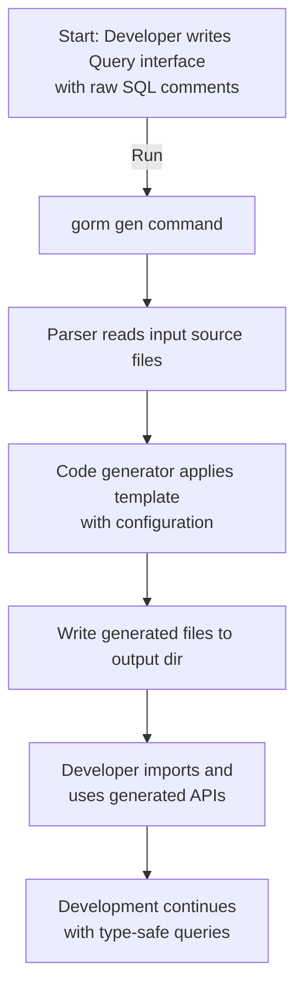

# Running the First Code Generation with GORM CLI

This guide walks you through running the core `gorm gen` command to generate your type-safe query APIs and model-driven field helpers. You’ll learn how to set correct input and output paths, understand what output files to expect, and troubleshoot the most common initial issues.

---

## 1. Prerequisites

Before generating code, ensure the following prerequisites are met:

- **Go 1.18 or later:** GORM CLI requires Go 1.18+ for generics support.
- **Installed GORM CLI:** Follow the installation instructions in the [Installing GORM CLI](overview/integration-getting-started/installation-setup) guide.
- **Defined Query Interfaces and Models:** You must have Go source files with query interfaces annotated using raw SQL templates in comments and model structs in the same directory or accessible by the command.

<Tip>
If you haven’t created query interfaces yet, see the [Quickstart Workflow](overview/integration-getting-started/quickstart-workflow) or [Project Setup & Model Definition](getting-started/configuration/project-setup) for complete guidance.
</Tip>

## 2. Command Overview

The `gorm gen` command generates GORM query code based on annotated Go interfaces with raw SQL comments.

Basic usage:
```bash
gorm gen -i <input_path> -o <output_path>
```

- **`-i, --input` (required):** Path to your Go file or directory containing the interfaces with raw SQL annotations.
- **`-o, --output` (optional):** Directory to save generated code. Defaults to `./g`.


## 3. Step-by-Step: Run Your First Code Generation

<Steps>
<Step title="Identify Input Path">
Locate the directory or Go file that contains your query interfaces with SQL templates, for example:

```bash
./examples
```

Your interfaces should look like:

```go
// examples/query.go

type Query[T any] interface {
  // SELECT * FROM @@table WHERE id=@id
  GetByID(id int) (T, error)
}
```
</Step>

<Step title="Choose Output Directory">
Select a directory where generated files will be saved. It’s best to keep generated code separate from your handwritten code.

Example:

```bash
./generated
```

If omitted, the default directory `./g` is used.
</Step>

<Step title="Run the Generator Command">
Execute the following in your terminal:

```bash
gorm gen -i ./examples -o ./generated
```

Expected console output:

```text
Generating file ./generated/query.gen.go from ./examples/query.go...
```

This confirms the generator parsed your input and created output files.
</Step>

<Step title="Verify Generated Files">
Check the output directory:

```bash
ls ./generated
```

You should see generated Go files (e.g., `query.gen.go`) containing the compiled, type-safe implementations and field helpers.

Open the generated files to inspect interfaces and method implementations.
</Step>

<Step title="Integrate with Your Code">
Use the generated APIs in your Go code, for example:

```go
user, err := generated.Query[User](db).GetByID(ctx, 123)
```

This returns a typed result using your model and query interface.
</Step>
</Steps>

## 4. Understanding Output

- **File naming:** Generates `.gen.go` files corresponding to your source interfaces.
- **Contents:** Includes concrete implementations of your query interfaces and field helper variables for your model structs.
- **Package:** Generated code maintains the original package structure for seamless import.

<Tip>
If you use a package-level `genconfig.Config`, the generator respects your custom output paths and field mappings automatically.
</Tip>

## 5. Common Pitfalls and How to Fix Them

<AccordionGroup title="Issues During Your First Run">
<Accordion title="Input Path Not Found or Empty">
- **Symptom:** `error processing <input>: stat <input>: no such file or directory`
- **Cause:** Specified path does not exist or is incorrect.
- **Fix:** Verify the path to your query interface file or directory. Use relative or absolute paths carefully.
</Accordion>

<Accordion title="No Interfaces Detected for Generation">
- **Symptom:** No files are generated despite correct paths.
- **Cause:** The input does not contain recognized raw SQL annotated interfaces.
- **Fix:**
  - Ensure interfaces have raw SQL templates in comments.
  - Confirm the files are Go source files and are not being skipped.
  - Check if you use `genconfig.Config` with include filters that exclude your interfaces.
</Accordion>

<Accordion title="Output Directory Permissions or Creation Issues">
- **Symptom:** Errors like `failed to create directory` or `failed to write file`.
- **Cause:** Insufficient write permissions or invalid output path.
- **Fix:** Ensure you have write permissions and the output directory exists or can be created.
</Accordion>

<Accordion title="Go Version Mismatch or Toolchain Issues">
- **Symptom:** Generator fails with Go syntax errors or unsupported generics.
- **Cause:** Using Go version below 1.18.
- **Fix:** Upgrade Go to 1.18 or later.
</Accordion>
</AccordionGroup>

## 6. Tips for Smooth Generation

- Use explicit input paths pointing directly to source files with query interfaces.
- Keep generated code in a dedicated directory separate from sources (e.g., `./generated`).
- If you want to customize generation behavior, create a `genconfig.Config` in your package as shown in [Configuring the Generator](getting-started/configuration/generator-configuration).
- Run generator commands from your project root to resolve relative paths properly.

## 7. Next Steps

- Explore the generated code by reading interface implementations and field helper types.
- Use generated APIs in your application code as demonstrated in the [Overview Quickstart](overview/integration-getting-started/quickstart-workflow).
- Learn how to customize generated fields and interfaces via configuration in the [Configuring the Generator](getting-started/configuration/generator-configuration) guide.
- For troubleshooting, see the [Troubleshooting Common Issues](getting-started/validation/troubleshooting) page.

---

## Appendix: Example Full Command

```bash
gorm gen -i ./examples -o ./generated
```

This will generate query implementations and model helpers from your interfaces in `./examples`, outputting files under `./generated`.

---

## References

- [Installing GORM CLI](getting-started/setup/installing-gorm-cli) — Setup and install prerequisites.
- [Quickstart Workflow](overview/integration-getting-started/quickstart-workflow) — Define interfaces and use generated APIs.
- [Configuring the Generator](getting-started/configuration/generator-configuration) — Customize generation with configs.
- [Troubleshooting Common Issues](getting-started/validation/troubleshooting) — Resolve frequent problems.


---

### Visual Summary of Generation Flow




---

This completes your initial code generation process with GORM CLI.

Start generating confidently and build robust, maintainable UIs with type-safe database queries!

---

# End of Guide
